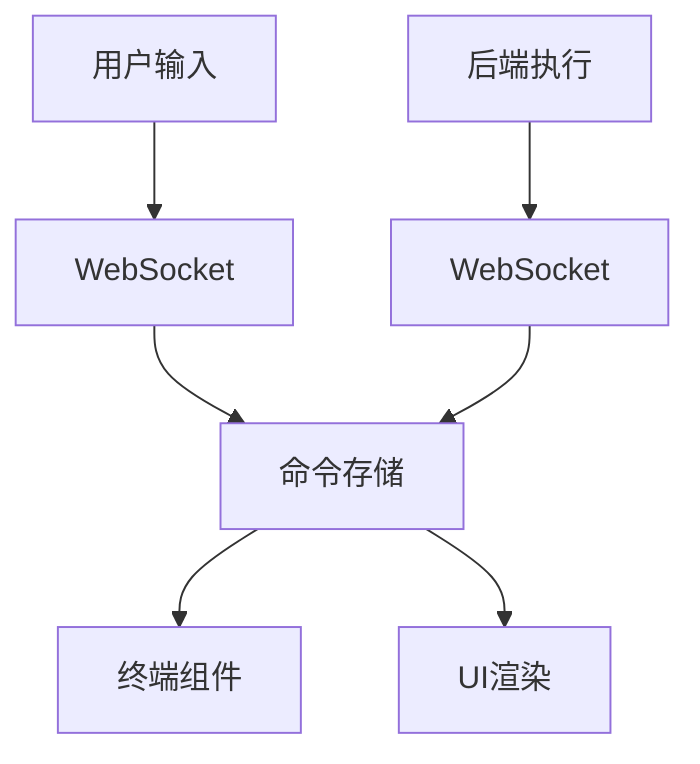
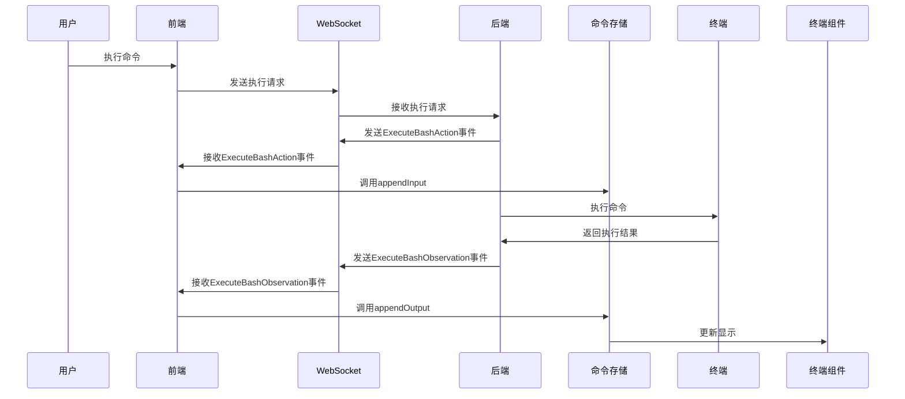
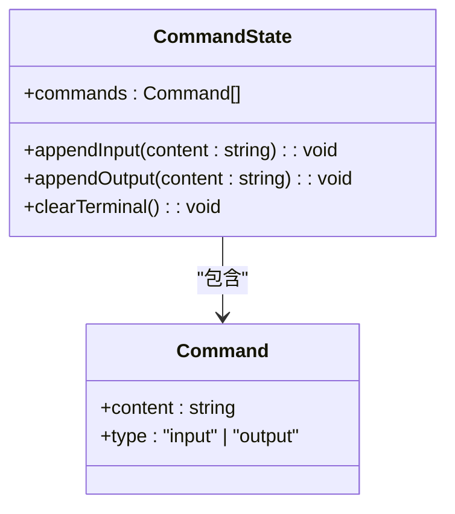
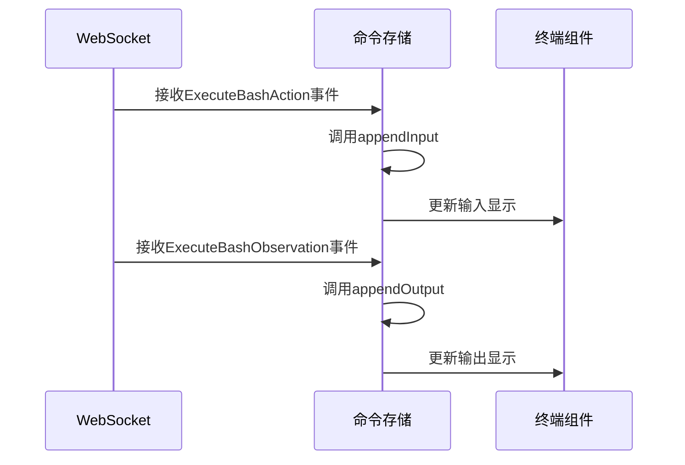
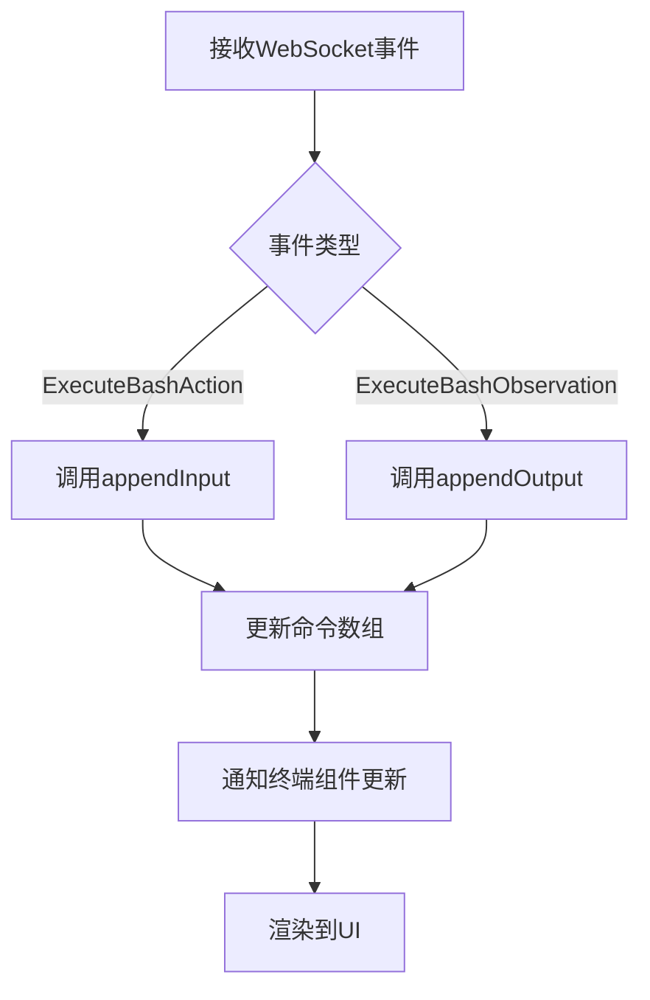
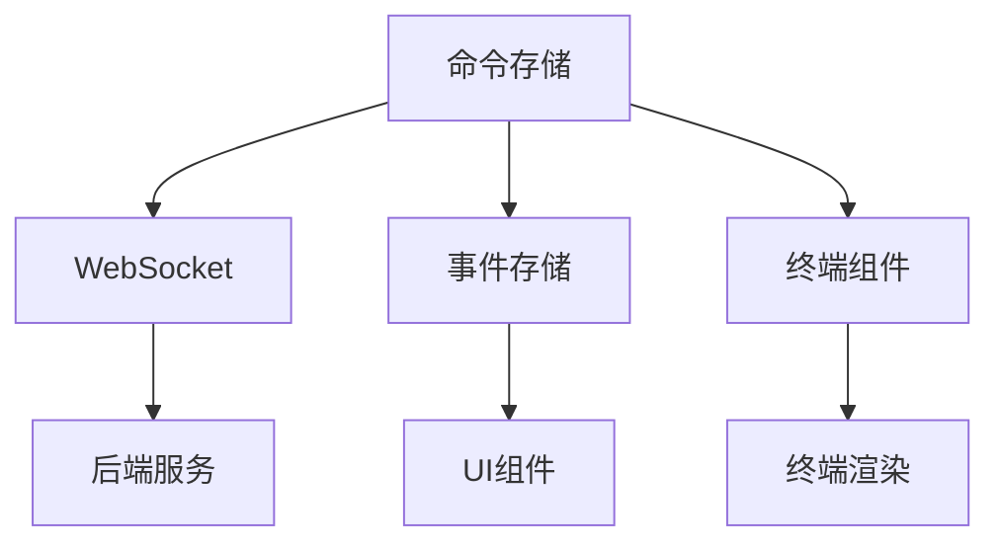

# 命令存储

<cite>
**本文档中引用的文件**  
- [command-store.ts](file://frontend/src/state/command-store.ts)
- [conversation-websocket-context.tsx](file://frontend/src/contexts/conversation-websocket-context.tsx)
- [use-terminal.ts](file://frontend/src/hooks/use-terminal.ts)
- [mock-ws-helpers.ts](file://frontend/src/mocks/mock-ws-helpers.ts)
- [type-guards.ts](file://frontend/src/types/v1/type-guards.ts)
- [use-event-store.ts](file://frontend/src/stores/use-event-store.ts)
</cite>

## 目录
1. [简介](#简介)
2. [项目结构](#项目结构)
3. [核心组件](#核心组件)
4. [架构概述](#架构概述)
5. [详细组件分析](#详细组件分析)
6. [依赖分析](#依赖分析)
7. [性能考虑](#性能考虑)
8. [故障排除指南](#故障排除指南)
9. [结论](#结论)

## 简介
本文档详细分析了OpenHands前端中命令存储（command-store）的实现方式，重点介绍其状态管理机制。命令存储负责跟踪用户执行的命令及其状态，包括命令的发送、执行、完成和错误处理等生命周期。文档将深入探讨命令队列的管理机制、状态更新逻辑以及与终端组件的集成方式，并提供命令重试、撤销和历史记录功能的实现细节。

## 项目结构
OpenHands前端的命令存储功能主要位于`frontend/src/state/`目录下，通过Zustand状态管理库实现。命令存储与WebSocket上下文、终端组件和事件处理系统紧密集成，形成一个完整的命令生命周期管理机制。

**图表来源**  
- [command-store.ts](file://frontend/src/state/command-store.ts)
- [conversation-websocket-context.tsx](file://frontend/src/contexts/conversation-websocket-context.tsx)

**章节来源**  
- [command-store.ts](file://frontend/src/state/command-store.ts)
- [conversation-websocket-context.tsx](file://frontend/src/contexts/conversation-websocket-context.tsx)

## 核心组件
命令存储的核心是`useCommandStore`，它使用Zustand创建一个全局状态，用于管理终端中的命令历史。该存储包含命令数组和操作命令的函数，如`appendInput`、`appendOutput`和`clearTerminal`。

**章节来源**  
- [command-store.ts](file://frontend/src/state/command-store.ts)

## 架构概述
命令存储的架构基于事件驱动模型，通过WebSocket接收来自后端的命令执行事件，并相应地更新状态。当用户执行命令时，后端发送`ExecuteBashAction`事件，命令存储将其作为输入添加到终端。当命令执行完成时，后端发送`ExecuteBashObservation`事件，命令存储将其作为输出添加到终端。

**图表来源**  
- [command-store.ts](file://frontend/src/state/command-store.ts)
- [conversation-websocket-context.tsx](file://frontend/src/contexts/conversation-websocket-context.tsx)
- [type-guards.ts](file://frontend/src/types/v1/type-guards.ts)

## 详细组件分析
### 命令存储分析
命令存储组件负责管理终端中的所有命令历史，包括用户输入和系统输出。它通过简单的数据结构和纯函数来确保状态更新的可预测性和一致性。

#### 对象导向组件：

**图表来源**  
- [command-store.ts](file://frontend/src/state/command-store.ts)

#### API/服务组件：

**图表来源**  
- [command-store.ts](file://frontend/src/state/command-store.ts)
- [conversation-websocket-context.tsx](file://frontend/src/contexts/conversation-websocket-context.tsx)

#### 复杂逻辑组件：

**图表来源**  
- [command-store.ts](file://frontend/src/state/command-store.ts)
- [conversation-websocket-context.tsx](file://frontend/src/contexts/conversation-websocket-context.tsx)

**章节来源**  
- [command-store.ts](file://frontend/src/state/command-store.ts)
- [conversation-websocket-context.tsx](file://frontend/src/contexts/conversation-websocket-context.tsx)

## 依赖分析
命令存储依赖于多个核心组件，包括WebSocket服务、事件存储和终端渲染组件。这些依赖关系确保了命令从执行到显示的完整流程。

**图表来源**  
- [command-store.ts](file://frontend/src/state/command-store.ts)
- [conversation-websocket-context.tsx](file://frontend/src/contexts/conversation-websocket-context.tsx)
- [use-event-store.ts](file://frontend/src/stores/use-event-store.ts)

**章节来源**  
- [command-store.ts](file://frontend/src/state/command-store.ts)
- [conversation-websocket-context.tsx](file://frontend/src/contexts/conversation-websocket-context.tsx)
- [use-event-store.ts](file://frontend/src/stores/use-event-store.ts)

## 性能考虑
命令存储的设计考虑了性能优化，通过Zustand的高效状态更新机制和选择性订阅来减少不必要的重新渲染。持久化的命令索引确保了在组件重新挂载时能够快速恢复终端状态。

## 故障排除指南
当命令存储出现问题时，可以检查以下方面：
1. WebSocket连接状态是否正常
2. 事件类型守卫是否正确识别命令事件
3. 命令存储的更新函数是否被正确调用
4. 终端组件是否正确订阅了命令存储的变化

**章节来源**  
- [command-store.ts](file://frontend/src/state/command-store.ts)
- [conversation-websocket-context.tsx](file://frontend/src/contexts/conversation-websocket-context.tsx)
- [type-guards.ts](file://frontend/src/types/v1/type-guards.ts)

## 结论
OpenHands的命令存储实现了一个高效、可靠的状态管理机制，能够准确跟踪用户执行的命令及其状态。通过与WebSocket和终端组件的紧密集成，它提供了一个流畅的用户体验，使用户能够清晰地看到命令的执行过程和结果。该设计具有良好的可扩展性，为未来的功能增强（如命令重试、撤销和高级历史记录）提供了坚实的基础。