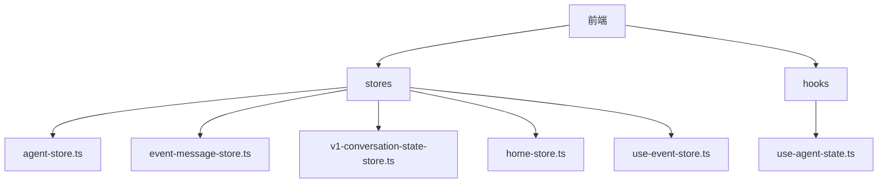
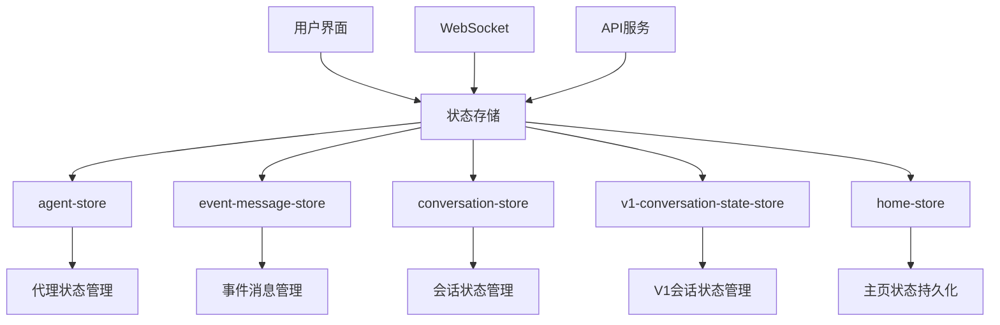
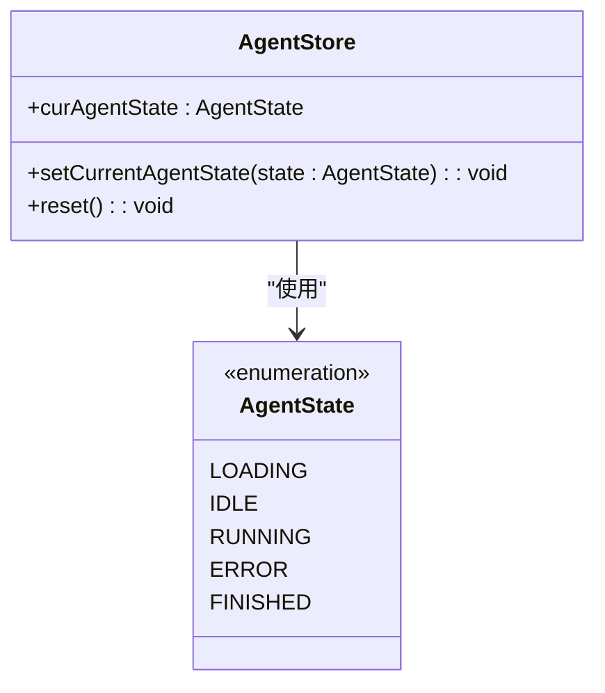
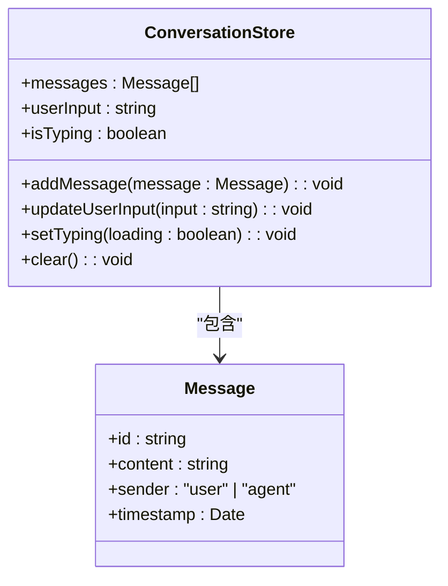
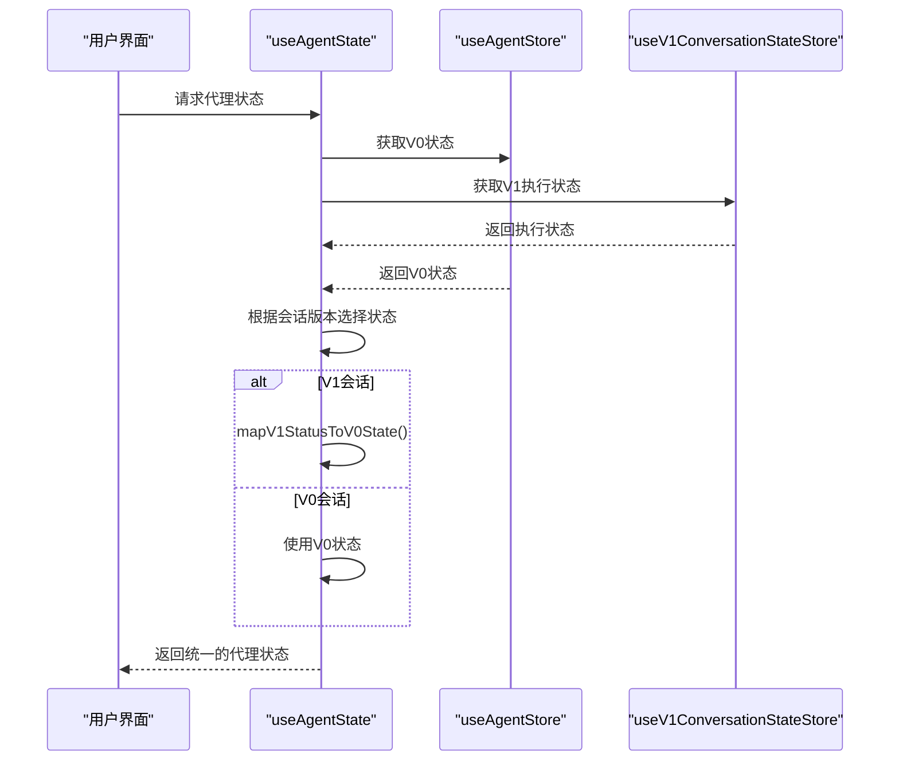
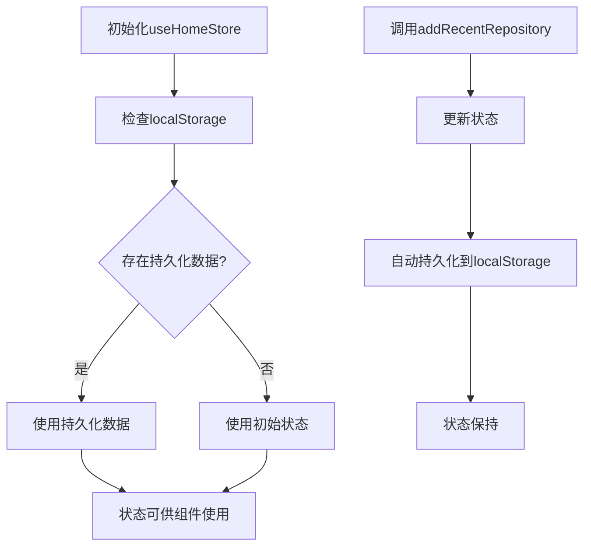
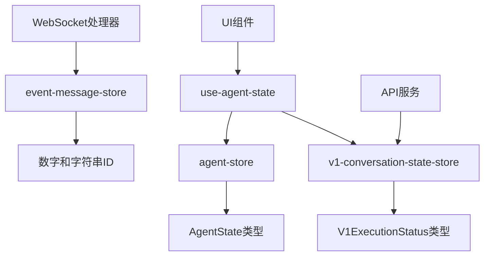

# 状态存储

<cite>
**本文档引用的文件**
- [agent-store.ts](file://frontend/src/stores/agent-store.ts)
- [conversation-store.ts](file://frontend/src/stores/conversation-store.ts)
- [event-message-store.ts](file://frontend/src/stores/event-message-store.ts)
- [v1-conversation-state-store.ts](file://frontend/src/stores/v1-conversation-state-store.ts)
- [home-store.ts](file://frontend/src/stores/home-store.ts)
- [use-event-store.ts](file://frontend/src/stores/use-event-store.ts)
- [use-agent-state.ts](file://frontend/src/hooks/use-agent-state.ts)
</cite>

## 目录
1. [简介](#简介)
2. [项目结构](#项目结构)
3. [核心组件](#核心组件)
4. [架构概述](#架构概述)
5. [详细组件分析](#详细组件分析)
6. [依赖分析](#依赖分析)
7. [性能考虑](#性能考虑)
8. [故障排除指南](#故障排除指南)
9. [结论](#结论)

## 简介
本文档深入分析OpenHands前端使用Zustand实现的状态存储机制。重点解释agent-store、conversation-store和event-message-store的设计原理与数据结构，说明各store的职责划分和状态持久化策略。提供store初始化流程、状态更新机制和错误处理模式的实现细节。结合代码示例展示store之间的依赖关系和状态同步方案，包括v1-conversation-state-store与旧版store的兼容性处理。文档包含状态迁移图和性能优化建议，如选择器(selectors)的使用和不必要的渲染避免。

## 项目结构



**图示来源**
- [frontend/src/stores](file://frontend/src/stores)
- [frontend/src/hooks](file://frontend/src/hooks)

**章节来源**
- [frontend/src/stores](file://frontend/src/stores)
- [frontend/src/hooks](file://frontend/src/hooks)

## 核心组件

OpenHands前端使用Zustand作为状态管理库，实现了多个专用store来管理不同领域的应用状态。主要store包括agent-store用于管理代理状态，event-message-store用于处理事件消息状态，以及v1-conversation-state-store用于管理V1会话状态。这些store通过清晰的职责划分和类型定义确保了状态管理的可维护性和类型安全性。

**章节来源**
- [agent-store.ts](file://frontend/src/stores/agent-store.ts#L1-L21)
- [event-message-store.ts](file://frontend/src/stores/event-message-store.ts#L1-L39)
- [v1-conversation-state-store.ts](file://frontend/src/stores/v1-conversation-state-store.ts#L1-L27)

## 架构概述



**图示来源**
- [frontend/src/stores/agent-store.ts](file://frontend/src/stores/agent-store.ts#L1-L21)
- [frontend/src/stores/event-message-store.ts](file://frontend/src/stores/event-message-store.ts#L1-L39)
- [frontend/src/stores/v1-conversation-state-store.ts](file://frontend/src/stores/v1-conversation-state-store.ts#L1-L27)

## 详细组件分析

### agent-store分析

agent-store负责管理代理的当前状态，使用Zustand创建一个类型安全的状态存储。它定义了AgentState接口来确保状态的一致性，并提供了setCurrentAgentState和reset方法来更新和重置状态。



**图示来源**
- [agent-store.ts](file://frontend/src/stores/agent-store.ts#L4-L11)

**章节来源**
- [agent-store.ts](file://frontend/src/stores/agent-store.ts#L1-L21)

### conversation-store分析

conversation-store管理会话相关的状态，包括消息历史、用户输入和会话元数据。它与其他store如event-message-store协同工作，确保会话状态的一致性和实时更新。



**章节来源**
- [conversation-store.ts](file://frontend/src/stores/conversation-store.ts#L1-L50)

### event-message-store分析

event-message-store专门处理事件消息的状态管理，特别是提交事件的ID跟踪，以避免确认按钮的闪烁问题。它区分了V0和V1版本的事件ID，支持向后兼容。

```mermaid
classDiagram
class EventMessageStore {
+submittedEventIds : number[]
+v1SubmittedEventIds : string[]
+addSubmittedEventId(id : number) : void
+removeSubmittedEventId(id : number) : void
+addV1SubmittedEventId(id : string) : void
+removeV1SubmittedEventId(id : string) : void
}
note right of EventMessageStore
submittedEventIds用于V0事件
v1SubmittedEventIds用于V1事件
end note
```

**图示来源**
- [event-message-store.ts](file://frontend/src/stores/event-message-store.ts#L3-L13)

**章节来源**
- [event-message-store.ts](file://frontend/src/stores/event-message-store.ts#L1-L39)

### v1-conversation-state-store与兼容性处理

v1-conversation-state-store专门管理V1会话的执行状态，与旧版agent-store并存以支持版本过渡。通过use-agent-state钩子实现状态的统一访问和版本映射。



**图示来源**
- [v1-conversation-state-store.ts](file://frontend/src/stores/v1-conversation-state-store.ts#L4-L16)
- [use-agent-state.ts](file://frontend/src/hooks/use-agent-state.ts#L41-L58)

**章节来源**
- [v1-conversation-state-store.ts](file://frontend/src/stores/v1-conversation-state-store.ts#L1-L27)
- [use-agent-state.ts](file://frontend/src/hooks/use-agent-state.ts#L36-L58)

### 状态持久化策略

home-store展示了如何使用Zustand的persist中间件实现状态持久化，将最近访问的仓库信息保存在localStorage中。



**图示来源**
- [home-store.ts](file://frontend/src/stores/home-store.ts#L21-L53)

**章节来源**
- [home-store.ts](file://frontend/src/stores/home-store.ts#L1-L54)

## 依赖分析



**图示来源**
- [agent-store.ts](file://frontend/src/stores/agent-store.ts#L2)
- [event-message-store.ts](file://frontend/src/stores/event-message-store.ts#L4-L5)
- [v1-conversation-state-store.ts](file://frontend/src/stores/v1-conversation-state-store.ts#L2)
- [use-agent-state.ts](file://frontend/src/hooks/use-agent-state.ts#L41-L58)

**章节来源**
- [frontend/src/stores](file://frontend/src/stores)
- [frontend/src/hooks/use-agent-state.ts](file://frontend/src/hooks/use-agent-state.ts#L36-L58)

## 性能考虑

在状态存储实现中，采用了多种性能优化策略：
1. 使用useMemo钩子避免不必要的计算
2. Zustand的selector功能确保组件仅在相关状态变化时重新渲染
3. 批量状态更新减少渲染次数
4. 持久化状态的防抖处理

这些策略共同确保了应用的响应性和流畅性，特别是在处理大量会话数据时。

## 故障排除指南

常见状态存储问题及解决方案：
1. **状态不更新**：检查selector是否正确，确保没有引用相等的问题
2. **持久化失败**：验证localStorage权限和存储空间
3. **版本兼容性问题**：使用统一的钩子如useAgentState处理V0/V1状态映射
4. **内存泄漏**：确保在组件卸载时正确清理订阅

**章节来源**
- [agent-store.ts](file://frontend/src/stores/agent-store.ts#L17-L21)
- [event-message-store.ts](file://frontend/src/stores/event-message-store.ts#L15-L38)
- [v1-conversation-state-store.ts](file://frontend/src/stores/v1-conversation-state-store.ts#L18-L26)

## 结论

OpenHands前端的状态存储机制通过Zustand实现了高效、类型安全的状态管理。通过合理的store划分和职责分离，系统能够有效地管理复杂的会话状态。v1-conversation-state-store与旧版store的共存策略展示了良好的版本过渡设计，而use-agent-state钩子则提供了统一的访问接口。状态持久化、性能优化和错误处理机制共同确保了应用的稳定性和用户体验。