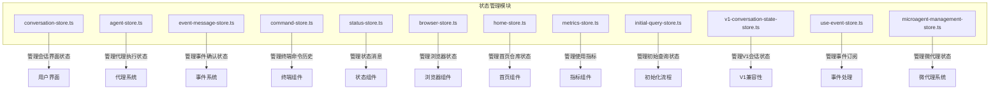
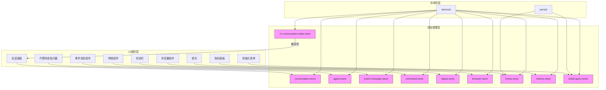
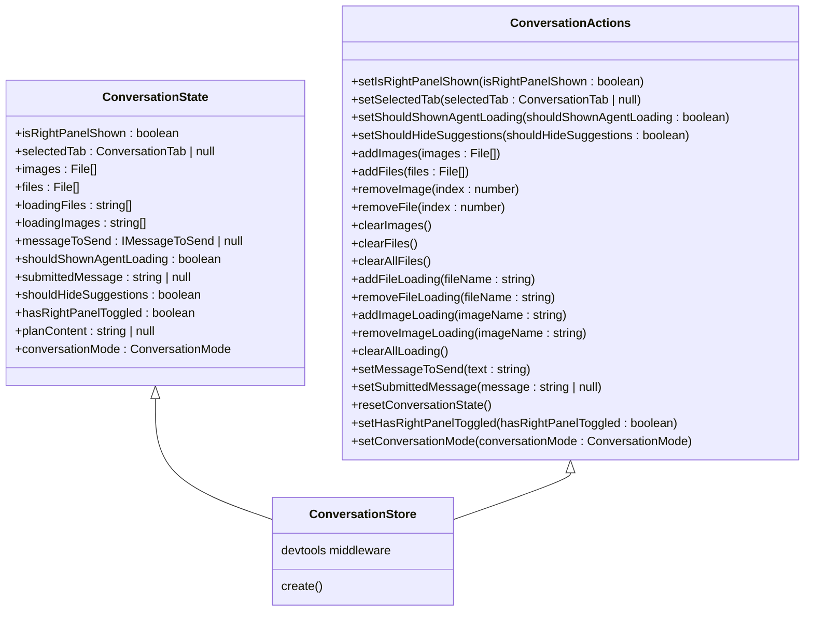
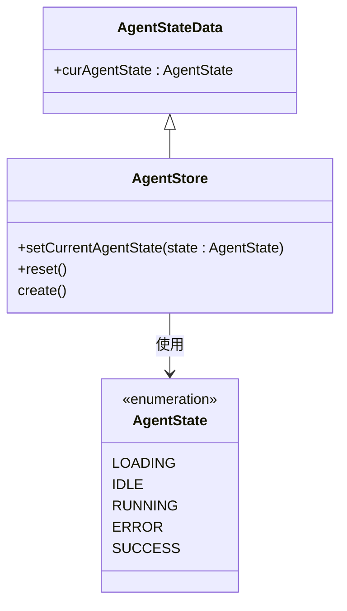
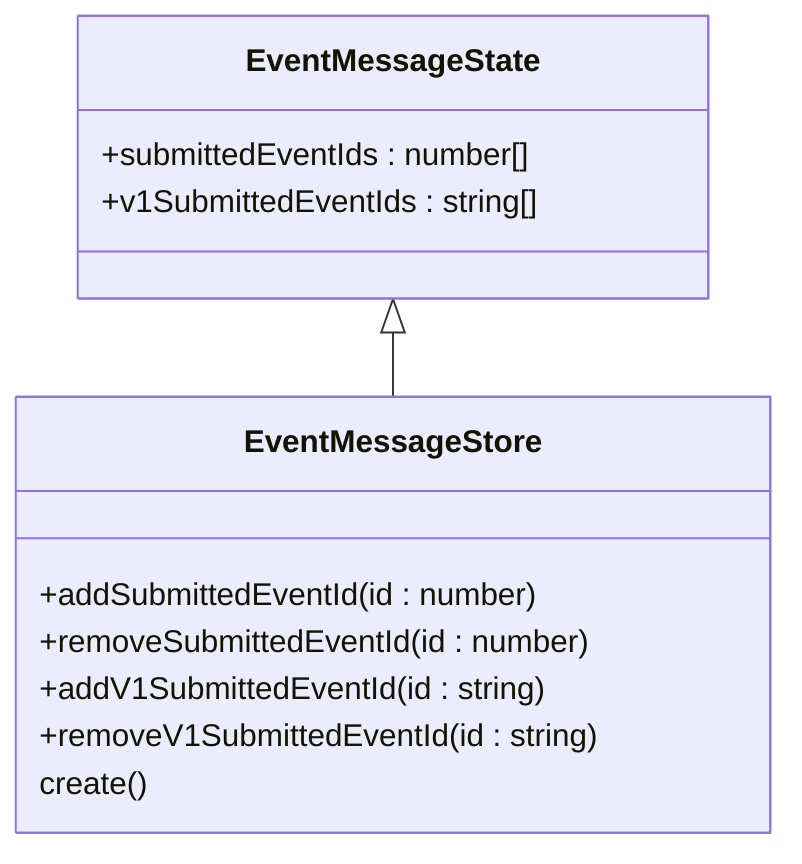
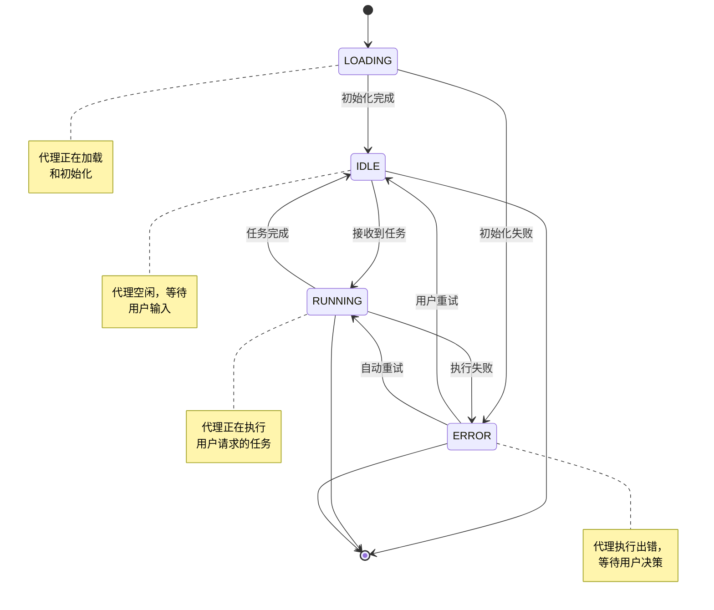
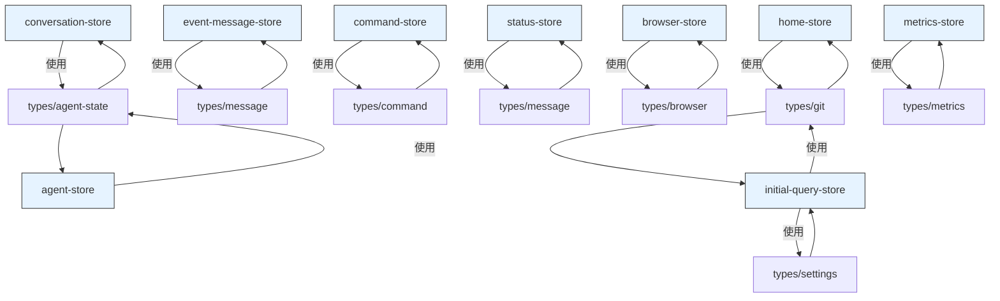

# 状态管理

<cite>
**本文档引用的文件**
- [conversation-store.ts](file://frontend/src/state/conversation-store.ts)
- [agent-store.ts](file://frontend/src/stores/agent-store.ts)
- [event-message-store.ts](file://frontend/src/stores/event-message-store.ts)
- [command-store.ts](file://frontend/src/state/command-store.ts)
- [status-store.ts](file://frontend/src/state/status-store.ts)
- [browser-store.ts](file://frontend/src/stores/browser-store.ts)
- [home-store.ts](file://frontend/src/stores/home-store.ts)
- [metrics-store.ts](file://frontend/src/stores/metrics-store.ts)
- [initial-query-store.ts](file://frontend/src/stores/initial-query-store.ts)
- [v1-conversation-state-store.ts](file://frontend/src/stores/v1-conversation-state-store.ts)
- [use-event-store.ts](file://frontend/src/stores/use-event-store.ts)
- [microagent-management-store.ts](file://frontend/src/state/microagent-management-store.ts)
</cite>

## 目录
1. [简介](#简介)
2. [项目结构](#项目结构)
3. [核心组件](#核心组件)
4. [架构概述](#架构概述)
5. [详细组件分析](#详细组件分析)
6. [依赖分析](#依赖分析)
7. [性能考虑](#性能考虑)
8. [故障排除指南](#故障排除指南)
9. [结论](#结论)

## 简介
OpenHands前端采用Zustand作为其状态管理解决方案，提供了一个高效、可扩展且易于调试的状态管理架构。该系统通过多个专用的状态存储(store)来管理应用程序的不同方面，包括会话状态、代理状态、事件消息、命令历史等。Zustand的轻量级特性和中间件支持（如devtools和persist）使得状态管理既强大又灵活。本文档详细说明了状态管理的设计原理、核心模块的实现以及最佳实践。

## 项目结构
OpenHands前端的状态管理主要分布在`src/state`和`src/stores`两个目录中，每个状态存储都专注于特定的功能领域。这种模块化的设计使得状态管理清晰且易于维护。

**Diagram sources**
- [conversation-store.ts](file://frontend/src/state/conversation-store.ts)
- [agent-store.ts](file://frontend/src/stores/agent-store.ts)
- [event-message-store.ts](file://frontend/src/stores/event-message-store.ts)
- [command-store.ts](file://frontend/src/state/command-store.ts)
- [status-store.ts](file://frontend/src/state/status-store.ts)
- [browser-store.ts](file://frontend/src/stores/browser-store.ts)
- [home-store.ts](file://frontend/src/stores/home-store.ts)
- [metrics-store.ts](file://frontend/src/stores/metrics-store.ts)
- [initial-query-store.ts](file://frontend/src/stores/initial-query-store.ts)
- [v1-conversation-state-store.ts](file://frontend/src/stores/v1-conversation-state-store.ts)
- [use-event-store.ts](file://frontend/src/stores/use-event-store.ts)
- [microagent-management-store.ts](file://frontend/src/state/microagent-management-store.ts)

**Section sources**
- [conversation-store.ts](file://frontend/src/state/conversation-store.ts)
- [agent-store.ts](file://frontend/src/stores/agent-store.ts)

## 核心组件
OpenHands的状态管理架构由多个核心状态存储组成，每个存储都负责管理特定领域的状态。`conversation-store`管理会话界面的状态，包括右侧面板的显示状态、选中的标签页、待发送的消息等。`agent-store`跟踪代理的当前执行状态，而`event-message-store`处理事件消息的确认状态，避免确认按钮的闪烁问题。这些存储通过Zustand的create函数创建，提供了清晰的状态和动作分离。

**Section sources**
- [conversation-store.ts](file://frontend/src/state/conversation-store.ts)
- [agent-store.ts](file://frontend/src/stores/agent-store.ts)
- [event-message-store.ts](file://frontend/src/stores/event-message-store.ts)

## 架构概述
OpenHands的状态管理架构采用模块化设计，将不同的状态关注点分离到独立的存储中。这种设计遵循单一职责原则，使得每个存储都专注于特定的功能领域。Zustand的中间件如devtools提供了强大的调试能力，而persist中间件则支持状态的持久化。状态存储通过自定义hooks暴露给组件，实现了状态逻辑与UI组件的解耦。

**Diagram sources**
- [conversation-store.ts](file://frontend/src/state/conversation-store.ts)
- [agent-store.ts](file://frontend/src/stores/agent-store.ts)
- [event-message-store.ts](file://frontend/src/stores/event-message-store.ts)
- [command-store.ts](file://frontend/src/state/command-store.ts)
- [status-store.ts](file://frontend/src/state/status-store.ts)
- [browser-store.ts](file://frontend/src/stores/browser-store.ts)
- [home-store.ts](file://frontend/src/stores/home-store.ts)
- [metrics-store.ts](file://frontend/src/stores/metrics-store.ts)
- [initial-query-store.ts](file://frontend/src/stores/initial-query-store.ts)
- [v1-conversation-state-store.ts](file://frontend/src/stores/v1-conversation-state-store.ts)

## 详细组件分析
### conversation-store分析
`conversation-store`是管理会话界面状态的核心存储，它跟踪右侧面板的显示状态、选中的标签页、待上传的文件和图片等。该存储使用localStorage来持久化右侧面板的显示状态，确保用户偏好在页面刷新后得以保留。存储中的动作方法遵循一致的命名约定，如`setIsRightPanelShown`、`setSelectedTab`等，使得API直观易用。

**Diagram sources**
- [conversation-store.ts](file://frontend/src/state/conversation-store.ts)

**Section sources**
- [conversation-store.ts](file://frontend/src/state/conversation-store.ts)

### agent-store分析
`agent-store`负责管理代理的当前执行状态，提供了一个简单的状态机来跟踪代理的生命周期。该存储的初始状态为`LOADING`，并通过`setCurrentAgentState`动作来更新状态。`reset`动作可以将存储重置为初始状态，这在会话重置或错误恢复时非常有用。

**Diagram sources**
- [agent-store.ts](file://frontend/src/stores/agent-store.ts)

**Section sources**
- [agent-store.ts](file://frontend/src/stores/agent-store.ts)

### event-message-store分析
`event-message-store`专门处理事件消息的确认状态，避免了确认按钮在用户交互后的闪烁问题。该存储维护两个数组：`submittedEventIds`用于V2事件，`v1SubmittedEventIds`用于V1事件，实现了向后兼容。动作方法如`addSubmittedEventId`和`removeSubmittedEventId`提供了对这些数组的安全操作。

**Diagram sources**
- [event-message-store.ts](file://frontend/src/stores/event-message-store.ts)

**Section sources**
- [event-message-store.ts](file://frontend/src/stores/event-message-store.ts)

### 状态迁移图
以下状态迁移图展示了`agent-store`中代理状态的转换逻辑：

**Diagram sources**
- [agent-store.ts](file://frontend/src/stores/agent-store.ts)

## 依赖分析
OpenHands的状态管理模块之间保持了低耦合，每个存储都独立管理自己的状态。然而，它们通过共享的类型定义和事件系统进行协作。例如，`conversation-store`和`agent-store`可能通过事件系统进行通信，当代理状态改变时更新会话界面。这种设计使得状态管理模块可以独立开发和测试，同时保持必要的协作。

**Diagram sources**
- [conversation-store.ts](file://frontend/src/state/conversation-store.ts)
- [agent-store.ts](file://frontend/src/stores/agent-store.ts)
- [event-message-store.ts](file://frontend/src/stores/event-message-store.ts)
- [command-store.ts](file://frontend/src/state/command-store.ts)
- [status-store.ts](file://frontend/src/state/status-store.ts)
- [browser-store.ts](file://frontend/src/stores/browser-store.ts)
- [home-store.ts](file://frontend/src/stores/home-store.ts)
- [metrics-store.ts](file://frontend/src/stores/metrics-store.ts)
- [initial-query-store.ts](file://frontend/src/stores/initial-query-store.ts)
- [types/agent-state](file://frontend/src/types/agent-state.ts)
- [types/message](file://frontend/src/types/message.ts)
- [types/command](file://frontend/src/types/command.ts)
- [types/browser](file://frontend/src/types/browser.ts)
- [types/git](file://frontend/src/types/git.ts)
- [types/settings](file://frontend/src/types/settings.ts)
- [types/metrics](file://frontend/src/types/metrics.ts)

**Section sources**
- [conversation-store.ts](file://frontend/src/state/conversation-store.ts)
- [agent-store.ts](file://frontend/src/stores/agent-store.ts)
- [event-message-store.ts](file://frontend/src/stores/event-message-store.ts)
- [command-store.ts](file://frontend/src/state/command-store.ts)
- [status-store.ts](file://frontend/src/state/status-store.ts)
- [browser-store.ts](file://frontend/src/stores/browser-store.ts)
- [home-store.ts](file://frontend/src/stores/home-store.ts)
- [metrics-store.ts](file://frontend/src/stores/metrics-store.ts)
- [initial-query-store.ts](file://frontend/src/stores/initial-query-store.ts)

## 性能考虑
OpenHands的状态管理设计考虑了性能优化。通过将状态分解到多个专用存储中，避免了不必要的重新渲染。Zustand的细粒度订阅机制确保组件只在相关状态改变时重新渲染。对于需要持久化的状态（如`home-store`中的最近仓库），使用了persist中间件，减少了对后端的频繁请求。此外，状态更新操作被设计为不可变的，避免了潜在的副作用。

## 故障排除指南
在使用OpenHands状态管理时，可能会遇到一些常见问题。如果状态更新没有触发UI重新渲染，请检查组件是否正确订阅了状态存储。如果持久化状态没有正确保存，请验证localStorage的使用是否被浏览器阻止。在开发过程中，可以使用Zustand的devtools中间件来跟踪状态变化和动作调度，这对于调试状态相关的问题非常有帮助。

**Section sources**
- [conversation-store.ts](file://frontend/src/state/conversation-store.ts)
- [home-store.ts](file://frontend/src/stores/home-store.ts)

## 结论
OpenHands前端的状态管理架构通过Zustand实现了高效、可维护的状态管理。模块化的设计、清晰的关注点分离以及强大的调试支持使得状态管理既强大又易于理解。通过遵循最佳实践，如使用不可变更新、细粒度订阅和适当的中间件，该架构为应用程序的可扩展性和性能提供了坚实的基础。