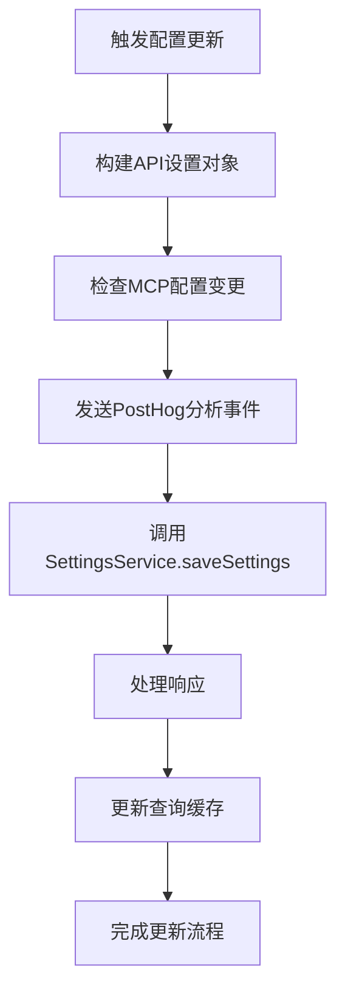
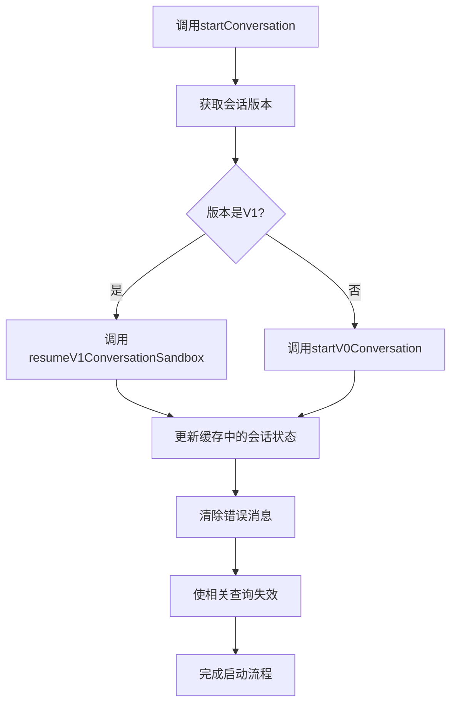
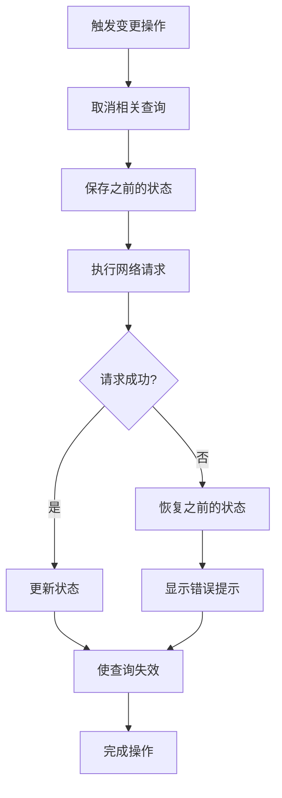
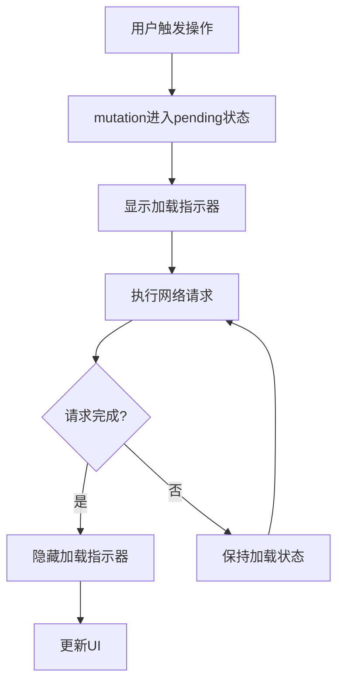
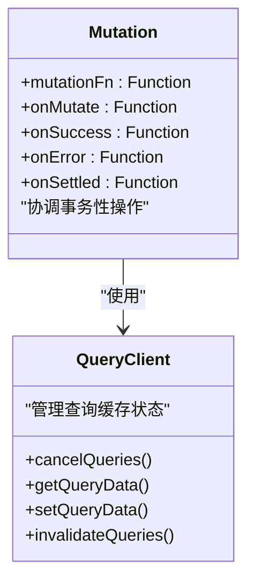
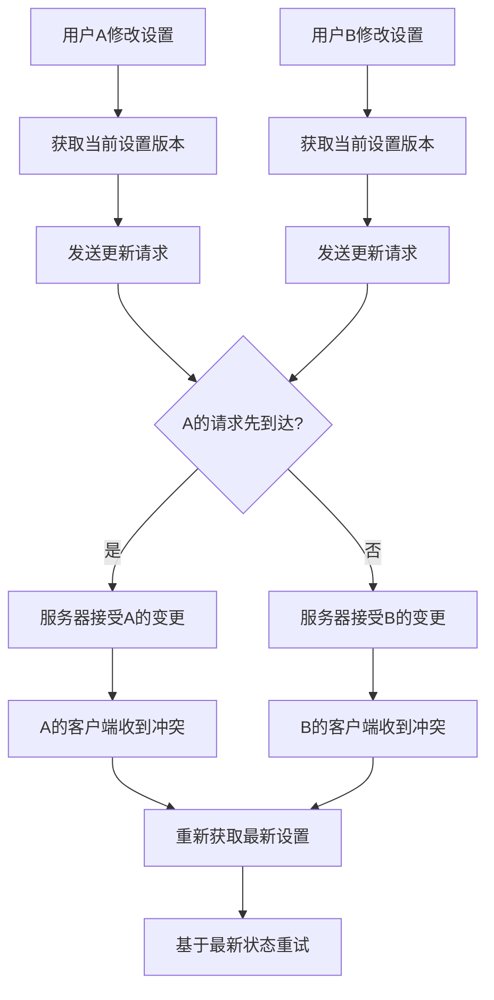
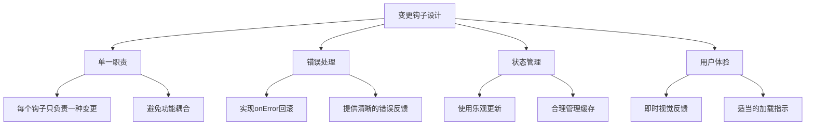

# 变更类钩子

<cite>
**本文档引用的文件**  
- [use-save-settings.ts](file://frontend/src/hooks/mutation/use-save-settings.ts)
- [settings-service.api.ts](file://frontend/src/settings-service/settings-service.api.ts)
- [use-create-conversation-and-subscribe-multiple.ts](file://frontend/src/hooks/use-create-conversation-and-subscribe-multiple.ts)
- [use-start-conversation.ts](file://frontend/src/hooks/mutation/use-start-conversation.ts)
- [use-unified-start-conversation.ts](file://frontend/src/hooks/mutation/use-unified-start-conversation.ts)
- [conversation-mutation-utils.ts](file://frontend/src/hooks/mutation/conversation-mutation-utils.ts)
- [use-update-conversation.ts](file://frontend/src/hooks/mutation/use-update-conversation.ts)
- [use-delete-conversation.ts](file://frontend/src/hooks/mutation/use-delete-conversation.ts)
- [error-message-store.ts](file://frontend/src/stores/error-message-store.ts)
- [security-analyzer-store.ts](file://frontend/src/stores/security-analyzer-store.ts)
</cite>

## 目录
1. [简介](#简介)
2. [配置更新钩子](#配置更新钩子)
3. [会话管理钩子](#会话管理钩子)
4. [错误处理与状态管理](#错误处理与状态管理)
5. [事务性操作与并发控制](#事务性操作与并发控制)
6. [最佳实践](#最佳实践)

## 简介
本文档系统性地阐述了OpenHands前端应用中变更类钩子的实现机制。重点分析了配置更新、会话创建与管理等核心功能的实现方式，包括乐观更新、错误回滚、状态同步等关键技术。文档详细说明了use-save-settings的配置更新流程，以及use-create-conversation和use-start-conversation等会话管理钩子的异步操作处理机制，并提供了错误处理、加载状态管理和副作用清理的最佳实践。

**变更类钩子**在OpenHands应用中扮演着关键角色，它们通过React Query的useMutation钩子实现状态变更操作，确保了用户界面与后端服务之间的数据一致性。这些钩子采用了乐观更新策略，在发送网络请求前先更新本地状态，提升了用户体验的流畅性。

**Section sources**
- [use-save-settings.ts](file://frontend/src/hooks/mutation/use-save-settings.ts#L1-L79)
- [use-start-conversation.ts](file://frontend/src/hooks/mutation/use-start-conversation.ts#L1-L44)

## 配置更新钩子

### use-save-settings实现机制
`use-save-settings`钩子负责管理应用设置的保存操作，实现了完整的配置更新流程。该钩子基于React Query的mutation机制，处理前端状态与后端存储之间的同步。



**Diagram sources**
- [use-save-settings.ts](file://frontend/src/hooks/mutation/use-save-settings.ts#L43-L78)
- [settings-service.api.ts](file://frontend/src/settings-service/settings-service.api.ts#L20-L25)

该钩子的核心功能包括：
- **配置转换**：将前端设置对象转换为符合API要求的格式
- **变更追踪**：检测MCP配置的变化并发送分析事件
- **乐观更新**：通过invalidateQueries使查询缓存失效，触发数据重新获取
- **版本控制**：支持多种配置项的版本管理，如LLM模型、代理类型等

钩子在`onSuccess`回调中调用`queryClient.invalidateQueries`来使设置查询失效，确保后续读取操作能获取最新的配置数据。这种机制实现了配置更新的版本控制策略，保证了系统状态的一致性。

**Section sources**
- [use-save-settings.ts](file://frontend/src/hooks/mutation/use-save-settings.ts#L9-L78)
- [settings-service.api.ts](file://frontend/src/settings-service/settings-service.api.ts#L4-L28)

## 会话管理钩子

### 会话创建与订阅
`use-create-conversation-and-subscribe-multiple`钩子实现了会话创建与WebSocket订阅的复合操作。该钩子采用多阶段处理模式，确保会话在准备好后才建立实时通信连接。

```mermaid
sequenceDiagram
participant UI as "用户界面"
participant Hook as "创建订阅钩子"
participant Service as "会话服务"
participant WebSocket as "WebSocket连接"
UI->>Hook : 调用createConversationAndSubscribe
Hook->>Service : 创建会话(异步)
Service-->>Hook : 返回会话ID和状态
Hook->>UI : 显示"会话启动中"提示
Hook->>Hook : 存储会话数据到createdConversations
loop 轮询会话状态
Hook->>Service : 查询会话状态
alt 状态为"RUNNING"
Service-->>Hook : 返回运行状态
Hook->>WebSocket : 建立WebSocket连接
Hook->>UI : 触发onSuccessCallback
break 完成
else 状态为"STARTING"
Service-->>Hook : 返回启动中状态
Hook->>Hook : 继续轮询(3秒间隔)
else 状态为"STOPPED"
Service-->>Hook : 返回停止状态
Hook->>UI : 清除启动提示
break 失败
end
end
```

**Diagram sources**
- [use-create-conversation-and-subscribe-multiple.ts](file://frontend/src/hooks/use-create-conversation-and-subscribe-multiple.ts#L26-L196)
- [use-create-conversation.ts](file://frontend/src/hooks/mutation/use-create-conversation.ts#L32-L100)

该实现的关键特性包括：
- **异步操作处理**：分离会话创建和WebSocket订阅，避免过早连接
- **状态轮询**：使用useQueries轮询会话状态，直到变为"RUNNING"
- **即时反馈**：立即显示启动提示，提升用户体验
- **多订阅支持**：支持同时管理多个会话的创建和订阅

**Section sources**
- [use-create-conversation-and-subscribe-multiple.ts](file://frontend/src/hooks/use-create-conversation-and-subscribe-multiple.ts#L26-L196)
- [use-create-conversation.ts](file://frontend/src/hooks/mutation/use-create-conversation.ts#L32-L100)

### 会话启动与恢复
`use-unified-start-conversation`钩子提供了统一的会话启动接口，能够自动处理V0和V1版本会话的启动逻辑。该钩子通过版本检测机制，路由到相应的启动实现。



**Diagram sources**
- [use-unified-start-conversation.ts](file://frontend/src/hooks/mutation/use-unified-start-conversation.ts#L23-L81)
- [conversation-mutation-utils.ts](file://frontend/src/hooks/mutation/conversation-mutation-utils.ts#L10-L19)

该钩子的状态同步机制包括：
- **版本检测**：从查询缓存中获取会话版本信息
- **乐观更新**：在`onSuccess`中更新缓存状态为"RUNNING"
- **错误回滚**：在`onError`中恢复之前的状态
- **查询失效**：使相关查询失效，触发数据刷新

**Section sources**
- [use-unified-start-conversation.ts](file://frontend/src/hooks/mutation/use-unified-start-conversation.ts#L23-L81)
- [conversation-mutation-utils.ts](file://frontend/src/hooks/mutation/conversation-mutation-utils.ts#L106-L138)

## 错误处理与状态管理

### 错误处理模式
变更类钩子采用了统一的错误处理模式，确保在操作失败时能够正确恢复状态。所有主要的mutation钩子都实现了`onError`回调，用于处理网络请求失败的情况。



**Diagram sources**
- [use-start-conversation.ts](file://frontend/src/hooks/mutation/use-start-conversation.ts#L18-L33)
- [use-update-conversation.ts](file://frontend/src/hooks/mutation/use-update-conversation.ts#L13-L45)
- [use-delete-conversation.ts](file://frontend/src/hooks/mutation/use-delete-conversation.ts#L11-L32)

关键的错误处理实践包括：
- **状态回滚**：在`onError`中使用`queryClient.setQueryData`恢复之前的状态
- **用户反馈**：通过toast组件显示错误信息，持续时间根据消息长度动态计算
- **副作用清理**：清除相关的临时状态和错误消息

**Section sources**
- [use-start-conversation.ts](file://frontend/src/hooks/mutation/use-start-conversation.ts#L26-L33)
- [use-update-conversation.ts](file://frontend/src/hooks/mutation/use-update-conversation.ts#L38-L45)
- [use-delete-conversation.ts](file://frontend/src/hooks/mutation/use-delete-conversation.ts#L27-L32)

### 加载状态管理
变更类钩子通过React Query的内置机制管理加载状态，提供了流畅的用户体验。`useIsMutating`钩子用于检测特定mutation的挂起状态。



**Diagram sources**
- [use-is-creating-conversation.ts](file://frontend/src/hooks/use-is-creating-conversation.ts#L4-L14)
- [use-create-conversation-and-subscribe-multiple.ts](file://frontend/src/hooks/use-create-conversation-and-subscribe-multiple.ts#L27-L44)

加载状态管理的关键点：
- **实时检测**：使用`useIsMutating`监控mutation状态
- **导航集成**：结合`useNavigation`处理页面导航时的状态
- **组合状态**：将多个状态源组合为统一的加载状态

**Section sources**
- [use-is-creating-conversation.ts](file://frontend/src/hooks/use-is-creating-conversation.ts#L4-L14)
- [use-create-conversation-and-subscribe-multiple.ts](file://frontend/src/hooks/use-create-conversation-and-subscribe-multiple.ts#L27-L44)

## 事务性操作与并发控制

### 事务性操作实现
变更类钩子通过React Query的mutation机制实现了类似事务的操作语义。虽然前端没有传统数据库事务，但通过一系列协调的操作达到了类似效果。



**Diagram sources**
- [use-update-conversation.ts](file://frontend/src/hooks/mutation/use-update-conversation.ts#L7-L58)
- [conversation-mutation-utils.ts](file://frontend/src/hooks/mutation/conversation-mutation-utils.ts#L106-L157)

事务性操作的关键步骤：
1. **准备阶段**：在`onMutate`中取消相关查询并保存之前状态
2. **执行阶段**：调用`mutationFn`执行实际的网络请求
3. **提交阶段**：在`onSuccess`中更新缓存并使查询失效
4. **回滚阶段**：在`onError`中恢复之前的状态

**Section sources**
- [use-update-conversation.ts](file://frontend/src/hooks/mutation/use-update-conversation.ts#L7-L58)
- [conversation-mutation-utils.ts](file://frontend/src/hooks/mutation/conversation-mutation-utils.ts#L106-L157)

### 并发冲突解决方案
系统通过查询缓存和版本检测机制处理并发冲突。当多个用户或组件同时修改同一资源时，系统能够检测并协调这些变更。



**Diagram sources**
- [use-save-settings.ts](file://frontend/src/hooks/mutation/use-save-settings.ts#L49-L70)
- [use-update-conversation.ts](file://frontend/src/hooks/mutation/use-update-conversation.ts#L19-L34)

并发控制策略包括：
- **乐观锁**：基于缓存版本进行更新，冲突时重新获取
- **自动重试**：通过查询失效和重新获取实现自动同步
- **最终一致性**：接受短暂的不一致，通过定期刷新达到最终一致

**Section sources**
- [use-save-settings.ts](file://frontend/src/hooks/mutation/use-save-settings.ts#L49-L70)
- [use-update-conversation.ts](file://frontend/src/hooks/mutation/use-update-conversation.ts#L19-L34)

## 最佳实践

### 变更钩子设计原则
基于OpenHands的实现，总结出以下变更钩子的最佳实践：



**Diagram sources**
- [use-save-settings.ts](file://frontend/src/hooks/mutation/use-save-settings.ts)
- [use-start-conversation.ts](file://frontend/src/hooks/mutation/use-start-conversation.ts)
- [use-update-conversation.ts](file://frontend/src/hooks/mutation/use-update-conversation.ts)

关键最佳实践：
- **分离关注点**：将业务逻辑与状态管理分离
- **防御性编程**：始终处理可能的错误情况
- **性能优化**：避免不必要的重新渲染和网络请求
- **可测试性**：设计易于单元测试的钩子结构

**Section sources**
- [use-save-settings.ts](file://frontend/src/hooks/mutation/use-save-settings.ts)
- [use-start-conversation.ts](file://frontend/src/hooks/mutation/use-start-conversation.ts)
- [use-update-conversation.ts](file://frontend/src/hooks/mutation/use-update-conversation.ts)