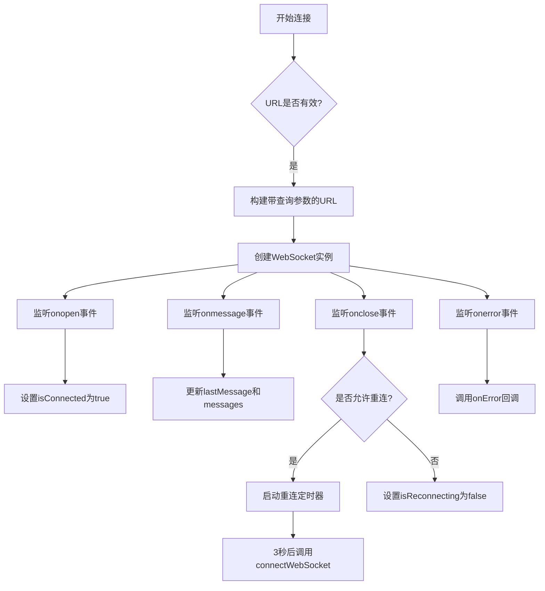

# 工具类钩子

<cite>
**本文档引用的文件**
- [use-websocket.ts](file://frontend/src/hooks/use-websocket.ts)
- [use-agent-state.ts](file://frontend/src/hooks/use-agent-state.ts)
- [use-conversation-id.ts](file://frontend/src/hooks/use-conversation-id.ts)
- [use-terminal.ts](file://frontend/src/hooks/use-terminal.ts)
- [ws-client-provider.tsx](file://frontend/src/context/ws-client-provider.tsx)
- [agent-store.ts](file://frontend/src/stores/agent-store.ts)
- [websocket-url.ts](file://frontend/src/utils/websocket-url.ts)
- [agent-state.tsx](file://frontend/src/types/agent-state.tsx)
</cite>

## 目录
1. [引言](#引言)
2. [WebSocket连接管理](#websocket连接管理)
3. [AI代理状态监控](#ai代理状态监控)
4. [会话标识管理](#会话标识管理)
5. [终端输出处理](#终端输出处理)
6. [性能监控与资源清理](#性能监控与资源清理)
7. [异常处理最佳实践](#异常处理最佳实践)
8. [结论](#结论)

## 引言

本文档深入解析OpenHands前端应用中的核心工具类钩子，重点阐述WebSocket连接管理、AI代理状态监控、会话标识管理和终端输出处理等关键功能的实现原理。这些钩子构成了前端与后端服务通信的基础设施，确保了应用的实时性、稳定性和用户体验。

## WebSocket连接管理

`useWebSocket` 钩子是前端与后端建立实时双向通信的核心。它封装了原生WebSocket API的复杂性，提供了自动重连、消息队列管理和错误处理等高级功能。

该钩子通过`useRef`和`useState`等React Hook管理WebSocket实例、连接状态和消息列表。在组件挂载时，它会根据提供的URL建立连接，并在组件卸载时进行清理，防止内存泄漏。



**钩子源码分析**
- **连接建立**: `connectWebSocket` 函数负责创建WebSocket实例，并根据`queryParams`选项构建带参数的URL。
- **消息处理**: `onmessage` 回调会更新`lastMessage`和`messages`状态，并触发用户提供的`onMessage`回调。
- **连接关闭**: `onclose` 事件处理程序是自动重连机制的核心。它检查连接关闭的原因（`event.code`），如果是非正常关闭（非1000），则会设置错误状态。
- **自动重连**: 通过`reconnect`选项控制，使用`setTimeout`实现指数退避重连策略，最大尝试次数可配置。
- **资源清理**: 在`useEffect`的清理函数中，会取消重连定时器并关闭WebSocket连接，确保组件卸载时资源被正确释放。

**Diagram sources**
- [use-websocket.ts](file://frontend/src/hooks/use-websocket.ts#L37-L113)

**Section sources**
- [use-websocket.ts](file://frontend/src/hooks/use-websocket.ts#L1-L192)

## AI代理状态监控

`useAgentState` 钩子负责监控AI代理的实时状态，并提供统一的状态接口。它通过Zustand状态管理库和React Query，实现了对V0和V1两种会话版本代理状态的兼容处理。

```mermaid
classDiagram
class useAgentState {
+useAgentStore : Zustand Hook
+useV1ConversationStateStore : Zustand Hook
+useActiveConversation : React Query Hook
+mapV1StatusToV0State(status) : AgentState
+useAgentState() : { curAgentState }
}
class useAgentStore {
-curAgentState : AgentState
+setCurrentAgentState(state)
+reset()
}
class AgentState {
+LOADING
+INIT
+RUNNING
+AWAITING_USER_INPUT
+PAUSED
+STOPPED
+FINISHED
+REJECTED
+ERROR
+RATE_LIMITED
+AWAITING_USER_CONFIRMATION
+USER_CONFIRMED
+USER_REJECTED
}
useAgentState --> useAgentStore : "使用"
useAgentState --> useV1ConversationStateStore : "使用"
useAgentState --> useActiveConversation : "使用"
useAgentStore --> AgentState : "包含"
```

**状态转换逻辑**
- **状态来源**: 钩子首先通过`useActiveConversation`获取当前会话信息，判断是V0还是V1版本。
- **V0状态**: 直接从`useAgentStore`中获取`curAgentState`。
- **V1状态**: 从`useV1ConversationStateStore`获取`execution_status`，然后通过`mapV1StatusToV0State`函数将其映射到统一的`AgentState`枚举。
- **状态枚举**: `AgentState` 枚举定义了代理可能处于的所有状态，如`RUNNING`（运行中）、`AWAITING_USER_INPUT`（等待用户输入）、`ERROR`（错误）等，为UI提供了清晰的状态指示。

**Section sources**
- [use-agent-state.ts](file://frontend/src/hooks/use-agent-state.ts#L1-L58)
- [agent-store.ts](file://frontend/src/stores/agent-store.ts#L1-L21)
- [agent-state.tsx](file://frontend/src/types/agent-state.tsx#L1-L22)

## 会话标识管理

`useConversationId` 钩子负责从URL路由参数中提取会话ID，为其他需要会话上下文的组件提供基础支持。

该钩子利用React Router的`useParams` Hook，从当前路由中获取`conversationId`参数。如果参数不存在，它会抛出一个错误，确保调用方在正确的路由上下文中使用该钩子。

```mermaid
flowchart LR
A[组件调用useConversationId] --> B[useParams获取参数]
B --> C{conversationId是否存在?}
C --> |是| D[返回{ conversationId }]
C --> |否| E[抛出错误]
```

此钩子的设计简单而有效，它将路由参数的解析逻辑封装起来，使得其他组件可以方便地获取会话ID，而无需关心路由的具体实现。

**Section sources**
- [use-conversation-id.ts](file://frontend/src/hooks/use-conversation-id.ts#L1-L13)

## 终端输出处理

`useTerminal` 钩子负责管理前端终端组件的渲染和交互。它基于`xterm.js`库，创建并维护一个终端实例，用于显示来自后端的命令和输出。

```mermaid
flowchart TD
A[初始化终端] --> B[创建Terminal实例]
B --> C[创建FitAddon实例]
C --> D[调用initializeTerminal]
D --> E[终端.open(HTMLDivElement)]
E --> F[隐藏光标]
F --> G[渲染历史命令]
G --> H[监听commands变化]
H --> I{有新命令?}
I --> |是| J[调用renderCommand]
J --> K[解析并写入终端]
I --> |否| L[等待]
H --> M[监听容器尺寸变化]
M --> N[调用fitAddon.fit()]
```

**核心功能**
- **终端初始化**: 在`useEffect`中创建`Terminal`和`FitAddon`实例，并将其挂载到DOM元素上。
- **命令渲染**: `renderCommand` 函数负责将命令对象（输入或输出）格式化并写入终端。对于输入命令，会先写入`$ `提示符。
- **输出解析**: 利用`parseTerminalOutput`工具函数，过滤掉Python解释器环境等无关信息，只显示用户关心的输出内容。
- **自适应布局**: 通过`ResizeObserver`监听容器尺寸变化，并调用`fitAddon.fit()`方法使终端自适应容器大小。
- **资源清理**: 在组件卸载时，调用`terminal.dispose()`方法销毁终端实例，释放资源。

**Section sources**
- [use-terminal.ts](file://frontend/src/hooks/use-terminal.ts#L1-L133)
- [parse-terminal-output.ts](file://frontend/src/utils/parse-terminal-output.ts#L1-L21)

## 性能监控与资源清理

本节探讨前端应用中的性能监控和资源清理最佳实践。

### 性能监控
- **消息速率监控**: `useRate` 钩子用于监控消息到达的速率。它记录时间戳，并计算最近两次消息的时间差，以判断消息流是否过于频繁，从而实现加载状态的控制。
- **WebSocket状态监控**: `ws-client-provider`中的`messageRateHandler`结合`useRate`，用于判断是否处于消息加载状态，优化用户体验。

### 资源清理
- **WebSocket清理**: `useWebSocket`钩子在`useEffect`的清理函数中，会清除重连定时器并关闭WebSocket连接，防止内存泄漏和无效的网络请求。
- **终端清理**: `useTerminal`钩子在清理函数中调用`terminal.dispose()`，确保`xterm.js`实例被完全销毁。
- **状态管理清理**: `useAgentStore`等Zustand store在组件卸载时会自动清理其订阅，但`reset`方法可用于手动重置状态。

**Section sources**
- [use-websocket.ts](file://frontend/src/hooks/use-websocket.ts#L131-L155)
- [use-terminal.ts](file://frontend/src/hooks/use-terminal.ts#L92-L95)
- [use-rate.ts](file://frontend/src/hooks/use-rate.ts#L1-L42)

## 异常处理最佳实践

前端应用的健壮性很大程度上取决于其异常处理能力。

### WebSocket异常处理
- **连接错误**: `onerror` 和 `onclose` 事件都会被捕获。`onclose`事件会根据`event.code`判断是否为正常关闭，非正常关闭会设置错误状态。
- **消息发送错误**: `sendMessage`函数在发送前会检查`socket`是否存在且处于`OPEN`状态，避免向已关闭的连接发送消息。
- **重连控制**: 使用`shouldReconnectRef`和`allowedToReconnectRef`两个引用，精确控制重连行为。`disconnect()`方法会明确禁止重连，而组件卸载时的清理函数也会禁用重连，防止不必要的网络请求。

### 全局错误处理
- **错误展示**: `ws-client-provider`中的`updateStatusWhenErrorMessagePresent`函数负责处理来自WebSocket的错误消息，并通过`showChatError`和`trackError`进行展示和上报。
- **错误分类**: 系统能够区分不同类型的错误，如“websocket error”、“timeout”或代理执行错误，并采取不同的处理策略。

**Section sources**
- [use-websocket.ts](file://frontend/src/hooks/use-websocket.ts#L73-L112)
- [ws-client-provider.tsx](file://frontend/src/context/ws-client-provider.tsx#L103-L128)

## 结论

本文档详细解析了OpenHands前端应用中的四个核心工具类钩子：`useWebSocket`、`useAgentState`、`useConversationId`和`useTerminal`。这些钩子通过精巧的设计和实现，解决了实时通信、状态管理、上下文获取和UI渲染等关键问题。

`useWebSocket` 提供了稳定可靠的实时连接，其自动重连和消息队列管理机制确保了通信的连续性。`useAgentState` 通过统一的接口抽象了不同版本会话的状态，简化了上层组件的开发。`useConversationId` 作为基础钩子，为应用提供了会话上下文。`useTerminal` 则利用强大的`xterm.js`库，实现了功能完整的终端体验。

这些钩子共同构成了一个高效、稳定且易于维护的前端架构，为AI代理的交互提供了坚实的基础。开发者在使用这些钩子时，应遵循其设计模式，特别是在资源清理和错误处理方面，以确保应用的长期稳定运行。