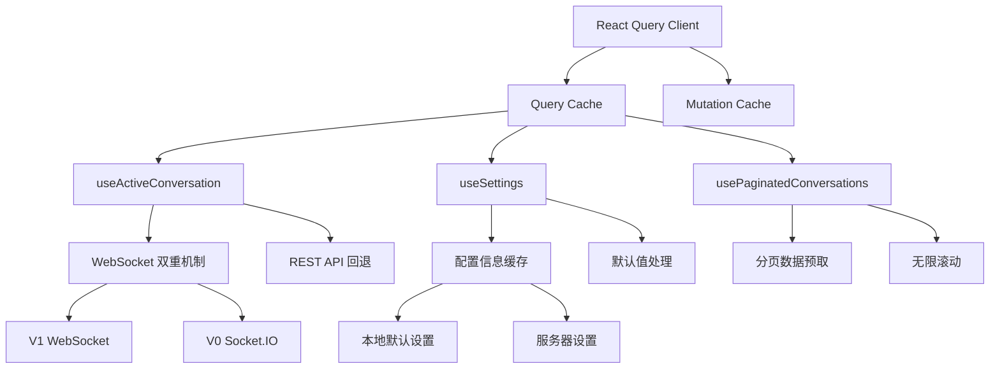
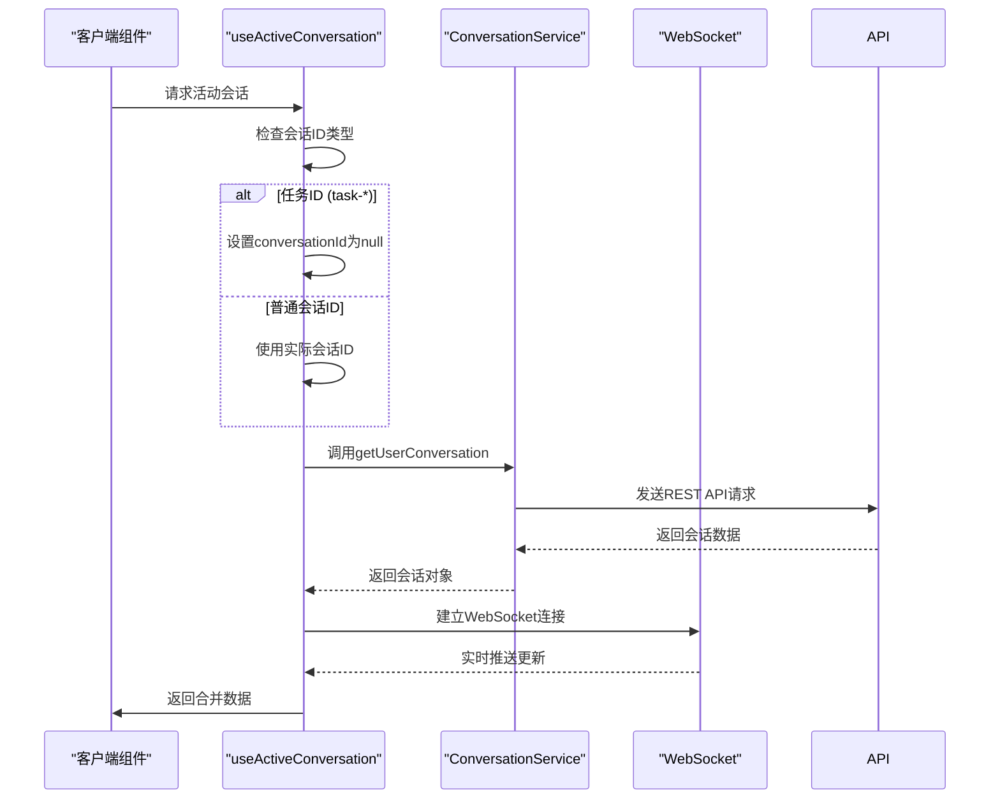
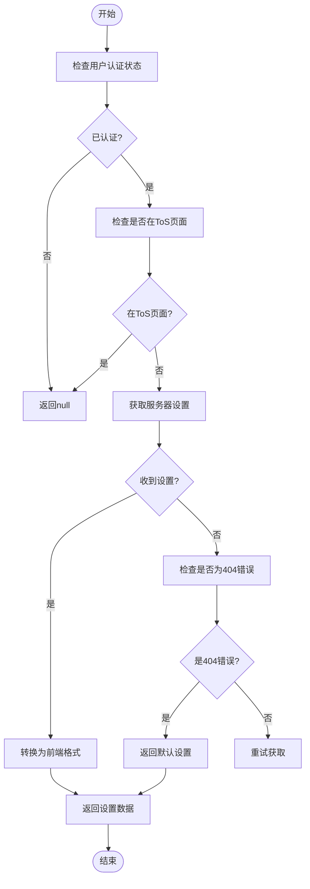
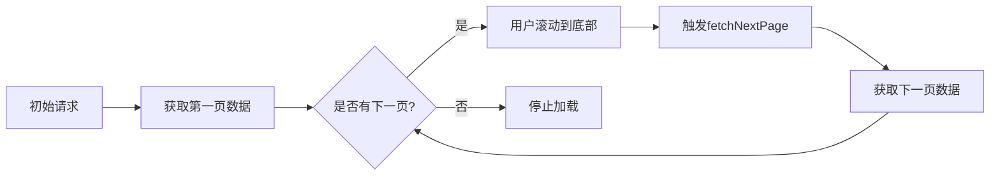
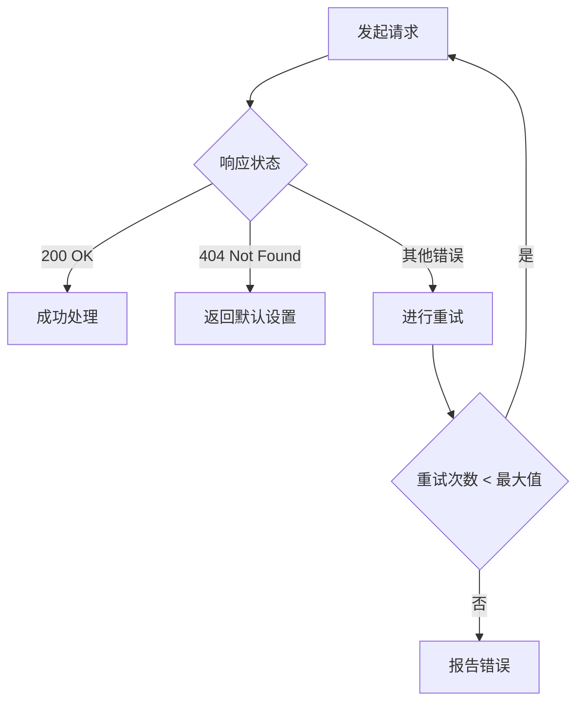
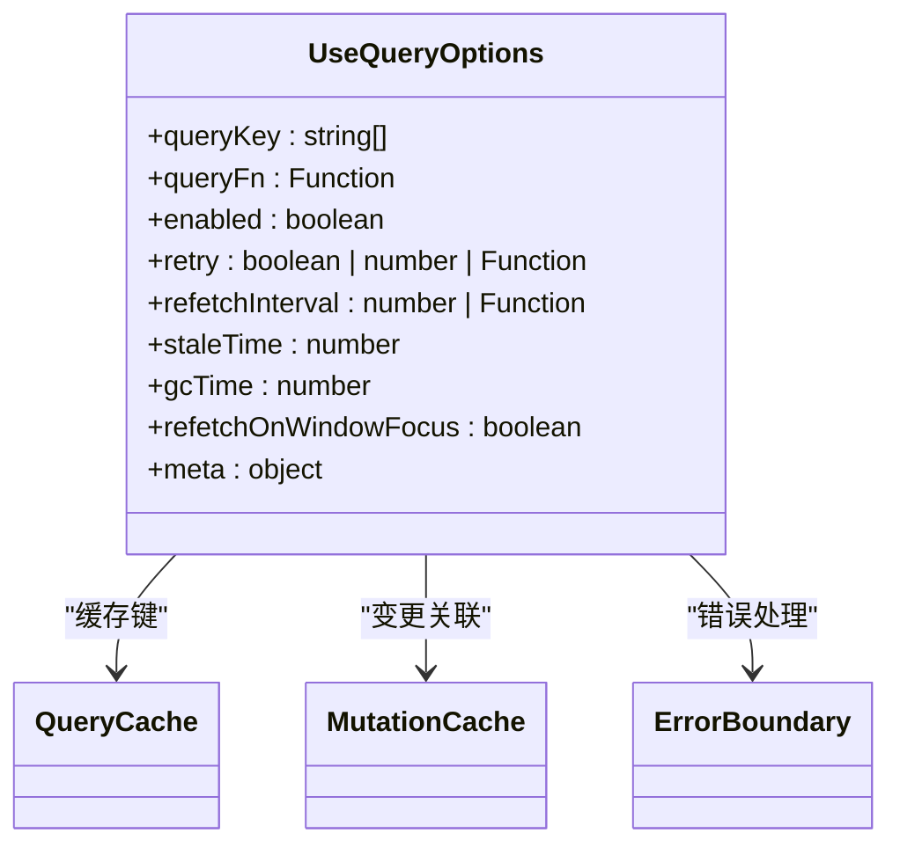

# 查询类钩子

<cite>
**本文档引用的文件**   
- [use-active-conversation.ts](file://frontend/src/hooks/query/use-active-conversation.ts)
- [use-settings.ts](file://frontend/src/hooks/query/use-settings.ts)
- [conversation-service.api.ts](file://frontend/src/api/conversation-service/conversation-service.api.ts)
- [settings-service.api.ts](file://frontend/src/settings-service/settings-service.api.ts)
- [conversation-websocket-context.tsx](file://frontend/src/contexts/conversation-websocket-context.tsx)
- [use-paginated-conversations.ts](file://frontend/src/hooks/query/use-paginated-conversations.ts)
- [query-client-config.ts](file://frontend/src/query-client-config.ts)
</cite>

## 目录
1. [引言](#引言)
2. [核心查询钩子架构](#核心查询钩子架构)
3. [use-active-conversation 数据获取机制](#use-active-conversation-数据获取机制)
4. [use-settings 配置缓存策略](#use-settings-配置缓存策略)
5. [分页处理与数据预取](#分页处理与数据预取)
6. [错误重试与同步机制](#错误重试与同步机制)
7. [自定义查询钩子创建指南](#自定义查询钩子创建指南)
8. [性能优化建议](#性能优化建议)
9. [常见数据同步问题解决方案](#常见数据同步问题解决方案)
10. [结论](#结论)

## 引言

本文档详细阐述了OpenHands前端应用中基于React Query的数据获取架构，重点分析了`use-active-conversation`和`use-settings`等核心查询钩子的实现机制。文档深入探讨了WebSocket与REST API双重数据获取模式、配置信息缓存策略、分页处理、错误重试机制以及数据预取模式。同时提供了自定义查询钩子的创建指南，包括useQuery配置选项、缓存键设计和数据转换逻辑，并包含性能优化建议和常见数据同步问题的解决方案。

## 核心查询钩子架构

OpenHands前端应用采用React Query作为核心数据获取和状态管理库，构建了一套完整的查询类钩子体系。该架构通过组合式API设计模式，将数据获取逻辑与UI组件解耦，实现了高效的数据缓存、同步和更新机制。



**图表来源**
- [use-active-conversation.ts](file://frontend/src/hooks/query/use-active-conversation.ts)
- [use-settings.ts](file://frontend/src/hooks/query/use-settings.ts)
- [use-paginated-conversations.ts](file://frontend/src/hooks/query/use-paginated-conversations.ts)

**本节来源**
- [use-active-conversation.ts](file://frontend/src/hooks/query/use-active-conversation.ts)
- [use-settings.ts](file://frontend/src/hooks/query/use-settings.ts)

## use-active-conversation 数据获取机制

`use-active-conversation`钩子实现了WebSocket与REST API双重机制的会话数据获取策略，确保在不同版本的会话之间无缝切换和数据同步。

### WebSocket与REST API双重机制

该钩子通过`useUserConversation`基础钩子获取会话数据，同时结合WebSocket实现实时数据更新。对于V0会话使用Socket.IO WebSocket，而对于V1会话则使用原生WebSocket协议。



**图表来源**
- [use-active-conversation.ts](file://frontend/src/hooks/query/use-active-conversation.ts)
- [conversation-service.api.ts](file://frontend/src/api/conversation-service/conversation-service.api.ts)
- [conversation-websocket-context.tsx](file://frontend/src/contexts/conversation-websocket-context.tsx)

### 动态轮询策略

该钩子实现了智能的动态轮询机制，根据会话状态调整轮询间隔：

- 当会话状态为"STARTING"时，轮询间隔为3秒
- 其他状态下，轮询间隔为30秒
- 任务ID会话不进行轮询，由专门的`useTaskPolling`钩子处理

这种策略平衡了实时性需求和服务器负载，确保在会话启动关键期能够快速获取状态更新，而在稳定期减少不必要的请求。

**本节来源**
- [use-active-conversation.ts](file://frontend/src/hooks/query/use-active-conversation.ts)

## use-settings 配置缓存策略

`use-settings`钩子实现了完善的配置信息缓存策略，确保用户设置的持久化和快速访问。

### 缓存与默认值处理

该钩子从服务器获取配置信息，同时处理404错误情况下的默认值返回，确保用户体验的连续性：



**图表来源**
- [use-settings.ts](file://frontend/src/hooks/query/use-settings.ts)
- [settings-service.api.ts](file://frontend/src/settings-service/settings-service.api.ts)

### 数据转换逻辑

服务器返回的配置数据经过转换后与前端所需的设置格式匹配，同时处理缺失字段的默认值：

- LLM模型、基础URL、代理等核心设置直接映射
- 布尔值设置如确认模式、声音通知等保持原样
- 数值设置如预算限制、压缩器大小等提供默认值
- 用户信息如邮箱、Git凭证等处理空值情况

这种转换逻辑确保了前后端数据格式的兼容性，同时提供了良好的用户体验。

**本节来源**
- [use-settings.ts](file://frontend/src/hooks/query/use-settings.ts)

## 分页处理与数据预取

OpenHands实现了高效的分页处理和数据预取机制，优化了大量数据的加载性能。

### 无限滚动分页实现

`use-paginated-conversations`钩子使用React Query的`useInfiniteQuery`实现无限滚动分页：



该实现通过`getNextPageParam`函数从API响应中提取`next_page_id`，作为下一次请求的参数，实现了基于游标的分页机制。

### 乐观缓存预填充

在获取分页数据时，系统会乐观地预填充单个会话的缓存，提高后续访问的响应速度：

```typescript
// 优化地预填充单个会话缓存
result.results.forEach((conversation) => {
  queryClient.setQueryData(
    ["user", "conversation", conversation.conversation_id],
    conversation,
  );
});
```

这种策略减少了重复的网络请求，提升了用户体验。

**本节来源**
- [use-paginated-conversations.ts](file://frontend/src/hooks/query/use-paginated-conversations.ts)

## 错误重试与同步机制

系统实现了智能的错误重试和数据同步机制，确保数据的一致性和可靠性。

### 条件性错误重试

`use-settings`钩子实现了条件性错误重试策略，避免在特定错误情况下进行不必要的重试：



这种策略特别针对404错误（设置未找到）不进行重试，而是立即返回默认设置，避免了用户长时间等待。

### 数据同步与失效

系统通过多种机制确保数据的同步和缓存失效：

- WebSocket消息触发相关查询的自动刷新
- 变更操作后手动使相关查询失效
- 基于时间的缓存过期策略（staleTime）
- 内存中的垃圾回收策略（gcTime）

这些机制共同保证了数据的实时性和一致性。

**本节来源**
- [use-settings.ts](file://frontend/src/hooks/query/use-settings.ts)
- [use-paginated-conversations.ts](file://frontend/src/hooks/query/use-paginated-conversations.ts)

## 自定义查询钩子创建指南

创建自定义查询钩子需要遵循一系列最佳实践，确保代码的可维护性和性能。

### useQuery配置选项



关键配置选项包括：
- **queryKey**: 缓存键，用于唯一标识查询
- **queryFn**: 数据获取函数，返回Promise
- **enabled**: 条件性执行查询
- **retry**: 错误重试策略
- **staleTime**: 数据陈旧时间
- **gcTime**: 缓存垃圾回收时间

### 缓存键设计原则

缓存键设计应遵循以下原则：
- 使用数组形式，便于参数化
- 包含资源类型和标识符
- 按层次组织，便于缓存管理
- 避免过长或复杂的键名

例如：`["user", "conversation", conversationId]`

### 数据转换逻辑

在查询函数中实现数据转换，确保返回的数据格式符合组件需求：

```typescript
const getSettingsQueryFn = async (): Promise<Settings> => {
  const apiSettings = await SettingsService.getSettings();
  
  return {
    LLM_MODEL: apiSettings.llm_model,
    LLM_BASE_URL: apiSettings.llm_base_url,
    // ... 其他字段映射
    CONDENSER_MAX_SIZE: apiSettings.condenser_max_size ?? DEFAULT_SETTINGS.CONDENSER_MAX_SIZE,
  };
};
```

**本节来源**
- [use-settings.ts](file://frontend/src/hooks/query/use-settings.ts)
- [use-active-conversation.ts](file://frontend/src/hooks/query/use-active-conversation.ts)

## 性能优化建议

为确保查询类钩子的高性能运行，建议遵循以下优化策略：

### 缓存策略优化

- 合理设置`staleTime`和`gcTime`，平衡数据新鲜度和内存使用
- 使用`initialData`预填充已知数据，避免不必要的加载状态
- 利用`placeholderData`提供骨架屏体验
- 实现智能的`enabled`条件，避免不必要的请求

### 网络请求优化

- 合并相关查询，减少请求数量
- 使用分页和无限滚动处理大量数据
- 实现数据预取（prefetching）提升用户体验
- 利用WebSocket实现实时更新，减少轮询

### 内存管理

- 监控查询缓存大小，避免内存泄漏
- 及时清理不再需要的查询
- 使用`keepPreviousData`避免加载状态闪烁
- 合理使用`select`选项进行数据选择，减少不必要的重新渲染

## 常见数据同步问题解决方案

### WebSocket连接问题

**问题**: WebSocket连接失败或频繁断开
**解决方案**:
- 实现重连机制
- 提供连接状态指示器
- 在连接失败时降级到轮询模式
- 记录连接错误日志用于诊断

### 缓存不一致

**问题**: 客户端缓存与服务器数据不一致
**解决方案**:
- 在变更操作后及时使相关查询失效
- 设置合理的缓存过期时间
- 实现WebSocket消息触发的缓存更新
- 提供手动刷新功能

### 分页数据重复

**问题**: 无限滚动中出现重复数据
**解决方案**:
- 确保API返回正确的`next_page_id`
- 在客户端使用Set去重
- 优化数据合并逻辑
- 监控分页参数的正确传递

## 结论

OpenHands的查询类钩子架构通过React Query的强大功能，实现了高效、可靠的数据获取和状态管理。`use-active-conversation`和`use-settings`等核心钩子展示了WebSocket与REST API双重机制、智能缓存策略和条件性错误处理的最佳实践。分页处理、数据预取和同步机制进一步提升了应用性能和用户体验。通过遵循本文档的指南，开发者可以创建高效、可维护的自定义查询钩子，为应用提供稳定的数据支持。