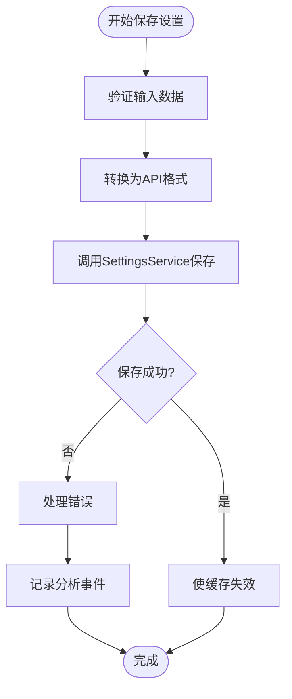

# 状态钩子

<cite>
**本文档引用的文件**
- [use-agent-state.ts](file://frontend/src/hooks/use-agent-state.ts)
- [use-active-conversation.ts](file://frontend/src/hooks/query/use-active-conversation.ts)
- [use-save-settings.ts](file://frontend/src/hooks/mutation/use-save-settings.ts)
- [use-websocket.ts](file://frontend/src/hooks/use-websocket.ts)
- [agent-store.ts](file://frontend/src/stores/agent-store.ts)
- [v1-conversation-state-store.ts](file://frontend/src/stores/v1-conversation-state-store.ts)
- [settings-service.api.ts](file://frontend/src/settings-service/settings-service.api.ts)
- [conversation-websocket-context.tsx](file://frontend/src/contexts/conversation-websocket-context.tsx)
- [websocket-url.ts](file://frontend/src/utils/websocket-url.ts)
- [use-settings.ts](file://frontend/src/hooks/query/use-settings.ts)
</cite>

## 目录
1. [简介](#简介)
2. [项目结构](#项目结构)
3. [核心组件](#核心组件)
4. [架构概述](#架构概述)
5. [详细组件分析](#详细组件分析)
6. [依赖分析](#依赖分析)
7. [性能考虑](#性能考虑)
8. [故障排除指南](#故障排除指南)
9. [结论](#结论)

## 简介
本文档系统性地阐述了OpenHands前端自定义React Hooks的设计与实现。重点说明了查询hooks（如use-agent-state、use-active-conversation）的数据获取机制和缓存策略，以及变更hooks（如use-save-settings）的突变操作和错误回滚逻辑。文档详细解释了这些hooks与Zustand store的集成方式，包括状态订阅、副作用处理和生命周期管理。同时提供了WebSocket相关hooks（use-websocket）的实时数据同步实现细节，以及表单处理hooks的验证和提交流程。通过实际使用示例和常见问题解决方案，帮助开发者深入理解OpenHands的状态管理机制。

## 项目结构
OpenHands前端的状态管理架构采用分层设计，主要由hooks、stores和contexts三个核心部分组成。hooks目录包含各种自定义React Hooks，分为查询（query）、变更（mutation）和通用工具三类。stores目录使用Zustand实现全局状态管理，为hooks提供底层状态存储。contexts目录则通过React Context提供跨组件的状态共享机制。

**图表来源**
- [use-agent-state.ts](file://frontend/src/hooks/use-agent-state.ts)
- [agent-store.ts](file://frontend/src/stores/agent-store.ts)
- [conversation-websocket-context.tsx](file://frontend/src/contexts/conversation-websocket-context.tsx)

**章节来源**
- [frontend/src/hooks](file://frontend/src/hooks)
- [frontend/src/stores](file://frontend/src/stores)
- [frontend/src/contexts](file://frontend/src/contexts)

## 核心组件
OpenHands前端的核心状态管理组件包括查询hooks、变更hooks、状态存储和WebSocket处理机制。查询hooks负责从API获取数据并管理缓存，变更hooks处理数据的修改操作并实现错误回滚。Zustand stores提供全局状态管理，而WebSocket相关组件则实现与后端的实时通信。

**章节来源**
- [use-agent-state.ts](file://frontend/src/hooks/use-agent-state.ts)
- [use-save-settings.ts](file://frontend/src/hooks/mutation/use-save-settings.ts)
- [use-websocket.ts](file://frontend/src/hooks/use-websocket.ts)

## 架构概述
OpenHands前端采用混合状态管理架构，结合了React Query、Zustand和原生React Context的优势。React Query用于管理服务器状态，处理数据获取、缓存和同步。Zustand用于管理客户端状态，提供轻量级的全局状态存储。WebSocket Context则负责实时通信，确保UI与后端状态保持同步。

**图表来源**
- [use-settings.ts](file://frontend/src/hooks/query/use-settings.ts)
- [agent-store.ts](file://frontend/src/stores/agent-store.ts)
- [conversation-websocket-context.tsx](file://frontend/src/contexts/conversation-websocket-context.tsx)

## 详细组件分析
本节深入分析OpenHands前端的关键状态管理组件，包括查询hooks、变更hooks、状态存储和WebSocket处理机制。

### 查询Hooks分析
查询hooks负责从服务器获取数据并管理本地缓存，确保数据的一致性和时效性。

#### use-agent-state分析

**图表来源**
- [use-agent-state.ts](file://frontend/src/hooks/use-agent-state.ts)
- [use-active-conversation.ts](file://frontend/src/hooks/query/use-active-conversation.ts)

#### use-active-conversation分析

**图表来源**
- [use-active-conversation.ts](file://frontend/src/hooks/query/use-active-conversation.ts)
- [conversation-service.api.ts](file://frontend/src/api/conversation-service/conversation-service.api.ts)

### 变更Hooks分析
变更hooks处理数据的修改操作，包括突变执行、错误处理和状态回滚。

#### use-save-settings分析

**图表来源**
- [use-save-settings.ts](file://frontend/src/hooks/mutation/use-save-settings.ts)
- [settings-service.api.ts](file://frontend/src/settings-service/settings-service.api.ts)

### WebSocket处理分析
WebSocket相关组件实现与后端的实时通信，确保UI状态与服务器状态同步。

#### use-websocket分析

**图表来源**
- [use-websocket.ts](file://frontend/src/hooks/use-websocket.ts)
- [websocket-url.ts](file://frontend/src/utils/websocket-url.ts)

**章节来源**
- [use-websocket.ts](file://frontend/src/hooks/use-websocket.ts)
- [websocket-url.ts](file://frontend/src/utils/websocket-url.ts)

## 依赖分析
OpenHands前端状态管理组件之间存在复杂的依赖关系，这些依赖确保了数据流的正确性和一致性。

**图表来源**
- [use-agent-state.ts](file://frontend/src/hooks/use-agent-state.ts)
- [use-save-settings.ts](file://frontend/src/hooks/mutation/use-save-settings.ts)
- [use-websocket.ts](file://frontend/src/hooks/use-websocket.ts)

**章节来源**
- [frontend/src/hooks](file://frontend/src/hooks)
- [frontend/src/services](file://frontend/src/services)

## 性能考虑
在使用OpenHands状态hooks时，需要注意以下性能优化点：

1. **缓存策略**：查询hooks使用React Query的缓存机制，避免不必要的网络请求。通过设置适当的staleTime和gcTime，平衡数据新鲜度和性能。

2. **选择性订阅**：使用Zustand的selector功能，只订阅组件需要的状态部分，避免不必要的重新渲染。

3. **防抖处理**：对于频繁触发的状态更新，使用use-debounce等工具进行防抖，减少状态更新频率。

4. **连接管理**：WebSocket连接在组件卸载时自动清理，避免内存泄漏和无效连接。

## 故障排除指南
### 常见问题及解决方案

#### WebSocket连接失败
**问题**：WebSocket连接无法建立或频繁断开
**解决方案**：
1. 检查网络连接和防火墙设置
2. 验证WebSocket URL格式是否正确
3. 检查后端服务是否正常运行
4. 查看浏览器控制台的错误信息

#### 状态更新不同步
**问题**：UI状态与服务器状态不一致
**解决方案**：
1. 检查useQuery的staleTime设置是否合理
2. 确认mutation的onSuccess回调中是否正确invalidated了相关查询
3. 验证WebSocket事件处理逻辑是否正确

#### 设置保存失败
**问题**：调用useSaveSettings后设置未保存
**解决方案**：
1. 检查网络请求是否成功
2. 验证输入数据格式是否符合API要求
3. 查看后端返回的错误信息
4. 确认用户是否有足够的权限

**章节来源**
- [use-websocket.ts](file://frontend/src/hooks/use-websocket.ts)
- [use-save-settings.ts](file://frontend/src/hooks/mutation/use-save-settings.ts)
- [use-settings.ts](file://frontend/src/hooks/query/use-settings.ts)

## 结论
OpenHands前端的状态管理架构通过精心设计的hooks、stores和contexts，实现了高效、可靠的状态管理。查询hooks利用React Query的强大功能，提供了优秀的数据获取和缓存策略。变更hooks通过清晰的突变操作和错误处理机制，确保了数据的一致性和完整性。Zustand stores为全局状态管理提供了轻量级的解决方案，而WebSocket相关组件则实现了与后端的实时同步。这种混合架构既保持了灵活性，又确保了性能和可维护性，为开发者提供了强大的状态管理工具。