# UI基础组件

<cite>
**本文档中引用的文件**  
- [resize-handle.tsx](file://frontend/src/components/ui/resize-handle.tsx)
- [context-menu.tsx](file://frontend/src/ui/context-menu.tsx)
- [context-menu-list-item.tsx](file://frontend/src/components/features/context-menu/context-menu-list-item.tsx)
- [use-drag-resize.ts](file://frontend/src/hooks/use-drag-resize.ts)
- [use-resizable-panels.ts](file://frontend/src/hooks/use-resizable-panels.ts)
- [tools-context-menu.tsx](file://frontend/src/components/features/controls/tools-context-menu.tsx)
- [constants.ts](file://frontend/src/utils/constants.ts)
- [utils.ts](file://frontend/src/utils/utils.ts)
</cite>

## 目录
1. [简介](#简介)
2. [核心UI基础组件](#核心ui基础组件)
3. [事件处理机制](#事件处理机制)
4. [CSS样式架构](#css样式架构)
5. [动画效果实现](#动画效果实现)
6. [实际使用示例](#实际使用示例)
7. [可定制性与主题支持](#可定制性与主题支持)
8. [组件集成分析](#组件集成分析)

## 简介
OpenHands前端的UI基础组件为整个应用提供了底层的交互能力。这些组件包括resize-handle（调整大小手柄）、context-menu（上下文菜单）和controls（控制组件）等低级别UI元素，它们构成了上层功能组件的交互基础。这些基础组件通过精心设计的事件处理机制、CSS样式架构和动画效果，实现了流畅的用户体验。

**Section sources**
- [context-menu.tsx](file://frontend/src/ui/context-menu.tsx#L1-L72)
- [resize-handle.tsx](file://frontend/src/components/ui/resize-handle.tsx#L1-L22)

## 核心UI基础组件

### Resize Handle（调整大小手柄）
Resize Handle组件是一个轻量级的UI元素，用于实现拖拽调整大小的功能。该组件通过`onMouseDown`事件处理器与上层逻辑连接，提供了一个视觉上几乎不可见但具有足够点击区域的手柄。

组件的主要特性包括：
- 使用`cursor-ew-resize`光标样式，提示用户可以进行水平拖拽
- 通过绝对定位的子元素创建更大的点击区域，提升用户体验
- 视觉指示器显示为细线，保持界面简洁

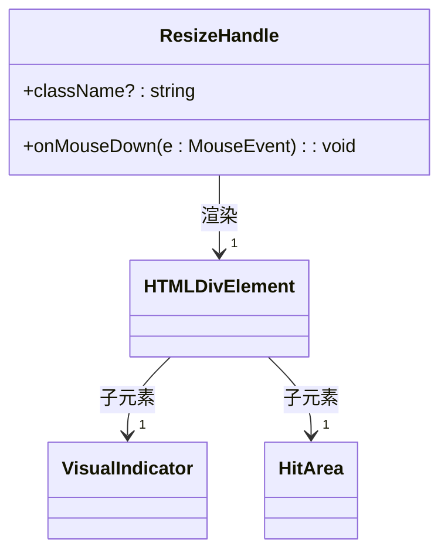

**Diagram sources**
- [resize-handle.tsx](file://frontend/src/components/ui/resize-handle.tsx#L1-L22)

### Context Menu（上下文菜单）
Context Menu组件是一个可配置的弹出式菜单，支持多种布局和定位选项。它使用class-variance-authority（cva）来管理不同的样式变体，提供了灵活的定制能力。

组件支持的变体包括：
- **尺寸变体**：compact（紧凑）和default（默认）
- **布局变体**：vertical（垂直）
- **位置变体**：top（顶部）和bottom（底部）
- **对齐变体**：left（左对齐）和right（右对齐）

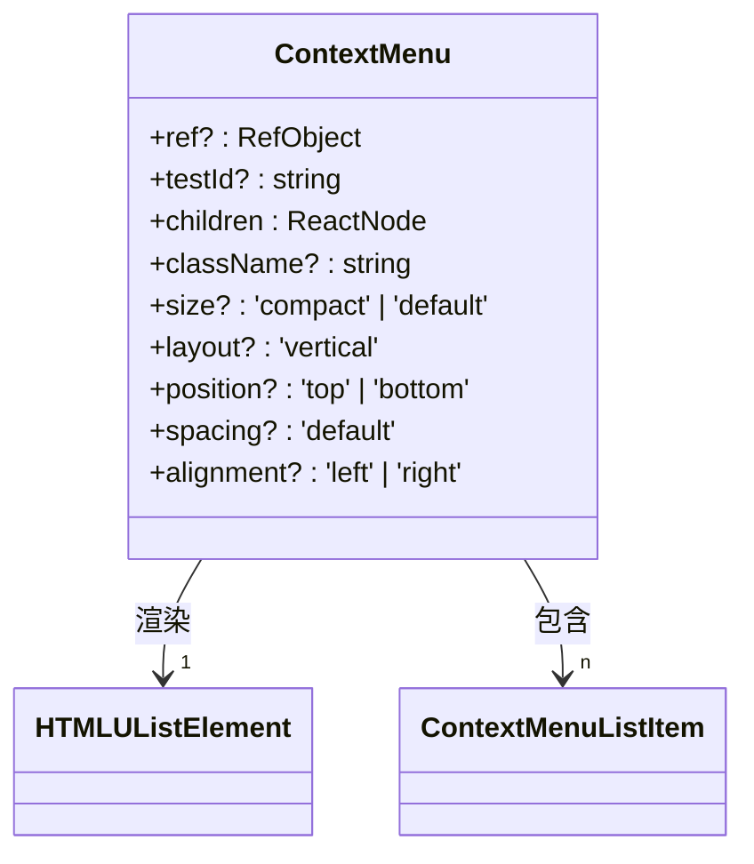

**Diagram sources**
- [context-menu.tsx](file://frontend/src/ui/context-menu.tsx#L1-L72)

### Context Menu List Item（上下文菜单项）
ContextMenuListItem组件是上下文菜单中的基本交互单元，通常作为菜单中的可点击选项。它提供了一个标准化的按钮样式，支持禁用状态和自定义点击处理。

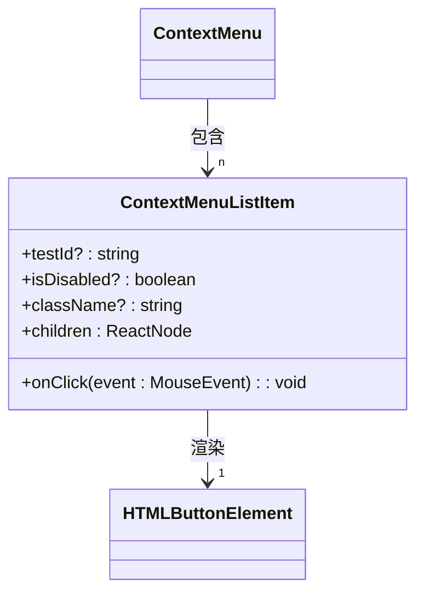

**Diagram sources**
- [context-menu-list-item.tsx](file://frontend/src/components/features/context-menu/context-menu-list-item.tsx#L1-L33)

**Section sources**
- [resize-handle.tsx](file://frontend/src/components/ui/resize-handle.tsx#L1-L22)
- [context-menu.tsx](file://frontend/src/ui/context-menu.tsx#L1-L72)
- [context-menu-list-item.tsx](file://frontend/src/components/features/context-menu/context-menu-list-item.tsx#L1-L33)

## 事件处理机制

### Resize Handle事件流
Resize Handle组件本身不直接处理复杂的事件逻辑，而是将`onMouseDown`事件委托给上层组件。真正的事件处理由`useDragResize`和`useResizablePanels`等自定义Hook实现。

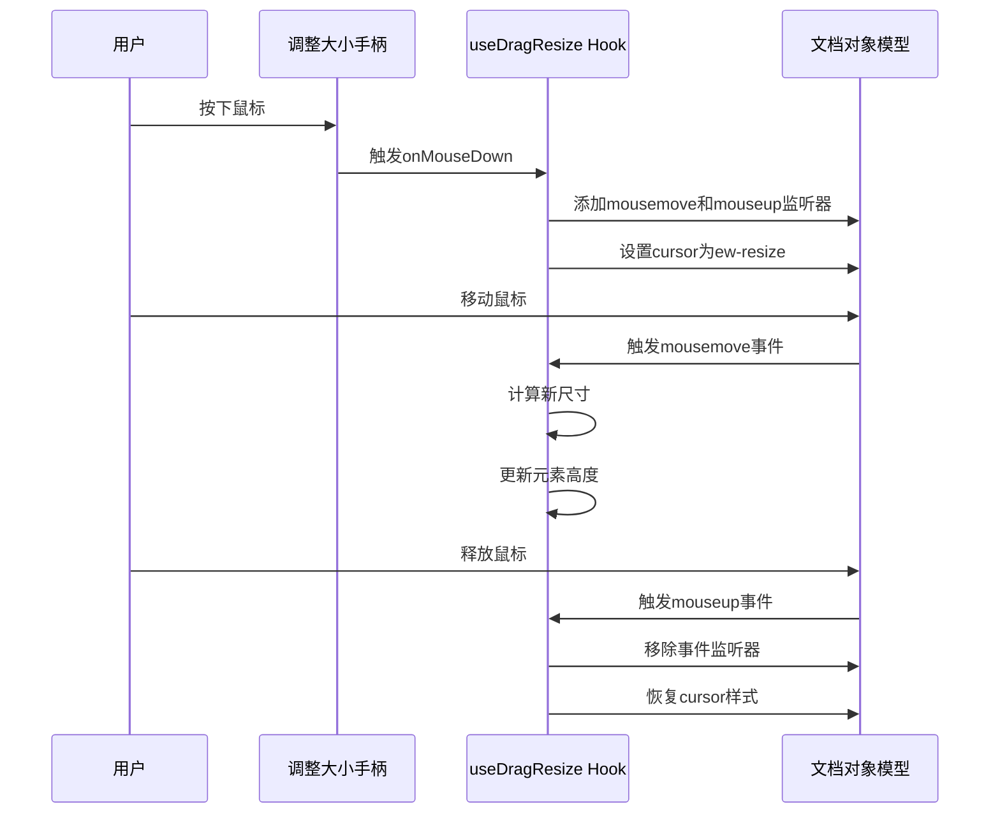

**Diagram sources**
- [use-drag-resize.ts](file://frontend/src/hooks/use-drag-resize.ts#L1-L167)
- [use-resizable-panels.ts](file://frontend/src/hooks/use-resizable-panels.ts#L1-L86)

### 拖拽调整大小Hook
`useDragResize` Hook是实现拖拽调整大小功能的核心。它处理了桌面和移动设备的不同事件模型，确保在各种设备上都能正常工作。

关键事件处理逻辑：
- `handleGripMouseDown`：处理鼠标按下事件，阻止默认行为并启动拖拽
- `handleGripTouchStart`：处理触摸开始事件，支持移动设备
- `createDragMoveHandler`：计算拖拽过程中的新高度，考虑最小和最大限制
- `createDragEndHandler`：清理事件监听器，恢复DOM状态

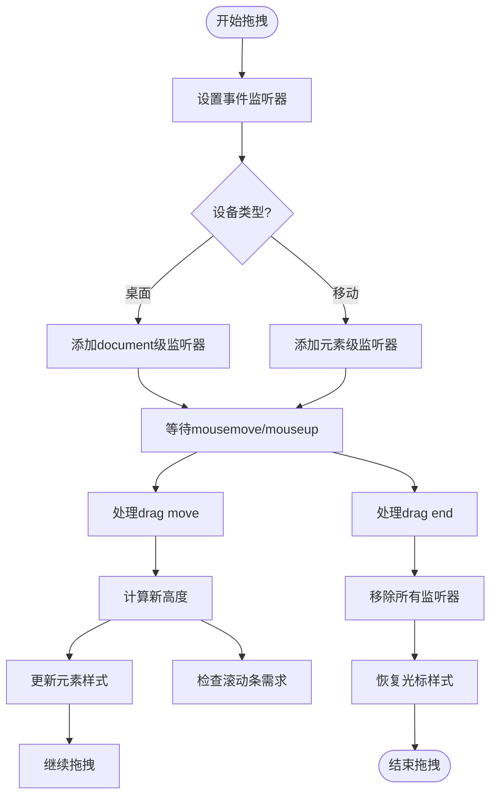

**Diagram sources**
- [use-drag-resize.ts](file://frontend/src/hooks/use-drag-resize.ts#L1-L167)

**Section sources**
- [use-drag-resize.ts](file://frontend/src/hooks/use-drag-resize.ts#L1-L167)
- [use-resizable-panels.ts](file://frontend/src/hooks/use-resizable-panels.ts#L1-L86)

## CSS样式架构

### 样式管理方案
OpenHands前端采用Tailwind CSS与class-variance-authority（cva）结合的样式管理方案。这种组合提供了原子化CSS的灵活性和组件化样式的可维护性。

主要样式工具：
- `cn`函数：合并类名，解决Tailwind类名冲突
- `cva`函数：定义组件的样式变体
- 原子化CSS类：直接在JSX中应用样式

### Resize Handle样式结构
Resize Handle组件的样式设计注重用户体验和视觉简洁性：

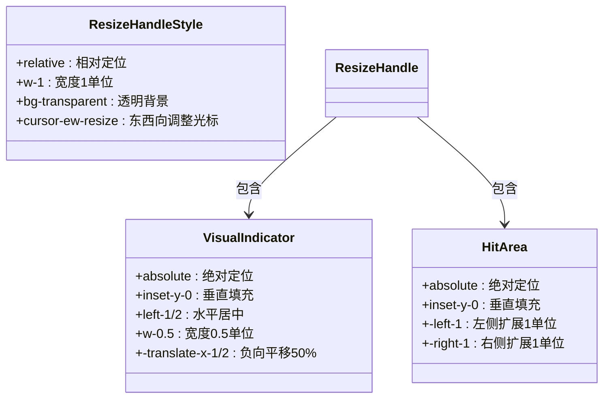

**Diagram sources**
- [resize-handle.tsx](file://frontend/src/components/ui/resize-handle.tsx#L1-L22)

### Context Menu样式变体
Context Menu使用cva定义了多个样式变体，实现了高度的可配置性：

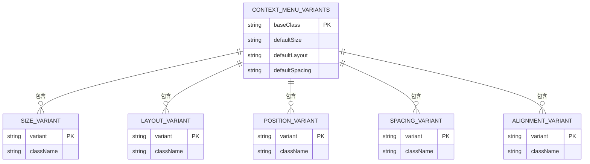

**Diagram sources**
- [context-menu.tsx](file://frontend/src/ui/context-menu.tsx#L1-L72)

**Section sources**
- [context-menu.tsx](file://frontend/src/ui/context-menu.tsx#L1-L72)
- [resize-handle.tsx](file://frontend/src/components/ui/resize-handle.tsx#L1-L22)
- [utils.ts](file://frontend/src/utils/utils.ts#L1-L676)

## 动画效果实现

### 过渡动画配置
OpenHands的UI组件使用CSS过渡动画来提升用户体验。在上下文菜单的子菜单实现中，可以看到明确的过渡效果配置：

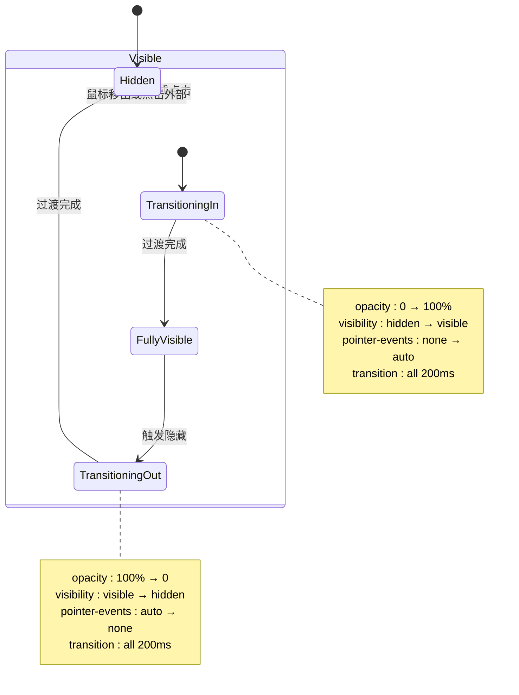

**Diagram sources**
- [tools-context-menu.tsx](file://frontend/src/components/features/controls/tools-context-menu.tsx#L1-L165)

### 拖拽过程中的实时反馈
在拖拽调整大小的过程中，系统提供实时的视觉反馈：

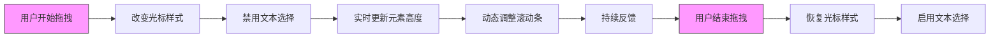

**Diagram sources**
- [use-drag-resize.ts](file://frontend/src/hooks/use-drag-resize.ts#L1-L167)

**Section sources**
- [use-drag-resize.ts](file://frontend/src/hooks/use-drag-resize.ts#L1-L167)
- [tools-context-menu.tsx](file://frontend/src/components/features/controls/tools-context-menu.tsx#L1-L165)

## 实际使用示例

### 可调整面板实现
`useResizablePanels` Hook展示了如何将基础组件集成到复杂功能中：

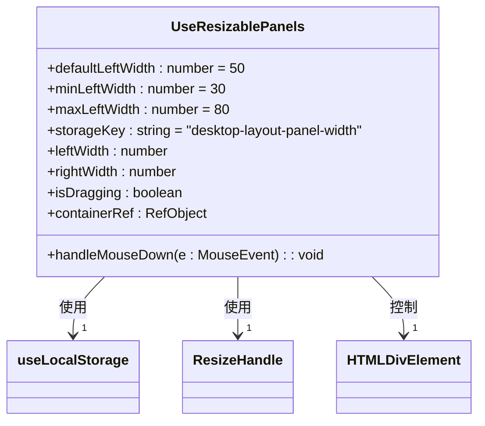

**Diagram sources**
- [use-resizable-panels.ts](file://frontend/src/hooks/use-resizable-panels.ts#L1-L86)

### 工具上下文菜单
工具上下文菜单是基础组件的典型集成示例，展示了多个基础组件如何协同工作：

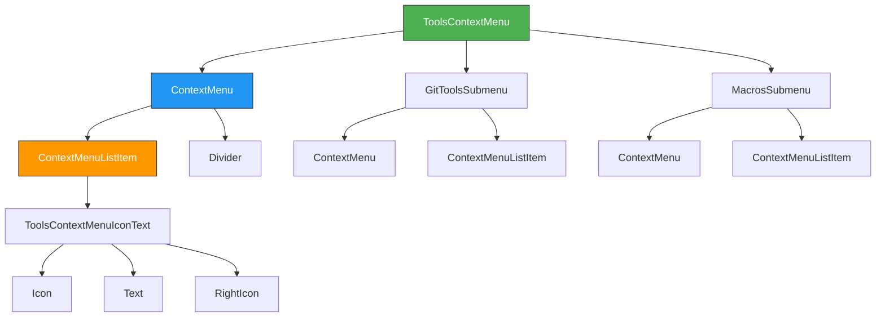

**Diagram sources**
- [tools-context-menu.tsx](file://frontend/src/components/features/controls/tools-context-menu.tsx#L1-L165)

**Section sources**
- [use-resizable-panels.ts](file://frontend/src/hooks/use-resizable-panels.ts#L1-L86)
- [tools-context-menu.tsx](file://frontend/src/components/features/controls/tools-context-menu.tsx#L1-L165)

## 可定制性与主题支持

### 样式定制机制
OpenHands通过多种方式支持组件的可定制性：

```mermaid
classDiagram
class Customization {
+className Prop : 外部类名
+variant Prop : 预设变体
+inline Style : 内联样式
+theme Context : 主题上下文
}
Customization --> "1" ResizeHandle : 应用于
Customization --> "1" ContextMenu : 应用于
Customization --> "1" ContextMenuListItem : 应用于
note right of Customization
支持的定制方式：
1. className属性 - 添加自定义类名
2. variant属性 - 选择预设样式变体
3. 内联样式 - 直接设置style属性
4. 主题上下文 - 全局主题配置
end note
```

**Diagram sources**
- [context-menu.tsx](file://frontend/src/ui/context-menu.tsx#L1-L72)
- [resize-handle.tsx](file://frontend/src/components/ui/resize-handle.tsx#L1-L22)

### 常量配置支持
通过`constants.ts`文件，系统提供了可配置的常量值，支持UI行为的定制：

```mermaid
erDiagram
CONSTANTS ||--o{ UI_CONSTANTS : 包含
CONSTANTS ||--o{ CHAT_CONSTANTS : 包含
CONSTANTS ||--o{ TOLERANCE_CONSTANTS : 包含
UI_CONSTANTS {
string CONTEXT_MENU_ICON_TEXT_CLASSNAME PK
string SETTINGS_FORM_LABEL_CLASSNAME
}
CHAT_CONSTANTS {
number CHAT_INPUT_HEIGHT_THRESHOLD PK
}
TOLERANCE_CONSTANTS {
number EPS PK
}
CONSTANTS {
string file PK
path: frontend/src/utils/constants.ts
}
```

**Diagram sources**
- [constants.ts](file://frontend/src/utils/constants.ts#L1-L73)

**Section sources**
- [constants.ts](file://frontend/src/utils/constants.ts#L1-L73)
- [context-menu.tsx](file://frontend/src/ui/context-menu.tsx#L1-L72)
- [resize-handle.tsx](file://frontend/src/components/ui/resize-handle.tsx#L1-L22)

## 组件集成分析

### 基础组件与上层功能的关系
OpenHands的UI架构体现了清晰的分层设计，基础组件为上层功能组件提供交互能力：

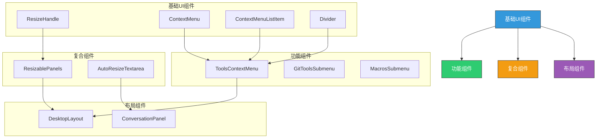

**Diagram sources**
- [tools-context-menu.tsx](file://frontend/src/components/features/controls/tools-context-menu.tsx#L1-L165)
- [use-resizable-panels.ts](file://frontend/src/hooks/use-resizable-panels.ts#L1-L86)

### 事件流与状态管理
系统的事件处理和状态管理体现了React的最佳实践：

```mermaid
sequenceDiagram
participant UI as UI组件
participant Hook as 自定义Hook
participant State as 状态管理
participant Storage as 持久化存储
UI->>Hook : 触发事件
Hook->>State : 更新状态
State->>UI : 重新渲染
State->>Storage : 持久化关键状态
Storage-->>State : 恢复状态
State-->>UI : 初始化UI
note right of Hook
自定义Hook负责：
- 事件处理逻辑
- 状态计算
- 副作用管理
end note
note right of State
状态管理原则：
- 状态提升
- 单一数据源
- 不可变性
end note
```

**Diagram sources**
- [use-resizable-panels.ts](file://frontend/src/hooks/use-resizable-panels.ts#L1-L86)
- [use-drag-resize.ts](file://frontend/src/hooks/use-drag-resize.ts#L1-L167)

**Section sources**
- [use-resizable-panels.ts](file://frontend/src/hooks/use-resizable-panels.ts#L1-L86)
- [use-drag-resize.ts](file://frontend/src/hooks/use-drag-resize.ts#L1-L167)
- [tools-context-menu.tsx](file://frontend/src/components/features/controls/tools-context-menu.tsx#L1-L165)
- [constants.ts](file://frontend/src/utils/constants.ts#L1-L73)
- [utils.ts](file://frontend/src/utils/utils.ts#L1-L676)