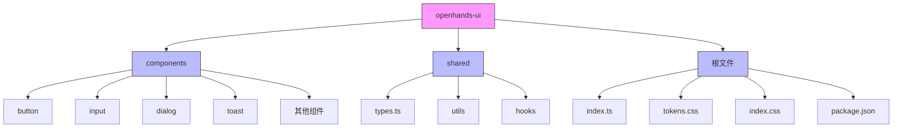
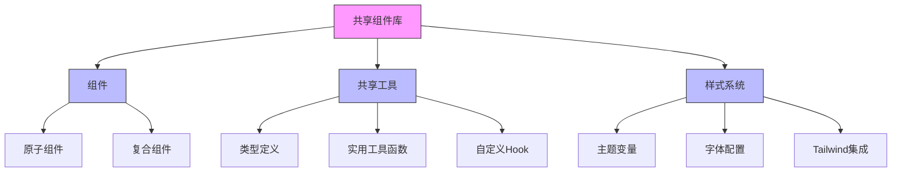
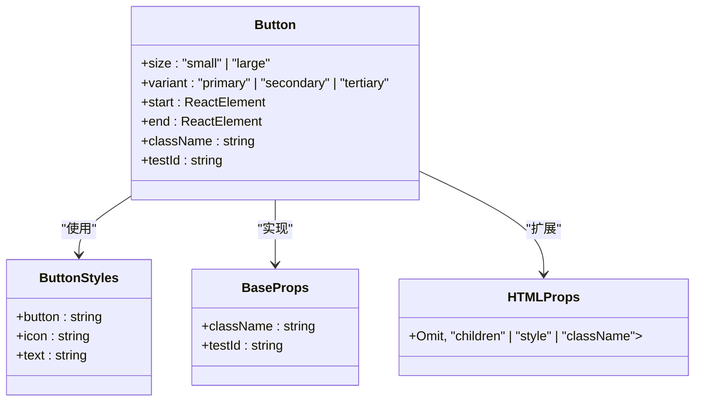
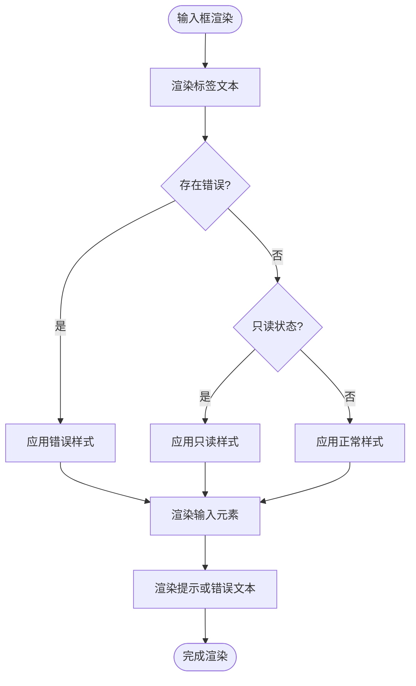
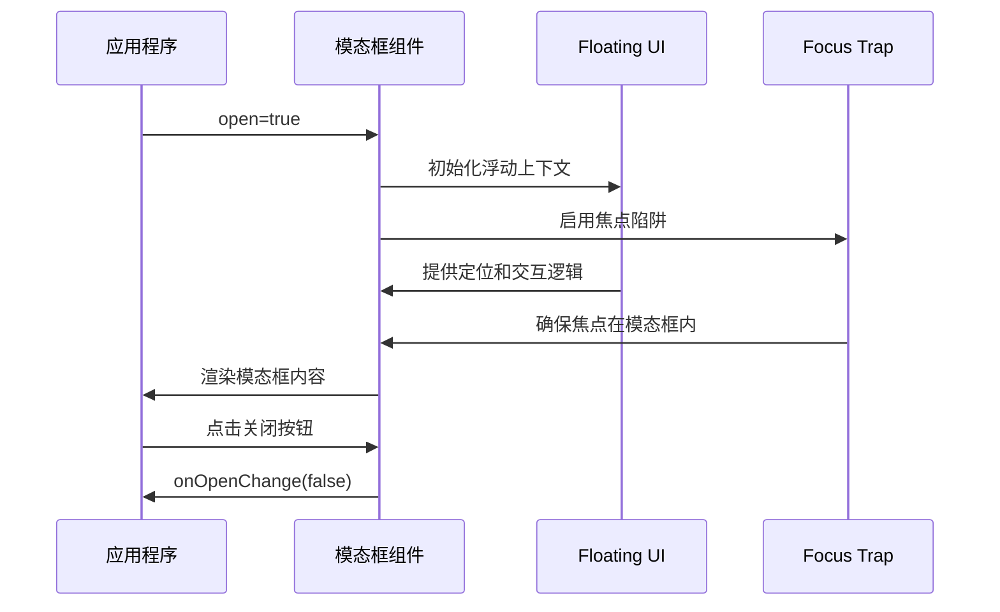
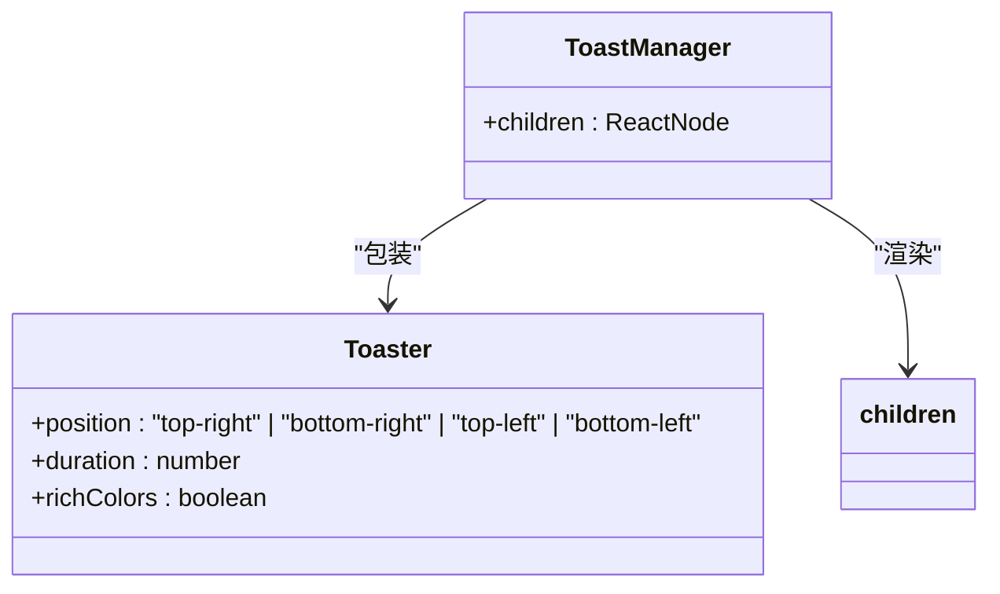

# 共享组件

<cite>
**本文档引用的文件**
- [Button.tsx](file://openhands-ui/components/button/Button.tsx)
- [Input.tsx](file://openhands-ui/components/input/Input.tsx)
- [Dialog.tsx](file://openhands-ui/components/dialog/Dialog.tsx)
- [ToastManager.tsx](file://openhands-ui/components/toast/ToastManager.tsx)
- [types.ts](file://openhands-ui/shared/types.ts)
- [cn.ts](file://openhands-ui/shared/utils/cn.ts)
- [use-array.ts](file://openhands-ui/shared/hooks/use-array.ts)
- [tokens.css](file://openhands-ui/tokens.css)
- [index.css](file://openhands-ui/index.css)
- [button/utils.ts](file://openhands-ui/components/button/utils.ts)
- [chip/utils.ts](file://openhands-ui/components/chip/utils.ts)
- [index.ts](file://openhands-ui/index.ts)
- [package.json](file://openhands-ui/package.json)
</cite>

## 目录
1. [简介](#简介)
2. [项目结构](#项目结构)
3. [核心组件](#核心组件)
4. [架构概述](#架构概述)
5. [详细组件分析](#详细组件分析)
6. [依赖分析](#依赖分析)
7. [性能考虑](#性能考虑)
8. [故障排除指南](#故障排除指南)
9. [结论](#结论)

## 简介
OpenHands前端共享组件库是一个基于React和TypeScript构建的现代化UI组件集合，旨在为OpenHands应用提供一致、可复用且可访问的用户界面元素。该组件库遵循现代前端最佳实践，采用Tailwind CSS进行样式设计，支持主题定制和响应式布局。组件库包含按钮、输入框、模态框、标签等多种常用UI元素，所有组件都经过精心设计以确保良好的用户体验和可访问性。

## 项目结构
OpenHands前端共享组件库的结构清晰，遵循功能分离的原则。组件库位于`openhands-ui`目录中，主要包含`components`、`shared`和根目录文件。



**图示来源**
- [index.ts](file://openhands-ui/index.ts)
- [package.json](file://openhands-ui/package.json)

**本节来源**
- [index.ts](file://openhands-ui/index.ts)
- [package.json](file://openhands-ui/package.json)

## 核心组件
OpenHands共享组件库提供了多种可复用的UI元素，包括按钮、输入框、模态框和通知等。这些组件设计遵循一致的设计原则，确保在不同功能模块中使用时保持视觉和行为的一致性。每个组件都支持多种变体和状态，如禁用、错误和只读状态，以满足不同的使用场景需求。

**本节来源**
- [Button.tsx](file://openhands-ui/components/button/Button.tsx)
- [Input.tsx](file://openhands-ui/components/input/Input.tsx)
- [Dialog.tsx](file://openhands-ui/components/dialog/Dialog.tsx)
- [ToastManager.tsx](file://openhands-ui/components/toast/ToastManager.tsx)

## 架构概述
OpenHands共享组件库采用模块化架构设计，将组件、共享工具和类型定义分离到不同的目录中。这种架构设计提高了代码的可维护性和可扩展性，使得新组件的添加和现有组件的修改更加容易。



**图示来源**
- [types.ts](file://openhands-ui/shared/types.ts)
- [cn.ts](file://openhands-ui/shared/utils/cn.ts)
- [use-array.ts](file://openhands-ui/shared/hooks/use-array.ts)
- [tokens.css](file://openhands-ui/tokens.css)

## 详细组件分析

### 按钮组件分析
按钮组件是用户界面中最常用的交互元素之一。OpenHands的按钮组件支持多种变体（主要、次要、三级）和尺寸（小、大），并允许在按钮前后添加图标。



**图示来源**
- [Button.tsx](file://openhands-ui/components/button/Button.tsx)
- [button/utils.ts](file://openhands-ui/components/button/utils.ts)
- [types.ts](file://openhands-ui/shared/types.ts)

### 输入框组件分析
输入框组件提供了完整的表单输入功能，包括标签、占位符、错误消息和提示文本。组件支持前后图标，并根据状态自动调整样式。



**图示来源**
- [Input.tsx](file://openhands-ui/components/input/Input.tsx)

### 模态框组件分析
模态框组件提供了一个可访问的对话框界面，使用Floating UI库处理定位和交互，Focus Trap库确保键盘导航的可访问性。



**图示来源**
- [Dialog.tsx](file://openhands-ui/components/dialog/Dialog.tsx)

### 通知组件分析
通知组件基于Sonner库构建，提供了一个轻量级的通知系统，支持多种通知类型和自定义配置。



**图示来源**
- [ToastManager.tsx](file://openhands-ui/components/toast/ToastManager.tsx)

## 依赖分析
OpenHands共享组件库依赖于多个第三方库来实现其功能，这些依赖关系确保了组件的高质量和可维护性。

```mermaid
graph TD
A[OpenHands组件库] --> B[@floating-ui/react]
A --> C[focus-trap-react]
A --> D[sonner]
A --> E[clsx]
A --> F[tailwind-merge]
A --> G[react-bootstrap-icons]
A --> H[react-select]
A --> I[deep-equal]
B --> J[处理浮动元素定位]
C --> K[处理键盘焦点陷阱]
D --> L[提供通知功能]
E --> M[条件类名合并]
F --> N[Tailwind类名合并]
G --> O[提供图标]
H --> P[提供选择组件]
I --> Q[深度对象比较]
style A fill:#f9f,stroke:#333
style B fill:#bbf,stroke:#333
style C fill:#bbf,stroke:#333
style D fill:#bbf,stroke:#333
style E fill:#bbf,stroke:#333
style F fill:#bbf,stroke:#333
style G fill:#bbf,stroke:#333
style H fill:#bbf,stroke:#333
style I fill:#bbf,stroke:#333
```

**图示来源**
- [package.json](file://openhands-ui/package.json)

**本节来源**
- [package.json](file://openhands-ui/package.json)

## 性能考虑
OpenHands共享组件库在设计时考虑了性能优化，采用了多种技术来确保组件的高效渲染和响应性。组件使用React的useCallback和useMemo等Hook来避免不必要的重新渲染，同时通过CSS变量和Tailwind的JIT模式优化样式处理性能。

## 故障排除指南
当使用OpenHands共享组件库时，可能会遇到一些常见问题。以下是针对这些问题的解决方案：

**本节来源**
- [Button.tsx](file://openhands-ui/components/button/Button.tsx)
- [Input.tsx](file://openhands-ui/components/input/Input.tsx)
- [Dialog.tsx](file://openhands-ui/components/dialog/Dialog.tsx)

## 结论
OpenHands前端共享组件库提供了一套完整、可复用且可访问的UI组件，为OpenHands应用的开发提供了坚实的基础。通过遵循一致的设计原则和API接口，该组件库确保了用户界面的一致性和可维护性。组件库的模块化架构和对现代前端技术的采用，使其成为一个强大而灵活的工具，能够满足各种复杂的用户界面需求。