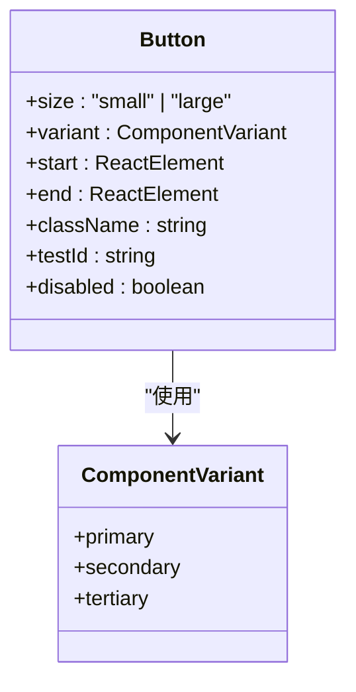
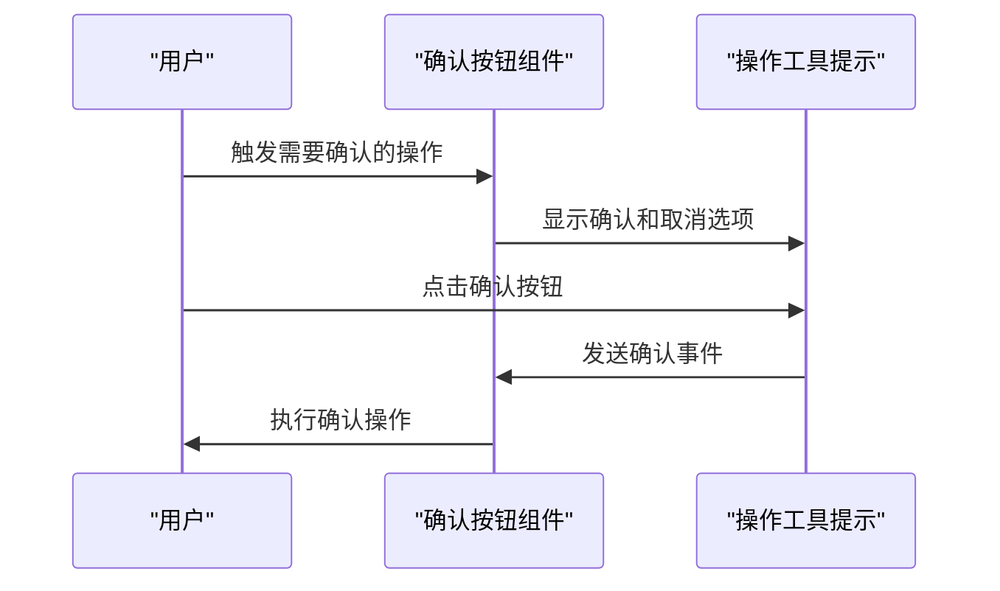
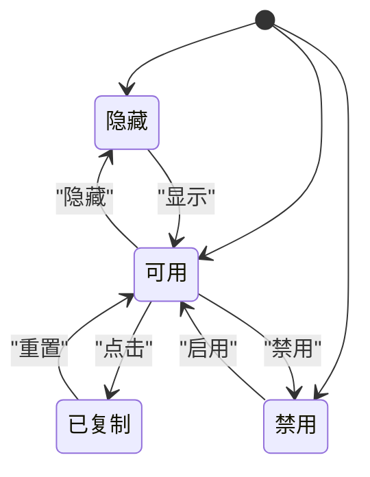
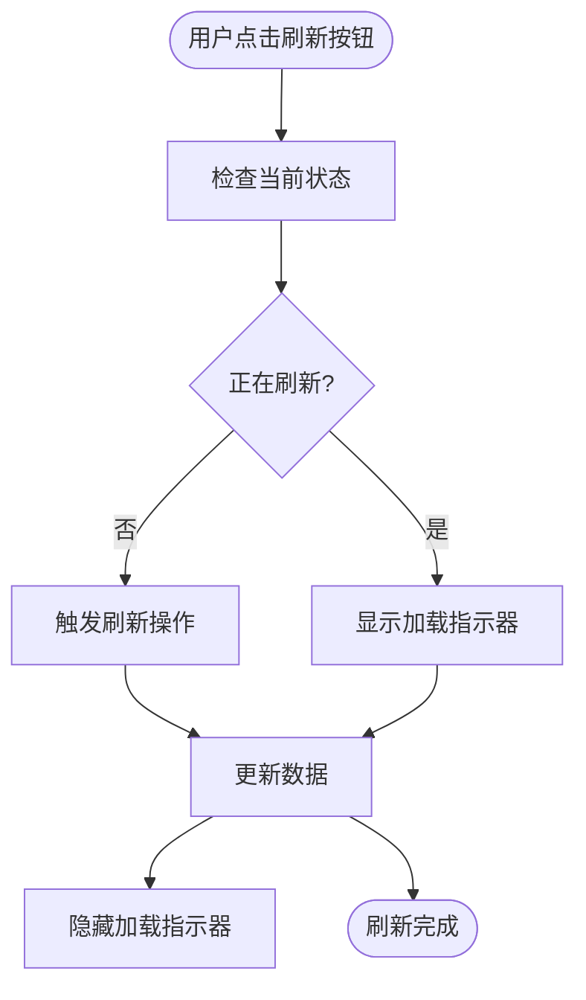
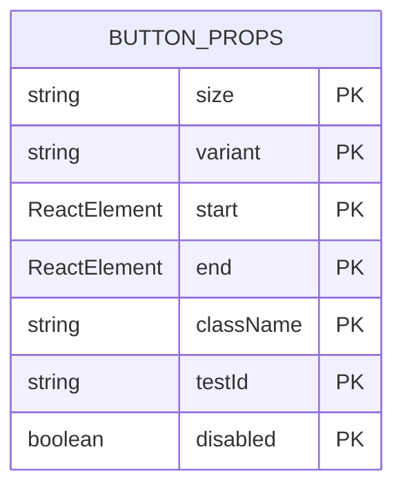
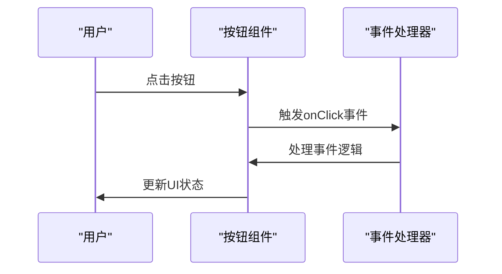
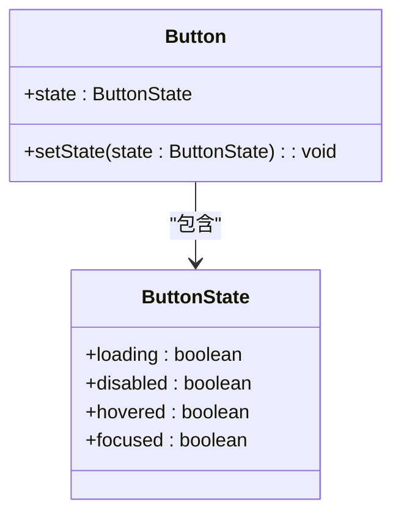
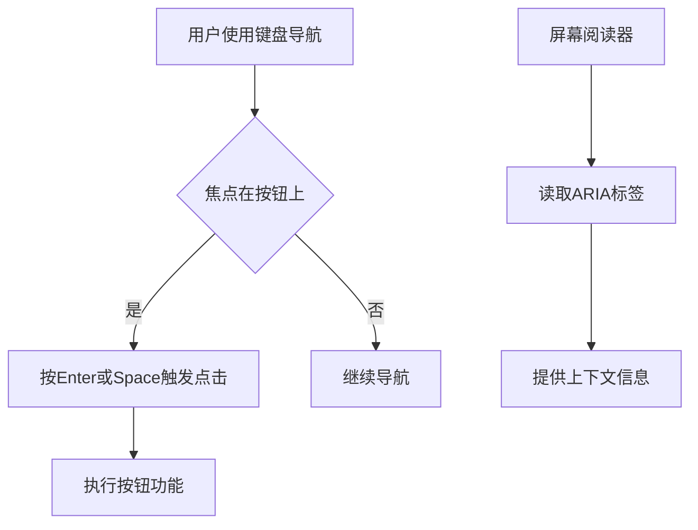
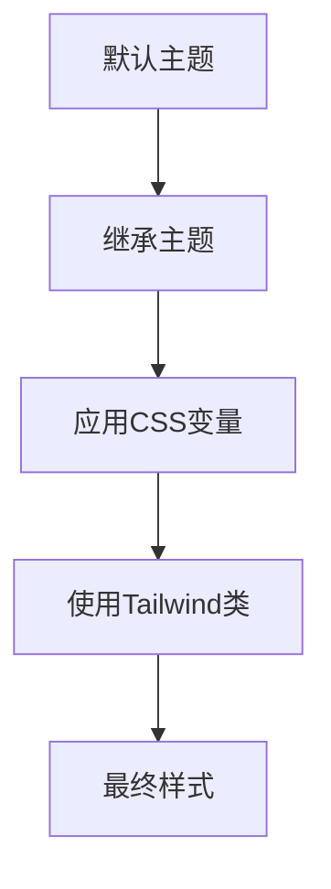

# 按钮组件

<cite>
**本文档引用的文件**
- [Button.tsx](file://openhands-ui/components/button/Button.tsx)
- [utils.ts](file://openhands-ui/components/button/utils.ts)
- [index.css](file://openhands-ui/components/button/index.css)
- [Button.stories.tsx](file://openhands-ui/components/button/Button.stories.tsx)
- [shared/types.ts](file://openhands-ui/shared/types.ts)
- [copy-to-clipboard-button.tsx](file://frontend/src/components/shared/buttons/copy-to-clipboard-button.tsx)
- [refresh-button.tsx](file://frontend/src/components/shared/buttons/refresh-button.tsx)
- [action-tooltip.tsx](file://frontend/src/components/shared/action-tooltip.tsx)
- [confirmation-buttons.tsx](file://frontend/src/components/shared/buttons/confirmation-buttons.tsx)
</cite>

## 目录
1. [简介](#简介)
2. [核心按钮组件](#核心按钮组件)
3. [确认按钮](#确认按钮)
4. [复制到剪贴板按钮](#复制到剪贴板按钮)
5. [刷新按钮](#刷新按钮)
6. [API接口与属性配置](#api接口与属性配置)
7. [事件处理机制](#事件处理机制)
8. [状态管理](#状态管理)
9. [可访问性实现](#可访问性实现)
10. [主题继承与样式定制](#主题继承与样式定制)

## 简介
OpenHands前端共享按钮组件库提供了一套统一的按钮组件，用于在不同上下文中实现一致的用户交互体验。这些按钮组件包括确认按钮、复制到剪贴板按钮、刷新按钮等，每个组件都经过精心设计，以满足特定的使用场景和交互需求。

**Section sources**
- [Button.tsx](file://openhands-ui/components/button/Button.tsx)
- [Button.stories.tsx](file://openhands-ui/components/button/Button.stories.tsx)

## 核心按钮组件
核心按钮组件是OpenHands前端共享按钮组件库的基础，提供了三种主要变体：主要按钮（primary）、次要按钮（secondary）和三级按钮（tertiary）。这些按钮支持不同的尺寸（小和大）以及在开始和结束位置添加图标。

**Diagram sources**
- [Button.tsx](file://openhands-ui/components/button/Button.tsx)
- [shared/types.ts](file://openhands-ui/shared/types.ts)

**Section sources**
- [Button.tsx](file://openhands-ui/components/button/Button.tsx)
- [utils.ts](file://openhands-ui/components/button/utils.ts)

## 确认按钮
确认按钮用于在用户需要确认某个操作时提供明确的确认选项。这种按钮通常与其他按钮（如取消按钮）一起使用，形成一个确认对话框。确认按钮具有高风险警告功能，可以在执行高风险操作前提醒用户。

**Diagram sources**
- [confirmation-buttons.tsx](file://frontend/src/components/shared/buttons/confirmation-buttons.tsx)
- [action-tooltip.tsx](file://frontend/src/components/shared/action-tooltip.tsx)

**Section sources**
- [confirmation-buttons.tsx](file://frontend/src/components/shared/buttons/confirmation-buttons.tsx)
- [action-tooltip.tsx](file://frontend/src/components/shared/action-tooltip.tsx)

## 复制到剪贴板按钮
复制到剪贴板按钮允许用户将内容复制到系统剪贴板。该按钮具有两种状态：复制（copy）和已复制（copied），通过不同的图标和ARIA标签来区分这两种状态。按钮还支持隐藏和禁用状态，以适应不同的使用场景。

**Diagram sources**
- [copy-to-clipboard-button.tsx](file://frontend/src/components/shared/buttons/copy-to-clipboard-button.tsx)

**Section sources**
- [copy-to-clipboard-button.tsx](file://frontend/src/components/shared/buttons/copy-to-clipboard-button.tsx)

## 刷新按钮
刷新按钮用于触发页面或数据的刷新操作。该按钮通常包含一个刷新图标，用户点击后会触发相应的刷新事件。刷新按钮的设计简洁明了，便于用户快速识别其功能。

**Diagram sources**
- [refresh-button.tsx](file://frontend/src/components/shared/buttons/refresh-button.tsx)

**Section sources**
- [refresh-button.tsx](file://frontend/src/components/shared/buttons/refresh-button.tsx)

## API接口与属性配置
按钮组件的API接口设计遵循React的最佳实践，提供了丰富的属性配置选项。主要属性包括size（尺寸）、variant（变体）、start（开始图标）、end（结束图标）、className（自定义类名）和testId（测试ID）。

**Diagram sources**
- [Button.tsx](file://openhands-ui/components/button/Button.tsx)
- [shared/types.ts](file://openhands-ui/shared/types.ts)

**Section sources**
- [Button.tsx](file://openhands-ui/components/button/Button.tsx)
- [shared/types.ts](file://openhands-ui/shared/types.ts)

## 事件处理机制
按钮组件通过onClick事件处理用户交互。对于复杂的交互场景，如确认对话框，使用了更高级的事件处理机制，包括键盘快捷键支持（如Cmd+Enter确认，Shift+Cmd+Backspace取消）。

**Diagram sources**
- [Button.tsx](file://openhands-ui/components/button/Button.tsx)
- [confirmation-buttons.tsx](file://frontend/src/components/shared/buttons/confirmation-buttons.tsx)

**Section sources**
- [Button.tsx](file://openhands-ui/components/button/Button.tsx)
- [confirmation-buttons.tsx](file://frontend/src/components/shared/buttons/confirmation-buttons.tsx)

## 状态管理
按钮组件支持多种状态，包括加载、禁用和悬停状态。这些状态通过CSS类和React状态管理来实现，确保用户界面的一致性和响应性。

**Diagram sources**
- [Button.tsx](file://openhands-ui/components/button/Button.tsx)
- [utils.ts](file://openhands-ui/components/button/utils.ts)

**Section sources**
- [Button.tsx](file://openhands-ui/components/button/Button.tsx)
- [utils.ts](file://openhands-ui/components/button/utils.ts)

## 可访问性实现
按钮组件充分考虑了可访问性需求，实现了键盘导航支持和ARIA标签应用。所有按钮都支持键盘操作，并为屏幕阅读器提供了适当的ARIA标签。

**Diagram sources**
- [Button.tsx](file://openhands-ui/components/button/Button.tsx)
- [copy-to-clipboard-button.tsx](file://frontend/src/components/shared/buttons/copy-to-clipboard-button.tsx)

**Section sources**
- [Button.tsx](file://openhands-ui/components/button/Button.tsx)
- [copy-to-clipboard-button.tsx](file://frontend/src/components/shared/buttons/copy-to-clipboard-button.tsx)

## 主题继承与样式定制
按钮组件支持主题继承和样式定制，允许开发者根据项目需求调整按钮的外观。通过CSS变量和Tailwind CSS类，可以轻松实现样式的定制。

**Diagram sources**
- [Button.tsx](file://openhands-ui/components/button/Button.tsx)
- [utils.ts](file://openhands-ui/components/button/utils.ts)
- [index.css](file://openhands-ui/components/button/index.css)

**Section sources**
- [Button.tsx](file://openhands-ui/components/button/Button.tsx)
- [utils.ts](file://openhands-ui/components/button/utils.ts)
- [index.css](file://openhands-ui/components/button/index.css)