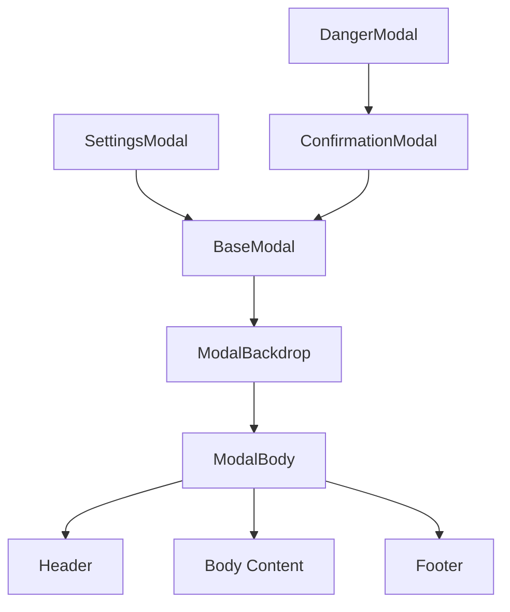
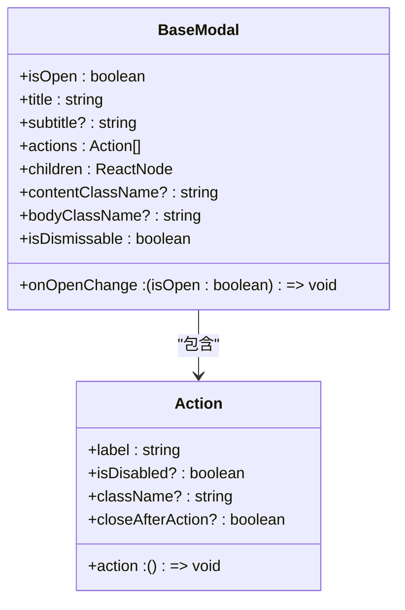
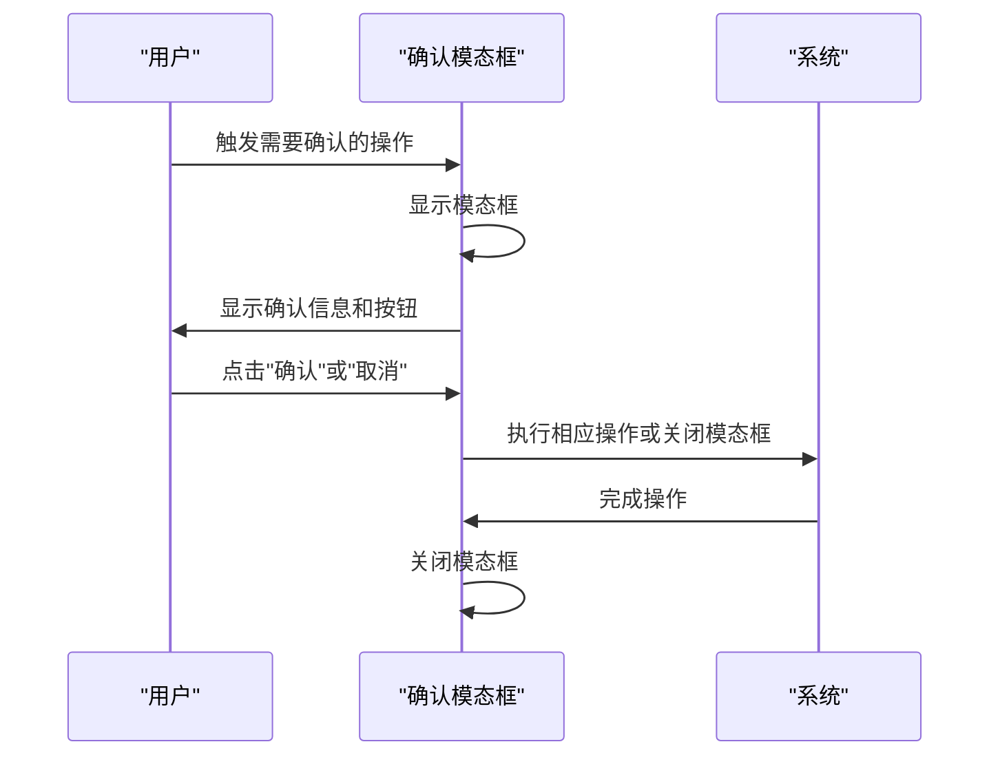
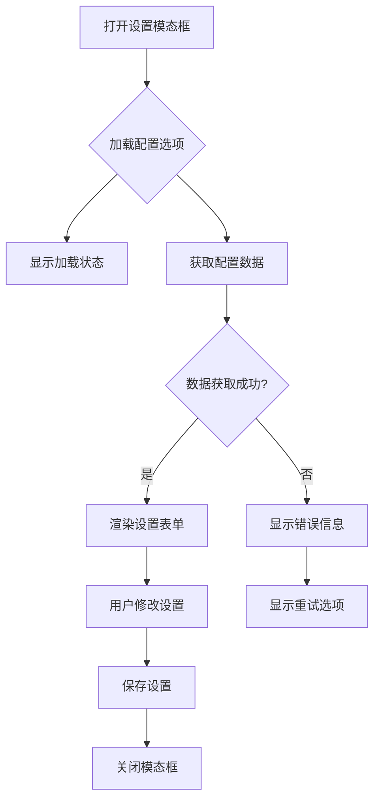
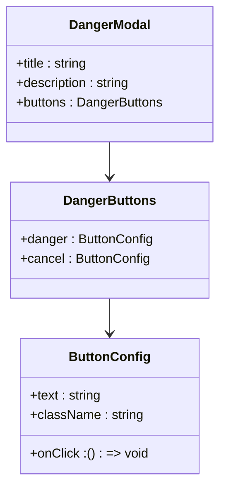

# 模态框组件

<cite>
**本文档中引用的文件**  
- [modal-backdrop.tsx](file://frontend/src/components/shared/modals/modal-backdrop.tsx)
- [modal-body.tsx](file://frontend/src/components/shared/modals/modal-body.tsx)
- [base-modal.tsx](file://frontend/src/components/shared/modals/base-modal/base-modal.tsx)
- [confirmation-modal.tsx](file://frontend/src/components/shared/modals/confirmation-modal.tsx)
- [settings-modal.tsx](file://frontend/src/components/shared/modals/settings/settings-modal.tsx)
- [danger-modal.tsx](file://frontend/src/components/shared/modals/confirmation-modals/danger-modal.tsx)
- [footer-content.tsx](file://frontend/src/components/shared/modals/base-modal/footer-content.tsx)
- [header-content.tsx](file://frontend/src/components/shared/modals/base-modal/header-content.tsx)
</cite>

## 目录
1. [简介](#简介)
2. [模态框体系结构](#模态框体系结构)
3. [基础模态框](#基础模态框)
4. [确认模态框](#确认模态框)
5. [设置模态框](#设置模态框)
6. [危险操作模态框](#危险操作模态框)
7. [API接口与状态管理](#api接口与状态管理)
8. [交互细节](#交互细节)
9. [可访问性实现](#可访问性实现)
10. [嵌套使用与冲突处理](#嵌套使用与冲突处理)

## 简介
OpenHands前端的模态框组件体系提供了一套完整的用户交互解决方案，用于在不离开当前页面的情况下展示重要信息、获取用户确认或配置应用设置。该体系基于React构建，遵循可访问性标准，并提供了多种预定义的模态框类型以满足不同的使用场景。

## 模态框体系结构
OpenHands的模态框组件体系由多个层次组成，每个层次负责不同的功能：

- **背景层 (Backdrop)**: 负责遮罩效果和点击外部关闭功能
- **头部 (Header)**: 包含标题和可选的副标题
- **主体 (Body)**: 包含主要的模态框内容
- **底部 (Footer)**: 包含操作按钮

该体系通过组合不同的组件来构建各种类型的模态框，确保了一致的用户体验和可维护性。

**Diagram sources**
- [modal-backdrop.tsx](file://frontend/src/components/shared/modals/modal-backdrop.tsx)
- [modal-body.tsx](file://frontend/src/components/shared/modals/modal-body.tsx)
- [base-modal.tsx](file://frontend/src/components/shared/modals/base-modal/base-modal.tsx)

**Section sources**
- [modal-backdrop.tsx](file://frontend/src/components/shared/modals/modal-backdrop.tsx)
- [modal-body.tsx](file://frontend/src/components/shared/modals/modal-body.tsx)

## 基础模态框
基础模态框是所有其他模态框的基类，提供了基本的结构和功能。它定义了模态框的通用API，包括打开/关闭控制、标题、内容和操作按钮。

**Diagram sources**
- [base-modal.tsx](file://frontend/src/components/shared/modals/base-modal/base-modal.tsx)
- [footer-content.tsx](file://frontend/src/components/shared/modals/base-modal/footer-content.tsx)

**Section sources**
- [base-modal.tsx](file://frontend/src/components/shared/modals/base-modal/base-modal.tsx)

## 确认模态框
确认模态框用于需要用户确认的操作，如删除文件或退出应用。它提供了一个简洁的界面，包含确认和取消按钮。

**Diagram sources**
- [confirmation-modal.tsx](file://frontend/src/components/shared/modals/confirmation-modal.tsx)

**Section sources**
- [confirmation-modal.tsx](file://frontend/src/components/shared/modals/confirmation-modal.tsx)

## 设置模态框
设置模态框用于配置应用的各种选项，如AI模型选择、界面主题等。它通常包含表单元素和多个配置选项。

**Diagram sources**
- [settings-modal.tsx](file://frontend/src/components/shared/modals/settings/settings-modal.tsx)

**Section sources**
- [settings-modal.tsx](file://frontend/src/components/shared/modals/settings/settings-modal.tsx)

## 危险操作模态框
危险操作模态框专门用于处理可能造成数据丢失或其他严重后果的操作，如删除项目或重置配置。它通过视觉设计强调操作的危险性。

**Diagram sources**
- [danger-modal.tsx](file://frontend/src/components/shared/modals/confirmation-modals/danger-modal.tsx)

**Section sources**
- [danger-modal.tsx](file://frontend/src/components/shared/modals/confirmation-modals/danger-modal.tsx)

## API接口与状态管理
模态框组件通过props接收外部状态，并通过回调函数与父组件通信。状态管理主要通过React的props和回调机制实现。

### 主要API接口
| 属性 | 类型 | 描述 | 默认值 |
|------|------|------|--------|
| isOpen | boolean | 控制模态框是否显示 | - |
| onOpenChange | (isOpen: boolean) => void | 模态框状态变化时的回调 | - |
| title | string | 模态框标题 | - |
| subtitle | string | 模态框副标题 | undefined |
| actions | Action[] | 操作按钮配置 | [] |
| isDismissable | boolean | 是否可以通过点击外部或ESC键关闭 | true |

### 状态管理机制
模态框的状态由父组件管理，通过`isOpen`和`onOpenChange`实现受控组件模式。这种设计使得模态框的状态可以与其他应用状态同步。

**Section sources**
- [base-modal.tsx](file://frontend/src/components/shared/modals/base-modal/base-modal.tsx)
- [modal-backdrop.tsx](file://frontend/src/components/shared/modals/modal-backdrop.tsx)

## 交互细节
### 打开/关闭动画
模态框使用CSS过渡效果实现平滑的打开和关闭动画。动画包括：
- 背景层的淡入淡出效果
- 模态框主体的缩放动画
- 动画持续时间为200毫秒

### 遮罩层行为
遮罩层具有以下行为特征：
- 点击遮罩层外部会关闭模态框
- 遮罩层阻止用户与背景内容交互
- 遮罩层具有60%的不透明度，确保背景内容可见但不可操作

### 点击外部关闭
当`isDismissable`属性为true时，用户可以通过以下方式关闭模态框：
- 点击遮罩层
- 按下ESC键
- 点击右上角的关闭按钮

**Section sources**
- [modal-backdrop.tsx](file://frontend/src/components/shared/modals/modal-backdrop.tsx)
- [base-modal.tsx](file://frontend/src/components/shared/modals/base-modal/base-modal.tsx)

## 可访问性实现
### 焦点管理
模态框实现了完整的焦点管理，确保键盘用户可以正常操作：
- 打开模态框时，焦点自动移动到模态框内
- 焦点在模态框内的可聚焦元素间循环
- 关闭模态框时，焦点返回到触发模态框的元素

### 键盘导航
支持以下键盘操作：
- **ESC键**: 关闭模态框
- **Tab键**: 在可聚焦元素间移动
- **Shift+Tab键**: 反向移动焦点
- **Enter/Space键**: 激活当前聚焦的按钮

### 屏幕阅读器支持
通过以下方式支持屏幕阅读器：
- 使用ARIA标签描述模态框的角色和状态
- 为标题和描述提供适当的ARIA属性
- 确保所有交互元素都有清晰的标签

**Section sources**
- [modal-backdrop.tsx](file://frontend/src/components/shared/modals/modal-backdrop.tsx)
- [base-modal.tsx](file://frontend/src/components/shared/modals/base-modal/base-modal.tsx)

## 嵌套使用与冲突处理
### 嵌套使用场景
模态框支持有限的嵌套使用，适用于以下场景：
- 在设置模态框中打开确认模态框
- 在确认模态框中显示错误信息模态框

### 冲突处理策略
为避免嵌套模态框带来的用户体验问题，采用了以下策略：
- 限制同时显示的模态框数量
- 后打开的模态框会覆盖前一个模态框的遮罩层
- 焦点管理确保始终只有一个模态框接收键盘输入
- ESC键关闭最上层的模态框

**Section sources**
- [modal-backdrop.tsx](file://frontend/src/components/shared/modals/modal-backdrop.tsx)
- [base-modal.tsx](file://frontend/src/components/shared/modals/base-modal/base-modal.tsx)