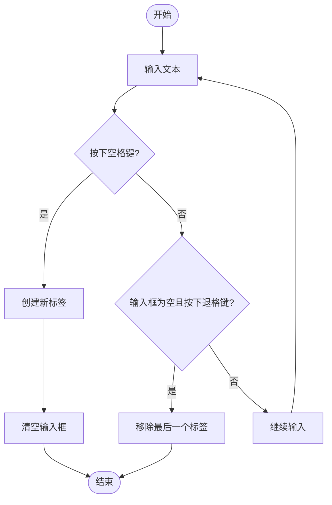
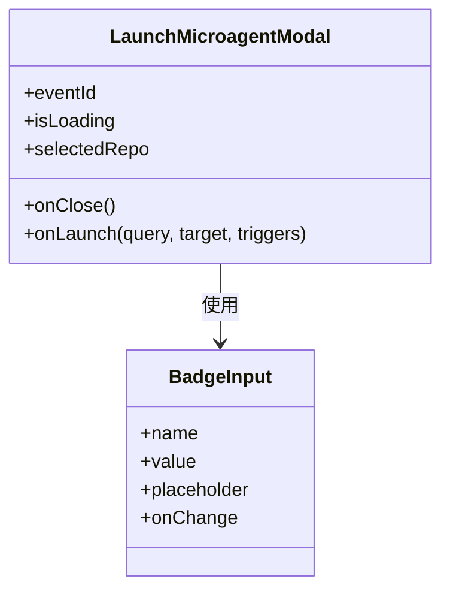
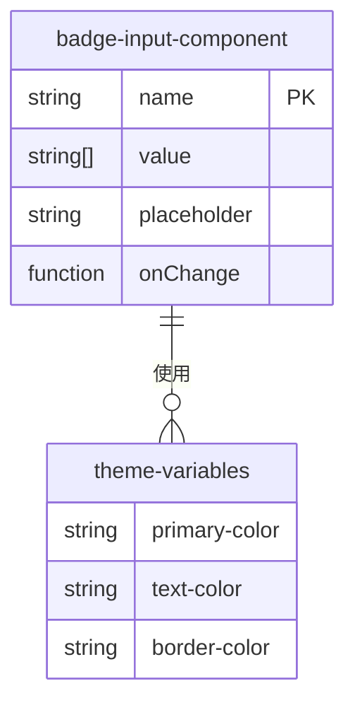

# 输入组件

<cite>
**本文档引用的文件**
- [badge-input.tsx](file://frontend/src/components/shared/inputs/badge-input.tsx)
- [badge-input.test.tsx](file://frontend/__tests__/components/shared/inputs/badge-input.test.tsx)
- [badge.tsx](file://frontend/src/components/shared/badge.tsx)
- [launch-microagent-modal.tsx](file://frontend/src/components/features/chat/microagent/launch-microagent-modal.tsx)
- [microagent-management-upsert-microagent-modal.tsx](file://frontend/src/components/features/microagent-management/microagent-management-upsert-microagent-modal.tsx)
</cite>

## 目录
1. [简介](#简介)
2. [设计目的与功能特性](#设计目的与功能特性)
3. [视觉表现与交互行为](#视觉表现与交互行为)
4. [API接口与属性配置](#api接口与属性配置)
5. [事件回调机制](#事件回调机制)
6. [使用示例](#使用示例)
7. [验证逻辑与错误处理](#验证逻辑与错误处理)
8. [可访问性特性](#可访问性特性)
9. [样式定制与主题适配](#样式定制与主题适配)

## 简介
`badge-input`组件是OpenHands前端中的一个标签输入组件，允许用户通过输入文本并按空格键来动态添加标签项，同时支持通过点击删除按钮或退格键来移除已添加的标签。该组件在微代理管理等场景中被广泛使用，为用户提供了一种直观、高效的多值输入方式。

**Section sources**
- [badge-input.tsx](file://frontend/src/components/shared/inputs/badge-input.tsx)
- [badge-input.test.tsx](file://frontend/__tests__/components/shared/inputs/badge-input.test.tsx)

## 设计目的与功能特性
`badge-input`组件的设计目的是提供一种用户友好的多标签输入方式，使用户能够轻松地添加和管理多个文本标签。其主要功能特性包括：
- 支持通过输入文本后按空格键或回车键来添加新标签
- 支持通过点击标签上的删除按钮或在输入框为空时按退格键来移除最后一个标签
- 防止创建空标签，确保输入的有效性
- 提供灵活的API接口，便于集成到不同的用户界面中

**Section sources**
- [badge-input.tsx](file://frontend/src/components/shared/inputs/badge-input.tsx)
- [badge-input.test.tsx](file://frontend/__tests__/components/shared/inputs/badge-input.test.tsx)

## 视觉表现与交互行为
`badge-input`组件的视觉表现采用了一种简洁的设计风格，每个标签以带有背景色的徽章形式显示，并在右侧提供一个删除图标。用户可以通过以下交互行为来操作该组件：
- 在输入框中输入文本后按空格键，输入的文本将被转换为一个标签并添加到标签列表中，同时输入框被清空
- 将鼠标悬停在标签上并点击删除图标，该标签将从列表中移除
- 当输入框为空时按退格键，最后一个标签将被移除

**Diagram sources**
- [badge-input.tsx](file://frontend/src/components/shared/inputs/badge-input.tsx)

## API接口与属性配置
`badge-input`组件提供了以下API接口和属性配置选项：
- `name`: 输入框的名称属性，用于表单提交
- `value`: 当前标签值的数组，受控组件的必要属性
- `placeholder`: 输入框的占位符文本，当没有标签时显示
- `onChange`: 值变化时的回调函数，接收更新后的标签数组作为参数

这些属性使得`badge-input`组件可以灵活地集成到各种表单和用户界面中。

**Section sources**
- [badge-input.tsx](file://frontend/src/components/shared/inputs/badge-input.tsx)

## 事件回调机制
`badge-input`组件通过`onChange`回调函数与父组件进行通信，每当标签数组发生变化时（无论是添加还是删除标签），都会调用此回调函数并将更新后的标签数组作为参数传递。这种设计模式遵循了React的受控组件原则，使得父组件能够完全控制`badge-input`的状态。

**Section sources**
- [badge-input.tsx](file://frontend/src/components/shared/inputs/badge-input.tsx)

## 使用示例
`badge-input`组件在OpenHands的多个功能模块中得到了应用，例如在启动微代理的模态框中用于输入触发词。以下是一个典型的使用示例：

**Diagram sources**
- [launch-microagent-modal.tsx](file://frontend/src/components/features/chat/microagent/launch-microagent-modal.tsx)
- [badge-input.tsx](file://frontend/src/components/shared/inputs/badge-input.tsx)

## 验证逻辑与错误处理
`badge-input`组件内置了基本的验证逻辑，防止用户创建空标签。具体来说，当用户在输入框为空的情况下按下空格键时，组件不会创建新的标签。此外，组件通过测试用例确保了其核心功能的正确性，包括标签的添加、删除以及空标签的防止。

**Section sources**
- [badge-input.test.tsx](file://frontend/__tests__/components/shared/inputs/badge-input.test.tsx)

## 可访问性特性
`badge-input`组件考虑了可访问性需求，支持键盘操作，用户可以通过Tab键在界面元素间导航，通过空格键添加标签，通过退格键删除标签。同时，组件使用了语义化的HTML标签和ARIA属性，确保屏幕阅读器用户能够理解组件的功能和状态。

**Section sources**
- [badge-input.tsx](file://frontend/src/components/shared/inputs/badge-input.tsx)

## 样式定制与主题适配
`badge-input`组件的样式通过Tailwind CSS进行定义，支持一定程度的定制。组件的颜色、字体大小等样式属性与OpenHands的整体设计系统保持一致，能够自动适配不同的主题。例如，标签的背景色使用了`bg-primary`类，文本颜色使用了`text-[#0D0F11]`，这些样式可以根据主题的变化而相应调整。

**Diagram sources**
- [badge-input.tsx](file://frontend/src/components/shared/inputs/badge-input.tsx)
- [tokens.css](file://openhands-ui/tokens.css)