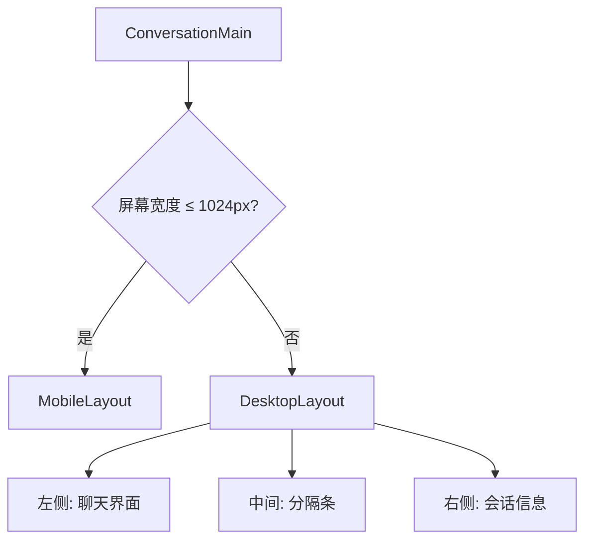
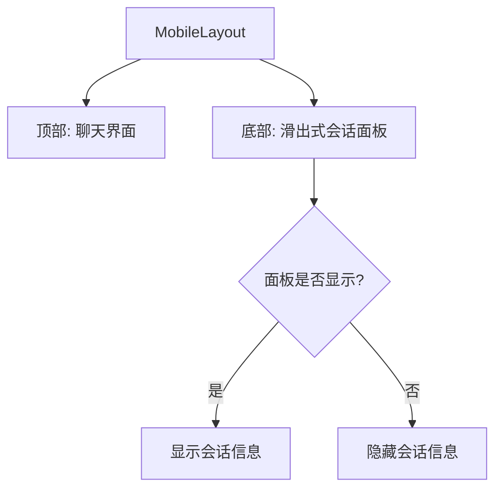
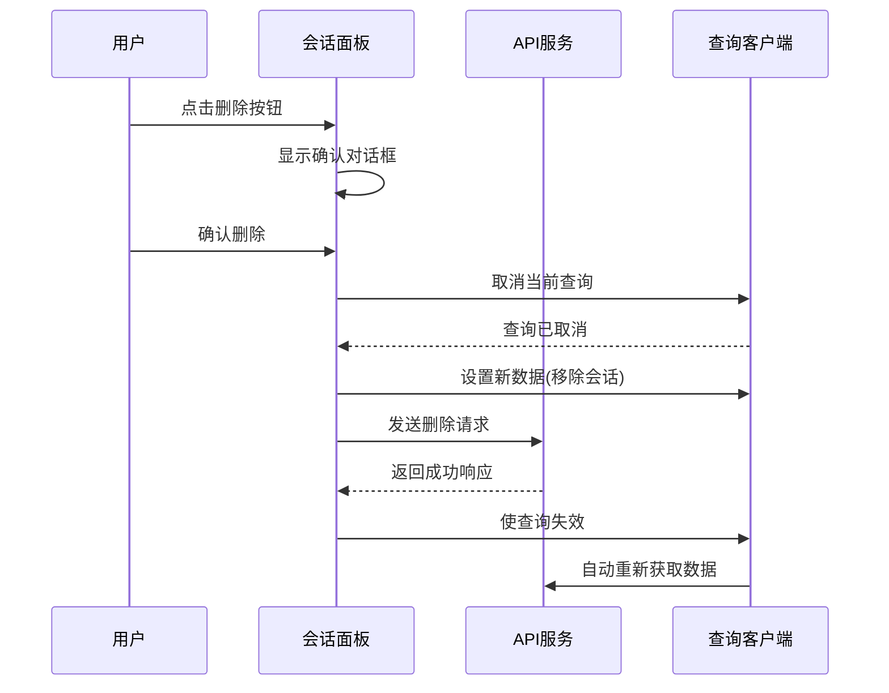
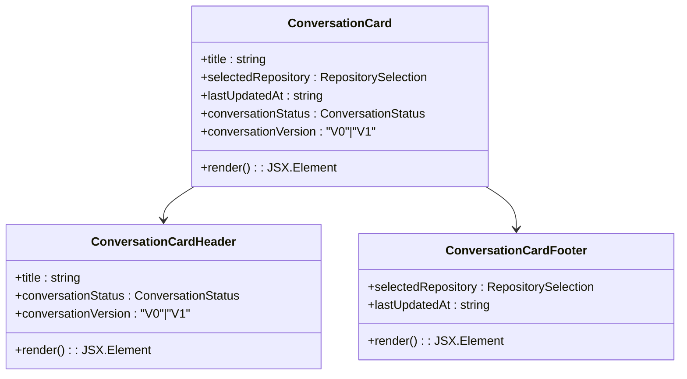
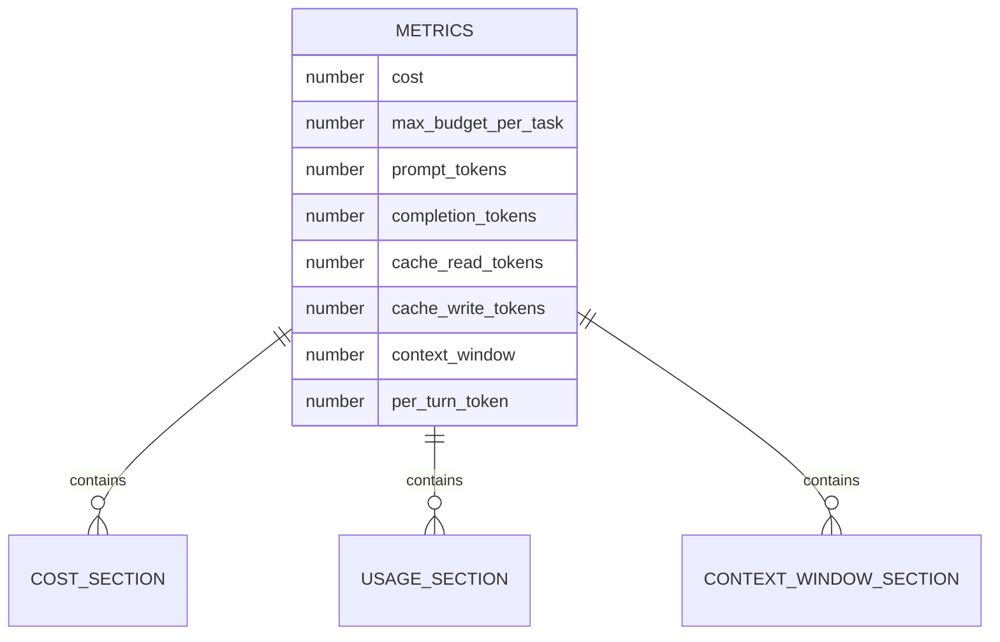
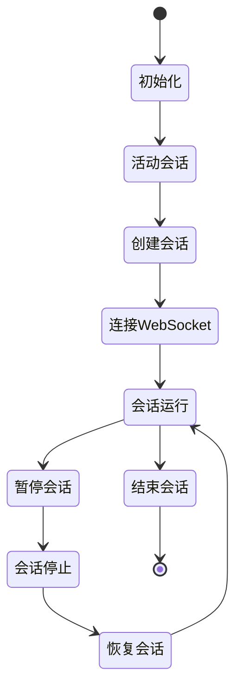
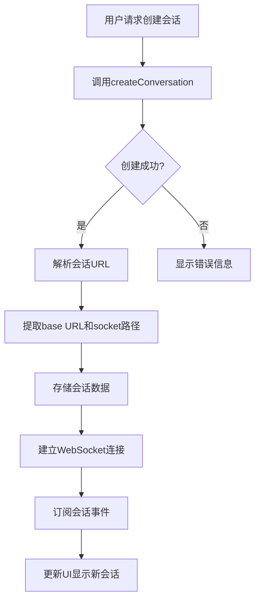

# 会话管理

<cite>
**本文档引用的文件**  
- [conversation-main.tsx](file://frontend/src/components/features/conversation/conversation-main/conversation-main.tsx)
- [conversation-panel.tsx](file://frontend/src/components/features/conversation-panel/conversation-panel.tsx)
- [conversation-card.tsx](file://frontend/src/components/features/conversation-panel/conversation-card/conversation-card.tsx)
- [metrics-modal.tsx](file://frontend/src/components/features/conversation/metrics-modal/metrics-modal.tsx)
- [desktop-layout.tsx](file://frontend/src/components/features/conversation/conversation-main/desktop-layout.tsx)
- [mobile-layout.tsx](file://frontend/src/components/features/conversation/conversation-main/mobile-layout.tsx)
- [conversation-store.ts](file://frontend/src/state/conversation-store.ts)
- [use-paginated-conversations.ts](file://frontend/src/hooks/query/use-paginated-conversations.ts)
- [use-delete-conversation.ts](file://frontend/src/hooks/mutation/use-delete-conversation.ts)
- [use-update-conversation.ts](file://frontend/src/hooks/mutation/use-update-conversation.ts)
- [use-create-conversation-and-subscribe-multiple.ts](file://frontend/src/hooks/use-create-conversation-and-subscribe-multiple.ts)
- [metrics-store.ts](file://frontend/src/stores/metrics-store.ts)
</cite>

## 目录
1. [介绍](#介绍)
2. [会话主界面布局与响应式设计](#会话主界面布局与响应式设计)
3. [会话面板管理](#会话面板管理)
4. [会话卡片组件](#会话卡片组件)
5. [指标模态框](#指标模态框)
6. [会话状态管理](#会话状态管理)
7. [会话命名与持久化](#会话命名与持久化)
8. [性能监控实现](#性能监控实现)
9. [结论](#结论)

## 介绍
OpenHands前端的会话管理系统为用户提供了一个直观且功能丰富的界面，用于管理多个AI会话。该系统支持在桌面和移动设备上进行响应式布局适配，允许用户创建、切换、启动、停止和删除会话。每个会话都显示其元数据（如名称、状态、版本）和快捷操作，并可通过指标模态框查看详细的消耗指标（成本、token使用量）。本文档将深入分析会话管理系统的各个组件及其交互机制。

**Section sources**
- [conversation-main.tsx](file://frontend/src/components/features/conversation/conversation-main/conversation-main.tsx)
- [conversation-panel.tsx](file://frontend/src/components/features/conversation-panel/conversation-panel.tsx)

## 会话主界面布局与响应式设计
会话主界面通过`conversation-main.tsx`组件实现，根据屏幕宽度动态切换桌面和移动布局。当屏幕宽度小于或等于1024px时，系统自动切换到移动布局；否则使用桌面布局。这种设计确保了在不同设备上的最佳用户体验。

### 桌面布局
桌面布局采用可调整大小的双面板设计，左侧为聊天界面，右侧为会话信息面板。用户可以通过拖动中间的分隔条来调整两个面板的宽度比例，系统会将用户的偏好存储在本地存储中以供下次使用。

**Diagram sources**
- [conversation-main.tsx](file://frontend/src/components/features/conversation/conversation-main/conversation-main.tsx)
- [desktop-layout.tsx](file://frontend/src/components/features/conversation/conversation-main/desktop-layout.tsx)

### 移动布局
移动布局采用底部滑出式设计，聊天界面占据大部分屏幕空间，会话信息面板从底部滑出。这种设计充分利用了移动设备的垂直空间，同时保持了界面的简洁性。

**Diagram sources**
- [conversation-main.tsx](file://frontend/src/components/features/conversation/conversation-main/conversation-main.tsx)
- [mobile-layout.tsx](file://frontend/src/components/features/conversation/conversation-main/mobile-layout.tsx)

**Section sources**
- [conversation-main.tsx](file://frontend/src/components/features/conversation/conversation-main/conversation-main.tsx)
- [desktop-layout.tsx](file://frontend/src/components/features/conversation/conversation-main/desktop-layout.tsx)
- [mobile-layout.tsx](file://frontend/src/components/features/conversation/conversation-main/mobile-layout.tsx)

## 会话面板管理
`conversation-panel.tsx`组件负责管理多个会话的展示、切换和操作。该组件实现了无限滚动加载，当用户滚动到列表底部时自动加载更多会话，提高了处理大量会话时的性能。

### 会话操作
会话面板支持以下操作：
- **启动会话**：通过WebSocket连接启动新的会话
- **停止会话**：暂停会话的执行
- **删除会话**：从列表中移除会话

这些操作通过React Query的mutation机制实现，确保了UI与数据状态的一致性。在执行删除操作前，系统会显示确认对话框以防止误操作。

**Diagram sources**
- [conversation-panel.tsx](file://frontend/src/components/features/conversation-panel/conversation-panel.tsx)
- [use-delete-conversation.ts](file://frontend/src/hooks/mutation/use-delete-conversation.ts)

### 数据获取与缓存
会话面板使用`usePaginatedConversations`钩子获取分页的会话数据，并通过React Query的缓存机制优化性能。查询结果被缓存15分钟，减少了不必要的网络请求。

**Section sources**
- [conversation-panel.tsx](file://frontend/src/components/features/conversation-panel/conversation-panel.tsx)
- [use-paginated-conversations.ts](file://frontend/src/hooks/query/use-paginated-conversations.ts)

## 会话卡片组件
`conversation-card.tsx`组件用于显示单个会话的元数据和提供快捷操作。每个会话卡片包含标题、状态、版本、关联仓库和最后更新时间等信息。

### 元数据显示
会话卡片通过`ConversationCardHeader`和`ConversationCardFooter`组件分别显示会话的头部和底部信息。头部显示会话标题、状态指示器和版本徽章，底部显示关联的代码仓库和最后更新时间。

**Diagram sources**
- [conversation-card.tsx](file://frontend/src/components/features/conversation-panel/conversation-card/conversation-card.tsx)
- [conversation-card-header.tsx](file://frontend/src/components/features/conversation-panel/conversation-card/conversation-card-header.tsx)
- [conversation-card-footer.tsx](file://frontend/src/components/features/conversation-panel/conversation-card/conversation-card-footer.tsx)

### 快捷操作
会话卡片提供了多种快捷操作按钮，包括：
- **删除**：删除当前会话
- **停止**：暂停会话执行
- **编辑**：修改会话标题
- **下载**：通过VS Code下载会话

这些操作通过上下文菜单提供，用户点击更多选项按钮后展开。所有操作都通过事件阻止机制防止冒泡，确保点击操作不会触发卡片本身的导航行为。

**Section sources**
- [conversation-card.tsx](file://frontend/src/components/features/conversation-panel/conversation-card/conversation-card.tsx)
- [conversation-card-header.tsx](file://frontend/src/components/features/conversation-panel/conversation-card/conversation-card-header.tsx)
- [conversation-card-footer.tsx](file://frontend/src/components/features/conversation-panel/conversation-card/conversation-card-footer.tsx)

## 指标模态框
`metrics-modal.tsx`组件用于展示会话的消耗指标，包括成本、token使用量和上下文窗口信息。该组件从`metrics-store.ts`中获取数据，并以清晰的格式呈现给用户。

### 指标分类
指标模态框将指标分为三个主要部分：
- **成本信息**：显示会话的总成本和预算限制
- **使用量信息**：详细列出输入、输出和缓存的token使用情况
- **上下文信息**：显示上下文窗口大小和每轮token限制

**Diagram sources**
- [metrics-modal.tsx](file://frontend/src/components/features/conversation/metrics-modal/metrics-modal.tsx)
- [metrics-store.ts](file://frontend/src/stores/metrics-store.ts)

### 状态管理
指标数据通过Zustand状态管理库进行管理，`useMetricsStore`钩子提供了对指标状态的访问和更新方法。当会话活动时，系统会定期更新指标数据，确保用户看到的是最新信息。

**Section sources**
- [metrics-modal.tsx](file://frontend/src/components/features/conversation/metrics-modal/metrics-modal.tsx)
- [metrics-store.ts](file://frontend/src/stores/metrics-store.ts)

## 会话状态管理
会话状态管理是整个系统的核心，涉及会话的创建、更新、持久化和同步。系统使用多种机制确保状态的一致性和可靠性。

### 状态存储
会话状态主要通过以下方式存储：
- **内存状态**：使用Zustand存储当前会话的临时状态
- **本地存储**：将用户偏好（如面板显示状态）保存在localStorage中
- **服务器状态**：通过API调用将会话数据持久化到后端

`conversation-store.ts`文件定义了会话状态的所有属性和操作方法，包括设置右侧面板显示状态、选择标签页、管理文件上传等。

**Diagram sources**
- [conversation-store.ts](file://frontend/src/state/conversation-store.ts)
- [use-create-conversation-and-subscribe-multiple.ts](file://frontend/src/hooks/use-create-conversation-and-subscribe-multiple.ts)

### 状态同步
系统通过WebSocket实现实时状态同步，当会话状态发生变化时（如从"STARTING"变为"RUNNING"），服务器会立即推送更新到客户端。前端使用`useActiveConversation`钩子监听这些变化，并相应地更新UI。

**Section sources**
- [conversation-store.ts](file://frontend/src/state/conversation-store.ts)
- [use-active-conversation.ts](file://frontend/src/hooks/query/use-active-conversation.ts)

## 会话命名与持久化
会话命名和持久化机制确保了用户可以方便地识别和管理自己的会话。

### 会话创建
会话创建过程通过`useCreateConversationAndSubscribeMultiple`钩子实现。当用户创建新会话时，系统会：
1. 调用后端API创建会话
2. 获取会话的URL和API密钥
3. 建立WebSocket连接以接收实时事件
4. 将会话数据存储在本地状态中

**Diagram sources**
- [use-create-conversation-and-subscribe-multiple.ts](file://frontend/src/hooks/use-create-conversation-and-subscribe-multiple.ts)

### 会话更新
会话更新（如重命名）通过乐观更新策略实现。在发送API请求之前，系统会立即更新本地UI，提供即时反馈。如果请求失败，系统会回滚到之前的状态。

`useUpdateConversation`钩子处理会话更新逻辑，包括：
- 取消当前查询以避免冲突
- 在本地数据中乐观更新会话标题
- 发送更新请求到服务器
- 请求完成后使相关查询失效以获取最新数据

**Section sources**
- [use-create-conversation-and-subscribe-multiple.ts](file://frontend/src/hooks/use-create-conversation-and-subscribe-multiple.ts)
- [use-update-conversation.ts](file://frontend/src/hooks/mutation/use-update-conversation.ts)

## 性能监控实现
性能监控系统跟踪会话的资源消耗情况，帮助用户了解和控制使用成本。

### 指标收集
系统收集以下性能指标：
- **成本**：会话的总费用
- **Token使用量**：输入、输出和缓存的token数量
- **上下文窗口**：模型的上下文长度限制
- **每轮Token限制**：单轮对话的token限制

这些指标通过后端服务定期计算并推送到前端，存储在`metrics-store`中。

### 预算管理
系统支持设置每任务最大预算，当会话成本接近或超过预算时，用户会收到通知。这种机制帮助用户避免意外的高额费用。

**Section sources**
- [metrics-store.ts](file://frontend/src/stores/metrics-store.ts)
- [metrics-modal.tsx](file://frontend/src/components/features/conversation/metrics-modal/metrics-modal.tsx)

## 结论
OpenHands的会话管理系统通过精心设计的组件架构和状态管理机制，为用户提供了一个高效、直观的会话管理体验。系统在桌面和移动设备上都表现出色，支持丰富的会话操作和详细的性能监控。通过React Query、Zustand和WebSocket等现代前端技术的结合，系统实现了良好的性能和实时性，为用户管理AI会话提供了强大的支持。