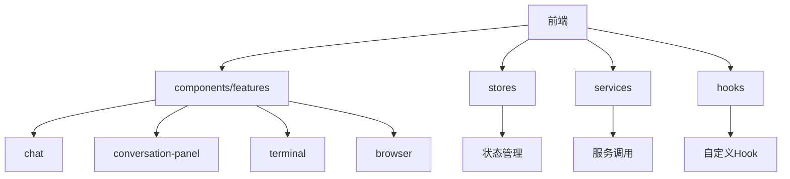
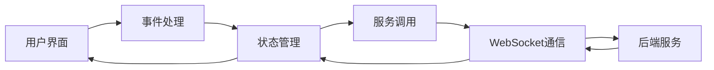
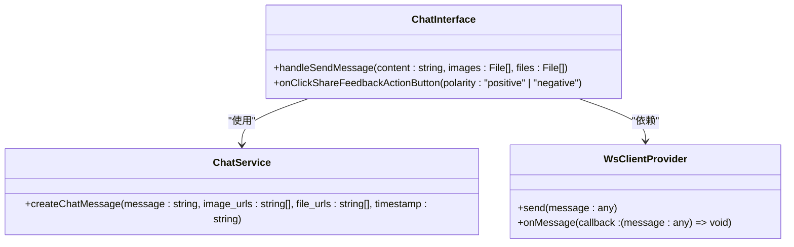
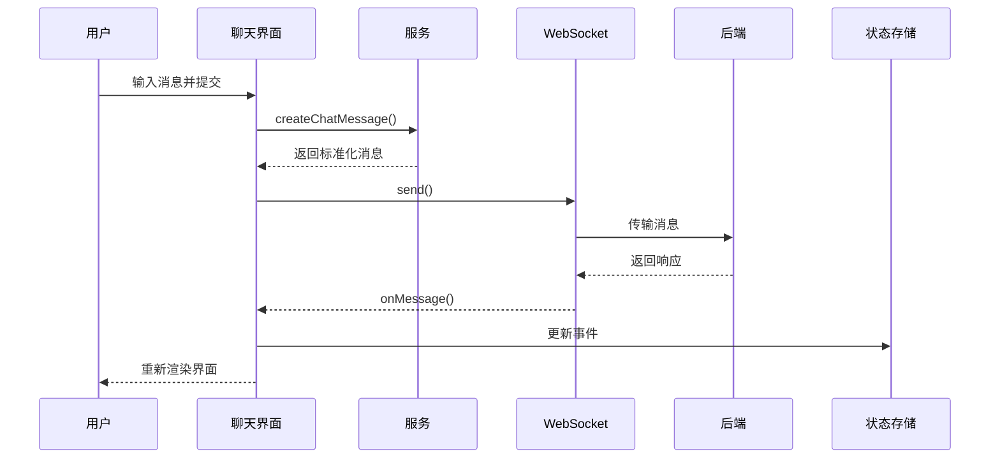
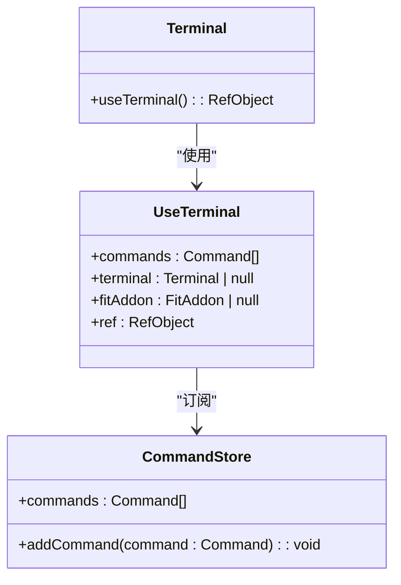
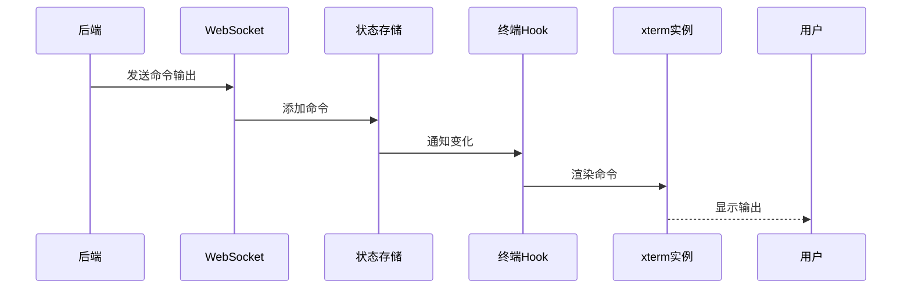
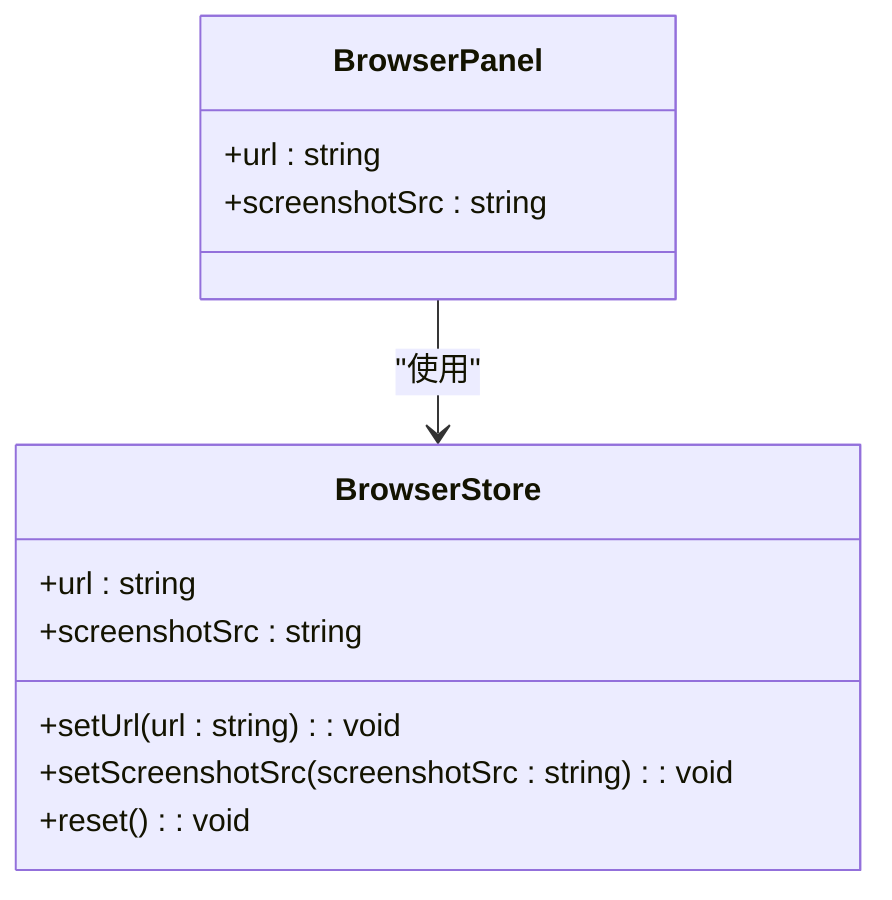
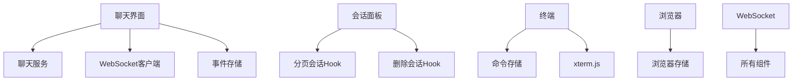

# 核心功能组件

<cite>
**本文档中引用的文件**  
- [chat-interface.tsx](file://frontend/src/components/features/chat/chat-interface.tsx)
- [conversation-panel.tsx](file://frontend/src/components/features/conversation-panel/conversation-panel.tsx)
- [terminal.tsx](file://frontend/src/components/features/terminal/terminal.tsx)
- [browser.tsx](file://frontend/src/components/features/browser/browser.tsx)
- [use-terminal.ts](file://frontend/src/hooks/use-terminal.ts)
- [browser-store.ts](file://frontend/src/stores/browser-store.ts)
- [chat-service.ts](file://frontend/src/services/chat-service.ts)
- [conversation-websocket-context.tsx](file://frontend/src/contexts/conversation-websocket-context.tsx)
- [ws-client-provider.tsx](file://frontend/src/context/ws-client-provider.tsx)
</cite>

## 目录
1. [介绍](#介绍)
2. [项目结构](#项目结构)
3. [核心组件](#核心组件)
4. [架构概览](#架构概览)
5. [详细组件分析](#详细组件分析)
6. [依赖分析](#依赖分析)
7. [性能考虑](#性能考虑)
8. [故障排除指南](#故障排除指南)
9. [结论](#结论)

## 介绍
本文档详细描述了OpenHands前端的核心功能组件，包括聊天界面、会话管理、终端和浏览器集成等关键部分。文档深入分析了`chat-interface.tsx`、`conversation-panel.tsx`、`terminal.tsx`和`browser.tsx`等核心组件的实现细节、状态管理机制和事件处理流程。同时，文档还探讨了这些组件如何通过WebSocket与后端进行实时通信以及它们之间的交互关系。

## 项目结构
OpenHands前端项目采用模块化设计，主要功能组件位于`frontend/src/components/features/`目录下。核心组件按功能划分，包括聊天、会话面板、终端和浏览器等独立模块。状态管理通过Zustand库实现，存储在`stores/`目录中，而业务逻辑和服务调用则封装在`services/`和`hooks/`目录中。



**Diagram sources**
- [chat-interface.tsx](file://frontend/src/components/features/chat/chat-interface.tsx)
- [conversation-panel.tsx](file://frontend/src/components/features/conversation-panel/conversation-panel.tsx)
- [terminal.tsx](file://frontend/src/components/features/terminal/terminal.tsx)
- [browser.tsx](file://frontend/src/components/features/browser/browser.tsx)

**Section sources**
- [chat-interface.tsx](file://frontend/src/components/features/chat/chat-interface.tsx)
- [conversation-panel.tsx](file://frontend/src/components/features/conversation-panel/conversation-panel.tsx)
- [terminal.tsx](file://frontend/src/components/features/terminal/terminal.tsx)
- [browser.tsx](file://frontend/src/components/features/browser/browser.tsx)

## 核心组件
OpenHands前端的核心功能由四个主要组件构成：聊天界面、会话管理面板、终端模拟器和浏览器集成。这些组件通过WebSocket与后端实时通信，实现了完整的开发助手功能。每个组件都有明确的职责划分，通过状态管理和事件处理机制协同工作。

**Section sources**
- [chat-interface.tsx](file://frontend/src/components/features/chat/chat-interface.tsx)
- [conversation-panel.tsx](file://frontend/src/components/features/conversation-panel/conversation-panel.tsx)
- [terminal.tsx](file://frontend/src/components/features/terminal/terminal.tsx)
- [browser.tsx](file://frontend/src/components/features/browser/browser.tsx)

## 架构概览
OpenHands前端采用现代化的React架构，结合Zustand进行状态管理，通过WebSocket实现与后端的实时通信。组件间通过Context和自定义Hook进行数据传递和状态共享，形成了清晰的单向数据流。



**Diagram sources**
- [ws-client-provider.tsx](file://frontend/src/context/ws-client-provider.tsx)
- [conversation-websocket-context.tsx](file://frontend/src/contexts/conversation-websocket-context.tsx)

## 详细组件分析
本节深入分析OpenHands前端的各个核心组件，包括其实现细节、状态管理机制和事件处理流程。

### 聊天界面分析
聊天界面组件负责处理用户输入、显示对话历史和管理聊天状态。它通过WebSocket与后端通信，实现实时消息传递。

#### 组件实现
聊天界面组件`chat-interface.tsx`是用户与AI助手交互的主要界面。它集成了消息显示、输入框、文件上传和反馈机制等功能。组件通过`useConversationWebSocket`上下文与后端建立WebSocket连接，实现双向实时通信。



**Diagram sources**
- [chat-interface.tsx](file://frontend/src/components/features/chat/chat-interface.tsx)
- [chat-service.ts](file://frontend/src/services/chat-service.ts)
- [ws-client-provider.tsx](file://frontend/src/context/ws-client-provider.tsx)

#### 状态管理
聊天界面通过多个状态存储来管理不同的数据：
- `useEventStore`：存储所有事件消息
- `useErrorMessageStore`：管理错误消息显示
- `useOptimisticUserMessageStore`：存储用户输入的乐观更新消息
- `useConversationStore`：管理会话相关状态

这些状态存储通过Zustand实现，确保了状态的可预测性和可调试性。

#### 事件处理
聊天界面的事件处理流程如下：
1. 用户在输入框中输入消息并提交
2. `handleSendMessage`函数被调用，处理消息内容和附件
3. 消息通过`chat-service`创建标准化的消息对象
4. 消息通过WebSocket发送到后端
5. 后端处理完成后，响应消息通过WebSocket返回
6. 前端更新状态存储，重新渲染界面



**Diagram sources**
- [chat-interface.tsx](file://frontend/src/components/features/chat/chat-interface.tsx)
- [chat-service.ts](file://frontend/src/services/chat-service.ts)
- [ws-client-provider.tsx](file://frontend/src/context/ws-client-provider.tsx)

**Section sources**
- [chat-interface.tsx](file://frontend/src/components/features/chat/chat-interface.tsx)
- [chat-service.ts](file://frontend/src/services/chat-service.ts)

### 会话管理面板分析
会话管理面板组件负责显示和管理用户的会话列表，提供会话的创建、删除和切换功能。

#### 组件实现
会话管理面板`conversation-panel.tsx`通过`usePaginatedConversations` Hook获取分页的会话列表，并使用`useInfiniteScroll`实现无限滚动加载。组件还集成了删除和停止会话的确认对话框，确保用户操作的安全性。

```mermaid
classDiagram
class ConversationPanel {
+handleDeleteProject(conversationId : string)
+handleStopConversation(conversationId : string, version? : "V0" | "V1")
+handleConversationTitleChange(conversationId : string, newTitle : string)
}
class UsePaginatedConversations {
+data : PaginatedConversations
+isFetching : boolean
+hasNextPage : boolean
+fetchNextPage() : void
}
class UseDeleteConversation {
+mutate : (variables : { conversationId : string }) => void
}
ConversationPanel --> UsePaginatedConversations : "使用"
ConversationPanel --> UseDeleteConversation : "使用"
```

**Diagram sources**
- [conversation-panel.tsx](file://frontend/src/components/features/conversation-panel/conversation-panel.tsx)
- [use-paginated-conversations](file://frontend/src/hooks/query/use-paginated-conversations)
- [use-delete-conversation](file://frontend/src/hooks/mutation/use-delete-conversation)

#### 状态管理
会话管理面板通过以下状态管理机制工作：
- 使用React的`useState`管理本地UI状态（如模态框可见性）
- 通过React Query的`usePaginatedConversations`获取远程会话数据
- 使用`useDeleteConversation`和`useUpdateConversation`等mutation Hook处理数据变更

这种组合方式既保证了本地UI的响应性，又确保了远程数据的一致性。

#### 事件处理
会话管理面板的事件处理主要包括：
- 会话选择：点击会话项导航到对应会话
- 会话删除：触发删除确认流程
- 会话停止：触发停止确认流程
- 标题编辑：更新会话标题

这些事件通过props传递给子组件（如`ConversationCard`），实现了关注点分离。

**Section sources**
- [conversation-panel.tsx](file://frontend/src/components/features/conversation-panel/conversation-panel.tsx)

### 终端集成分析
终端组件提供了一个模拟的终端界面，用于显示AI助手执行的命令和输出。

#### 组件实现
终端组件由`terminal.tsx`和`use-terminal.ts`两个文件组成。`terminal.tsx`是UI组件，负责渲染终端界面；`use-terminal.ts`是自定义Hook，封装了xterm.js终端库的初始化和管理逻辑。



**Diagram sources**
- [terminal.tsx](file://frontend/src/components/features/terminal/terminal.tsx)
- [use-terminal.ts](file://frontend/src/hooks/use-terminal.ts)
- [command-store.ts](file://frontend/src/state/command-store.ts)

#### 状态管理
终端的状态管理基于Zustand的`command-store.ts`，该存储维护了一个命令数组，包含用户输入和系统输出。`use-terminal` Hook订阅这个存储，当有新命令时自动更新终端显示。

终端还使用了持久化的`persistentLastCommandIndex`来跟踪已渲染的命令索引，确保在组件重新挂载时不会重复渲染历史命令。

#### 事件处理
终端的事件处理流程如下：
1. 后端执行命令并生成输出事件
2. 事件通过WebSocket传递到前端
3. 前端将事件添加到`command-store`
4. `use-terminal` Hook检测到存储变化
5. 新命令被渲染到xterm.js终端实例中



**Diagram sources**
- [terminal.tsx](file://frontend/src/components/features/terminal/terminal.tsx)
- [use-terminal.ts](file://frontend/src/hooks/use-terminal.ts)
- [command-store.ts](file://frontend/src/state/command-store.ts)

**Section sources**
- [terminal.tsx](file://frontend/src/components/features/terminal/terminal.tsx)
- [use-terminal.ts](file://frontend/src/hooks/use-terminal.ts)

### 浏览器集成分析
浏览器组件提供了一个简单的浏览器界面，用于显示AI助手浏览网页的截图。

#### 组件实现
浏览器组件`browser.tsx`通过`useBrowserStore`获取浏览器状态（URL和截图），并相应地渲染界面。当会话切换时，组件会自动重置状态，确保不同会话间的隔离。



**Diagram sources**
- [browser.tsx](file://frontend/src/components/features/browser/browser.tsx)
- [browser-store.ts](file://frontend/src/stores/browser-store.ts)

#### 状态管理
浏览器的状态管理通过Zustand的`browser-store.ts`实现，存储了两个关键状态：
- `url`：当前浏览的URL
- `screenshotSrc`：当前页面的截图（base64编码）

该存储还提供了`reset`方法，用于在会话切换时清除状态。

#### 事件处理
浏览器组件的事件处理相对简单：
1. 当会话ID变化时，`useEffect`触发`reset`操作
2. 后端更新浏览器状态时，通过WebSocket发送新状态
3. 前端更新`browser-store`
4. 组件重新渲染，显示新内容

**Section sources**
- [browser.tsx](file://frontend/src/components/features/browser/browser.tsx)
- [browser-store.ts](file://frontend/src/stores/browser-store.ts)

## 依赖分析
OpenHands前端组件之间的依赖关系清晰，遵循了关注点分离的原则。核心依赖包括：



**Diagram sources**
- [chat-interface.tsx](file://frontend/src/components/features/chat/chat-interface.tsx)
- [conversation-panel.tsx](file://frontend/src/components/features/conversation-panel/conversation-panel.tsx)
- [terminal.tsx](file://frontend/src/components/features/terminal/terminal.tsx)
- [browser.tsx](file://frontend/src/components/features/browser/browser.tsx)

## 性能考虑
OpenHands前端在性能优化方面采用了多种技术：

### 虚拟滚动
会话管理面板使用`useInfiniteScroll`实现无限滚动，避免一次性加载所有会话导致的性能问题。只有当前可见的会话会被渲染，提高了大型会话列表的渲染性能。

### 懒加载
组件采用按需加载策略，只有当用户导航到特定功能时，相关组件才会被加载和初始化。例如，终端和浏览器组件只在用户切换到对应标签时才完全激活。

### 内存管理
通过合理的状态管理生命周期，确保内存的有效使用：
- 使用`useEffect`的清理函数及时释放资源（如WebSocket连接、事件监听器）
- 采用持久化引用避免不必要的重新渲染
- 在会话切换时重置相关状态，防止内存泄漏

## 故障排除指南
### WebSocket连接问题
如果WebSocket连接失败，检查：
- 后端服务是否正常运行
- 网络连接是否稳定
- 浏览器是否阻止了WebSocket连接

### 组件状态不一致
如果组件显示状态与实际状态不符：
- 检查相关状态存储是否正确更新
- 验证WebSocket消息是否正确接收和处理
- 确认组件是否正确订阅了状态变化

### 性能问题
如果界面响应缓慢：
- 检查是否有过多的重新渲染
- 验证虚拟滚动是否正常工作
- 确认大文件上传是否影响主线程

**Section sources**
- [ws-client-provider.tsx](file://frontend/src/context/ws-client-provider.tsx)
- [conversation-websocket-context.tsx](file://frontend/src/contexts/conversation-websocket-context.tsx)

## 结论
OpenHands前端通过精心设计的组件架构和状态管理机制，实现了功能丰富且性能优良的开发助手界面。核心组件各司其职，通过WebSocket与后端实时通信，为用户提供流畅的交互体验。代码结构清晰，遵循现代前端开发最佳实践，具有良好的可维护性和扩展性。