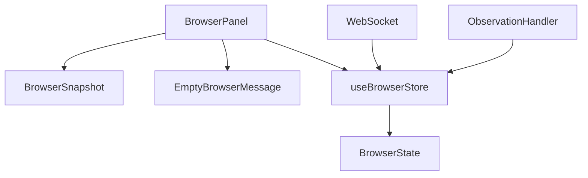
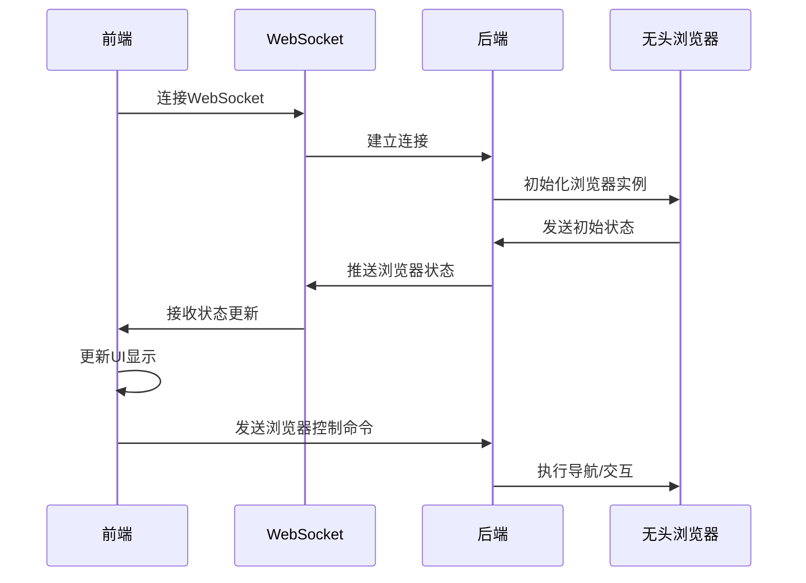
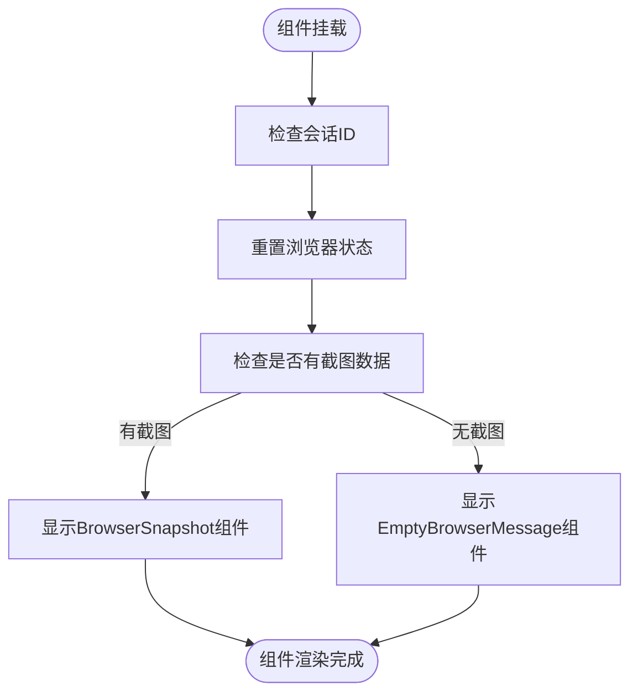
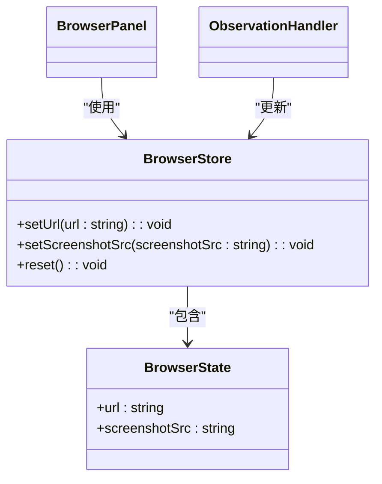
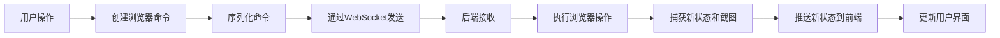
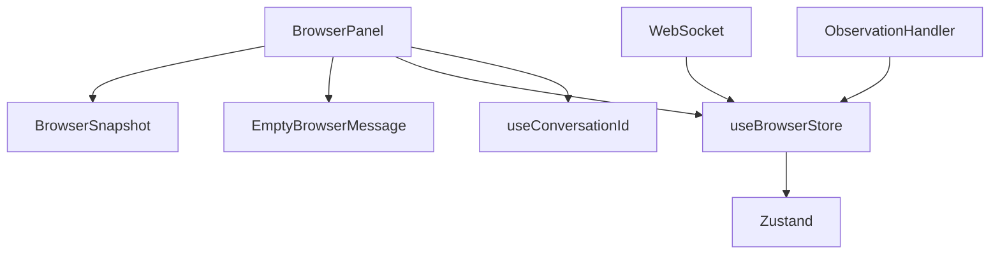

# 浏览器集成

<cite>
**本文档中引用的文件**  
- [browser.tsx](file://frontend/src/components/features/browser/browser.tsx)
- [browser-snapshot.tsx](file://frontend/src/components/features/browser/browser-snapshot.tsx)
- [empty-browser-message.tsx](file://frontend/src/components/features/browser/empty-browser-message.tsx)
- [browser-store.ts](file://frontend/src/stores/browser-store.ts)
- [websocket-url.ts](file://frontend/src/utils/websocket-url.ts)
- [observations.ts](file://frontend/src/services/observations.ts)
- [action.ts](file://frontend/src/types/v1/core/base/action.ts)
</cite>

## 目录
1. [简介](#简介)
2. [项目结构](#项目结构)
3. [核心组件](#核心组件)
4. [架构概述](#架构概述)
5. [详细组件分析](#详细组件分析)
6. [依赖分析](#依赖分析)
7. [性能考虑](#性能考虑)
8. [故障排除指南](#故障排除指南)
9. [结论](#结论)

## 简介
本文档详细描述了OpenHands前端的浏览器集成实现。重点分析了browser.tsx组件的架构设计，解释其如何嵌入和管理无头浏览器实例的显示。文档详细说明了组件如何处理浏览器的导航、截图（browser-snapshot.tsx）和状态同步。同时阐述了empty-browser-message.tsx组件在浏览器未激活时的用户体验设计。提供了代码示例展示浏览器控制命令的发送和响应处理流程。讨论了跨域问题、安全沙箱和性能优化（如按需渲染）的实现策略，并解释了如何处理复杂的网页交互，包括表单填写、点击事件和动态内容加载。

## 项目结构
OpenHands前端的浏览器集成功能主要位于`frontend/src/components/features/browser/`目录下，包含三个核心组件文件：browser.tsx、browser-snapshot.tsx和empty-browser-message.tsx。这些组件与位于`frontend/src/stores/`目录下的browser-store.ts状态管理文件协同工作。浏览器功能通过WebSocket与后端通信，相关工具函数位于`frontend/src/utils/websocket-url.ts`。浏览器相关的观察处理逻辑在`frontend/src/services/observations.ts`中实现。

**图表来源**  
- [browser.tsx](file://frontend/src/components/features/browser/browser.tsx)
- [browser-store.ts](file://frontend/src/stores/browser-store.ts)

**章节来源**  
- [browser.tsx](file://frontend/src/components/features/browser/browser.tsx)
- [browser-store.ts](file://frontend/src/stores/browser-store.ts)

## 核心组件
浏览器集成的核心组件包括BrowserPanel、BrowserSnapshot和EmptyBrowserMessage。BrowserPanel是主组件，负责协调其他组件并管理浏览器状态。BrowserSnapshot组件用于显示浏览器截图，而EmptyBrowserMessage则在没有活动浏览器会话时提供用户友好的提示信息。这些组件通过Zustand状态管理库与全局状态进行交互，确保浏览器状态在应用的不同部分之间保持同步。

**章节来源**  
- [browser.tsx](file://frontend/src/components/features/browser/browser.tsx)
- [browser-snapshot.tsx](file://frontend/src/components/features/browser/browser-snapshot.tsx)
- [empty-browser-message.tsx](file://frontend/src/components/features/browser/empty-browser-message.tsx)

## 架构概述
OpenHands的浏览器集成采用基于WebSocket的实时通信架构。前端通过WebSocket连接到后端服务，接收浏览器状态更新和截图数据。browser-store.ts文件定义了浏览器状态的存储结构，包括当前URL和截图源数据。当收到新的浏览器观察数据时，observations.ts中的处理函数会更新状态存储，触发UI重新渲染。这种架构实现了前后端之间的实时同步，确保用户界面始终反映最新的浏览器状态。

**图表来源**  
- [browser-store.ts](file://frontend/src/stores/browser-store.ts)
- [websocket-url.ts](file://frontend/src/utils/websocket-url.ts)
- [observations.ts](file://frontend/src/services/observations.ts)

## 详细组件分析

### BrowserPanel组件分析
BrowserPanel组件是浏览器功能的入口点，负责协调浏览器状态的显示和管理。组件通过useBrowserStore Hook订阅浏览器状态，并在会话ID变化时重置状态。组件根据是否有截图数据决定显示BrowserSnapshot还是EmptyBrowserMessage。

**图表来源**  
- [browser.tsx](file://frontend/src/components/features/browser/browser.tsx)

**章节来源**  
- [browser.tsx](file://frontend/src/components/features/browser/browser.tsx)

### 浏览器状态管理分析
浏览器状态管理通过Zustand库实现，使用useBrowserStore Hook提供全局状态访问。状态存储包含URL和截图源数据，并提供相应的更新方法。这种集中式状态管理确保了应用各部分对浏览器状态的一致视图。

**图表来源**  
- [browser-store.ts](file://frontend/src/stores/browser-store.ts)

**章节来源**  
- [browser-store.ts](file://frontend/src/stores/browser-store.ts)

### 浏览器控制命令分析
浏览器控制命令通过WebSocket发送到后端执行。前端定义了多种浏览器操作类型，包括导航、点击、输入等。这些命令通过action.ts中定义的类型系统进行类型化，确保类型安全。

**图表来源**  
- [action.ts](file://frontend/src/types/v1/core/base/action.ts)
- [websocket-url.ts](file://frontend/src/utils/websocket-url.ts)

**章节来源**  
- [action.ts](file://frontend/src/types/v1/core/base/action.ts)

## 依赖分析
浏览器集成组件依赖于多个核心模块：Zustand用于状态管理，WebSocket用于实时通信，React用于UI渲染。组件间依赖关系清晰，BrowserPanel依赖于BrowserSnapshot和EmptyBrowserMessage，所有组件都依赖于useBrowserStore提供的状态管理功能。这种模块化设计提高了代码的可维护性和可测试性。

**图表来源**  
- [browser.tsx](file://frontend/src/components/features/browser/browser.tsx)
- [browser-store.ts](file://frontend/src/stores/browser-store.ts)

**章节来源**  
- [browser.tsx](file://frontend/src/components/features/browser/browser.tsx)
- [browser-store.ts](file://frontend/src/stores/browser-store.ts)

## 性能考虑
浏览器集成在性能方面采用了多种优化策略。通过按需渲染机制，只有在有截图数据时才渲染BrowserSnapshot组件，避免了不必要的DOM操作。WebSocket连接实现了高效的数据传输，只推送变化的状态数据而非完整页面。状态管理使用了不可变更新模式，确保React组件的高效重渲染。此外，截图数据以Base64编码传输，减少了网络请求次数。

**章节来源**  
- [browser.tsx](file://frontend/src/components/features/browser/browser.tsx)
- [browser-store.ts](file://frontend/src/stores/browser-store.ts)

## 故障排除指南
当浏览器集成出现问题时，首先检查WebSocket连接状态。确保后端服务正常运行且网络连接稳定。检查浏览器状态存储是否正确更新，可通过开发工具查看useBrowserStore的状态。验证截图数据格式是否正确，应为以"data:image/png;base64,"开头的Base64编码字符串。如果导航功能失效，检查发送的浏览器命令是否符合预期格式。

**章节来源**  
- [browser.tsx](file://frontend/src/components/features/browser/browser.tsx)
- [observations.ts](file://frontend/src/services/observations.ts)
- [websocket-url.ts](file://frontend/src/utils/websocket-url.ts)

## 结论
OpenHands的浏览器集成实现了一个高效、响应式的无头浏览器界面。通过WebSocket实现实时通信，结合Zustand状态管理，创建了一个流畅的用户体验。组件设计遵循单一职责原则，各组件职责明确，易于维护和扩展。架构支持复杂的网页交互，包括导航、表单填写和动态内容加载，为用户提供了一个强大的浏览器自动化工具。