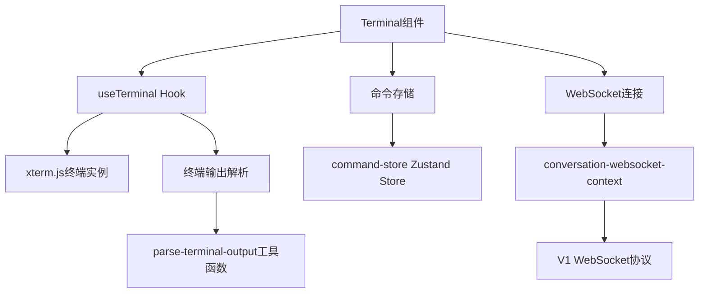
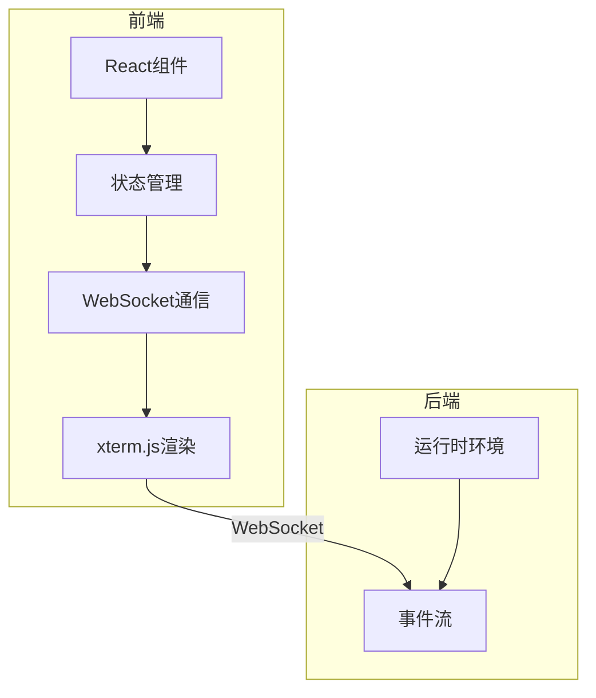
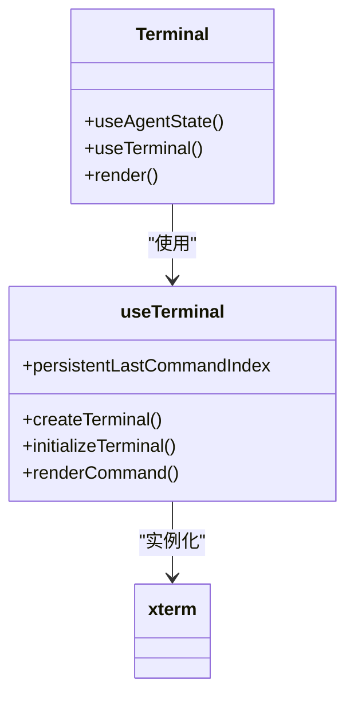
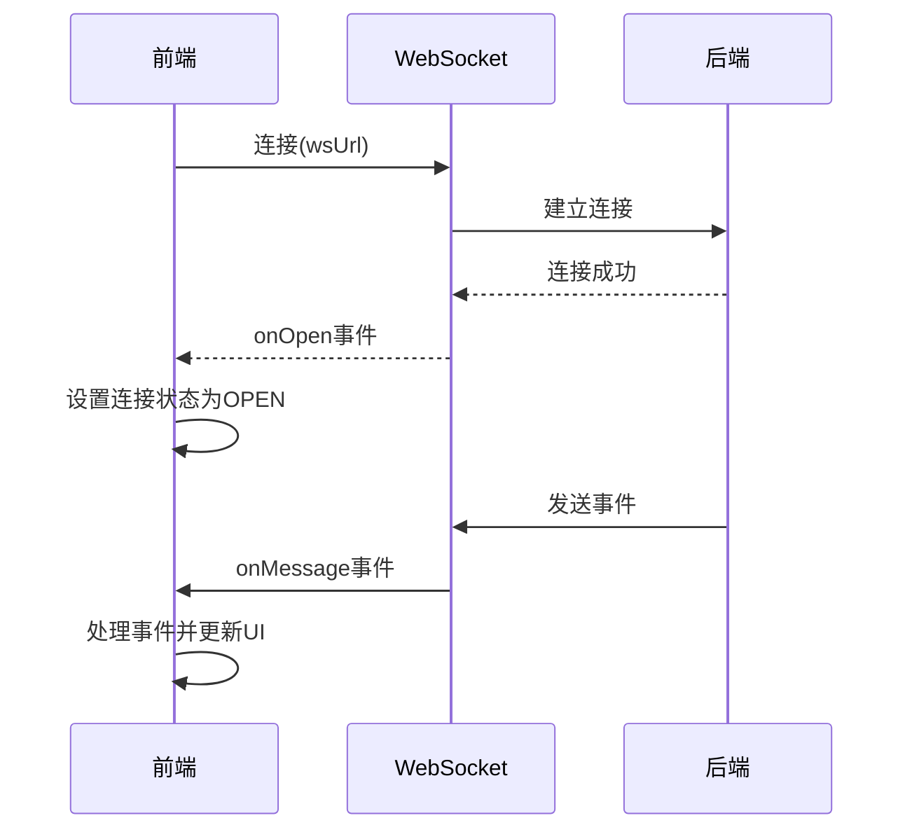
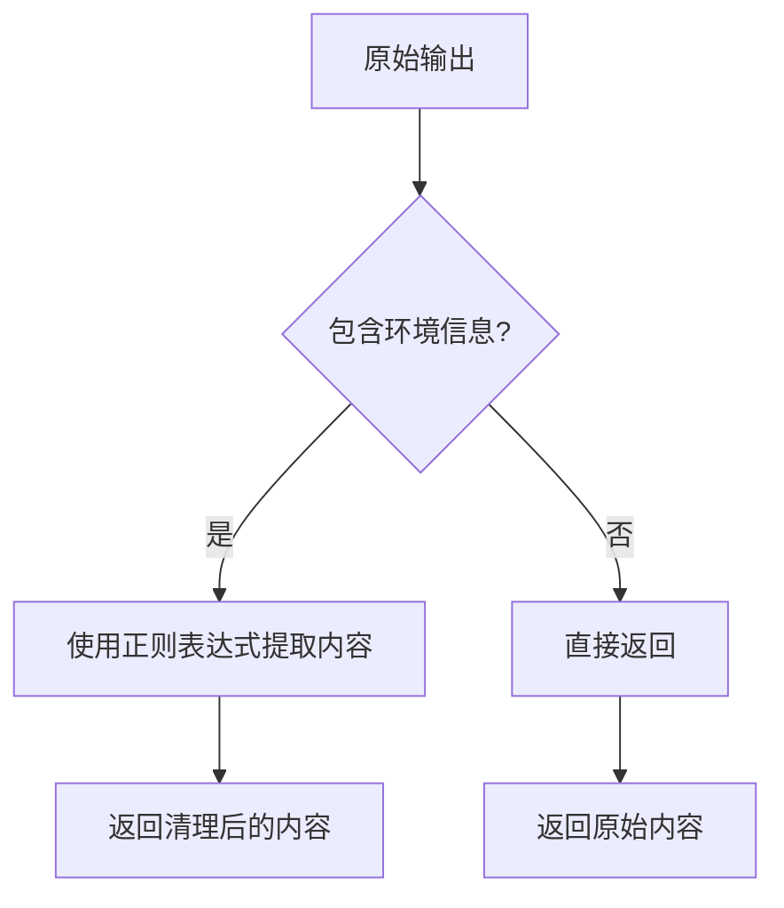

# 终端集成

<cite>
**本文档中引用的文件**  
- [terminal.tsx](file://frontend/src/components/features/terminal/terminal.tsx)
- [use-terminal.ts](file://frontend/src/hooks/use-terminal.ts)
- [websocket-url.ts](file://frontend/src/utils/websocket-url.ts)
- [conversation-websocket-context.tsx](file://frontend/src/contexts/conversation-websocket-context.tsx)
- [command-store.ts](file://frontend/src/state/command-store.ts)
- [parse-terminal-output.ts](file://frontend/src/utils/parse-terminal-output.ts)
</cite>

## 目录
1. [项目结构](#项目结构)
2. [核心组件](#核心组件)
3. [架构概述](#架构概述)
4. [详细组件分析](#详细组件分析)
5. [依赖分析](#依赖分析)
6. [性能考虑](#性能考虑)
7. [故障排除指南](#故障排除指南)
8. [结论](#结论)

## 项目结构

OpenHands前端的终端集成主要位于`frontend/src/components/features/terminal/`目录下，核心组件为`terminal.tsx`。该组件依赖于`xterm.js`库来渲染终端界面，并通过WebSocket与后端运行时环境进行实时通信。终端状态通过Zustand状态管理库进行管理，命令历史存储在`command-store.ts`中。WebSocket连接逻辑封装在`conversation-websocket-context.tsx`中，支持V0和V1两种协议版本。



**Diagram sources**
- [terminal.tsx](file://frontend/src/components/features/terminal/terminal.tsx)
- [use-terminal.ts](file://frontend/src/hooks/use-terminal.ts)
- [conversation-websocket-context.tsx](file://frontend/src/contexts/conversation-websocket-context.tsx)
- [command-store.ts](file://frontend/src/state/command-store.ts)
- [parse-terminal-output.ts](file://frontend/src/utils/parse-terminal-output.ts)

**Section sources**
- [terminal.tsx](file://frontend/src/components/features/terminal/terminal.tsx)
- [use-terminal.ts](file://frontend/src/hooks/use-terminal.ts)

## 核心组件

`terminal.tsx`是OpenHands前端中负责终端显示的核心组件。它通过`useTerminal` Hook初始化xterm.js终端实例，并将其挂载到DOM元素上。该组件是只读的，不接受用户输入，主要用于显示来自后端运行时的命令执行输出。组件会根据代理状态（agent state）决定是否显示"等待运行时"的消息。当运行时处于非活动状态时，终端会被隐藏。

**Section sources**
- [terminal.tsx](file://frontend/src/components/features/terminal/terminal.tsx)

## 架构概述

OpenHands的终端集成采用分层架构设计。最上层是React组件层，负责UI渲染和用户交互。中间层是状态管理层，使用Zustand管理终端命令历史。通信层负责与后端建立WebSocket连接，接收实时事件流。底层是xterm.js终端渲染引擎，负责将文本输出渲染为可视化的终端界面。整个架构通过清晰的职责分离，确保了代码的可维护性和可扩展性。



**Diagram sources**
- [terminal.tsx](file://frontend/src/components/features/terminal/terminal.tsx)
- [use-terminal.ts](file://frontend/src/hooks/use-terminal.ts)
- [conversation-websocket-context.tsx](file://frontend/src/contexts/conversation-websocket-context.tsx)

## 详细组件分析

### Terminal组件分析

`terminal.tsx`组件的实现非常简洁，主要职责是创建终端容器并根据代理状态控制显示。组件使用`useAgentState` Hook获取当前代理状态，并通过`RUNTIME_INACTIVE_STATES`常量判断运行时是否处于非活动状态。当运行时非活动时，显示"等待运行时"的消息；否则，渲染终端界面。终端元素通过`useTerminal` Hook返回的ref进行挂载。



**Diagram sources**
- [terminal.tsx](file://frontend/src/components/features/terminal/terminal.tsx)
- [use-terminal.ts](file://frontend/src/hooks/use-terminal.ts)

### WebSocket连接分析

终端与后端的通信通过WebSocket实现。`conversation-websocket-context.tsx`提供了`ConversationWebSocketProvider`，负责管理WebSocket连接的生命周期。连接URL通过`buildWebSocketUrl`工具函数构建，遵循`ws://host:port/sockets/events/{conversationId}`的格式。连接建立后，客户端会监听各种事件，包括连接成功、断开、错误等，并相应地更新UI状态。



**Diagram sources**
- [conversation-websocket-context.tsx](file://frontend/src/contexts/conversation-websocket-context.tsx)
- [websocket-url.ts](file://frontend/src/utils/websocket-url.ts)

### 终端输出解析分析

终端输出的解析由`parse-terminal-output.ts`工具函数负责。该函数使用正则表达式匹配并移除Python解释器环境信息等冗余内容，只保留用户关心的命令输出。解析后的输出通过`writeln`方法写入xterm.js终端实例。这种设计确保了终端显示的整洁性，避免了技术细节对用户体验的干扰。



**Diagram sources**
- [parse-terminal-output.ts](file://frontend/src/utils/parse-terminal-output.ts)

**Section sources**
- [parse-terminal-output.ts](file://frontend/src/utils/parse-terminal-output.ts)

## 依赖分析

终端组件依赖多个关键模块：`xterm.js`用于终端渲染，`@xterm/addon-fit`用于自适应终端大小，Zustand用于状态管理，以及WebSocket API用于实时通信。这些依赖通过清晰的接口进行交互，确保了组件的低耦合性。`use-terminal.ts`作为适配层，封装了xterm.js的复杂性，为上层组件提供了简洁的API。

```mermaid
graph TD
A[terminal.tsx] --> B[use-terminal.ts]
B --> C[xterm.js]
B --> D[@xterm/addon-fit]
A --> E[command-store.ts]
A --> F[conversation-websocket-context.tsx]
F --> G[WebSocket API]
```

**Diagram sources**
- [terminal.tsx](file://frontend/src/components/features/terminal/terminal.tsx)
- [use-terminal.ts](file://frontend/src/hooks/use-terminal.ts)
- [command-store.ts](file://frontend/src/state/command-store.ts)
- [conversation-websocket-context.tsx](file://frontend/src/contexts/conversation-websocket-context.tsx)

## 性能考虑

终端集成在性能方面做了多项优化。首先，使用`persistentLastCommandIndex`来跟踪已渲染的命令索引，避免重复渲染历史命令。其次，通过`ResizeObserver`监听容器大小变化，动态调整终端尺寸。此外，终端配置中设置了`scrollback: 1000`，限制了滚动缓冲区大小，防止内存占用过高。这些优化确保了即使在处理大量输出时，终端也能保持流畅的用户体验。

## 故障排除指南

当终端无法正常工作时，可以按照以下步骤进行排查：
1. 检查WebSocket连接状态，确保前端能与后端建立连接
2. 验证`conversationId`和`conversationUrl`是否正确传递
3. 检查浏览器控制台是否有JavaScript错误
4. 确认xterm.js CSS文件已正确加载
5. 查看网络面板，确认WebSocket握手是否成功

**Section sources**
- [conversation-websocket-context.tsx](file://frontend/src/contexts/conversation-websocket-context.tsx)
- [use-terminal.ts](file://frontend/src/hooks/use-terminal.ts)

## 结论

OpenHands的终端集成通过精心设计的架构，实现了前端与后端运行时环境的高效通信。组件化的设计使得代码易于维护和扩展，而WebSocket的使用确保了实时交互的流畅性。通过合理的状态管理和性能优化，终端能够稳定地处理大量输出，为用户提供良好的使用体验。未来可以考虑增加用户输入功能，使终端成为真正的双向交互界面。