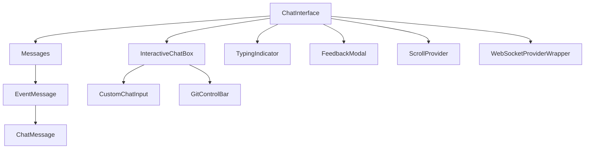
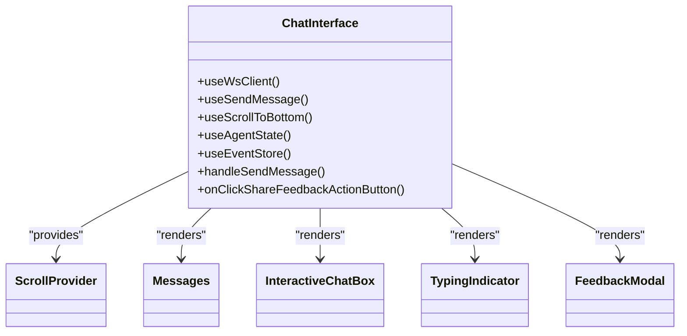
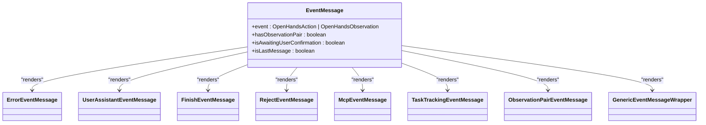
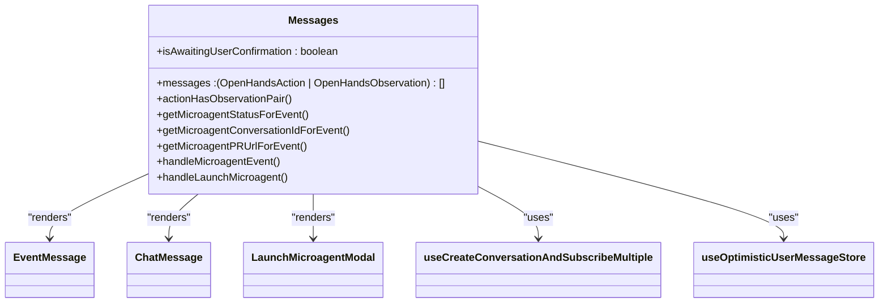
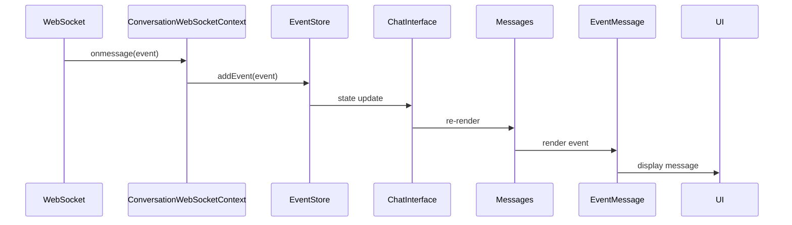
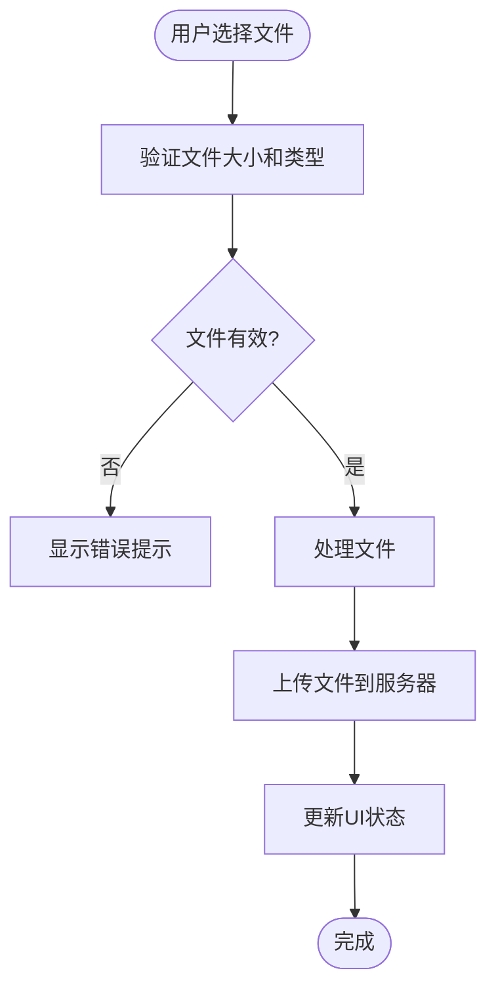
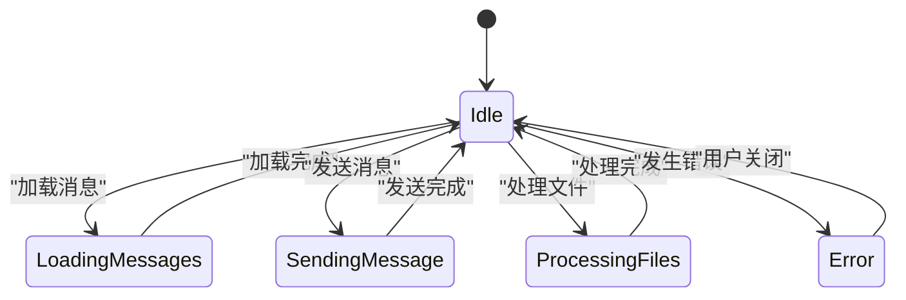
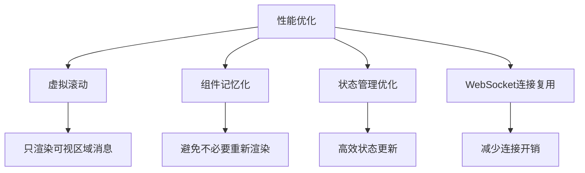

# 聊天系统

<cite>
**本文档引用的文件**
- [chat-interface.tsx](file://frontend/src/components/features/chat/chat-interface.tsx)
- [chat-message.tsx](file://frontend/src/components/features/chat/chat-message.tsx)
- [event-message.tsx](file://frontend/src/components/features/chat/event-message.tsx)
- [messages.tsx](file://frontend/src/components/features/chat/messages.tsx)
- [interactive-chat-box.tsx](file://frontend/src/components/features/chat/interactive-chat-box.tsx)
- [conversation-websocket-context.tsx](file://frontend/src/contexts/conversation-websocket-context.tsx)
- [use-send-message.ts](file://frontend/src/hooks/use-send-message.ts)
- [websocket-url.ts](file://frontend/src/utils/websocket-url.ts)
- [use-unified-upload-files.ts](file://frontend/src/hooks/mutation/use-unified-upload-files.ts)
- [use-event-store.ts](file://frontend/stores/use-event-store.ts)
</cite>

## 目录
1. [介绍](#介绍)
2. [核心架构](#核心架构)
3. [核心组件分析](#核心组件分析)
4. [消息流处理](#消息流处理)
5. [输入系统实现](#输入系统实现)
6. [错误处理与用户体验](#错误处理与用户体验)
7. [性能优化](#性能优化)

## 介绍
OpenHands前端的聊天系统是一个复杂的交互式界面，负责协调用户与AI代理之间的对话。该系统采用现代化的React架构，结合WebSocket实时通信技术，实现了流畅的聊天体验。本文档将深入分析聊天系统的实现细节，重点关注核心组件的架构设计、消息处理流程、状态管理机制以及用户体验优化。

## 核心架构
OpenHands聊天系统采用分层架构设计，以`chat-interface.tsx`作为核心容器组件，协调整个聊天界面的各个部分。系统支持V0和V1两种对话版本，通过条件渲染和状态管理实现无缝切换。



**Diagram sources**
- [chat-interface.tsx](file://frontend/src/components/features/chat/chat-interface.tsx#L62-L322)
- [messages.tsx](file://frontend/src/components/features/chat/messages.tsx#L45-L297)
- [interactive-chat-box.tsx](file://frontend/src/components/features/chat/interactive-chat-box.tsx#L16-L153)

**Section sources**
- [chat-interface.tsx](file://frontend/src/components/features/chat/chat-interface.tsx#L62-L322)

## 核心组件分析

### chat-interface.tsx 架构设计
`chat-interface.tsx`作为聊天系统的主容器组件，负责协调消息展示、用户输入和状态管理。该组件通过多个自定义Hook集成各种功能，包括WebSocket连接、消息发送、滚动控制和错误处理。

组件的主要职责包括：
- 管理WebSocket连接状态
- 协调消息列表的渲染
- 处理用户输入和消息发送
- 管理滚动行为和用户体验
- 处理反馈和错误状态



**Diagram sources**
- [chat-interface.tsx](file://frontend/src/components/features/chat/chat-interface.tsx#L62-L322)

**Section sources**
- [chat-interface.tsx](file://frontend/src/components/features/chat/chat-interface.tsx#L62-L322)

### chat-message.tsx 消息渲染
`chat-message.tsx`组件负责渲染不同类型的消息，包括用户消息、助手消息和系统消息。该组件采用React的Props模式，通过`type`属性区分不同的消息类型，并应用相应的样式。

```mermaid
classDiagram
class ChatMessage {
+type : OpenHandsSourceType
+message : string
+actions : Array<{icon, onClick, tooltip}>
+handleCopyToClipboard()
}
ChatMessage --> Markdown : "uses"
ChatMessage --> CopyToClipboardButton : "uses"
ChatMessage --> TooltipButton : "uses"
```

**Diagram sources**
- [chat-message.tsx](file://frontend/src/components/features/chat/chat-message.tsx#L24-L133)

**Section sources**
- [chat-message.tsx](file://frontend/src/components/features/chat/chat-message.tsx#L24-L133)

### event-message.tsx 事件处理
`event-message.tsx`组件负责处理各种事件类型，包括错误、完成、拒绝等。该组件采用策略模式，根据事件类型选择相应的渲染组件。



**Diagram sources**
- [event-message.tsx](file://frontend/src/components/features/chat/event-message.tsx#L45-L146)

**Section sources**
- [event-message.tsx](file://frontend/src/components/features/chat/event-message.tsx#L45-L146)

### messages.tsx 消息列表管理
`messages.tsx`组件负责管理消息列表的虚拟滚动和性能优化。该组件使用React.memo进行性能优化，避免不必要的重新渲染。



**Diagram sources**
- [messages.tsx](file://frontend/src/components/features/chat/messages.tsx#L45-L297)

**Section sources**
- [messages.tsx](file://frontend/src/components/features/chat/messages.tsx#L45-L297)

## 消息流处理
聊天系统的消息流从WebSocket接收开始，经过状态更新，最终渲染到UI界面。整个流程涉及多个组件和Hook的协同工作。



**Diagram sources**
- [conversation-websocket-context.tsx](file://frontend/src/contexts/conversation-websocket-context.tsx#L281-L327)
- [use-event-store.ts](file://frontend/stores/use-event-store.ts)
- [chat-interface.tsx](file://frontend/src/components/features/chat/chat-interface.tsx#L62-L322)

**Section sources**
- [conversation-websocket-context.tsx](file://frontend/src/contexts/conversation-websocket-context.tsx#L281-L327)
- [use-event-store.ts](file://frontend/stores/use-event-store.ts)

## 输入系统实现
聊天系统的输入系统由`interactive-chat-box.tsx`组件实现，支持文本输入、文件上传和命令提交等多种交互方式。

### 文件上传处理
文件上传功能通过`useUnifiedUploadFiles` Hook实现，支持图片和普通文件的上传。系统会对上传的文件进行验证，确保符合大小和类型要求。



**Diagram sources**
- [interactive-chat-box.tsx](file://frontend/src/components/features/chat/interactive-chat-box.tsx#L16-L153)
- [use-unified-upload-files.ts](file://frontend/src/hooks/mutation/use-unified-upload-files.ts)

**Section sources**
- [interactive-chat-box.tsx](file://frontend/src/components/features/chat/interactive-chat-box.tsx#L16-L153)

### 交互式输入处理
输入框支持多种交互方式，包括：
- 文本输入和发送
- 文件拖拽上传
- 命令提交
- 快捷键操作

系统通过`CustomChatInput`组件实现这些功能，并与`GitControlBar`组件集成，提供丰富的交互体验。

## 错误处理与用户体验
聊天系统实现了完善的错误处理机制和加载状态设计，确保用户在各种情况下都能获得良好的体验。

### 错误处理机制
系统通过`errorMessage-store`管理错误状态，当发生错误时：
1. 在输入框下方显示错误横幅
2. 记录错误信息用于分析
3. 提供清晰的错误提示

### 加载状态设计
系统在不同场景下显示相应的加载状态：
- 消息加载时显示加载指示器
- 文件上传时显示进度
- 代理思考时显示打字指示器



**Diagram sources**
- [chat-interface.tsx](file://frontend/src/components/features/chat/chat-interface.tsx#L62-L322)
- [interactive-chat-box.tsx](file://frontend/src/components/features/chat/interactive-chat-box.tsx#L16-L153)

**Section sources**
- [chat-interface.tsx](file://frontend/src/components/features/chat/chat-interface.tsx#L62-L322)

## 性能优化
聊天系统通过多种技术手段实现性能优化，确保在大量消息场景下的流畅体验。

### 虚拟滚动
`messages.tsx`组件实现虚拟滚动，只渲染可视区域内的消息，大大减少了DOM节点数量。

### 组件记忆化
使用React.memo对`Messages`组件进行记忆化，避免在消息列表未变化时的不必要重新渲染。

### 状态管理优化
通过Zustand状态管理库，实现高效的状态更新和订阅机制，减少不必要的组件重新渲染。



**Diagram sources**
- [messages.tsx](file://frontend/src/components/features/chat/messages.tsx#L45-L297)
- [chat-interface.tsx](file://frontend/src/components/features/chat/chat-interface.tsx#L62-L322)

**Section sources**
- [messages.tsx](file://frontend/src/components/features/chat/messages.tsx#L45-L297)