# 组件结构

<cite>
**本文档中引用的文件**  
- [root.tsx](file://frontend/src/root.tsx)
- [chat-interface.tsx](file://frontend/src/components/features/chat/chat-interface.tsx)
- [interactive-chat-box.tsx](file://frontend/src/components/features/chat/interactive-chat-box.tsx)
- [conversation-panel.tsx](file://frontend/src/components/features/conversation-panel/conversation-panel.tsx)
- [browser.tsx](file://frontend/src/components/features/browser/browser.tsx)
- [terminal.tsx](file://frontend/src/components/features/terminal/terminal.tsx)
- [card.tsx](file://frontend/src/ui/card.tsx)
- [base-modal.tsx](file://frontend/src/components/shared/modals/base-modal/base-modal.tsx)
- [chat-message.tsx](file://frontend/src/components/features/chat/chat-message.tsx)
- [openhands-ui/shared/types.ts](file://openhands-ui/shared/types.ts)
- [openhands-ui/components/select/react-select.d.ts](file://openhands-ui/components/select/react-select.d.ts)
- [frontend/src/types/v1/core/base/index.ts](file://frontend/src/types/v1/core/base/index.ts)
- [frontend/.eslintrc](file://frontend/.eslintrc)
</cite>

## 目录
1. [项目结构](#项目结构)
2. [核心组件分析](#核心组件分析)
3. [目录职责划分](#目录职责划分)
4. [组件依赖关系](#组件依赖关系)
5. [可复用组件设计模式](#可复用组件设计模式)
6. [响应式设计与可访问性](#响应式设计与可访问性)

## 项目结构

OpenHands前端采用模块化React组件架构，主要组件组织在`frontend/src/components`目录下，分为`features`、`shared`和`ui`三个核心目录。项目使用React Router进行路由管理，通过Zustand进行状态管理，并采用Tailwind CSS进行样式设计。

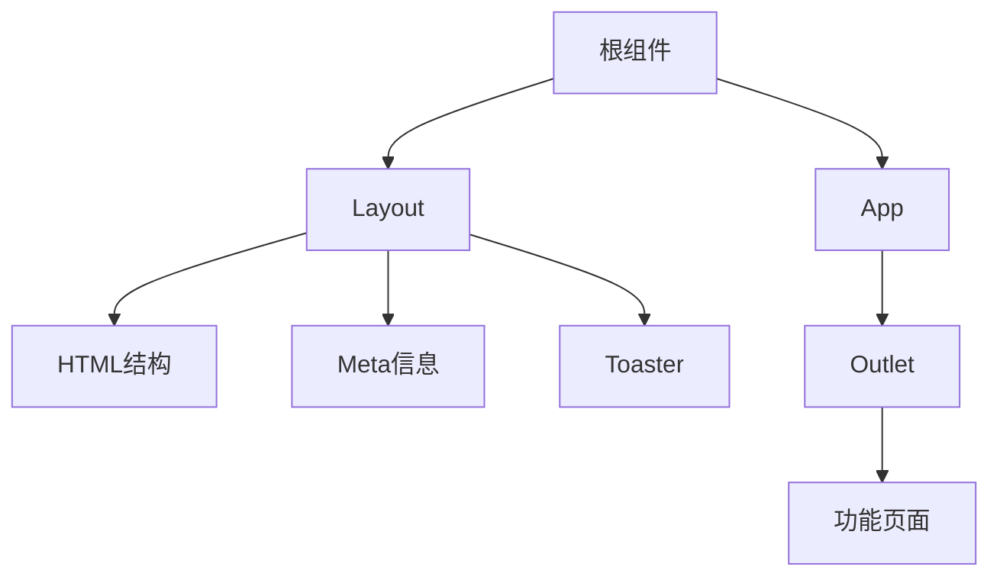

**图示来源**
- [root.tsx](file://frontend/src/root.tsx)

**本节来源**
- [root.tsx](file://frontend/src/root.tsx)

## 核心组件分析

### 聊天界面组件

聊天界面是OpenHands的核心交互区域，由`ChatInterface`组件主导，整合了消息显示、输入框、状态指示器等多个子组件。该组件通过WebSocket与后端保持实时通信，支持文件上传、代码块复制等高级功能。

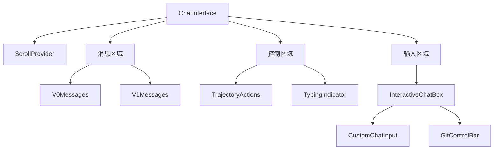

**图示来源**
- [chat-interface.tsx](file://frontend/src/components/features/chat/chat-interface.tsx)
- [interactive-chat-box.tsx](file://frontend/src/components/features/chat/interactive-chat-box.tsx)

**本节来源**
- [chat-interface.tsx](file://frontend/src/components/features/chat/chat-interface.tsx)

### 会话面板组件

会话面板组件`ConversationPanel`负责管理用户的所有对话会话，提供会话列表、创建新会话、删除会话等功能。该组件采用无限滚动技术加载更多会话，并通过模态框处理危险操作的确认。

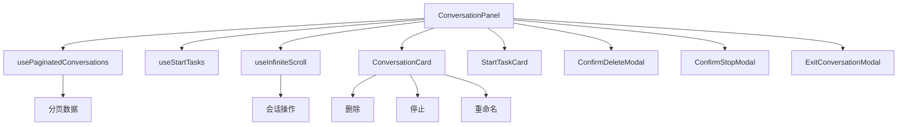

**图示来源**
- [conversation-panel.tsx](file://frontend/src/components/features/conversation-panel/conversation-panel.tsx)

**本节来源**
- [conversation-panel.tsx](file://frontend/src/components/features/conversation-panel/conversation-panel.tsx)

### 浏览器组件

浏览器组件`BrowserPanel`用于显示代理在浏览任务中的网页快照。该组件通过`useBrowserStore`获取浏览器状态，包括URL和截图数据，并在会话切换时重置状态。

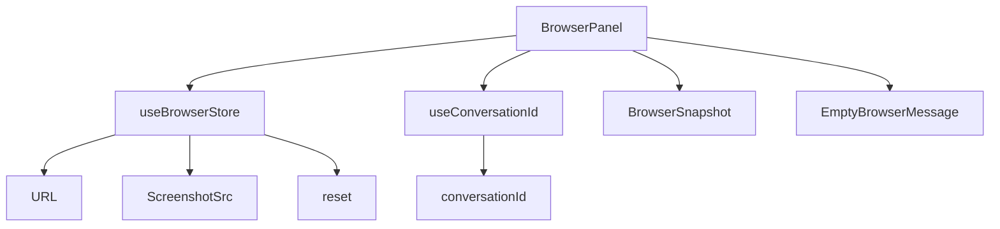

**图示来源**
- [browser.tsx](file://frontend/src/components/features/browser/browser.tsx)

**本节来源**
- [browser.tsx](file://frontend/src/components/features/browser/browser.tsx)

### 终端组件

终端组件`Terminal`集成了xterm.js库，提供完整的终端仿真功能。该组件根据代理状态决定是否显示终端内容，当运行时未激活时显示等待消息。

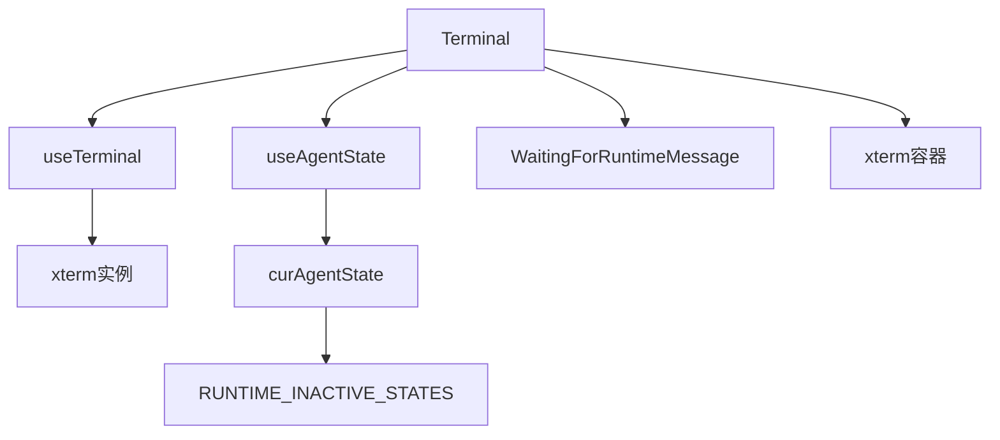

**图示来源**
- [terminal.tsx](file://frontend/src/components/features/terminal/terminal.tsx)

**本节来源**
- [terminal.tsx](file://frontend/src/components/features/terminal/terminal.tsx)

## 目录职责划分

### features目录

`features`目录包含与特定功能或页面直接相关的组件，这些组件通常较为复杂，包含业务逻辑和状态管理。该目录采用功能域划分，每个子目录对应一个核心功能。

```mermaid
graph TD
A[features] --> B[analytics]
A --> C[browser]
A --> D[chat]
A --> E[conversation]
A --> F[conversation-panel]
A --> G[diff-viewer]
A --> H[feedback]
A --> I[files]
A --> J[guards]
A --> K[home]
A --> L[images]
A --> M[maintenance]
A --> N[markdown]
A --> O[microagent-management]
A --> P[payment]
A --> Q[served-host]
A --> R[settings]
A --> S[sidebar]
A --> T[suggestions]
A --> U[terminal]
A --> V[tips]
A --> W[trajectory]
A --> X[waitlist]
```

**图示来源**
- [frontend/src/components/features](file://frontend/src/components/features)

**本节来源**
- [frontend/src/components/features](file://frontend/src/components/features)

### shared目录

`shared`目录包含可在多个功能中复用的组件，这些组件通常不包含业务逻辑，专注于提供通用UI元素和交互模式。

```mermaid
graph TD
A[shared] --> B[buttons]
A --> C[inputs]
A --> D[modals]
A --> E[action-tooltip]
A --> F[badge]
A --> G[git-provider-icon]
A --> H[loader]
A --> I[loading-spinner]
A --> J[risk-alert]
B --> K[confirmation-buttons]
B --> L[conversation-panel-button]
B --> M[copy-to-clipboard-button]
B --> N[icon-button]
B --> O[microagent-management-button]
B --> P[modal-button]
B --> Q[new-project-button]
B --> R[openhands-logo-button]
B --> S[refresh-button]
B --> T[remove-button]
B --> U[scroll-to-bottom-button]
B --> V[tooltip-button]
B --> W[trajectory-action-button]
B --> X[v1-confirmation-buttons]
D --> Y[base-modal]
D --> Z[confirmation-modals]
D --> AA[settings]
```

**图示来源**
- [frontend/src/components/shared](file://frontend/src/components/shared)

**本节来源**
- [frontend/src/components/shared](file://frontend/src/components/shared)

### ui目录

`ui`目录包含最基础的UI组件，这些组件通常直接映射到设计系统的原子组件，提供一致的视觉语言和交互体验。

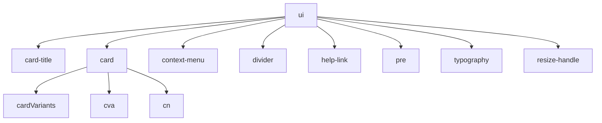

**图示来源**
- [frontend/src/components/ui](file://frontend/src/components/ui)

**本节来源**
- [frontend/src/components/ui](file://frontend/src/components/ui)

## 组件依赖关系

OpenHands前端组件之间存在清晰的依赖关系，遵循从通用到特定的层次结构。基础UI组件被共享组件使用，共享组件又被功能组件使用。

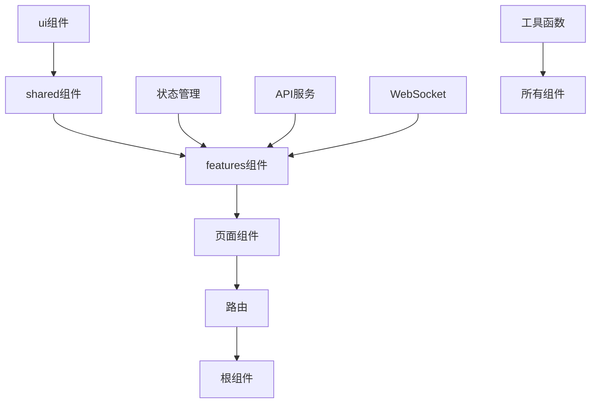

**图示来源**
- [frontend/src/components](file://frontend/src/components)
- [frontend/src/hooks](file://frontend/src/hooks)
- [frontend/src/stores](file://frontend/src/stores)
- [frontend/src/api](file://frontend/src/api)

**本节来源**
- [frontend/src/components](file://frontend/src/components)

## 可复用组件设计模式

### 基础组件设计

基础UI组件如`Card`采用变体模式，通过`class-variance-authority`库定义不同的样式变体，提供灵活的配置选项。

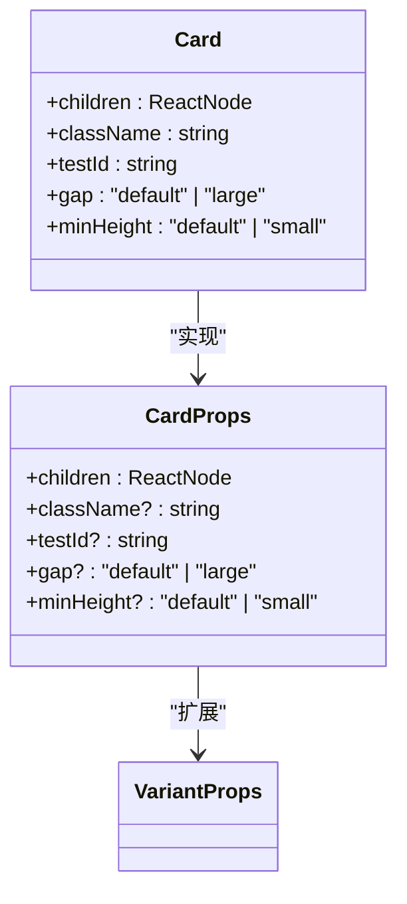

**图示来源**
- [card.tsx](file://frontend/src/ui/card.tsx)

**本节来源**
- [card.tsx](file://frontend/src/ui/card.tsx)

### 模态框组件设计

模态框组件采用组合模式，将复杂的模态框分解为可复用的头部、主体和底部组件，提高组件的灵活性和可维护性。

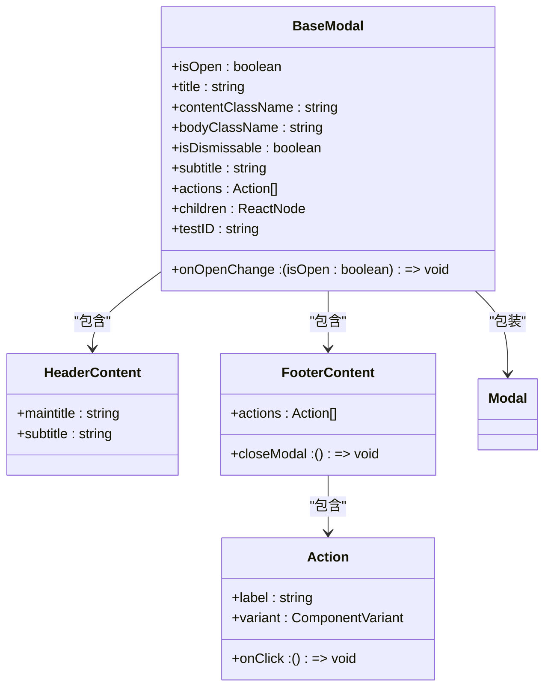

**图示来源**
- [base-modal.tsx](file://frontend/src/components/shared/modals/base-modal/base-modal.tsx)

**本节来源**
- [base-modal.tsx](file://frontend/src/components/shared/modals/base-modal/base-modal.tsx)

### 消息组件设计

聊天消息组件`ChatMessage`采用插槽模式，允许在消息周围添加自定义操作按钮，并支持Markdown渲染和代码块复制功能。

```mermaid
classDiagram
class ChatMessage {
+type : OpenHandsSourceType
+message : string
+actions : Array<{icon : ReactNode, onClick : () => void, tooltip? : string}>
+children : ReactNode
-isHovering : boolean
-isCopy : boolean
}
class OpenHandsSourceType {
+user
+agent
}
ChatMessage --> OpenHandsSourceType : "使用"
ChatMessage --> CopyToClipboardButton : "包含"
ChatMessage --> TooltipButton : "包含"
ChatMessage --> Markdown : "使用"
```

**图示来源**
- [chat-message.tsx](file://frontend/src/components/features/chat/chat-message.tsx)

**本节来源**
- [chat-message.tsx](file://frontend/src/components/features/chat/chat-message.tsx)

## 响应式设计与可访问性

### 响应式设计实现

OpenHands前端采用移动优先的响应式设计策略，使用Tailwind CSS的断点系统实现不同屏幕尺寸下的布局调整。

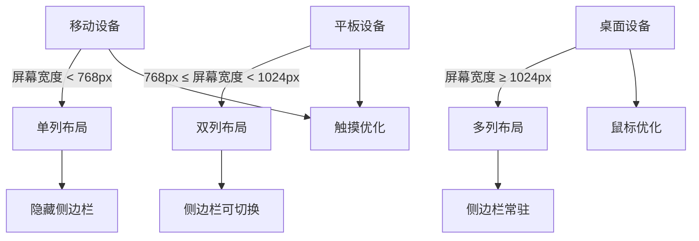

**图示来源**
- [tailwind.config.js](file://frontend/tailwind.config.js)
- [tailwind.css](file://frontend/src/tailwind.css)

**本节来源**
- [tailwind.config.js](file://frontend/tailwind.config.js)
- [tailwind.css](file://frontend/src/tailwind.css)

### 可访问性考虑

项目在可访问性方面做了多项考虑，包括键盘导航支持、ARIA标签、对比度优化等，确保所有用户都能有效使用应用。

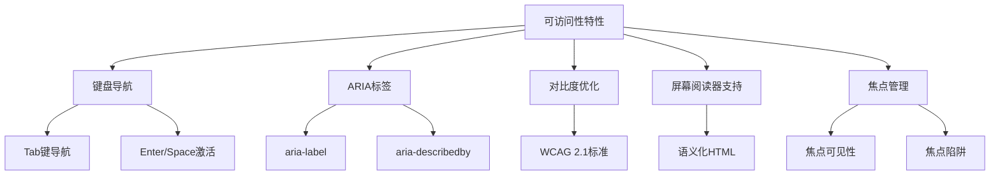

**图示来源**
- [.eslintrc](file://frontend/.eslintrc)
- [package.json](file://frontend/package.json)

**本节来源**
- [.eslintrc](file://frontend/.eslintrc)