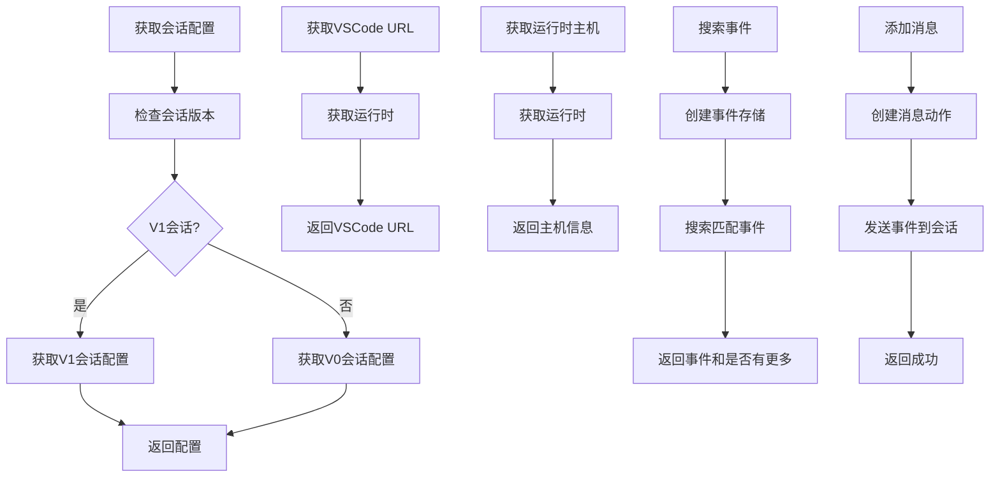
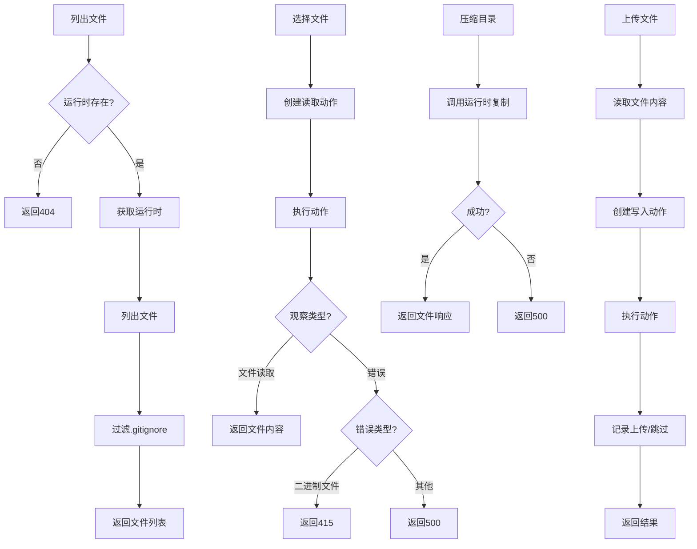
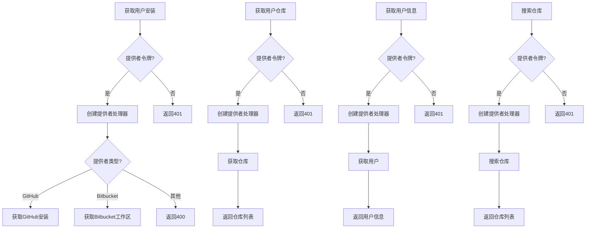
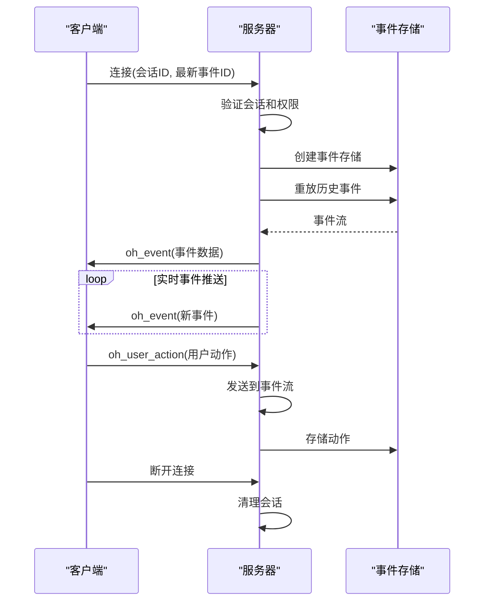
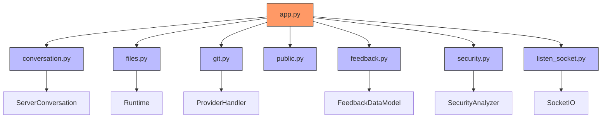
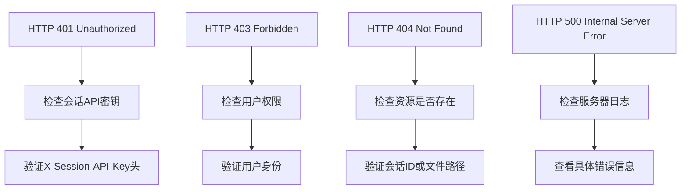

# API设计

<cite>
**本文档中引用的文件**   
- [app.py](file://openhands/server/app.py)
- [conversation.py](file://openhands/server/routes/conversation.py)
- [files.py](file://openhands/server/routes/files.py)
- [git.py](file://openhands/server/routes/git.py)
- [public.py](file://openhands/server/routes/public.py)
- [feedback.py](file://openhands/server/routes/feedback.py)
- [security.py](file://openhands/server/routes/security.py)
- [listen_socket.py](file://openhands/server/listen_socket.py)
- [v1_router.py](file://openhands/app_server/v1_router.py)
- [errors.py](file://openhands/app_server/errors.py)
- [dependencies.py](file://openhands/server/dependencies.py)
- [types.py](file://openhands/server/types.py)
</cite>

## 目录
1. [简介](#简介)
2. [项目结构](#项目结构)
3. [核心组件](#核心组件)
4. [架构概述](#架构概述)
5. [详细组件分析](#详细组件分析)
6. [依赖分析](#依赖分析)
7. [性能考虑](#性能考虑)
8. [故障排除指南](#故障排除指南)
9. [结论](#结论)

## 简介
OpenHands是一个基于FastAPI构建的RESTful API系统，旨在提供强大的会话管理、文件操作和Git集成功能。该API架构支持WebSocket实时事件流，实现了现代化的前后端通信模式。系统设计注重可扩展性和安全性，通过模块化的路由组织和清晰的端点分类策略，为开发者提供了直观的API使用体验。API支持版本控制机制和向后兼容性策略，确保系统的稳定演进。

## 项目结构
OpenHands的API架构采用模块化设计，将不同功能的API端点组织在独立的路由模块中。这种设计提高了代码的可维护性和可扩展性。

```mermaid
graph TD
subgraph "API路由模块"
A[conversation.py]
B[files.py]
C[git.py]
D[public.py]
E[feedback.py]
F[security.py]
end
subgraph "核心服务"
G[app.py]
H[listen_socket.py]
I[v1_router.py]
end
G --> A
G --> B
## 核心组件
OpenHands的API核心组件包括会话管理、文件操作、Git集成和实时事件流。这些组件通过FastAPI的路由系统进行组织，每个组件都有明确的职责边界。
**Section sources**
- [app.py](file://openhands/server/app.py#L1-L97)
- [conversation.py](file://openhands/server/routes/conversation.py#L1-L421)
- [files.py](file://openhands/server/routes/files.py#L1-L319)
- [git.py](file://openhands/server/routes/git.py#L1-L421)
## 架构概述
OpenHands的API架构基于FastAPI框架，采用分层设计模式。系统通过模块化的路由组织原则，将不同功能的API端点分类管理。
```mermaid
graph TD
    A[客户端] --> B[API网关]
    B --> C[会话管理API]
    B --> D[文件操作API]
    B --> E[Git集成API]
    B --> F[公共选项API]
    B --> G[反馈API]
    B --> H[安全分析API]
    
    C --> I[会话管理器]
    D --> J[运行时环境]
    E --> K[Git服务]
    H --> L[安全分析器]
    
    I --> M[事件存储]
    J --> M
    K --> M
    L --> M
    
    M --> N[WebSocket服务]
    N --> A
    
    style A fill:#f9f,stroke:#333
    style B fill:#bbf,stroke:#333
    style C fill:#f96,stroke:#333
    style D fill:#f96,stroke:#333
    style E fill:#f96,stroke:#333
    style F fill:#f96,stroke:#333
    style G fill:#f96,stroke:#333
    style H fill:#f96,stroke:#333

```

**Diagram sources **
- [app.py](file://openhands/server/app.py#L1-L97)
- [listen_socket.py](file://openhands/server/listen_socket.py#L1-L169)

## 详细组件分析

### 会话管理组件分析
会话管理组件负责处理与对话会话相关的所有操作，包括会话配置获取、VSCode URL获取、运行时主机获取和事件流管理。

#### 会话管理API端点


**Diagram sources **
- [conversation.py](file://openhands/server/routes/conversation.py#L107-L324)

### 文件操作组件分析
文件操作组件提供了对运行时环境中文件的全面管理功能，包括文件列表、文件读取、目录压缩和文件上传。

#### 文件操作API端点


**Diagram sources **
- [files.py](file://openhands/server/routes/files.py#L35-L319)

### Git集成组件分析
Git集成组件提供了与Git服务提供商的深度集成，支持用户安装、仓库、分支和微代理的管理。

#### Git集成API端点


**Diagram sources **
- [git.py](file://openhands/server/routes/git.py#L38-L165)

### 实时事件流组件分析
实时事件流组件通过WebSocket实现客户端与服务器之间的双向通信，提供低延迟的事件推送。

#### WebSocket事件流设计


**Diagram sources **
- [listen_socket.py](file://openhands/server/listen_socket.py#L35-L159)

## 依赖分析

OpenHands的API组件之间存在清晰的依赖关系，通过依赖注入机制实现松耦合。



**Diagram sources **
- [app.py](file://openhands/server/app.py#L1-L97)
- [dependencies.py](file://openhands/server/dependencies.py#L1-L24)

## 性能考虑

OpenHands的API设计考虑了性能优化，特别是在事件流处理和文件操作方面。系统通过异步处理和流式响应来提高性能。

### 事件流性能优化
- 使用异步事件存储包装器(AsyncEventStoreWrapper)实现非阻塞事件处理
- 支持事件过滤和分页，减少不必要的数据传输
- 通过WebSocket实现低延迟的实时通信

### 文件操作性能优化
- 支持批量文件上传，减少网络往返次数
- 使用后台任务处理文件压缩，避免阻塞主线程
- 实现.gitignore文件过滤，减少不必要的文件传输

## 故障排除指南

### 常见API错误及解决方案


**Section sources**
- [errors.py](file://openhands/app_server/errors.py#L1-L44)
- [dependencies.py](file://openhands/server/dependencies.py#L10-L17)

## 结论

OpenHands的API设计体现了现代化的RESTful架构原则，通过模块化的路由组织、清晰的端点分类和强大的实时通信能力，为开发者提供了高效、可靠的API服务。系统设计注重安全性、可扩展性和性能优化，支持会话管理、文件操作和Git集成等核心功能。WebSocket实时事件流的实现使得客户端能够及时获取系统状态更新，提升了用户体验。整体架构清晰，组件职责明确，为系统的持续演进奠定了坚实的基础。