# GitHub API交互与业务逻辑

<cite>
**本文档引用的文件**
- [github_service.py](file://enterprise/integrations/github/github_service.py)
- [github_manager.py](file://enterprise/integrations/github/github_manager.py)
- [queries.py](file://enterprise/integrations/github/queries.py)
- [github_types.py](file://enterprise/integrations/github/github_types.py)
- [github_view.py](file://enterprise/integrations/github/github_view.py)
- [data_collector.py](file://enterprise/integrations/github/data_collector.py)
- [base.py](file://openhands/integrations/github/service/base.py)
- [github_service.py](file://openhands/integrations/github/github_service.py)
</cite>

## 目录
1. [简介](#简介)
2. [项目结构概览](#项目结构概览)
3. [核心组件架构](#核心组件架构)
4. [GitHub API客户端封装](#github-api客户端封装)
5. [高级业务逻辑处理](#高级业务逻辑处理)
6. [GraphQL查询系统](#graphql查询系统)
7. [数据收集与存储](#数据收集与存储)
8. [API限制与优化策略](#api限制与优化策略)
9. [错误处理与恢复机制](#错误处理与恢复机制)
10. [最佳实践与性能优化](#最佳实践与性能优化)

## 简介

本文档详细介绍了OpenHands项目中GitHub API交互的核心架构和业务逻辑。该系统通过三层架构设计，实现了从底层API调用到高级业务逻辑的完整GitHub集成解决方案，支持仓库操作、拉取请求管理、代码审查和状态更新等核心功能。

## 项目结构概览

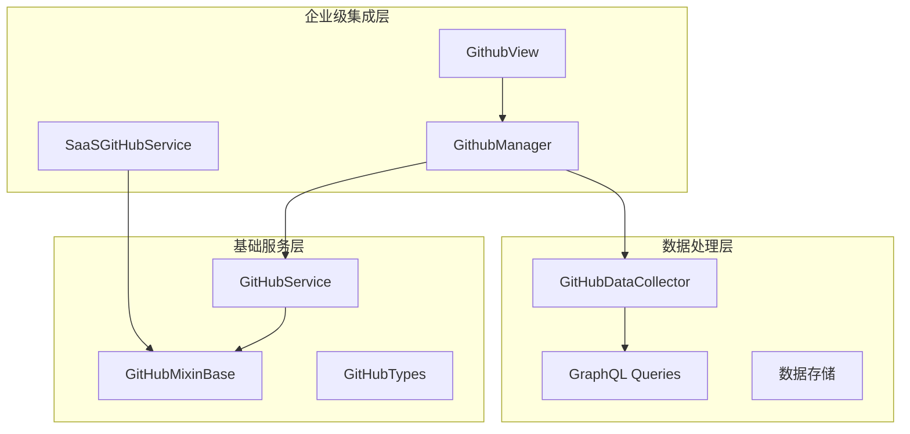

**图表来源**
- [github_service.py](file://enterprise/integrations/github/github_service.py#L13-L144)
- [github_manager.py](file://enterprise/integrations/github/github_manager.py#L38-L345)
- [base.py](file://openhands/integrations/github/service/base.py#L17-L127)

## 核心组件架构

### 三层架构设计

系统采用分层架构，每层负责特定职责：

1. **企业级服务层**：处理用户认证、令牌管理和业务逻辑
2. **基础服务层**：封装GitHub API调用和通用功能
3. **数据处理层**：负责数据收集、存储和查询优化

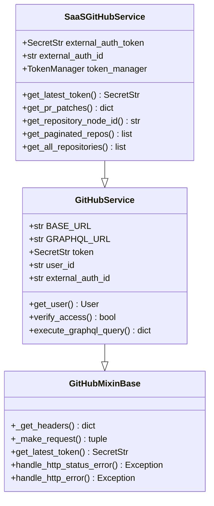

**图表来源**
- [github_service.py](file://enterprise/integrations/github/github_service.py#L13-L144)
- [github_service.py](file://openhands/integrations/github/github_service.py#L21-L79)
- [base.py](file://openhands/integrations/github/service/base.py#L17-L127)

**章节来源**
- [github_service.py](file://enterprise/integrations/github/github_service.py#L1-L144)
- [github_service.py](file://openhands/integrations/github/github_service.py#L1-L79)
- [base.py](file://openhands/integrations/github/service/base.py#L1-L127)

## GitHub API客户端封装

### SaaSGitHubService核心功能

SaaSGitHubService是企业级GitHub服务的核心实现，提供了完整的API封装和高级功能：

#### 认证与令牌管理

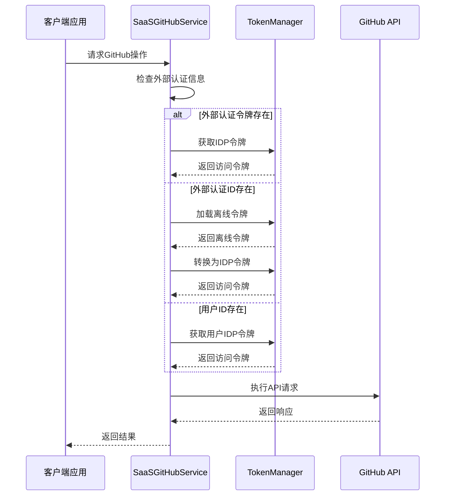

**图表来源**
- [github_service.py](file://enterprise/integrations/github/github_service.py#L39-L73)

#### 分页处理机制

系统实现了智能的分页处理，支持GitHub API的分页限制：

| 参数 | 默认值 | 最大值 | 描述 |
|------|--------|--------|------|
| per_page | 30 | 100 | 每页最大项目数 |
| page | 1 | N/A | 当前页码 |
| total_count | 动态计算 | N/A | 总项目数 |

#### GraphQL查询执行

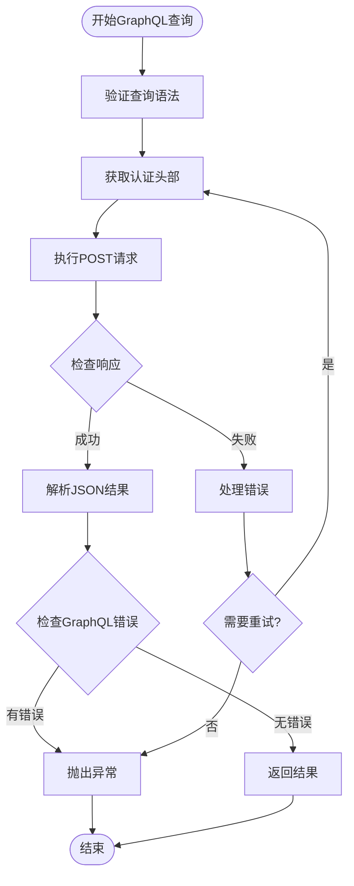

**图表来源**
- [base.py](file://openhands/integrations/github/service/base.py#L83-L108)

**章节来源**
- [github_service.py](file://enterprise/integrations/github/github_service.py#L39-L144)
- [base.py](file://openhands/integrations/github/service/base.py#L40-L108)

## 高级业务逻辑处理

### GithubManager核心业务流程

GithubManager负责处理复杂的GitHub事件和业务逻辑，实现了智能的工作流管理：

#### 事件触发与权限检查

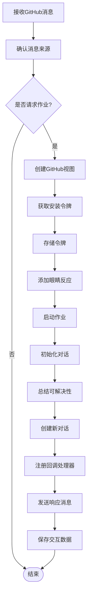

**图表来源**
- [github_manager.py](file://enterprise/integrations/github/github_manager.py#L157-L344)

#### 权限验证机制

系统实现了多层次的权限验证：

| 验证层级 | 检查内容 | 实现方式 |
|----------|----------|----------|
| 用户身份验证 | 用户是否有写入权限 | 检查协作者权限或组织成员身份 |
| 仓库访问控制 | 用户是否可以访问目标仓库 | 验证仓库所有权或协作关系 |
| 操作权限检查 | 特定操作是否允许 | 基于角色和权限级别判断 |

#### 作业启动流程

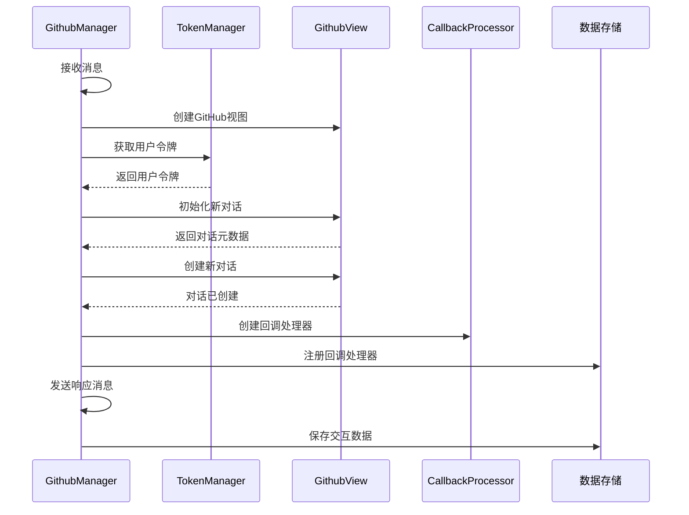

**图表来源**
- [github_manager.py](file://enterprise/integrations/github/github_manager.py#L217-L344)

**章节来源**
- [github_manager.py](file://enterprise/integrations/github/github_manager.py#L38-L344)

## GraphQL查询系统

### 查询架构设计

系统使用GraphQL进行高效的数据查询，支持复杂的数据聚合：

#### PR查询优化

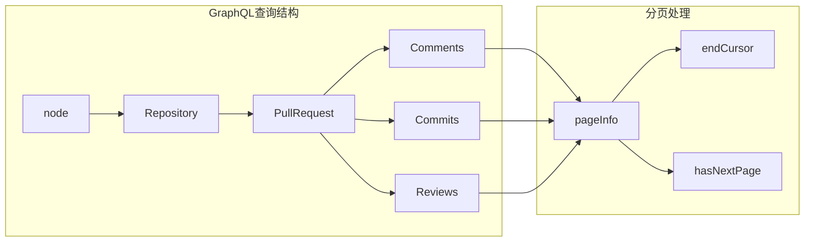

**图表来源**
- [queries.py](file://enterprise/integrations/github/queries.py#L1-L103)

#### 查询变量管理

| 变量名 | 类型 | 必需 | 描述 |
|--------|------|------|------|
| nodeId | ID! | 是 | 仓库节点ID |
| pr_number | Int! | 是 | PR编号 |
| commits_after | String | 否 | 提交分页游标 |
| comments_after | String | 否 | 评论分页游标 |
| reviews_after | String | 否 | 审查分页游标 |

**章节来源**
- [queries.py](file://enterprise/integrations/github/queries.py#L1-L103)

## 数据收集与存储

### GitHubDataCollector核心功能

GitHubDataCollector负责收集和存储GitHub交互数据，支持多种数据类型：

#### 数据收集策略

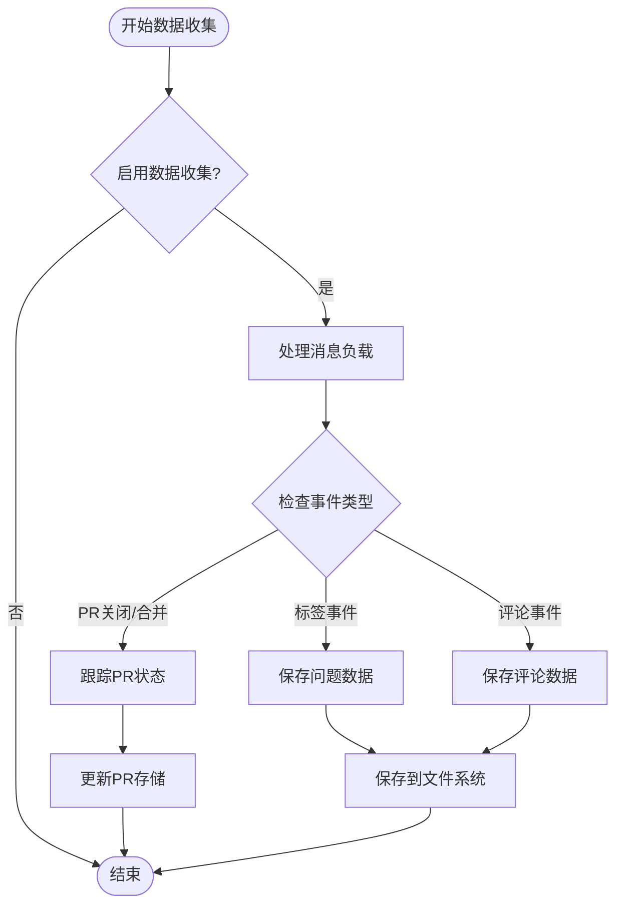

**图表来源**
- [data_collector.py](file://enterprise/integrations/github/data_collector.py#L677-L692)

#### 数据存储格式

系统采用分层存储结构：

| 存储路径 | 数据类型 | 文件格式 | 用途 |
|----------|----------|----------|------|
| github_data/issue-{repo}-{issue}.json | 问题数据 | JSON | 保存问题详情和评论 |
| github_data/pr-{repo}-{pr}.json | PR数据 | JSON | 保存PR元数据和提交信息 |
| prs/github/{repo}-{pr}/data.json | 完整PR数据 | JSON | 包含所有PR相关信息 |

#### 统计数据分析

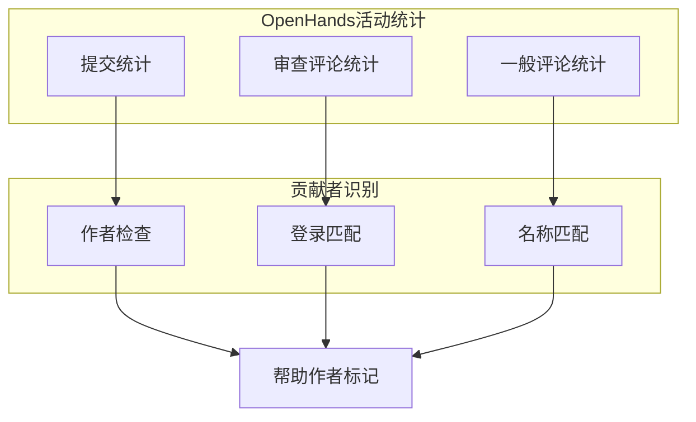

**图表来源**
- [data_collector.py](file://enterprise/integrations/github/data_collector.py#L329-L374)

**章节来源**
- [data_collector.py](file://enterprise/integrations/github/data_collector.py#L45-L692)

## API限制与优化策略

### 分页处理机制

系统实现了智能的分页处理，有效应对GitHub API的限制：

#### 分页算法

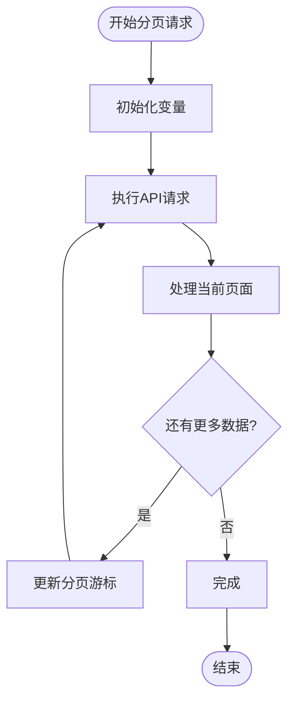

**图表来源**
- [data_collector.py](file://enterprise/integrations/github/data_collector.py#L466-L532)

#### 速率限制处理

| 限制类型 | GitHub标准 | 策略 | 实现方式 |
|----------|------------|------|----------|
| 公共API | 5000次/小时 | 令牌桶算法 | 自动重试机制 |
| 安装令牌 | 15000次/小时 | 动态调整 | 智能调度 |
| GraphQL查询 | 5000次/小时 | 查询优化 | 缓存机制 |

### 批量操作优化

#### 并发处理策略

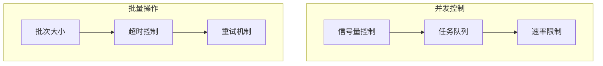

**章节来源**
- [base.py](file://openhands/integrations/github/service/base.py#L40-L81)
- [data_collector.py](file://enterprise/integrations/github/data_collector.py#L466-L532)

## 错误处理与恢复机制

### 异常处理层次

系统实现了多层异常处理机制：

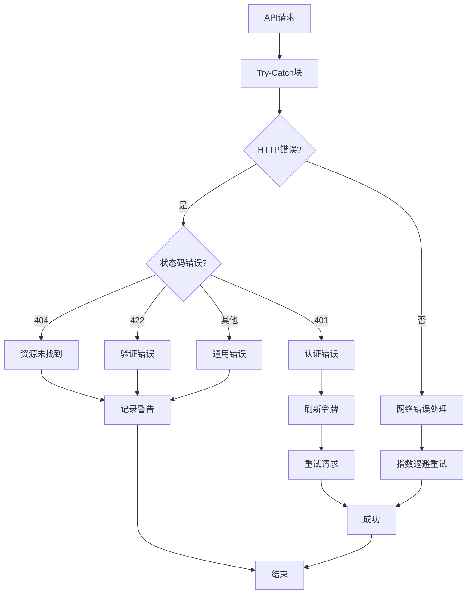

**图表来源**
- [base.py](file://openhands/integrations/github/service/base.py#L78-L81)

### 错误恢复策略

| 错误类型 | 恢复策略 | 重试次数 | 退避时间 |
|----------|----------|----------|----------|
| 认证失败 | 刷新令牌 | 3次 | 1秒 |
| 速率限制 | 等待重试 | 5次 | 指数退避 |
| 网络超时 | 重新连接 | 3次 | 固定间隔 |
| 资源不存在 | 记录日志 | 1次 | 不重试 |

**章节来源**
- [base.py](file://openhands/integrations/github/service/base.py#L78-L81)

## 最佳实践与性能优化

### 性能优化策略

#### 缓存机制

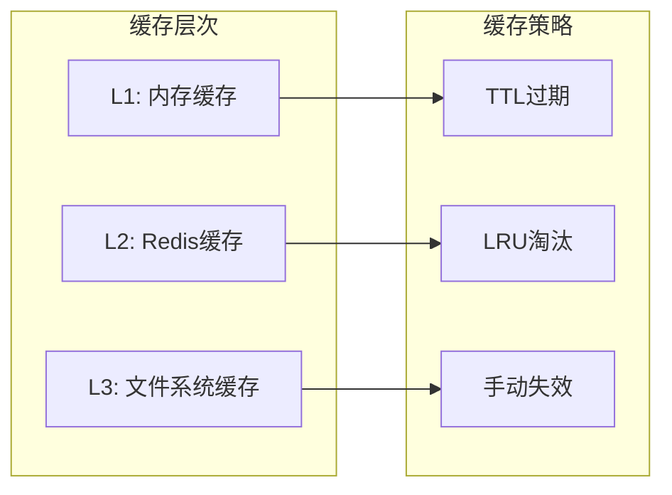

#### 查询优化

| 优化技术 | 应用场景 | 效果 |
|----------|----------|------|
| GraphQL字段选择 | 减少传输数据 | 30-50%减少带宽 |
| 分页批处理 | 大量数据获取 | 避免超时限制 |
| 并发控制 | 高频操作 | 提升吞吐量 |
| 连接池管理 | 长时间运行 | 减少连接开销 |

### 监控与调试

#### 关键指标监控

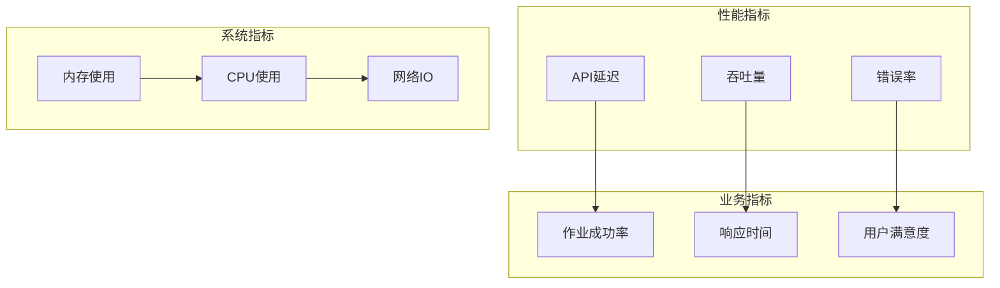

### 安全最佳实践

#### 认证安全

| 安全措施 | 实现方式 | 验证方法 |
|----------|----------|----------|
| 令牌轮换 | 定期刷新 | 自动检测过期 |
| 权限最小化 | 基于角色访问 | RBAC模型 |
| 审计日志 | 操作记录 | 完整性校验 |
| 加密传输 | HTTPS/TLS | 证书验证 |

**章节来源**
- [github_service.py](file://enterprise/integrations/github/github_service.py#L39-L144)
- [github_manager.py](file://enterprise/integrations/github/github_manager.py#L217-L344)

## 结论

OpenHands的GitHub API交互系统通过精心设计的三层架构，实现了高效、可靠、可扩展的GitHub集成解决方案。系统不仅处理了复杂的API限制和错误恢复，还提供了丰富的业务逻辑支持，为自动化代码审查和仓库管理提供了强大的基础设施。

通过模块化的组件设计、智能的缓存策略和完善的错误处理机制，该系统能够稳定地处理大规模的GitHub交互需求，同时保持良好的性能表现。未来的发展方向包括进一步优化GraphQL查询、增强实时数据同步能力，以及扩展对更多GitHub功能的支持。