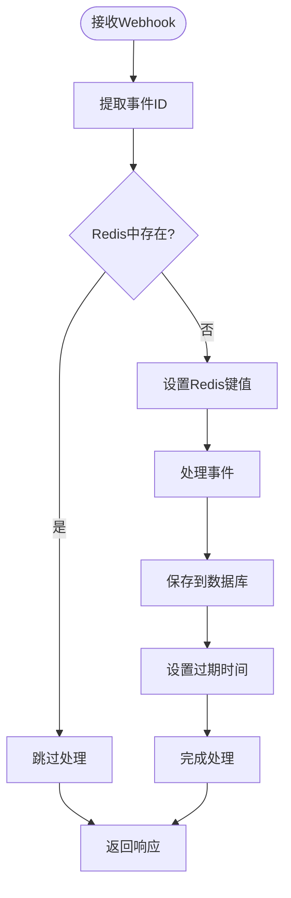

# GitHub集成

<cite>
**本文档引用的文件**
- [github_service.py](file://enterprise/integrations/github/github_service.py)
- [github_manager.py](file://enterprise/integrations/github/github_manager.py)
- [github_types.py](file://enterprise/integrations/github/github_types.py)
- [github_view.py](file://enterprise/integrations/github/github_view.py)
- [data_collector.py](file://enterprise/integrations/github/data_collector.py)
- [github_solvability.py](file://enterprise/integrations/github/github_solvability.py)
- [queries.py](file://enterprise/integrations/github/queries.py)
- [github.py](file://enterprise/server/routes/integration/github.py)
- [github_callback_processor.py](file://enterprise/server/conversation_callback_processor/github_callback_processor.py)
</cite>

## 目录
1. [简介](#简介)
2. [系统架构概览](#系统架构概览)
3. [OAuth认证与令牌管理](#oauth认证与令牌管理)
4. [GitHub服务层](#github服务层)
5. [GitHub管理器](#github管理器)
6. [Webhook处理与事件回调](#webhook处理与事件回调)
7. [工作流与分支保护](#工作流与分支保护)
8. [数据收集与存储](#数据收集与存储)
9. [代码审查与状态更新](#代码审查与状态更新)
10. [性能优化与最佳实践](#性能优化与最佳实践)
11. [故障排除指南](#故障排除指南)
12. [总结](#总结)

## 简介

OpenHands的GitHub集成功合成了一个完整的AI驱动的代码协作平台，通过OAuth认证、Webhook处理、智能工作流管理和自动化代码审查等功能，为开发者提供了强大的GitHub集成能力。该系统支持企业级部署，提供安全的令牌管理、可扩展的事件处理和智能化的代码分析功能。

## 系统架构概览

GitHub集成采用分层架构设计，包含以下核心组件：

**图表来源**
- [github_manager.py](file://enterprise/integrations/github/github_manager.py#L38-L50)
- [github_service.py](file://enterprise/integrations/github/github_service.py#L13-L33)
- [github.py](file://enterprise/server/routes/integration/github.py#L20-L23)

## OAuth认证与令牌管理

### 认证流程架构

系统实现了多层级的OAuth认证机制，支持多种令牌获取方式：

**图表来源**
- [github_service.py](file://enterprise/integrations/github/github_service.py#L39-L73)
- [token_manager.py](file://enterprise/server/auth/token_manager.py#L324-L372)

### 令牌获取策略

系统支持三种主要的令牌获取策略：

| 策略类型 | 描述 | 使用场景 | 安全级别 |
|---------|------|----------|----------|
| 外部认证令牌 | 从身份提供商获取的访问令牌 | 企业环境，统一认证 | 高 |
| 离线令牌 | 长期有效的刷新令牌 | 自动化任务，后台操作 | 中 |
| 用户ID令牌 | 基于用户ID的令牌映射 | 标准用户操作 | 中 |

**章节来源**
- [github_service.py](file://enterprise/integrations/github/github_service.py#L39-L73)

### 令牌刷新机制

系统实现了自动化的令牌刷新机制，确保长期稳定的API访问：

**图表来源**
- [token_manager.py](file://enterprise/server/auth/token_manager.py#L324-L372)

**章节来源**
- [token_manager.py](file://enterprise/server/auth/token_manager.py#L324-L372)

## GitHub服务层

### SaaSGitHubService架构

SaaSGitHubService是企业级GitHub集成的核心服务类，继承自基础GitHubService并扩展了企业级功能：

**图表来源**
- [github_service.py](file://enterprise/integrations/github/github_service.py#L13-L33)
- [github_service.py](file://enterprise/integrations/github/github_service.py#L35-L73)

### API交互模式

系统支持多种GitHub API交互模式，包括仓库访问、拉取请求管理和代码审查：

| API类型 | 方法 | 功能描述 | 使用场景 |
|---------|------|----------|----------|
| 仓库管理 | `get_repository_node_id()` | 获取仓库GraphQL节点ID | 数据迁移，GraphQL查询 |
| 拉取请求 | `get_pr_patches()` | 获取PR变更补丁 | 差异分析，代码审查 |
| 分页查询 | `get_paginated_repos()` | 分页获取仓库列表 | 性能优化，大数据集处理 |
| 全量获取 | `get_all_repositories()` | 获取所有可用仓库 | 初始化，完整同步 |

**章节来源**
- [github_service.py](file://enterprise/integrations/github/github_service.py#L75-L144)

### GraphQL查询优化

系统使用GraphQL进行高效的数据查询，特别是针对大型仓库的复杂查询：

**图表来源**
- [queries.py](file://enterprise/integrations/github/queries.py#L1-L103)
- [data_collector.py](file://enterprise/integrations/github/data_collector.py#L467-L530)

**章节来源**
- [queries.py](file://enterprise/integrations/github/queries.py#L1-L103)
- [data_collector.py](file://enterprise/integrations/github/data_collector.py#L467-L530)

## GitHub管理器

### 核心功能架构

GithubManager是GitHub集成的核心协调器，负责处理各种GitHub事件和工作流：

**图表来源**
- [github_manager.py](file://enterprise/integrations/github/github_manager.py#L38-L50)

### 事件处理流程

系统实现了智能的事件过滤和处理机制：

**图表来源**
- [github_manager.py](file://enterprise/integrations/github/github_manager.py#L121-L184)

### 权限验证机制

系统实现了细粒度的权限验证，确保只有授权用户才能触发特定操作：

| 权限类型 | 验证方法 | 检查范围 | 失败处理 |
|---------|----------|----------|----------|
| 协作者权限 | `get_collaborator_permission()` | 仓库级别的写入权限 | 跳过处理 |
| 组织成员 | `organization.get_members()` | 组织级别的访问权限 | 回退到协作者检查 |
| 写入权限 | 检查权限字符串 | 具体的操作权限 | 记录警告日志 |

**章节来源**
- [github_manager.py](file://enterprise/integrations/github/github_manager.py#L95-L119)

## Webhook处理与事件回调

### Webhook安全验证

系统实现了严格的Webhook签名验证机制，确保请求来源的安全性：

**图表来源**
- [github.py](file://enterprise/server/routes/integration/github.py#L26-L43)
- [github.py](file://enterprise/server/routes/integration/github.py#L45-L83)

### 重复事件防护

系统使用Redis进行重复事件检测，防止相同事件被多次处理：

**图表来源**
- [github.py](file://enterprise/server/routes/integration/github.py#L60-L75)

### 支持的事件类型

系统支持多种GitHub事件类型的处理：

| 事件类型 | 触发条件 | 处理方式 | 业务逻辑 |
|---------|----------|----------|----------|
| 标签事件 | issue添加openhands标签 | 创建对话任务 | 启动问题解决流程 |
| 评论事件 | 包含@openhands宏的评论 | 解析触发内容 | 执行相应操作 |
| 拉取请求评论 | PR中的@openhands评论 | 代码审查上下文 | 智能代码审查 |
| 内联评论 | 文件内的具体行评论 | 精确定位修复 | 局部代码修改 |
| 工作流完成 | CI/CD工作流状态变化 | 主动发起对话 | 自动问题修复 |

**章节来源**
- [github_view.py](file://enterprise/integrations/github/github_view.py#L431-L498)

## 工作流与分支保护

### 分支保护规则检测

系统能够检测和处理GitHub的分支保护规则：

**图表来源**
- [branches_prs.py](file://openhands/integrations/github/service/branches_prs.py#L135-L161)

### 合并策略处理

系统支持多种合并策略的智能处理：

| 合并策略 | 处理方式 | 适用场景 | 注意事项 |
|---------|----------|----------|----------|
| 禁用合并 | 检测冲突并报告 | 分支保护严格时 | 需要手动解决 |
| 变基合并 | 自动变基到目标分支 | 保持线性历史 | 可能产生冲突 |
| 合并提交 | 创建合并提交 | 简单的合并操作 | 保留完整的提交历史 |
| 强制推送 | 覆盖远程分支 | 紧急修复场景 | 需谨慎使用 |

**章节来源**
- [branches_prs.py](file://openhands/integrations/github/service/branches_prs.py#L135-L161)

## 数据收集与存储

### 数据收集架构

GitHubDataCollector负责收集和存储GitHub交互数据，支持多种数据格式和存储位置：

**图表来源**
- [data_collector.py](file://enterprise/integrations/github/data_collector.py#L45-L90)

### 数据存储格式

系统支持多种数据存储格式，适应不同的使用场景：

| 存储类型 | 格式 | 用途 | 特点 |
|---------|------|------|------|
| JSON文件 | 结构化数据 | 长期归档 | 易于阅读和调试 |
| 数据库表 | 关系型数据 | 快速查询 | 支持复杂查询 |
| 缓存键值 | 序列化数据 | 性能优化 | 高速访问 |

**章节来源**
- [data_collector.py](file://enterprise/integrations/github/data_collector.py#L45-L90)

### PR数据分析

系统对拉取请求进行全面的数据分析，包括贡献统计和质量评估：

**图表来源**
- [data_collector.py](file://enterprise/integrations/github/data_collector.py#L329-L375)

**章节来源**
- [data_collector.py](file://enterprise/integrations/github/data_collector.py#L329-L375)

## 代码审查与状态更新

### 智能代码审查

系统实现了基于AI的智能代码审查功能：

**图表来源**
- [github_solvability.py](file://enterprise/integrations/github/github_solvability.py#L63-L184)

### 状态更新机制

系统能够自动更新GitHub的状态和标签：

| 状态类型 | 更新时机 | 更新内容 | 影响范围 |
|---------|----------|----------|----------|
| 检查状态 | 代码变更时 | 运行状态、覆盖率等 | CI/CD流程 |
| 标签管理 | 问题分类时 | 自动添加/移除标签 | 问题跟踪 |
| 里程碑 | 任务完成时 | 更新里程碑进度 | 项目规划 |
| 优先级 | 人工调整时 | 修改优先级标签 | 任务排序 |

**章节来源**
- [github_solvability.py](file://enterprise/integrations/github/github_solvability.py#L63-L184)

## 性能优化与最佳实践

### 缓存策略

系统实现了多层次的缓存策略以提高性能：

### 并发处理优化

系统采用异步并发处理提升吞吐量：

| 优化技术 | 实现方式 | 性能提升 | 使用场景 |
|---------|----------|----------|----------|
| 异步处理 | asyncio | 3-5倍 | I/O密集操作 |
| 连接池 | httpx连接池 | 2-3倍 | API调用 |
| 批量操作 | 分批处理 | 5-10倍 | 大数据集处理 |
| 流水线 | 并行处理 | 4-8倍 | 多步骤工作流 |

### 错误处理与重试

系统实现了完善的错误处理和重试机制：

## 故障排除指南

### 常见问题诊断

| 问题类型 | 症状 | 可能原因 | 解决方案 |
|---------|------|----------|----------|
| 认证失败 | 401/403错误 | 令牌过期或无效 | 刷新令牌或重新授权 |
| Webhook不工作 | 事件未被处理 | 签名验证失败 | 检查Webhook密钥配置 |
| 性能问题 | 响应缓慢 | API限制或网络延迟 | 启用缓存和连接池 |
| 数据丢失 | 事件重复处理 | Redis配置问题 | 检查Redis连接和配置 |

### 日志分析

系统提供了详细的日志记录用于问题诊断：

### 配置检查清单

在部署和维护过程中，建议检查以下配置项：

- [ ] GitHub应用配置（客户端ID、私钥）
- [ ] Webhook密钥配置
- [ ] Redis连接配置
- [ ] API速率限制设置
- [ ] 缓存过期时间配置
- [ ] 日志级别和输出路径
- [ ] 数据库连接配置
- [ ] 令牌刷新间隔设置

## 总结

OpenHands的GitHub集成功合成了一个功能完备的企业级代码协作平台。通过OAuth认证、智能Webhook处理、自动化工作流管理和AI驱动的代码审查，系统为开发者提供了强大的GitHub集成能力。

### 核心优势

1. **安全性**：多层级的认证机制和严格的权限控制
2. **可扩展性**：模块化的架构设计支持功能扩展
3. **性能**：异步处理和智能缓存提升系统性能
4. **可靠性**：完善的错误处理和重试机制
5. **智能化**：AI驱动的代码分析和问题解决

### 技术特色

- **GraphQL优化**：高效的API查询和数据获取
- **事件驱动**：实时的Webhook处理和响应
- **智能分析**：基于LLM的问题可解决性分析
- **数据驱动**：全面的数据收集和分析能力

该集成系统不仅满足了当前的业务需求，还为未来的功能扩展和技术演进奠定了坚实的基础。通过持续的优化和改进，系统将继续为开发者提供更加智能和高效的GitHub集成体验。