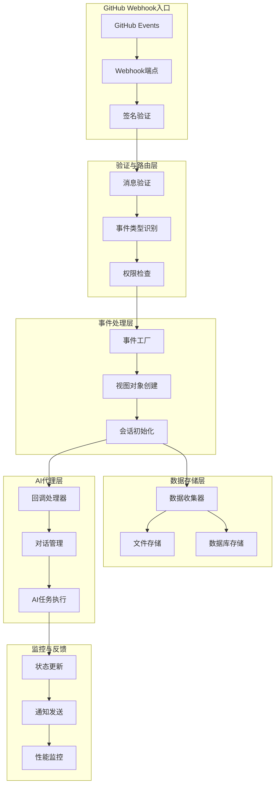
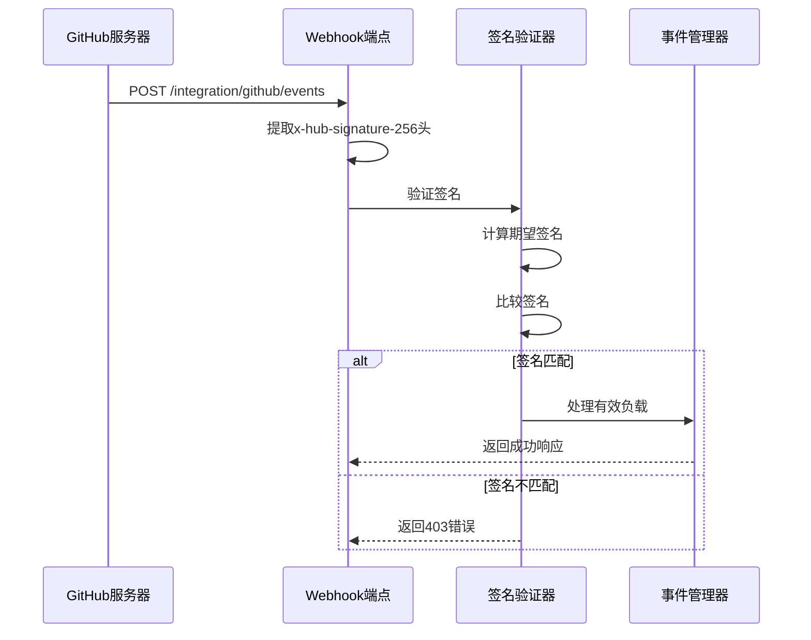
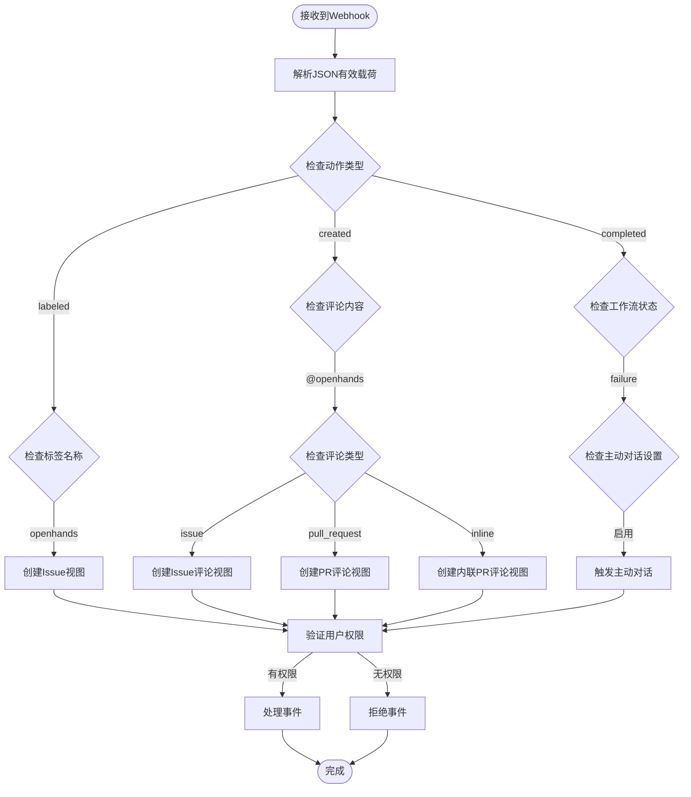
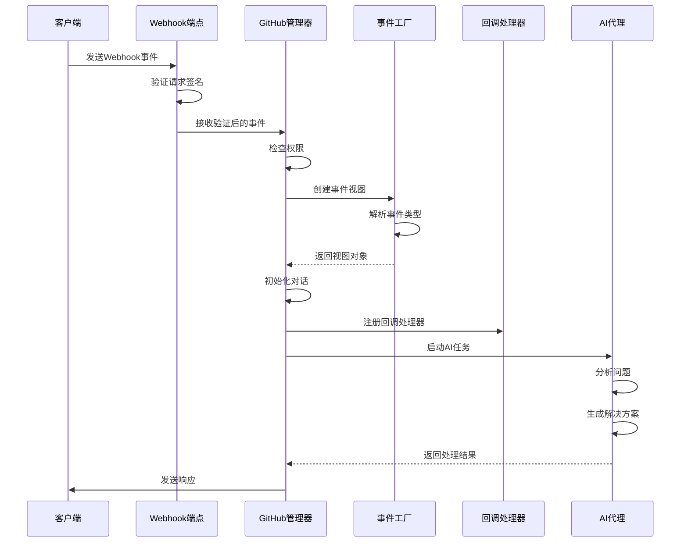
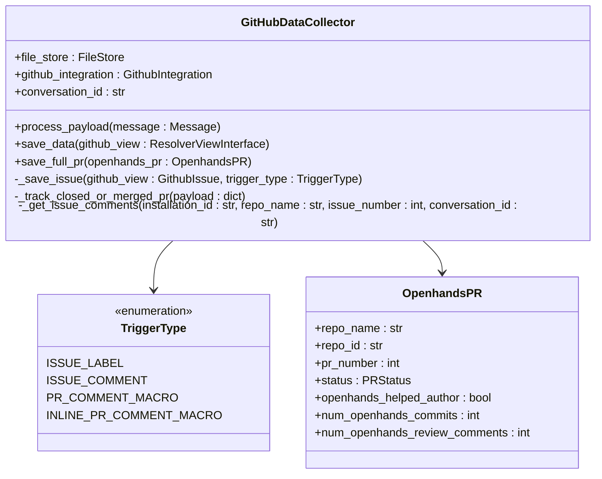
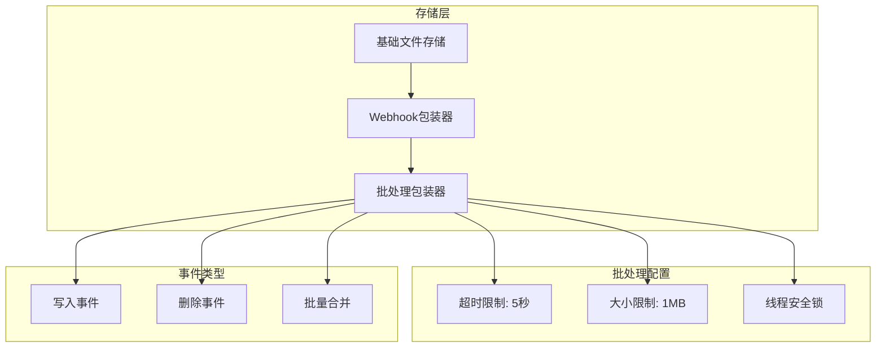
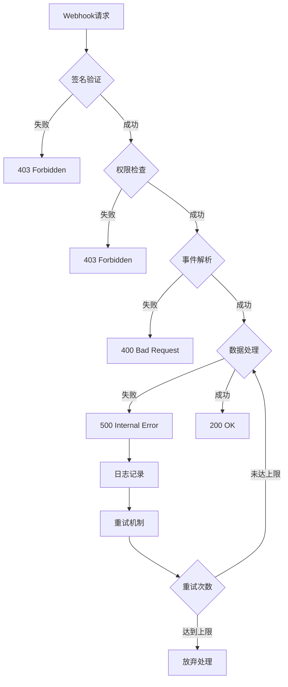

# Webhook事件处理与回调机制

<cite>
**本文档引用的文件**
- [github.py](file://enterprise/server/routes/integration/github.py)
- [github_view.py](file://enterprise/integrations/github/github_view.py)
- [github_service.py](file://enterprise/integrations/github/github_service.py)
- [github_types.py](file://enterprise/integrations/github/github_types.py)
- [github_manager.py](file://enterprise/integrations/github/github_manager.py)
- [data_collector.py](file://enterprise/integrations/github/data_collector.py)
- [event_webhook.py](file://enterprise/server/routes/event_webhook.py)
- [web_hook.py](file://openhands/storage/web_hook.py)
- [batched_web_hook.py](file://openhands/storage/batched_web_hook.py)
</cite>

## 目录
1. [简介](#简介)
2. [系统架构概览](#系统架构概览)
3. [Webhook端点验证机制](#webhook端点验证机制)
4. [事件类型识别与路由](#事件类型识别与路由)
5. [事件处理流水线](#事件处理流水线)
6. [数据存储与批处理](#数据存储与批处理)
7. [错误处理与重试策略](#错误处理与重试策略)
8. [实际使用示例](#实际使用示例)
9. [配置与管理](#配置与管理)
10. [故障排除指南](#故障排除指南)

## 简介

OpenHands的GitHub Webhook集成系统是一个复杂而强大的事件驱动架构，负责接收、验证、解析和处理来自GitHub的各种事件。该系统支持多种事件类型，包括issue标签、评论、pull request操作等，并能够自动触发AI代理进行问题解决和代码审查。

### 核心功能特性

- **多层签名验证**：确保Webhook请求的真实性和安全性
- **智能事件分类**：自动识别和路由不同类型的GitHub事件
- **异步事件处理**：支持高并发事件处理和后台任务执行
- **数据持久化**：完整的事件数据存储和历史追踪
- **批处理优化**：高效的批量数据传输和存储机制
- **错误恢复**：完善的异常处理和重试机制

## 系统架构概览



**图表来源**
- [github.py](file://enterprise/server/routes/integration/github.py#L45-L83)
- [github_manager.py](file://enterprise/integrations/github/github_manager.py#L38-L345)

## Webhook端点验证机制

### 请求签名验证

系统采用GitHub官方推荐的SHA256 HMAC签名验证机制，确保Webhook请求的完整性和真实性。



**图表来源**
- [github.py](file://enterprise/server/routes/integration/github.py#L26-L42)

### 验证流程详解

1. **头部提取**：从HTTP请求中提取`x-hub-signature-256`头部
2. **签名计算**：使用预配置的Webhook密钥计算期望签名
3. **安全比较**：使用时间安全的字符串比较函数验证签名
4. **错误处理**：对无效签名返回适当的HTTP状态码

**章节来源**
- [github.py](file://enterprise/server/routes/integration/github.py#L26-L42)

## 事件类型识别与路由

### 支持的事件类型

系统能够识别和处理以下主要的GitHub事件类型：

| 事件类型 | 触发条件 | 处理方式 | 权限要求 |
|---------|---------|---------|---------|
| `issues.labeled` | issue添加openhands标签 | 创建新对话 | 写入权限 |
| `issue_comment.created` | issue评论包含@openhands | 回复评论 | 写入权限 |
| `pull_request_comment.created` | PR评论包含@openhands | 回复评论 | 写入权限 |
| `pull_request_review_comment.created` | 内联PR评论包含@openhands | 回复评论 | 写入权限 |
| `workflow_run.completed` | 工作流完成且失败 | 主动发起对话 | 写入权限 |

### 事件识别算法



**图表来源**
- [github_view.py](file://enterprise/integrations/github/github_view.py#L431-L756)
- [github_manager.py](file://enterprise/integrations/github/github_manager.py#L121-L155)

### 权限验证机制

系统实现了多层次的权限验证：

1. **安装级权限**：验证GitHub应用的安装权限
2. **仓库级权限**：检查用户在目标仓库中的权限级别
3. **分支级权限**：验证对特定分支的操作权限
4. **用户级权限**：确认用户的最终操作权限

**章节来源**
- [github_manager.py](file://enterprise/integrations/github/github_manager.py#L95-L119)

## 事件处理流水线

### 完整处理流程



**图表来源**
- [github_manager.py](file://enterprise/integrations/github/github_manager.py#L157-L345)

### 数据收集与存储

系统通过专门的数据收集器记录所有交互事件：



**图表来源**
- [data_collector.py](file://enterprise/integrations/github/data_collector.py#L45-L693)

**章节来源**
- [data_collector.py](file://enterprise/integrations/github/data_collector.py#L677-L693)

## 数据存储与批处理

### 文件存储架构

系统采用分层的文件存储架构，支持实时写入和批量处理：



**图表来源**
- [batched_web_hook.py](file://openhands/storage/batched_web_hook.py#L17-L269)
- [web_hook.py](file://openhands/storage/web_hook.py#L9-L120)

### 批处理优化策略

1. **时间窗口聚合**：在5秒的时间窗口内聚合多个事件
2. **大小限制控制**：当批次达到1MB时立即发送
3. **内存管理**：使用线程安全的数据结构
4. **异步处理**：所有网络请求都在后台线程中执行

**章节来源**
- [batched_web_hook.py](file://openhands/storage/batched_web_hook.py#L127-L269)

## 错误处理与重试策略

### 异常处理层次



**图表来源**
- [github.py](file://enterprise/server/routes/integration/github.py#L45-L83)

### 重试机制实现

系统在多个层面实现了重试机制：

1. **HTTP客户端重试**：使用tenacity库实现指数退避重试
2. **数据库连接重试**：自动重连数据库连接
3. **文件系统重试**：处理临时文件系统错误
4. **网络请求重试**：对网络不稳定情况的容错处理

**章节来源**
- [web_hook.py](file://openhands/storage/web_hook.py#L82-L120)
- [batched_web_hook.py](file://openhands/storage/batched_web_hook.py#L216-L262)

## 实际使用示例

### 基本Webhook配置

```bash
# 设置环境变量
export GITHUB_APP_WEBHOOK_SECRET="your_webhook_secret_here"
export GITHUB_WEBHOOKS_ENABLED="true"

# Webhook URL格式
https://your-domain.com/integration/github/events
```

### 支持的GitHub事件有效载荷示例

#### Issue标签事件
```json
{
  "action": "labeled",
  "issue": {
    "number": 123,
    "title": "Bug: 登录页面无法加载",
    "body": "用户报告登录页面无法正常加载..."
  },
  "label": {
    "name": "openhands"
  },
  "repository": {
    "id": 123456789,
    "name": "my-repo",
    "full_name": "user/my-repo"
  },
  "installation": {
    "id": 987654321
  }
}
```

#### Issue评论事件
```json
{
  "action": "created",
  "comment": {
    "id": 987654321,
    "body": "这个问题看起来很严重，请@openhands帮忙看看"
  },
  "issue": {
    "number": 123,
    "title": "性能问题"
  },
  "repository": {
    "id": 123456789,
    "name": "my-repo"
  },
  "sender": {
    "login": "user123"
  }
}
```

#### Pull Request事件
```json
{
  "action": "opened",
  "pull_request": {
    "number": 456,
    "title": "修复登录认证问题",
    "body": "此PR解决了登录认证失败的问题...",
    "head": {
      "ref": "feature/login-fix"
    }
  },
  "repository": {
    "id": 123456789,
    "name": "my-repo"
  }
}
```

### 系统响应行为

当接收到有效的Webhook事件时，系统会：

1. **立即响应**：返回HTTP 200状态码确认接收
2. **后台处理**：在后台线程中处理事件
3. **权限验证**：检查用户权限和仓库访问权限
4. **对话启动**：为符合条件的事件启动AI对话
5. **状态跟踪**：记录事件处理状态和结果

**章节来源**
- [github.py](file://enterprise/server/routes/integration/github.py#L45-L83)

## 配置与管理

### 环境变量配置

| 变量名 | 描述 | 默认值 | 示例 |
|-------|------|--------|------|
| `GITHUB_APP_WEBHOOK_SECRET` | GitHub应用Webhook密钥 | 必需 | `ghp_xxxxxxxxxxxx` |
| `GITHUB_WEBHOOKS_ENABLED` | 是否启用GitHub Webhooks | `true` | `true` |
| `OPENHANDS_GITHUB_SERVICE_CLS` | 自定义GitHub服务类 | `GitHubService` | `CustomGitHubService` |

### GitHub应用配置

1. **Webhook URL**：`https://your-domain.com/integration/github/events`
2. **内容类型**：`application/json`
3. **密钥**：使用环境变量中的`GITHUB_APP_WEBHOOK_SECRET`
4. **事件选择**：
   - Issues
   - Pull Requests
   - Workflows
   - Issue Comments
   - Pull Request Comments

### 监控和日志

系统提供了详细的日志记录和监控功能：

- **请求日志**：记录所有Webhook请求的详细信息
- **错误日志**：记录处理过程中的所有错误和异常
- **性能指标**：监控处理延迟和成功率
- **审计日志**：记录所有用户操作和系统决策

**章节来源**
- [github.py](file://enterprise/server/routes/integration/github.py#L15-L25)

## 故障排除指南

### 常见问题及解决方案

#### 1. 签名验证失败

**症状**：收到403错误，提示"Request signatures didn't match!"

**原因**：
- Webhook密钥配置错误
- 请求被中间人篡改
- 时间同步问题

**解决方案**：
```bash
# 检查环境变量
echo $GITHUB_APP_WEBHOOK_SECRET

# 验证密钥正确性
python -c "
import hmac, hashlib
secret = 'your_webhook_secret'
payload = b'test_payload'
signature = 'sha256=' + hmac.new(secret.encode(), payload, hashlib.sha256).hexdigest()
print(signature)
"
```

#### 2. 权限不足错误

**症状**：事件被拒绝，提示权限不足

**原因**：
- 用户不在仓库协作者列表中
- GitHub应用权限范围不足
- 仓库私有且未授权

**解决方案**：
1. 检查用户在仓库中的权限级别
2. 验证GitHub应用的安装状态
3. 确认仓库的可见性设置

#### 3. 事件处理延迟

**症状**：Webhook响应时间过长

**原因**：
- 网络连接不稳定
- 数据库连接问题
- AI服务响应慢

**解决方案**：
1. 检查网络连接质量
2. 监控数据库性能指标
3. 调整AI服务超时设置

#### 4. 数据丢失或重复

**症状**：事件数据不一致或重复处理

**原因**：
- 并发处理冲突
- 数据库事务问题
- 缓存一致性问题

**解决方案**：
1. 使用分布式锁机制
2. 实现幂等性处理
3. 启用数据完整性检查

### 调试工具和技巧

#### 启用详细日志
```bash
# 设置日志级别
export LOG_LEVEL=DEBUG

# 查看Webhook处理日志
tail -f /var/log/your-application.log | grep "GitHub"
```

#### 测试Webhook配置
```bash
# 使用curl测试Webhook端点
curl -X POST \
  https://your-domain.com/integration/github/events \
  -H "Content-Type: application/json" \
  -H "x-hub-signature-256: sha256=..." \
  -d @test-payload.json
```

#### 性能监控
```bash
# 监控Webhook处理性能
htop
iotop
netstat -tulpn | grep :8000
```

**章节来源**
- [github.py](file://enterprise/server/routes/integration/github.py#L75-L83)

## 结论

OpenHands的GitHub Webhook集成系统提供了一个完整、可靠且可扩展的事件处理解决方案。通过多层验证、智能路由、异步处理和完善的错误恢复机制，该系统能够高效地处理各种GitHub事件，并自动触发相应的AI代理任务。

系统的模块化设计使得它易于维护和扩展，同时提供了丰富的配置选项和监控功能，确保了生产环境中的稳定运行。无论是简单的issue标签还是复杂的pull request审查，该系统都能够提供及时、准确的响应和服务。