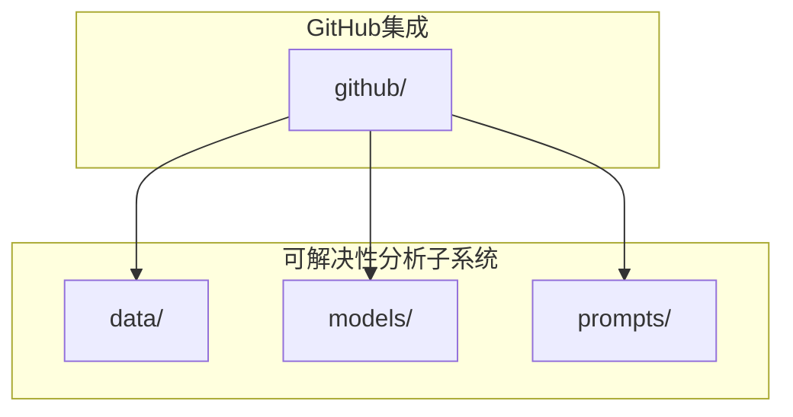
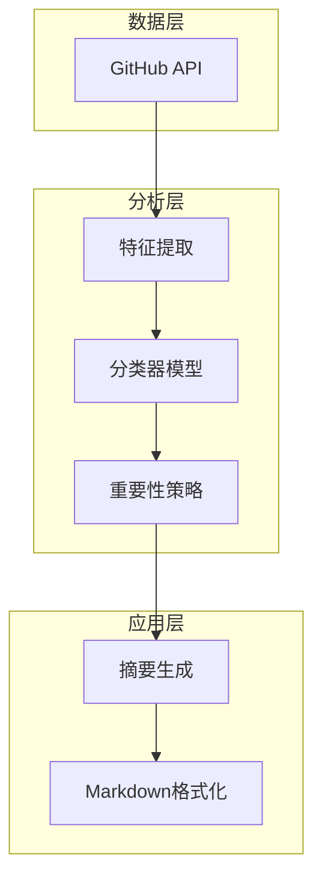
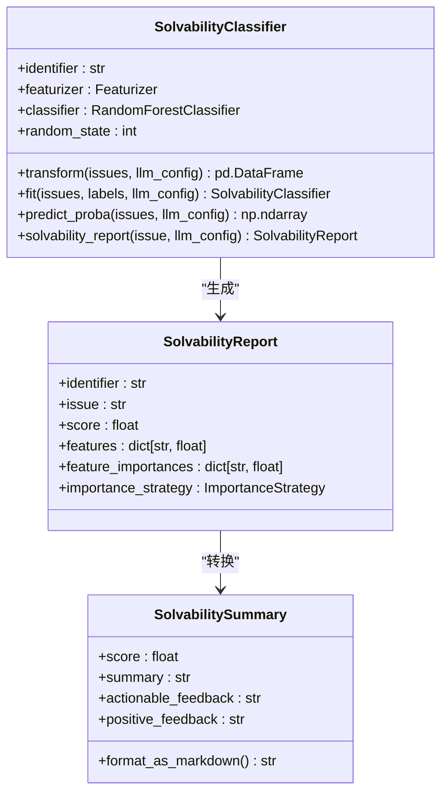
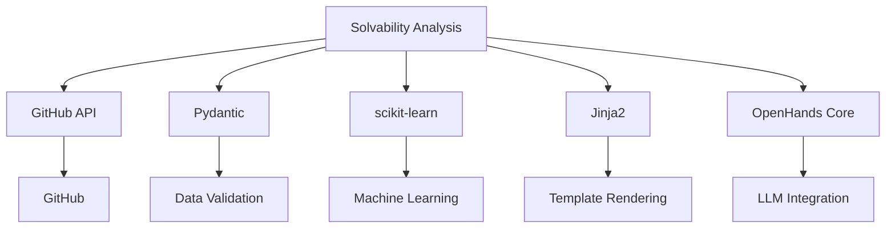

# 可解决性分析集成

<cite>
**本文档中引用的文件**  
- [github_solvability.py](file://enterprise/integrations/github/github_solvability.py)
- [github_view.py](file://enterprise/integrations/github/github_view.py)
- [report.py](file://enterprise/integrations/solvability/models/report.py)
- [summary.py](file://enterprise/integrations/solvability/models/summary.py)
- [data/__init__.py](file://enterprise/integrations/solvability/data/__init__.py)
- [importance_strategy.py](file://enterprise/integrations/solvability/models/importance_strategy.py)
- [difficulty_level.py](file://enterprise/integrations/solvability/models/difficulty_level.py)
- [prompts/__init__.py](file://enterprise/integrations/solvability/prompts/__init__.py)
</cite>

## 目录
1. [简介](#简介)
2. [项目结构](#项目结构)
3. [核心组件](#核心组件)
4. [架构概述](#架构概述)
5. [详细组件分析](#详细组件分析)
6. [依赖分析](#依赖分析)
7. [性能考量](#性能考量)
8. [故障排除指南](#故障排除指南)
9. [结论](#结论)

## 简介
本文档详细说明了GitHub问题可解决性分析的集成实现。该系统通过分析GitHub问题和拉取请求的特征，评估其可解决性，并为开发人员提供反馈。系统实现了基于机器学习的分类器模型，结合提示工程生成人类可读的摘要，帮助优化任务分配和资源规划。

## 项目结构
可解决性分析功能主要位于enterprise/integrations/solvability目录下，与GitHub集成模块紧密协作。系统采用模块化设计，将特征提取、分类、摘要生成等功能分离，便于维护和扩展。



**Diagram sources**
- [data/__init__.py](file://enterprise/integrations/solvability/data/__init__.py)
- [models/report.py](file://enterprise/integrations/solvability/models/report.py)

**Section sources**
- [github_solvability.py](file://enterprise/integrations/github/github_solvability.py)
- [data/__init__.py](file://enterprise/integrations/solvability/data/__init__.py)

## 核心组件
可解决性分析系统的核心组件包括问题特征提取器、随机森林分类器、摘要生成器和重要性策略。这些组件协同工作，从GitHub问题中提取特征，预测可解决性，并生成易于理解的反馈。

**Section sources**
- [github_solvability.py](file://enterprise/integrations/github/github_solvability.py)
- [report.py](file://enterprise/integrations/solvability/models/report.py)

## 架构概述
可解决性分析系统采用分层架构，从数据采集到结果呈现分为多个层次。系统首先通过GitHub API获取问题上下文，然后使用预训练的分类器模型进行分析，最后通过提示工程生成人类可读的摘要。



**Diagram sources**
- [github_solvability.py](file://enterprise/integrations/github/github_solvability.py)
- [summary.py](file://enterprise/integrations/solvability/models/summary.py)

## 详细组件分析

### 问题特征提取与可解决性评估
系统通过fetch_github_issue_context函数收集GitHub问题的完整上下文，包括标题、描述、标签和评论。这些信息被用作可解决性分析的输入，确保评估基于全面的问题信息。

**Section sources**
- [github_solvability.py](file://enterprise/integrations/github/github_solvability.py#L26-L60)
- [github_view.py](file://enterprise/integrations/github/github_view.py#L84-L757)

### 分类器模型与提示工程集成
系统通过load_classifier函数加载预训练的分类器模型，并结合提示工程生成可解决性摘要。分类器模型基于随机森林算法，通过特征重要性分析提供可解释的预测结果。

#### 分类器模型集成


**Diagram sources**
- [data/__init__.py](file://enterprise/integrations/solvability/data/__init__.py#L13-L31)
- [report.py](file://enterprise/integrations/solvability/models/report.py#L8-L88)

### 可解决性摘要生成
系统使用SolvabilitySummary类将分类器的输出转换为人类可读的Markdown格式摘要。摘要包含可解决性评分、执行摘要、可操作反馈和正面反馈，帮助开发人员理解问题的可解决性。

#### 摘要生成流程
```mermaid
flowchart TD
Start([开始]) --> LoadClassifier["加载分类器模型"]
LoadClassifier --> FetchContext["获取GitHub问题上下文"]
FetchContext --> GenerateReport["生成可解决性报告"]
GenerateReport --> CreateSummary["创建摘要对象"]
CreateSummary --> FormatMarkdown["格式化为Markdown"]
FormatMarkdown --> End([结束])
Note over FormatMarkdown,End: 摘要包含难度级别<br/>可操作反馈和正面反馈
```

**Diagram sources**
- [summary.py](file://enterprise/integrations/solvability/models/summary.py#L15-L173)
- [difficulty_level.py](file://enterprise/integrations/solvability/models/difficulty_level.py#L6-L38)

## 依赖分析
可解决性分析系统依赖于多个关键组件，包括GitHub API客户端、机器学习库和模板引擎。这些依赖关系确保了系统的功能完整性和可扩展性。



**Diagram sources**
- [github_solvability.py](file://enterprise/integrations/github/github_solvability.py)
- [models/report.py](file://enterprise/integrations/solvability/models/report.py)

**Section sources**
- [github_solvability.py](file://enterprise/integrations/github/github_solvability.py#L1-L184)
- [data/__init__.py](file://enterprise/integrations/solvability/data/__init__.py#L1-L42)

## 性能考量
可解决性分析系统在设计时考虑了性能因素，包括API调用超时、缓存机制和异步处理。系统使用asyncio.timeout装饰器确保分析操作在指定时间内完成，避免阻塞其他任务。

**Section sources**
- [github_solvability.py](file://enterprise/integrations/github/github_solvability.py#L63-L184)
- [summary.py](file://enterprise/integrations/solvability/models/summary.py#L122-L152)

## 故障排除指南
当可解决性分析功能出现问题时，可以检查以下常见问题：用户设置中是否启用了可解决性分析功能、LLM配置是否正确、GitHub API令牌是否有效。系统日志提供了详细的执行信息，有助于诊断问题。

**Section sources**
- [github_solvability.py](file://enterprise/integrations/github/github_solvability.py#L82-L109)
- [github_view.py](file://enterprise/integrations/github/github_view.py#L46-L77)

## 结论
可解决性分析系统为GitHub问题管理提供了有价值的洞察，帮助团队优先处理可解决的问题，优化资源分配。通过机器学习和提示工程的结合，系统不仅提供了预测结果，还生成了可操作的反馈，提升了开发效率。