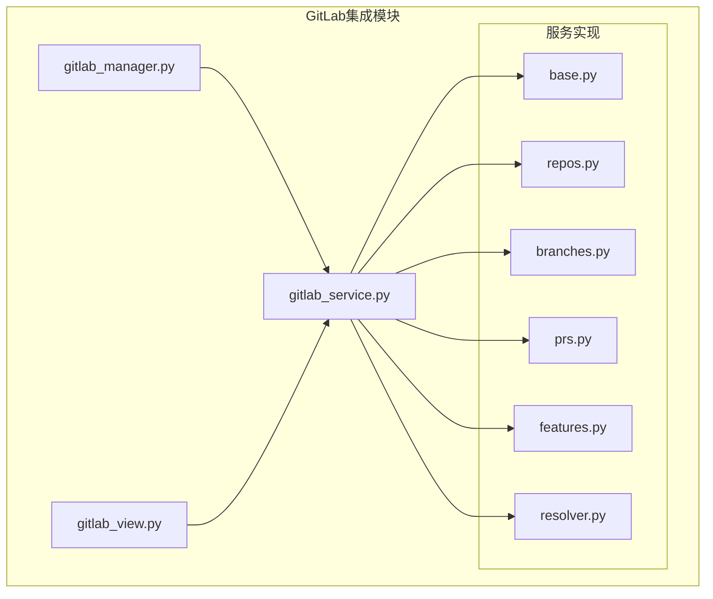
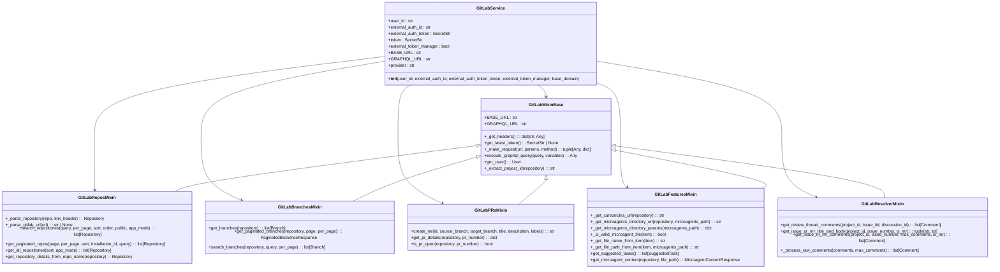
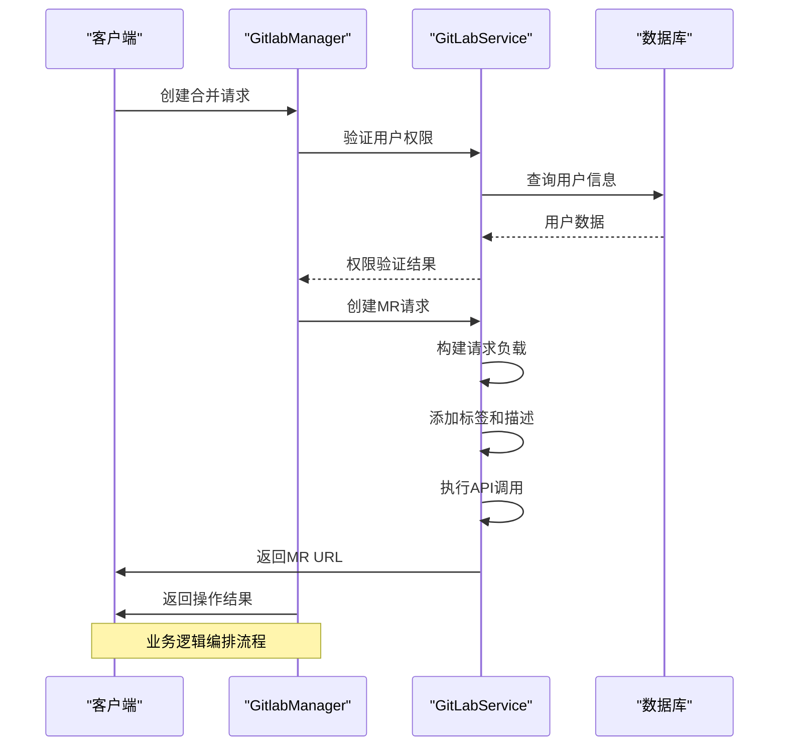
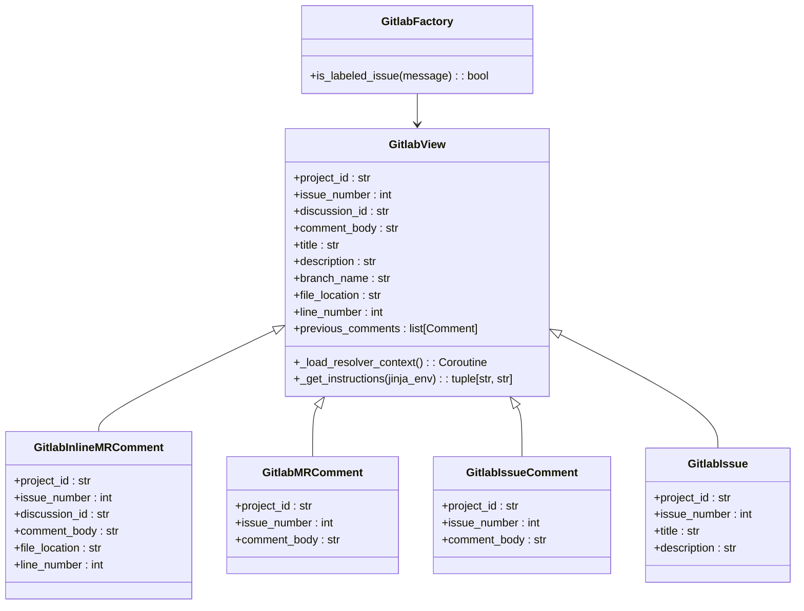
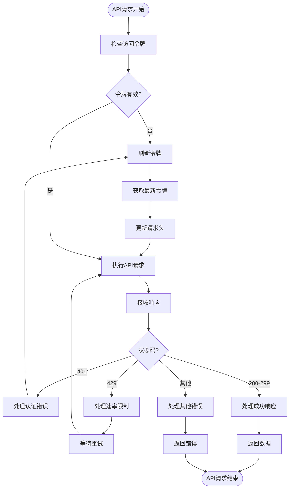
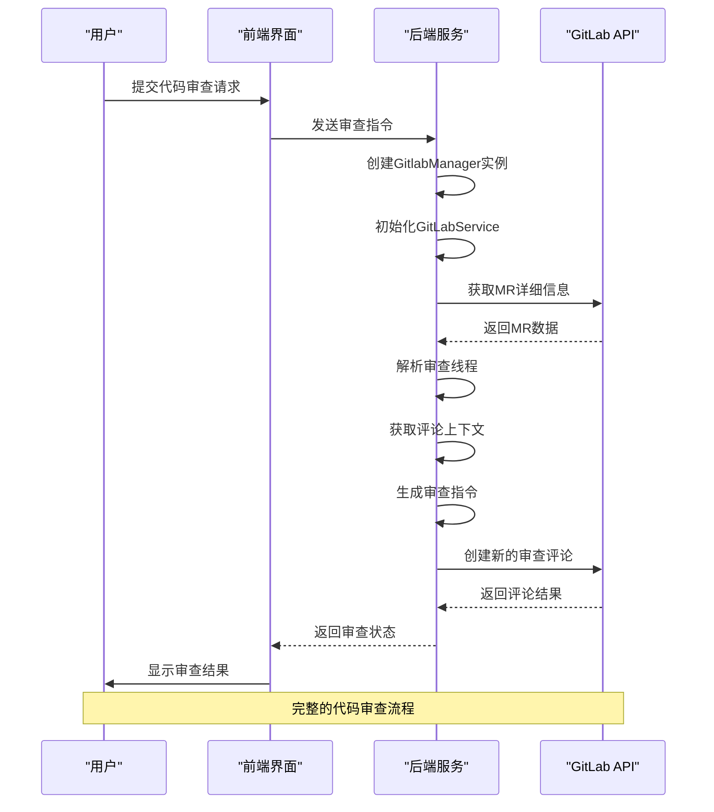

# GitLab API交互与业务逻辑

<cite>
**本文档引用的文件**
- [gitlab_service.py](file://enterprise/integrations/gitlab/gitlab_service.py)
- [gitlab_manager.py](file://enterprise/integrations/gitlab/gitlab_manager.py)
- [gitlab_view.py](file://enterprise/integrations/gitlab/gitlab_view.py)
- [base.py](file://openhands/integrations/gitlab/service/base.py)
- [prs.py](file://openhands/integrations/gitlab/service/prs.py)
- [resolver.py](file://openhands/integrations/gitlab/service/resolver.py)
- [features.py](file://openhands/integrations/gitlab/service/features.py)
</cite>

## 目录
1. [项目结构](#项目结构)
2. [核心组件](#核心组件)
3. [GitLab服务实现](#gitlab服务实现)
4. [业务逻辑编排](#业务逻辑编排)
5. [数据转换与视图模型](#数据转换与视图模型)
6. [API调用策略](#api调用策略)
7. [实际使用场景](#实际使用场景)

## 项目结构

**Diagram sources**
- [gitlab_service.py](file://enterprise/integrations/gitlab/gitlab_service.py)
- [gitlab_manager.py](file://enterprise/integrations/gitlab/gitlab_manager.py)
- [gitlab_view.py](file://enterprise/integrations/gitlab/gitlab_view.py)

**Section sources**
- [gitlab_service.py](file://enterprise/integrations/gitlab/gitlab_service.py)
- [gitlab_manager.py](file://enterprise/integrations/gitlab/gitlab_manager.py)
- [gitlab_view.py](file://enterprise/integrations/gitlab/gitlab_view.py)

## 核心组件

GitLab集成模块由三个核心组件构成：`gitlab_service.py`负责API调用，`gitlab_manager.py`处理业务逻辑编排，`gitlab_view.py`管理数据转换和视图模型。这些组件共同实现了对GitLab平台的全面集成，支持项目访问、合并请求创建、代码审查和状态更新等核心功能。

**Section sources**
- [gitlab_service.py](file://enterprise/integrations/gitlab/gitlab_service.py)
- [gitlab_manager.py](file://enterprise/integrations/gitlab/gitlab_manager.py)
- [gitlab_view.py](file://enterprise/integrations/gitlab/gitlab_view.py)

## GitLab服务实现

**Diagram sources**
- [gitlab_service.py](file://enterprise/integrations/gitlab/gitlab_service.py)
- [base.py](file://openhands/integrations/gitlab/service/base.py)
- [repos.py](file://openhands/integrations/gitlab/service/repos.py)
- [branches.py](file://openhands/integrations/gitlab/service/branches.py)
- [prs.py](file://openhands/integrations/gitlab/service/prs.py)
- [features.py](file://openhands/integrations/gitlab/service/features.py)
- [resolver.py](file://openhands/integrations/gitlab/service/resolver.py)

**Section sources**
- [gitlab_service.py](file://enterprise/integrations/gitlab/gitlab_service.py)
- [base.py](file://openhands/integrations/gitlab/service/base.py)

## 业务逻辑编排

**Diagram sources**
- [gitlab_manager.py](file://enterprise/integrations/gitlab/gitlab_manager.py)
- [gitlab_service.py](file://enterprise/integrations/gitlab/gitlab_service.py)

**Section sources**
- [gitlab_manager.py](file://enterprise/integrations/gitlab/gitlab_manager.py)

## 数据转换与视图模型

**Diagram sources**
- [gitlab_view.py](file://enterprise/integrations/gitlab/gitlab_view.py)

**Section sources**
- [gitlab_view.py](file://enterprise/integrations/gitlab/gitlab_view.py)

## API调用策略

**Diagram sources**
- [base.py](file://openhands/integrations/gitlab/service/base.py)

**Section sources**
- [base.py](file://openhands/integrations/gitlab/service/base.py)

## 实际使用场景

**Diagram sources**
- [gitlab_manager.py](file://enterprise/integrations/gitlab/gitlab_manager.py)
- [gitlab_service.py](file://enterprise/integrations/gitlab/gitlab_service.py)
- [gitlab_view.py](file://enterprise/integrations/gitlab/gitlab_view.py)

**Section sources**
- [gitlab_manager.py](file://enterprise/integrations/gitlab/gitlab_manager.py)
- [gitlab_service.py](file://enterprise/integrations/gitlab/gitlab_service.py)
- [gitlab_view.py](file://enterprise/integrations/gitlab/gitlab_view.py)