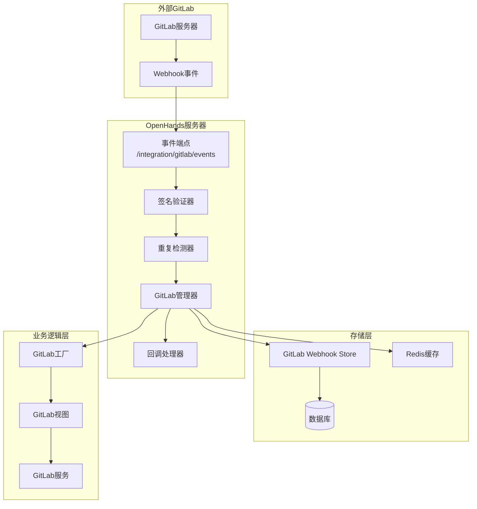
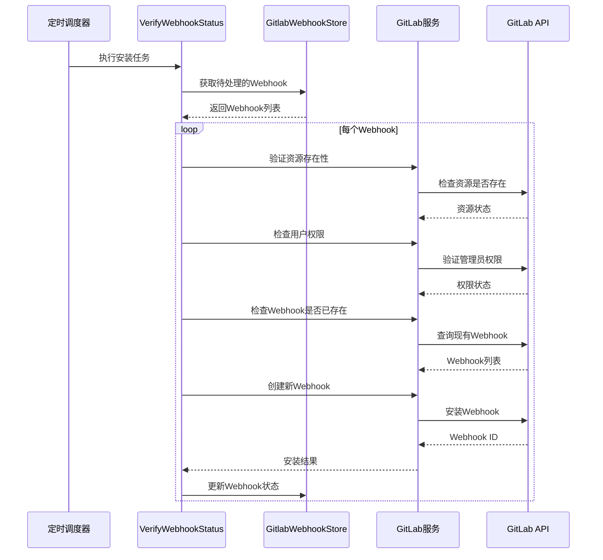
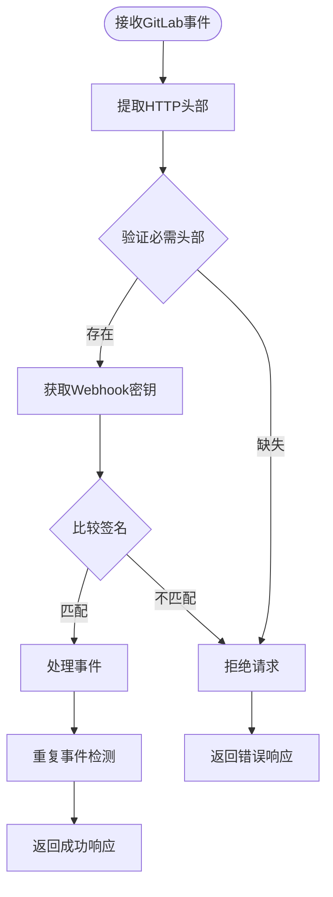
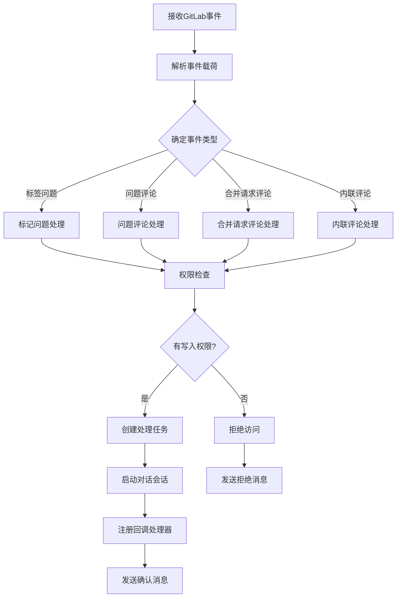
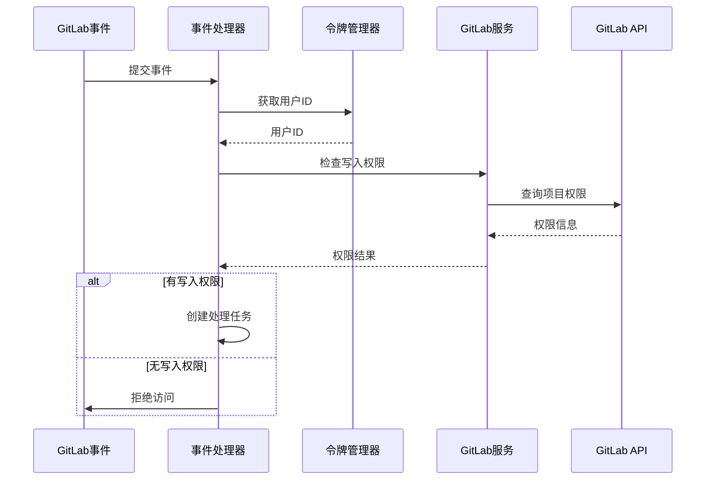
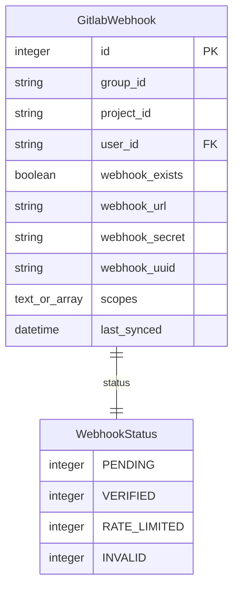
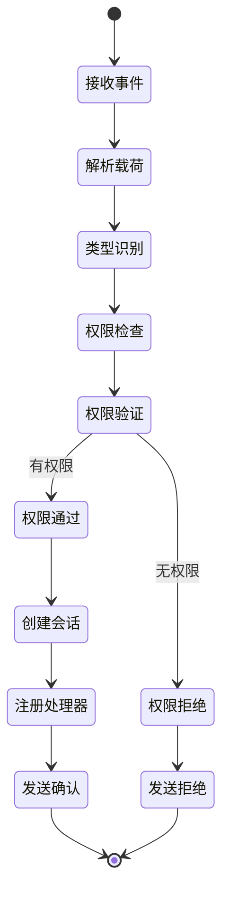
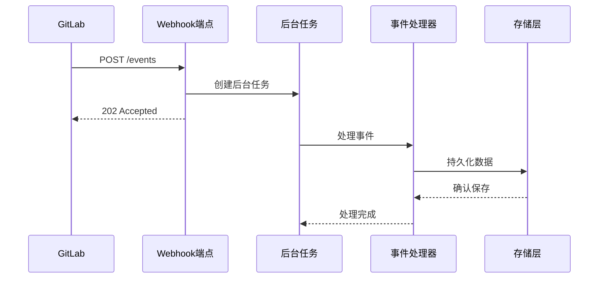
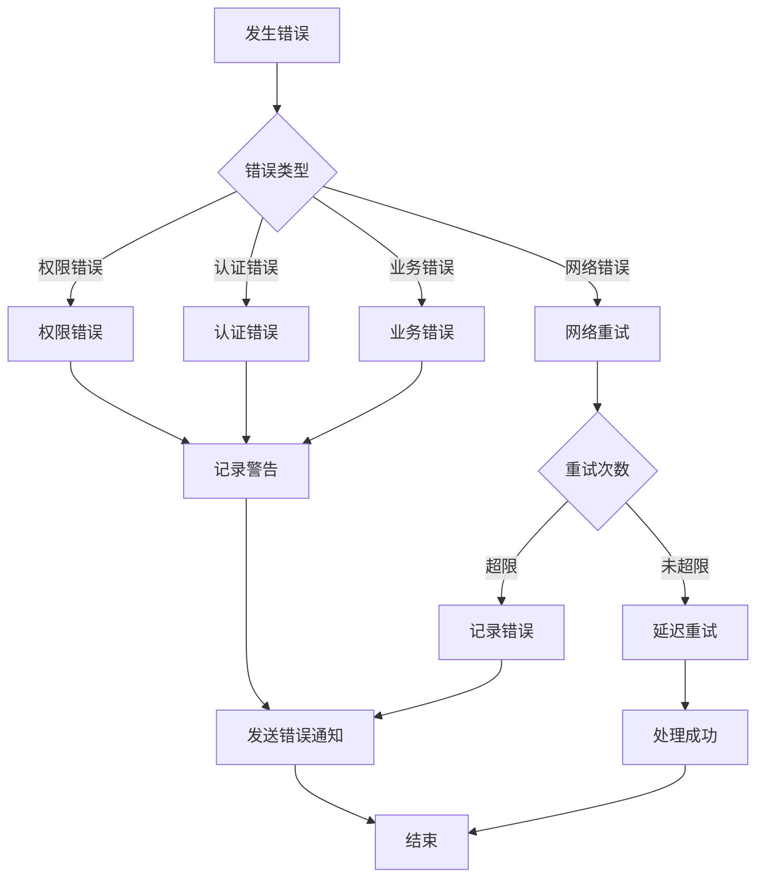
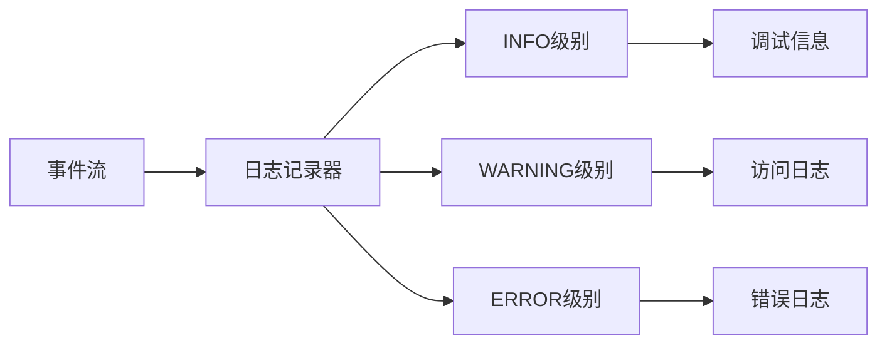

# GitLab Webhook与事件处理

<cite>
**本文档中引用的文件**
- [gitlab_manager.py](file://enterprise/integrations/gitlab/gitlab_manager.py)
- [gitlab_webhook.py](file://enterprise/storage/gitlab_webhook.py)
- [install_gitlab_webhooks.py](file://enterprise/sync/install_gitlab_webhooks.py)
- [gitlab_webhook_store.py](file://enterprise/storage/gitlab_webhook_store.py)
- [gitlab_service.py](file://enterprise/integrations/gitlab/gitlab_service.py)
- [gitlab_view.py](file://enterprise/integrations/gitlab/gitlab_view.py)
- [event_webhook.py](file://enterprise/server/routes/event_webhook.py)
- [gitlab.py](file://enterprise/server/routes/integration/gitlab.py)
</cite>

## 目录
1. [简介](#简介)
2. [系统架构概览](#系统架构概览)
3. [Webhook注册机制](#webhook注册机制)
4. [事件验证与签名检查](#事件验证与签名检查)
5. [事件分发与处理](#事件分发与处理)
6. [持久化存储模型](#持久化存储模型)
7. [事件类型与处理流程](#事件类型与处理流程)
8. [异步处理机制](#异步处理机制)
9. [错误处理与重试策略](#错误处理与重试策略)
10. [性能优化考虑](#性能优化考虑)
11. [故障排除指南](#故障排除指南)

## 简介

OpenHands的GitLab Webhook集成提供了一个完整的解决方案，用于接收、验证和处理来自GitLab的各种事件。该系统支持多种事件类型，包括推送、合并请求、问题评论等，并提供了强大的权限验证、重复事件检测和异步处理能力。

### 核心功能特性

- **多事件类型支持**：支持推送、合并请求、问题、评论等多种GitLab事件
- **安全验证**：基于Webhook密钥的事件签名验证
- **重复事件防护**：使用Redis进行事件去重处理
- **权限控制**：细粒度的用户访问权限检查
- **异步处理**：非阻塞的事件处理机制
- **持久化存储**：完整的Webhook配置和状态管理

## 系统架构概览

GitLab Webhook集成采用分层架构设计，确保系统的可扩展性和维护性。

**图表来源**
- [gitlab.py](file://enterprise/server/routes/integration/gitlab.py#L35-L85)
- [gitlab_manager.py](file://enterprise/integrations/gitlab/gitlab_manager.py#L31-L262)
- [gitlab_webhook_store.py](file://enterprise/storage/gitlab_webhook_store.py#L15-L231)

## Webhook注册机制

### 自动注册流程

系统通过定期任务自动为用户的GitLab资源（项目或组）安装Webhook。

**图表来源**
- [install_gitlab_webhooks.py](file://enterprise/sync/install_gitlab_webhooks.py#L243-L325)
- [gitlab_webhook_store.py](file://enterprise/storage/gitlab_webhook_store.py#L175-L231)

### Webhook配置参数

| 参数 | 描述 | 默认值 |
|------|------|--------|
| webhook_name | Webhook名称 | "OpenHands Resolver" |
| webhook_url | Webhook回调URL | 动态生成 |
| webhook_secret | 用于签名验证的密钥 | UUID生成 |
| scopes | 监听的事件类型 | 多种事件类型组合 |
| enable_ssl_verification | 启用SSL验证 | True |

**节来源**
- [install_gitlab_webhooks.py](file://enterprise/sync/install_gitlab_webhooks.py#L14-L24)
- [install_gitlab_webhooks.py](file://enterprise/sync/install_gitlab_webhooks.py#L202-L213)

## 事件验证与签名检查

### 签名验证机制

系统使用GitLab提供的Webhook令牌进行事件验证，确保只有来自可信源的事件被处理。

**图表来源**
- [gitlab.py](file://enterprise/server/routes/integration/gitlab.py#L21-L40)
- [gitlab.py](file://enterprise/server/routes/integration/gitlab.py#L42-L85)

### 重复事件检测

系统使用Redis进行事件去重，防止相同事件被多次处理。

| 检测方式 | 实现方法 | 时间窗口 |
|----------|----------|----------|
| 基于ID检测 | 使用object_attributes.id作为键 | 60秒 |
| 基于哈希检测 | 对完整载荷计算SHA256哈希 | 60秒 |
| 键值设置 | NX模式（仅在键不存在时设置） | 60秒 |

**节来源**
- [gitlab.py](file://enterprise/server/routes/integration/gitlab.py#L50-L76)

## 事件分发与处理

### 事件路由机制

接收到的GitLab事件根据其类型被路由到相应的处理器。

**图表来源**
- [gitlab_manager.py](file://enterprise/integrations/gitlab/gitlab_manager.py#L74-L117)
- [gitlab_view.py](file://enterprise/integrations/gitlab/gitlab_view.py#L240-L452)

### 权限验证流程

系统执行多层次的权限验证以确保用户对目标资源具有适当的访问权限。

**图表来源**
- [gitlab_manager.py](file://enterprise/integrations/gitlab/gitlab_manager.py#L43-L73)
- [gitlab_service.py](file://enterprise/integrations/gitlab/gitlab_service.py#L476-L499)

**节来源**
- [gitlab_manager.py](file://enterprise/integrations/gitlab/gitlab_manager.py#L43-L117)

## 持久化存储模型

### 数据库表结构

GitLab Webhook的状态和配置信息存储在专门的数据库表中。

**图表来源**
- [gitlab_webhook.py](file://enterprise/storage/gitlab_webhook.py#L15-L43)

### 存储操作接口

| 操作类型 | 方法 | 描述 |
|----------|------|------|
| 存储Webhook | `store_webhooks()` | 批量插入或更新Webhook记录 |
| 更新Webhook | `update_webhook()` | 更新特定Webhook的属性 |
| 删除Webhook | `delete_webhook()` | 删除指定的Webhook记录 |
| 过滤待处理 | `filter_rows()` | 获取需要处理的Webhook列表 |
| 获取密钥 | `get_webhook_secret()` | 根据UUID和用户ID获取Webhook密钥 |

**节来源**
- [gitlab_webhook_store.py](file://enterprise/storage/gitlab_webhook_store.py#L15-L231)

## 事件类型与处理流程

### 支持的事件类型

系统支持多种GitLab事件类型的处理：

| 事件类型 | 触发条件 | 处理方式 |
|----------|----------|----------|
| 标记问题 | 添加特定标签到问题 | 创建新的对话会话 |
| 问题评论 | 包含机器人提及的评论 | 回复到问题讨论 |
| 合并请求评论 | 包含机器人提及的MR评论 | 回复到MR讨论 |
| 内联评论 | 在代码审查中的内联评论 | 特定文件行上下文回复 |

### 事件处理状态机

**图表来源**
- [gitlab_view.py](file://enterprise/integrations/gitlab/gitlab_view.py#L240-L452)

**节来源**
- [gitlab_view.py](file://enterprise/integrations/gitlab/gitlab_view.py#L240-L452)

## 异步处理机制

### 后台任务处理

系统采用异步处理模式，确保Webhook端点能够快速响应而不会阻塞。

**图表来源**
- [event_webhook.py](file://enterprise/server/routes/event_webhook.py#L53-L145)

### 批量操作支持

系统支持批量Webhook操作，提高处理效率。

| 操作类型 | 支持方法 | 处理路径 |
|----------|----------|----------|
| 单个写入 | POST | `/sessions/{conversation_id}/{subpath}` |
| 批量写入 | POST | `/event-webhook/batch` |
| 删除操作 | DELETE | `/sessions/{conversation_id}/{subpath}` |

**节来源**
- [event_webhook.py](file://enterprise/server/routes/event_webhook.py#L146-L242)

## 错误处理与重试策略

### 错误分类与处理

系统对不同类型的错误采用不同的处理策略：

### 速率限制处理

系统实现了智能的速率限制检测和处理机制：

| 状态码 | 处理策略 | 后续动作 |
|--------|----------|----------|
| 200 | 正常处理 | 继续处理 |
| 429 | 速率限制 | 延迟重试 |
| 403 | 认证失败 | 标记无效 |
| 5xx | 服务器错误 | 指数退避重试 |

**节来源**
- [install_gitlab_webhooks.py](file://enterprise/sync/install_gitlab_webhooks.py#L37-L42)
- [install_gitlab_webhooks.py](file://enterprise/sync/install_gitlab_webhooks.py#L293-L302)

## 性能优化考虑

### 缓存策略

- **Redis缓存**：用于事件去重和临时数据存储
- **数据库连接池**：减少连接建立开销
- **批量操作**：减少数据库往返次数

### 并发控制

- **异步处理**：避免阻塞主线程
- **任务队列**：合理分配系统资源
- **限流机制**：防止系统过载

### 内存管理

- **对象池**：重用频繁创建的对象
- **及时清理**：释放不再需要的资源
- **监控指标**：跟踪内存使用情况

## 故障排除指南

### 常见问题诊断

| 问题症状 | 可能原因 | 解决方案 |
|----------|----------|----------|
| Webhook未触发 | 权限不足 | 检查用户权限和资源访问级别 |
| 事件被拒绝 | 签名验证失败 | 验证Webhook密钥配置 |
| 重复事件处理 | Redis连接问题 | 检查Redis服务状态 |
| 处理延迟高 | 系统负载过高 | 监控系统资源使用情况 |

### 日志分析

系统提供了详细的日志记录，便于问题诊断：

### 监控指标

关键监控指标包括：
- Webhook安装成功率
- 事件处理延迟
- 错误率统计
- 资源使用情况

**节来源**
- [gitlab_manager.py](file://enterprise/integrations/gitlab/gitlab_manager.py#L256-L262)
- [install_gitlab_webhooks.py](file://enterprise/sync/install_gitlab_webhooks.py#L306-L320)

## 结论

OpenHands的GitLab Webhook集成提供了一个完整、安全、高效的解决方案，用于处理GitLab平台上的各种事件。通过多层次的安全验证、智能的权限控制和异步处理机制，系统能够可靠地处理大量并发事件，同时保证数据的一致性和安全性。

该系统的设计充分考虑了可扩展性和维护性，为未来的功能扩展和技术升级奠定了坚实的基础。通过持续的监控和优化，系统能够适应不断变化的业务需求和技术环境。