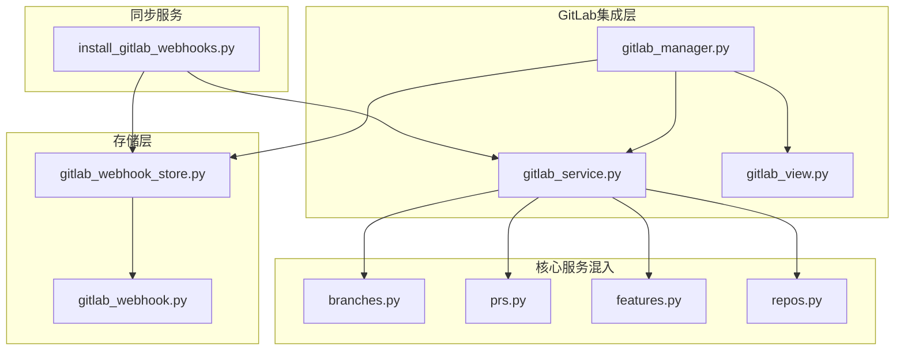
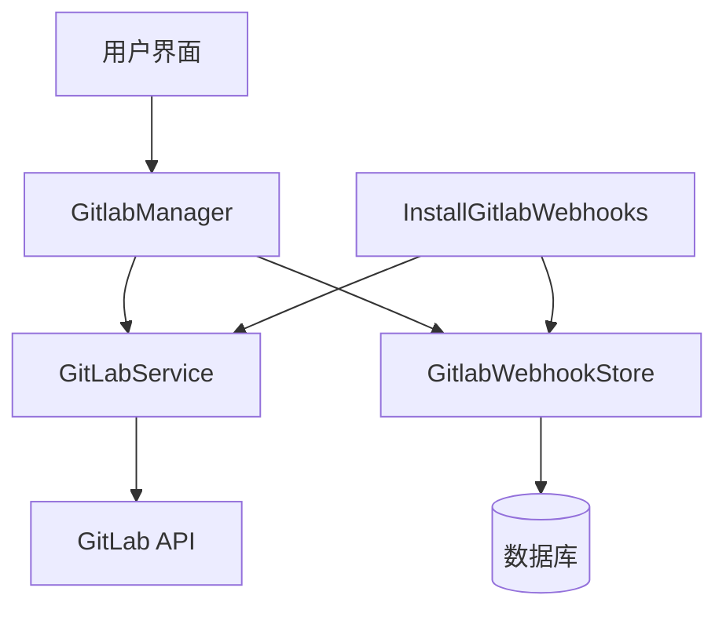
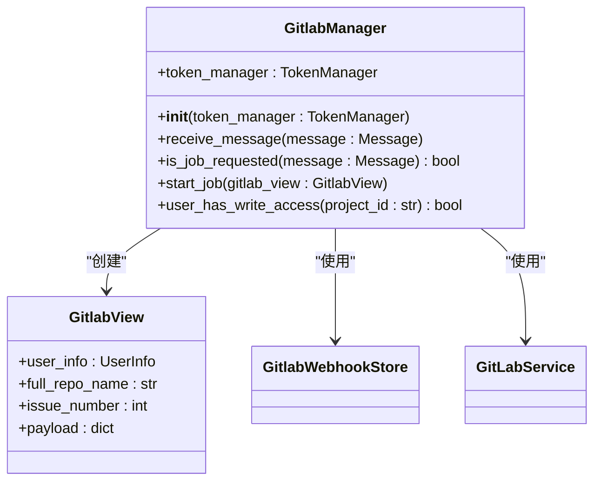
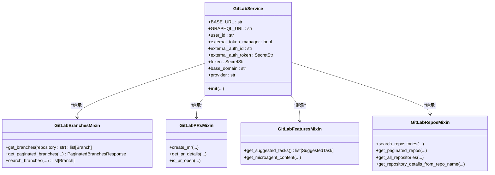
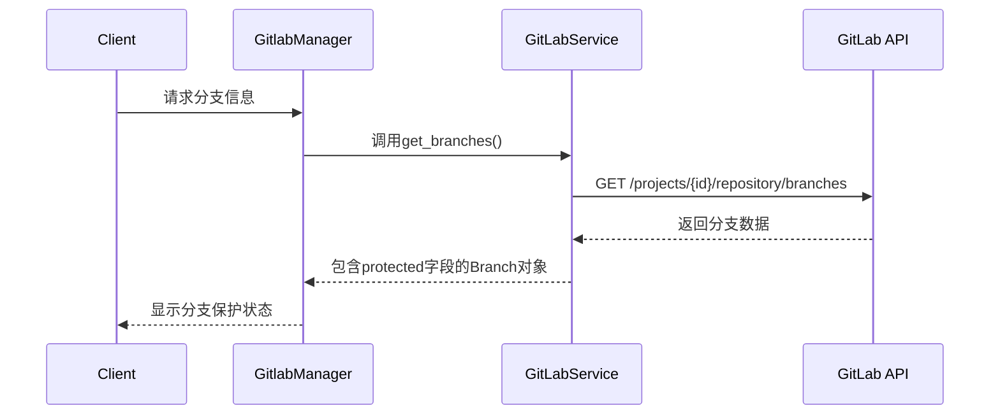
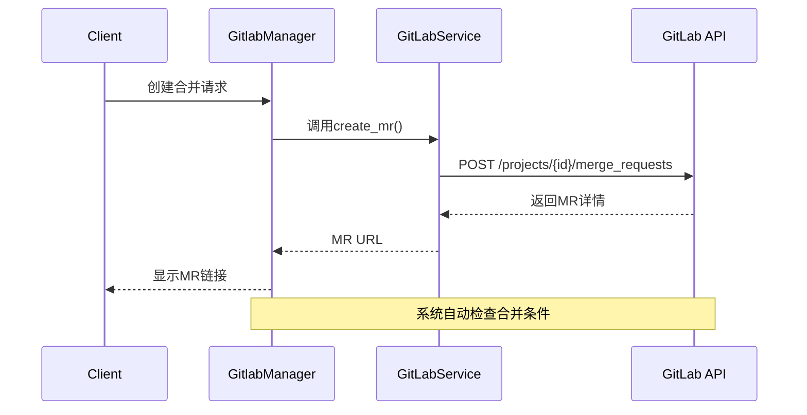
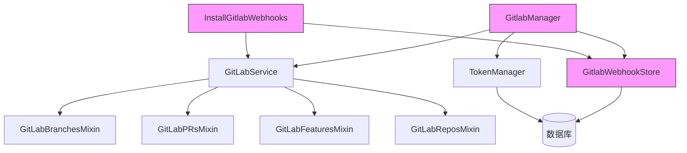
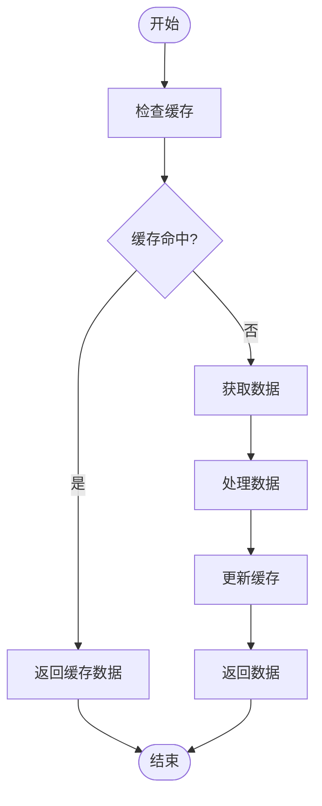
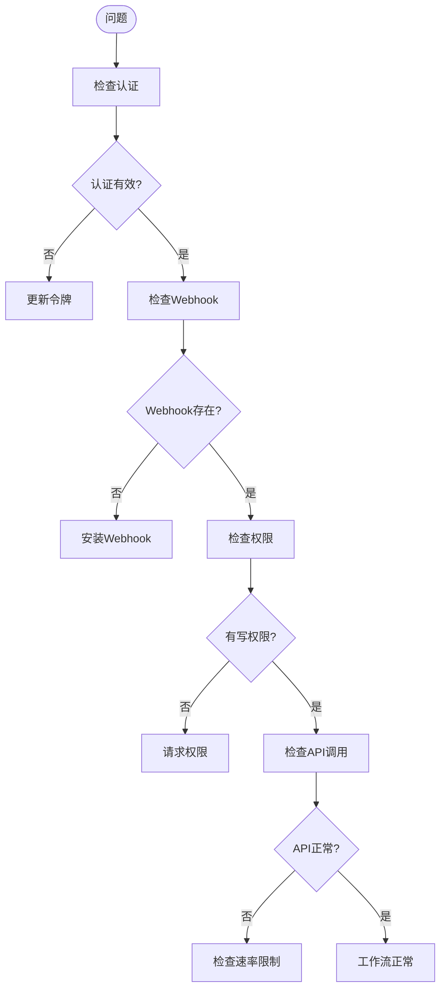

# GitLab工作流支持

<cite>
**本文档引用的文件**  
- [gitlab_manager.py](file://enterprise/integrations/gitlab/gitlab_manager.py)
- [gitlab_service.py](file://enterprise/integrations/gitlab/gitlab_service.py)
- [gitlab_view.py](file://enterprise/integrations/gitlab/gitlab_view.py)
- [gitlab_webhook.py](file://enterprise/storage/gitlab_webhook.py)
- [gitlab_webhook_store.py](file://enterprise/storage/gitlab_webhook_store.py)
- [install_gitlab_webhooks.py](file://enterprise/sync/install_gitlab_webhooks.py)
- [prs.py](file://openhands/integrations/gitlab/service/prs.py)
- [branches.py](file://openhands/integrations/gitlab/service/branches.py)
- [features.py](file://openhands/integrations/gitlab/service/features.py)
- [repos.py](file://openhands/integrations/gitlab/service/repos.py)
</cite>

## 目录
1. [项目结构](#项目结构)
2. [核心组件](#核心组件)
3. [架构概述](#架构概述)
4. [详细组件分析](#详细组件分析)
5. [依赖分析](#依赖分析)
6. [性能考虑](#性能考虑)
7. [故障排除指南](#故障排除指南)
8. [结论](#结论)

## 项目结构

GitLab工作流支持功能分布在多个模块中，主要位于`enterprise/integrations/gitlab/`和`openhands/integrations/gitlab/`目录下。系统采用分层架构，将GitLab服务功能分解为多个混入（mixin）类，通过组合方式构建完整的功能集。

**图示来源**
- [gitlab_manager.py](file://enterprise/integrations/gitlab/gitlab_manager.py)
- [gitlab_service.py](file://enterprise/integrations/gitlab/gitlab_service.py)
- [gitlab_webhook_store.py](file://enterprise/storage/gitlab_webhook_store.py)

**章节来源**
- [gitlab_manager.py](file://enterprise/integrations/gitlab/gitlab_manager.py)
- [gitlab_service.py](file://enterprise/integrations/gitlab/gitlab_service.py)

## 核心组件

GitLab工作流支持的核心组件包括`GitlabManager`、`GitLabService`以及相关的混入类。这些组件协同工作，实现了对GitLab分支保护规则、合并策略、代码所有者和CI/CD集成的全面支持。系统通过`GitlabManager`作为入口点，协调各个服务组件的工作流程。

**章节来源**
- [gitlab_manager.py](file://enterprise/integrations/gitlab/gitlab_manager.py)
- [gitlab_service.py](file://enterprise/integrations/gitlab/gitlab_service.py)

## 架构概述

GitLab工作流支持系统采用分层架构设计，将业务逻辑与数据访问分离。系统通过`GitlabManager`协调工作流，利用`GitLabService`提供GitLab API的封装，并通过存储层维护仓库配置状态。

**图示来源**
- [gitlab_manager.py](file://enterprise/integrations/gitlab/gitlab_manager.py)
- [gitlab_service.py](file://enterprise/integrations/gitlab/gitlab_service.py)
- [gitlab_webhook_store.py](file://enterprise/storage/gitlab_webhook_store.py)

## 详细组件分析

### GitLab管理器分析

`GitlabManager`是GitLab工作流的核心协调器，负责接收和处理来自GitLab的事件，启动相应的工作任务。

**图示来源**
- [gitlab_manager.py](file://enterprise/integrations/gitlab/gitlab_manager.py)
- [gitlab_view.py](file://enterprise/integrations/gitlab/gitlab_view.py)

**章节来源**
- [gitlab_manager.py](file://enterprise/integrations/gitlab/gitlab_manager.py#L72-L107)

### GitLab服务分析

`GitLabService`类通过多个混入类组合实现完整的GitLab功能支持，包括分支管理、合并请求、仓库操作等。

**图示来源**
- [gitlab_service.py](file://enterprise/integrations/gitlab/gitlab_service.py)
- [branches.py](file://openhands/integrations/gitlab/service/branches.py)
- [prs.py](file://openhands/integrations/gitlab/service/prs.py)
- [features.py](file://openhands/integrations/gitlab/service/features.py)
- [repos.py](file://openhands/integrations/gitlab/service/repos.py)

**章节来源**
- [gitlab_service.py](file://enterprise/integrations/gitlab/gitlab_service.py)
- [branches.py](file://openhands/integrations/gitlab/service/branches.py)
- [prs.py](file://openhands/integrations/gitlab/service/prs.py)

### 分支保护规则处理

系统通过`GitLabBranchesMixin`类处理GitLab分支保护规则，能够识别受保护分支的特殊要求。

**图示来源**
- [branches.py](file://openhands/integrations/gitlab/service/branches.py#L10-L47)
- [gitlab_manager.py](file://enterprise/integrations/gitlab/gitlab_manager.py)

**章节来源**
- [branches.py](file://openhands/integrations/gitlab/service/branches.py#L10-L47)

### 合并请求工作流

系统通过`GitLabPRsMixin`类处理合并请求工作流，遵循GitLab的合并条件检查。

**图示来源**
- [prs.py](file://openhands/integrations/gitlab/service/prs.py#L11-L59)
- [gitlab_manager.py](file://enterprise/integrations/gitlab/gitlab_manager.py)

**章节来源**
- [prs.py](file://openhands/integrations/gitlab/service/prs.py#L11-L59)

## 依赖分析

GitLab工作流支持系统依赖于多个组件协同工作，形成完整的功能链。

**图示来源**
- [gitlab_manager.py](file://enterprise/integrations/gitlab/gitlab_manager.py)
- [gitlab_service.py](file://enterprise/integrations/gitlab/gitlab_service.py)
- [gitlab_webhook_store.py](file://enterprise/storage/gitlab_webhook_store.py)
- [install_gitlab_webhooks.py](file://enterprise/sync/install_gitlab_webhooks.py)

**章节来源**
- [gitlab_manager.py](file://enterprise/integrations/gitlab/gitlab_manager.py)
- [gitlab_service.py](file://enterprise/integrations/gitlab/gitlab_service.py)
- [gitlab_webhook_store.py](file://enterprise/storage/gitlab_webhook_store.py)

## 性能考虑

系统在处理GitLab工作流时考虑了性能优化，包括分页处理、缓存机制和异步操作。

**图示来源**
- [gitlab_service.py](file://enterprise/integrations/gitlab/gitlab_service.py)
- [gitlab_webhook_store.py](file://enterprise/storage/gitlab_webhook_store.py)

## 故障排除指南

当GitLab工作流出现问题时，可以检查以下方面：

**章节来源**
- [gitlab_manager.py](file://enterprise/integrations/gitlab/gitlab_manager.py)
- [gitlab_service.py](file://enterprise/integrations/gitlab/gitlab_service.py)
- [install_gitlab_webhooks.py](file://enterprise/sync/install_gitlab_webhooks.py)

## 结论

GitLab工作流支持系统通过`gitlab_manager.py`中的工作流适配逻辑，实现了对分支保护规则、合并策略、代码所有者和CI/CD集成的全面支持。系统能够识别和处理受保护分支的特殊要求，并在创建合并请求时遵循GitLab的合并条件检查。通过与存储层协同，系统能够维护仓库配置状态，确保工作流的稳定性和可靠性。