# GitLab认证与令牌管理

<cite>
**本文档引用的文件**
- [gitlab_service.py](file://enterprise/integrations/gitlab/gitlab_service.py)
- [gitlab_manager.py](file://enterprise/integrations/gitlab/gitlab_manager.py)
- [gitlab_view.py](file://enterprise/integrations/gitlab/gitlab_view.py)
- [token_manager.py](file://enterprise/server/auth/token_manager.py)
- [gitlab_callback_processor.py](file://enterprise/server/conversation_callback_processor/gitlab_callback_processor.py)
- [install_gitlab_webhooks.py](file://enterprise/sync/install_gitlab_webhooks.py)
- [auth.py](file://enterprise/server/routes/auth.py)
- [middleware.py](file://enterprise/server/middleware.py)
</cite>

## 目录
1. [简介](#简介)
2. [系统架构概览](#系统架构概览)
3. [OAuth2.0认证流程](#oauth20认证流程)
4. [令牌管理系统](#令牌管理系统)
5. [GitLab服务封装](#gitlab服务封装)
6. [回调处理器机制](#回调处理器机制)
7. [Webhook安装与同步](#webhook安装与同步)
8. [安全存储策略](#安全存储策略)
9. [错误处理与重试机制](#错误处理与重试机制)
10. [性能优化考虑](#性能优化考虑)
11. [故障排除指南](#故障排除指南)
12. [总结](#总结)

## 简介

OpenHands平台实现了完整的GitLab OAuth2.0认证机制，支持用户通过GitLab账户进行身份验证，并提供令牌生命周期管理、会话管理和安全存储功能。该系统采用多层架构设计，确保认证过程的安全性和可靠性。

## 系统架构概览

GitLab认证系统采用分层架构，包含以下核心组件：

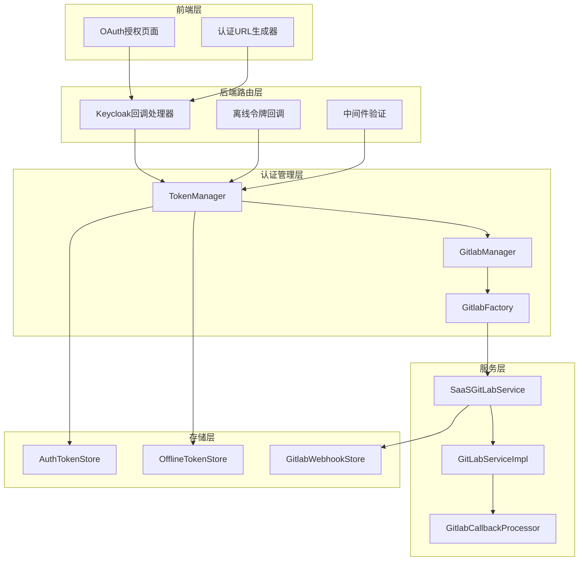

**图表来源**
- [gitlab_service.py](file://enterprise/integrations/gitlab/gitlab_service.py#L21-L81)
- [token_manager.py](file://enterprise/server/auth/token_manager.py#L78-L88)
- [gitlab_manager.py](file://enterprise/integrations/gitlab/gitlab_manager.py#L31-L40)

## OAuth2.0认证流程

### 认证端点配置

系统通过多个端点处理GitLab OAuth2.0认证流程：

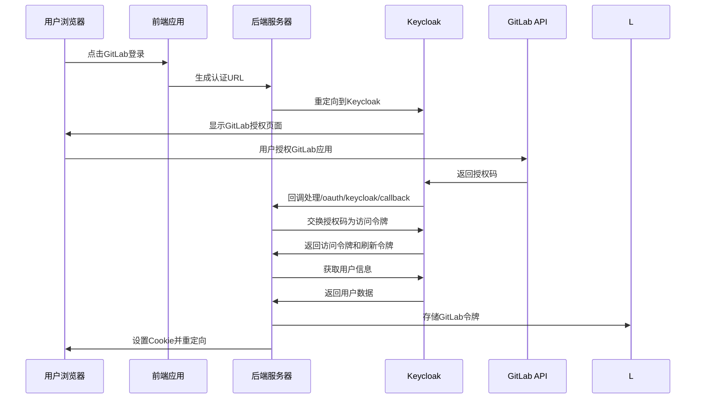

**图表来源**
- [auth.py](file://enterprise/server/routes/auth.py#L235-L272)
- [token_manager.py](file://enterprise/server/auth/token_manager.py#L89-L111)

### 状态验证机制

系统实现了严格的状态验证机制以防止CSRF攻击：

| 验证步骤 | 描述 | 实现位置 |
|---------|------|----------|
| 状态参数生成 | 使用Fernet加密生成随机状态值 | [generate_auth_url.ts](file://frontend/src/utils/generate-auth-url.ts#L40-L45) |
| 状态参数验证 | 解密并验证状态值的一致性 | [auth.py](file://enterprise/server/routes/auth.py#L252-L272) |
| 重定向URI验证 | 确保回调URI与注册的URI匹配 | [token_manager.py](file://enterprise/server/auth/token_manager.py#L90-L97) |

**节来源**
- [auth.py](file://enterprise/server/routes/auth.py#L235-L272)
- [token_manager.py](file://enterprise/server/auth/token_manager.py#L89-L111)

## 令牌管理系统

### 令牌类型与生命周期

系统管理多种类型的令牌，每种都有不同的生命周期和用途：

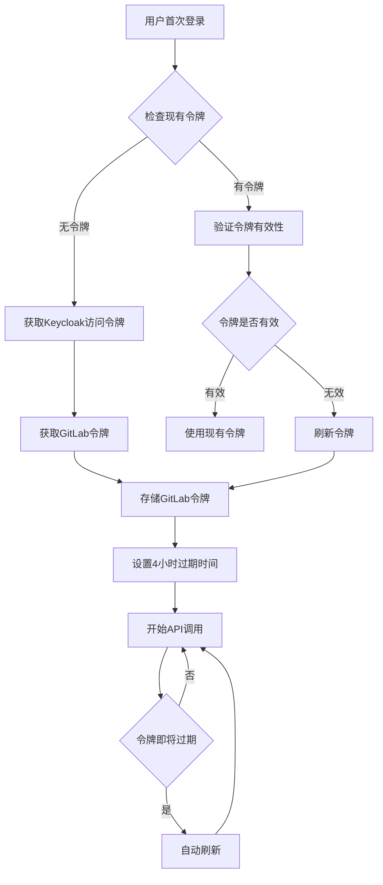

**图表来源**
- [token_manager.py](file://enterprise/server/auth/token_manager.py#L250-L276)
- [token_manager.py](file://enterprise/server/auth/token_manager.py#L289-L329)

### 令牌获取与刷新机制

#### 获取最新令牌

系统提供了多种获取GitLab令牌的方式：

| 获取方式 | 触发条件 | 实现方法 | 安全级别 |
|---------|----------|----------|----------|
| 外部认证令牌 | 用户已通过Keycloak认证 | `get_idp_token()` | 高 |
| 离线令牌 | 用户需要长期访问 | `get_idp_token_from_offline_token()` | 中 |
| 用户ID令牌 | 基于用户ID查找 | `get_idp_token_from_idp_user_id()` | 中 |

#### 令牌刷新策略

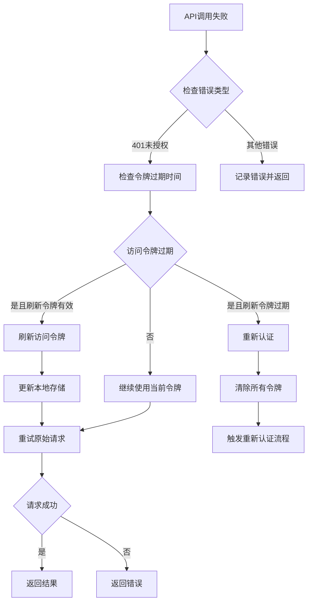

**图表来源**
- [token_manager.py](file://enterprise/server/auth/token_manager.py#L289-L329)
- [token_manager.py](file://enterprise/server/auth/token_manager.py#L444-L461)

**节来源**
- [token_manager.py](file://enterprise/server/auth/token_manager.py#L250-L276)
- [token_manager.py](file://enterprise/server/auth/token_manager.py#L444-L461)

## GitLab服务封装

### SaaSGitLabService类架构

系统通过`SaaSGitLabService`类封装GitLab API客户端，提供统一的认证上下文管理：

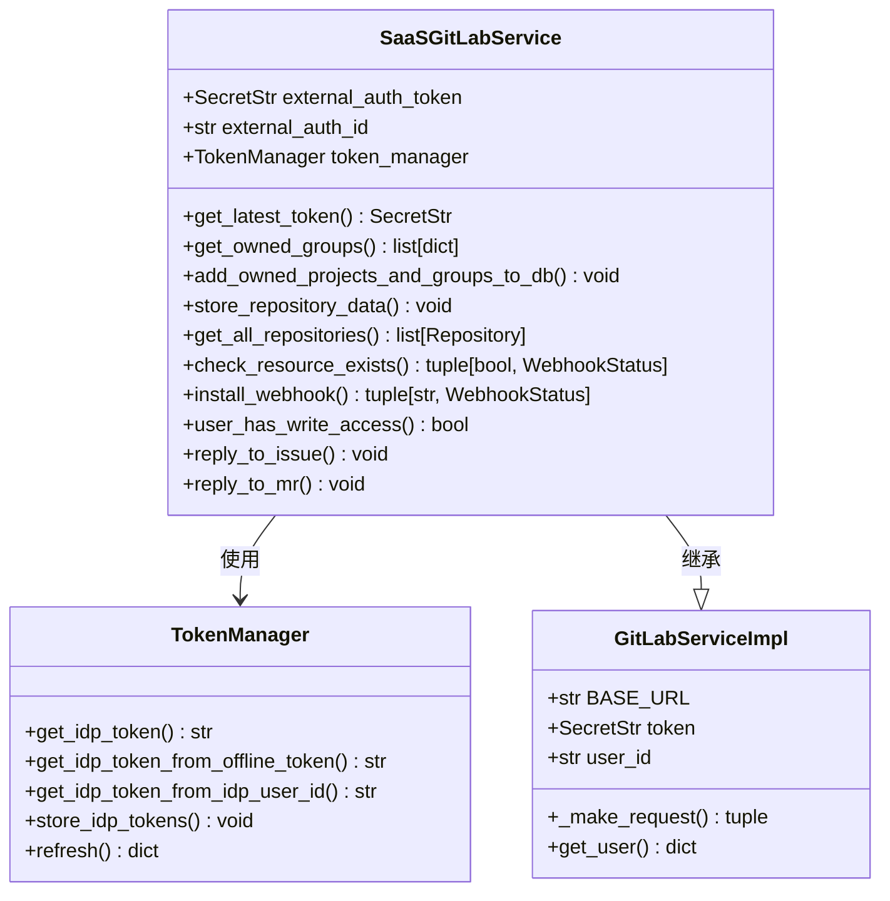

**图表来源**
- [gitlab_service.py](file://enterprise/integrations/gitlab/gitlab_service.py#L21-L81)
- [token_manager.py](file://enterprise/server/auth/token_manager.py#L78-L88)

### 仓库数据管理

系统实现了完整的仓库数据同步机制：

| 功能模块 | 描述 | 实现方法 |
|---------|------|----------|
| 个人项目识别 | 识别用户拥有的GitLab项目 | `get_all_repositories()` |
| 组织权限检查 | 验证用户对组的管理员权限 | `check_user_has_admin_access_to_resource()` |
| Webhook安装 | 自动安装事件监听Webhook | `install_webhook()` |
| 数据存储 | 将仓库信息持久化到数据库 | `store_repository_data()` |

**节来源**
- [gitlab_service.py](file://enterprise/integrations/gitlab/gitlab_service.py#L148-L170)
- [gitlab_service.py](file://enterprise/integrations/gitlab/gitlab_service.py#L406-L474)

## 回调处理器机制

### GitlabCallbackProcessor工作流程

回调处理器负责在对话状态变化时向GitLab发送摘要信息：

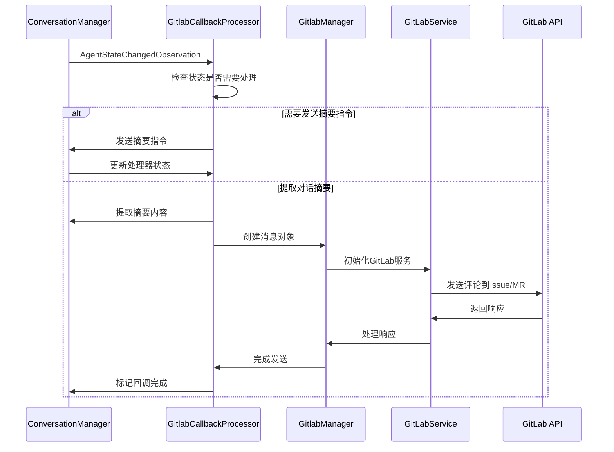

**图表来源**
- [gitlab_callback_processor.py](file://enterprise/server/conversation_callback_processor/gitlab_callback_processor.py#L65-L143)

### 消息发送机制

回调处理器实现了异步消息发送机制，确保不会阻塞主流程：

| 处理阶段 | 功能描述 | 实现细节 |
|---------|----------|----------|
| 状态检查 | 过滤不需要处理的状态变化 | `AgentState.AWAITING_USER_INPUT`, `FINISHED` |
| 摘要提取 | 从对话历史中提取关键信息 | `extract_summary_from_conversation_manager()` |
| 异步发送 | 使用`asyncio.create_task()`异步发送消息 | `_send_message_to_gitlab()` |
| 状态更新 | 更新回调状态并持久化 | `CallbackStatus.COMPLETED` |

**节来源**
- [gitlab_callback_processor.py](file://enterprise/server/conversation_callback_processor/gitlab_callback_processor.py#L65-L143)

## Webhook安装与同步

### Webhook安装流程

系统自动为用户的GitLab资源安装Webhook以接收事件通知：

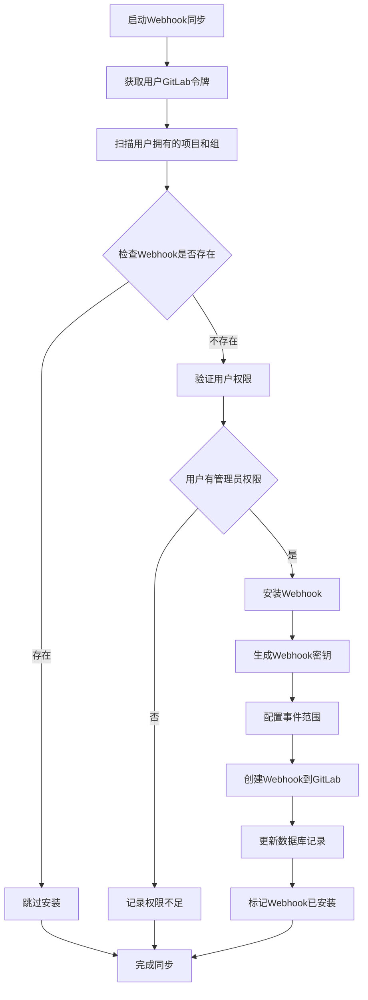

**图表来源**
- [install_gitlab_webhooks.py](file://enterprise/sync/install_gitlab_webhooks.py#L200-L301)

### 仓库同步机制

系统实现了增量仓库同步机制，定期更新用户的GitLab仓库列表：

| 同步步骤 | 描述 | 时间间隔 |
|---------|------|----------|
| 令牌获取 | 获取用户的GitLab访问令牌 | 每次同步前 |
| 资源扫描 | 扫描用户拥有的项目和组 | 每小时 |
| 权限验证 | 验证用户对每个资源的访问权限 | 每个资源 |
| 数据更新 | 更新数据库中的仓库信息 | 实时 |
| Webhook管理 | 确保每个资源都有对应的Webhook | 每次同步 |

**节来源**
- [install_gitlab_webhooks.py](file://enterprise/sync/install_gitlab_webhooks.py#L200-L301)

## 安全存储策略

### 令牌加密存储

系统采用多层加密策略保护敏感令牌数据：

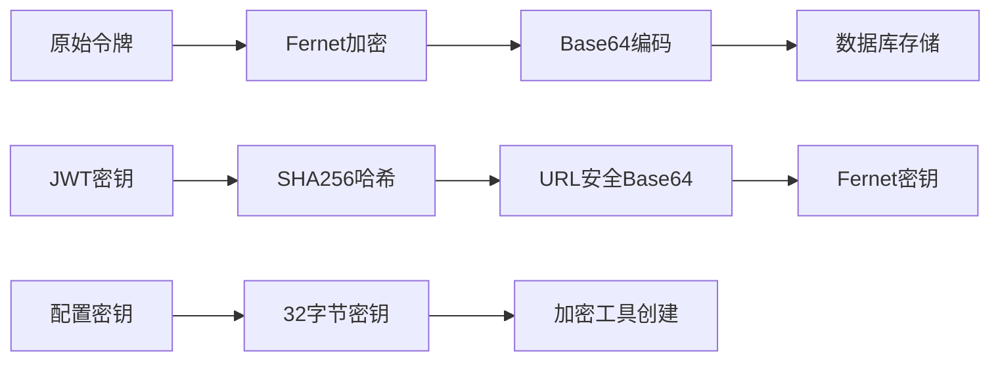

**图表来源**
- [token_manager.py](file://enterprise/server/auth/token_manager.py#L47-L75)

### 存储结构设计

| 存储类型 | 表名 | 主要字段 | 加密级别 |
|---------|------|----------|----------|
| 认证令牌 | auth_tokens | access_token, refresh_token | Fernet加密 |
| 离线令牌 | offline_tokens | offline_token | JWT负载加密 |
| Webhook信息 | gitlab_webhooks | webhook_secret, webhook_url | 敏感信息独立存储 |

**节来源**
- [token_manager.py](file://enterprise/server/auth/token_manager.py#L169-L188)
- [token_manager.py](file://enterprise/server/auth/token_manager.py#L585-L590)

## 错误处理与重试机制

### 异常处理策略

系统实现了全面的异常处理和重试机制：

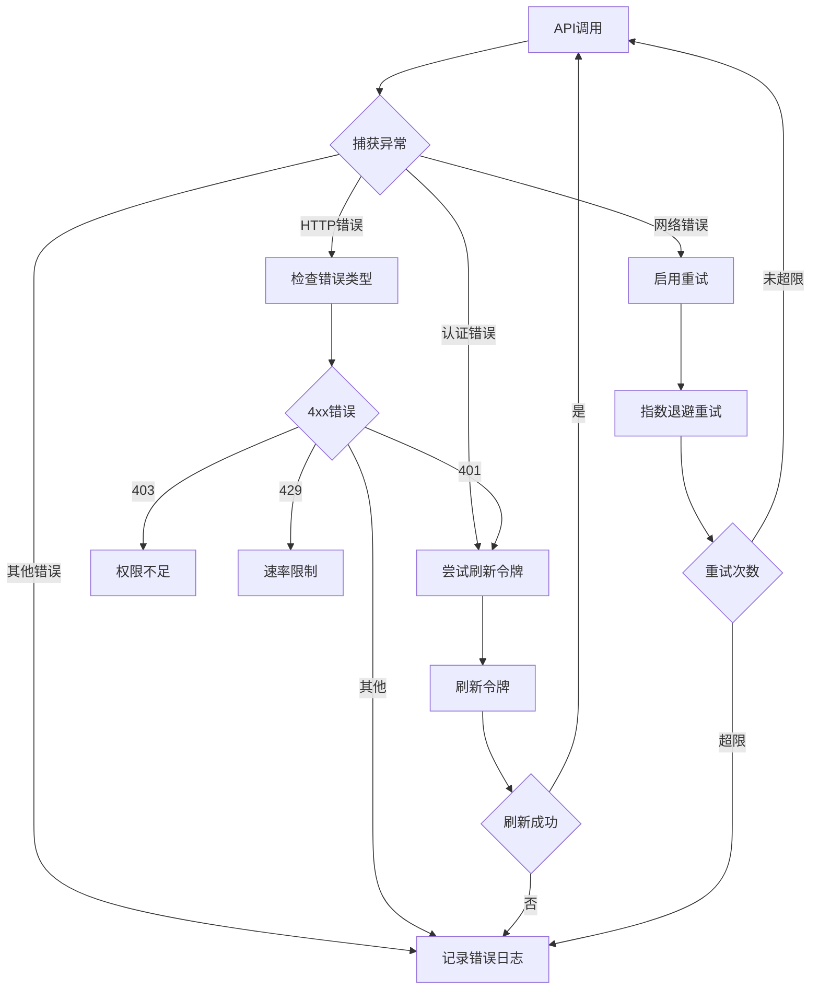

**图表来源**
- [token_manager.py](file://enterprise/server/auth/token_manager.py#L289-L329)
- [token_manager.py](file://enterprise/server/auth/token_manager.py#L444-L461)

### 重试配置

| 错误类型 | 重试策略 | 最大重试次数 | 退避算法 |
|---------|----------|-------------|----------|
| Keycloak连接错误 | 指数退避 | 2次 | 默认 |
| 令牌刷新失败 | 线性退避 | 3次 | 自定义 |
| API调用失败 | 固定间隔 | 5次 | 等待3秒 |

**节来源**
- [token_manager.py](file://enterprise/server/auth/token_manager.py#L444-L461)
- [token_manager.py](file://enterprise/server/auth/token_manager.py#L468-L488)

## 性能优化考虑

### 缓存策略

系统实现了多层次缓存机制以提高性能：

| 缓存层级 | 缓存内容 | 过期时间 | 实现位置 |
|---------|----------|----------|----------|
| 内存缓存 | 用户信息 | 1小时 | TokenManager |
| 数据库缓存 | 仓库列表 | 4小时 | SaaSGitLabService |
| HTTP缓存 | API响应 | 5分钟 | GitLabServiceImpl |
| 令牌缓存 | 访问令牌 | 4小时 | AuthTokenStore |

### 并发控制

系统采用了多种并发控制策略：

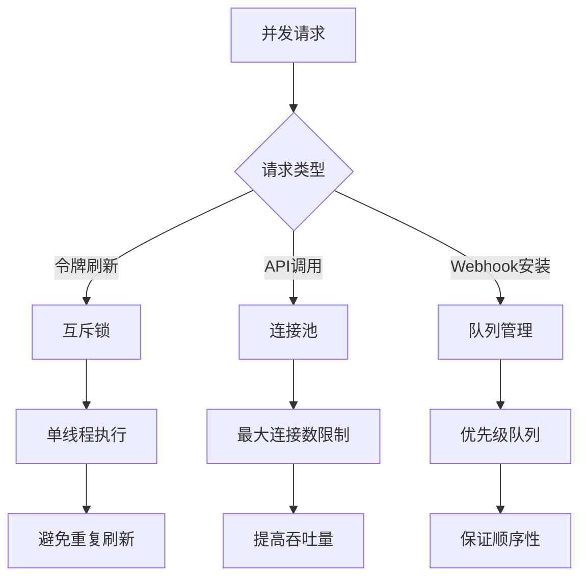

## 故障排除指南

### 常见问题诊断

| 问题症状 | 可能原因 | 排查步骤 | 解决方案 |
|---------|----------|----------|----------|
| 无法获取GitLab令牌 | Keycloak认证失败 | 检查Keycloak配置 | 重新配置认证提供商 |
| 令牌刷新失败 | 网络连接问题 | 检查网络连通性 | 重启服务或检查防火墙 |
| Webhook安装失败 | 用户权限不足 | 验证GitLab权限 | 联系管理员提升权限 |
| API调用超时 | 速率限制 | 检查API使用频率 | 实现请求限流 |

### 日志分析

系统提供了详细的日志记录用于问题诊断：

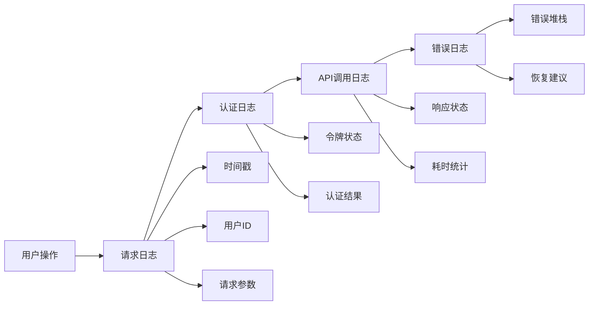

**节来源**
- [gitlab_service.py](file://enterprise/integrations/gitlab/gitlab_service.py#L47-L57)
- [token_manager.py](file://enterprise/server/auth/token_manager.py#L264-L275)

## 总结

OpenHands的GitLab认证与令牌管理系统是一个完整、安全、高性能的解决方案。系统通过以下特性确保了良好的用户体验和安全性：

1. **完整的OAuth2.0流程**：支持标准的授权码流程，包含严格的状态验证和CSRF防护
2. **智能令牌管理**：自动处理令牌刷新、过期检测和错误恢复
3. **安全的数据存储**：采用多层加密策略保护敏感信息
4. **可靠的回调机制**：确保事件驱动的功能正常运行
5. **完善的错误处理**：提供重试机制和详细的错误日志
6. **高效的性能优化**：通过缓存和并发控制提升系统响应速度

该系统为OpenHands平台提供了坚实的GitLab集成功础，支持企业级的认证需求和大规模部署要求。