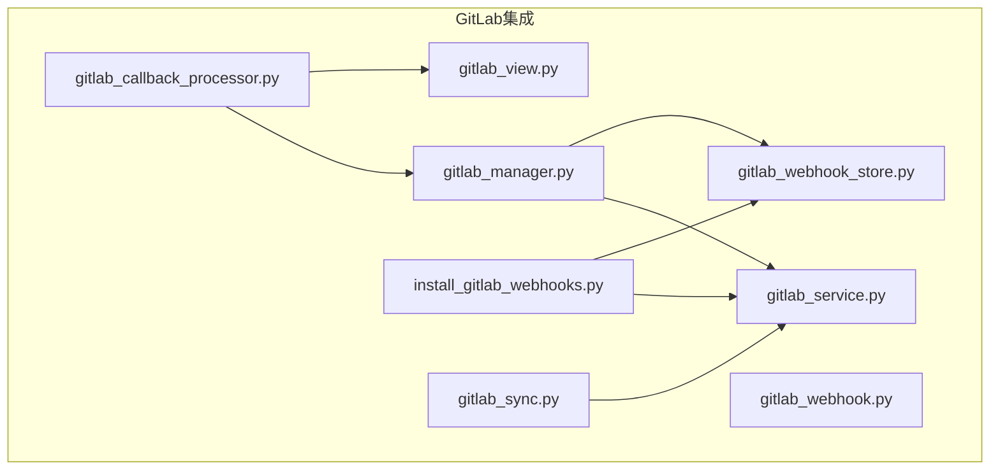
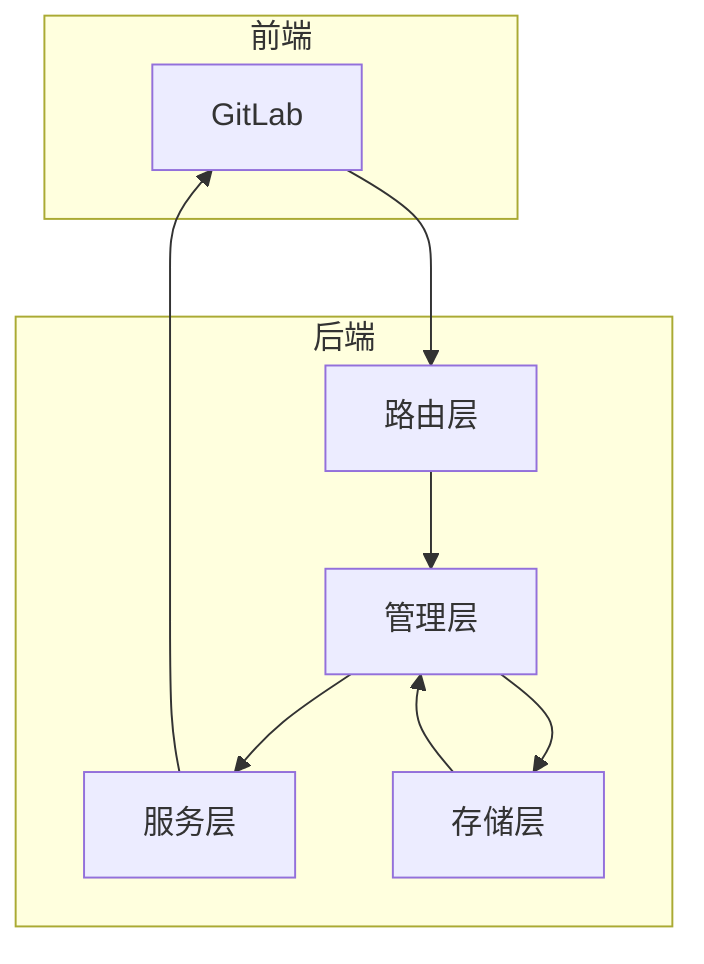
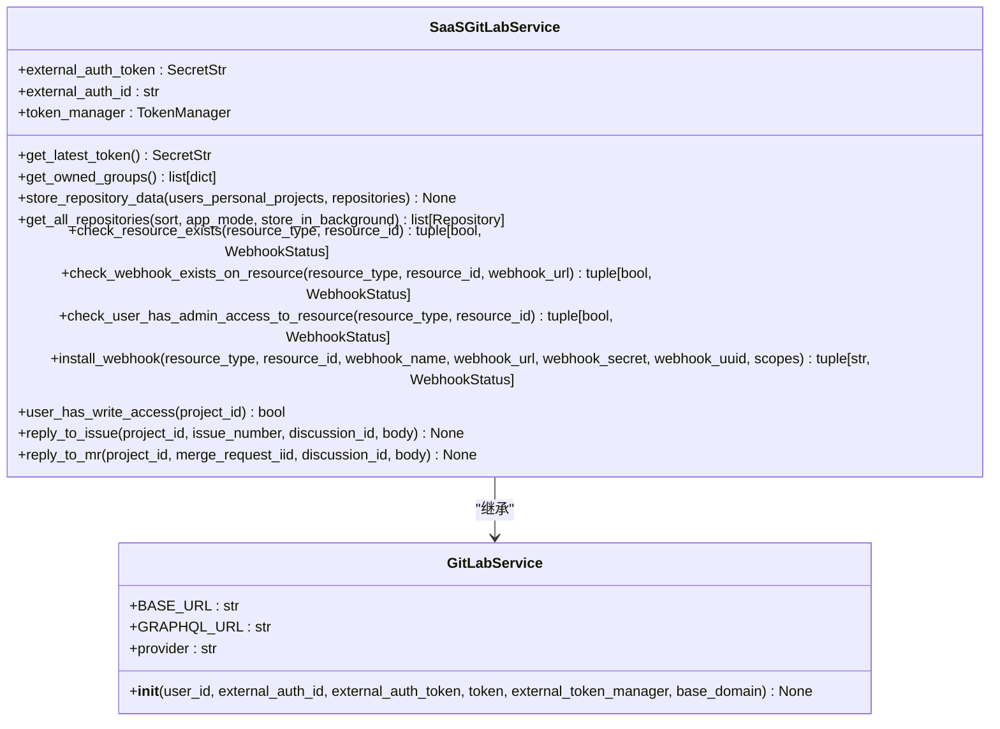
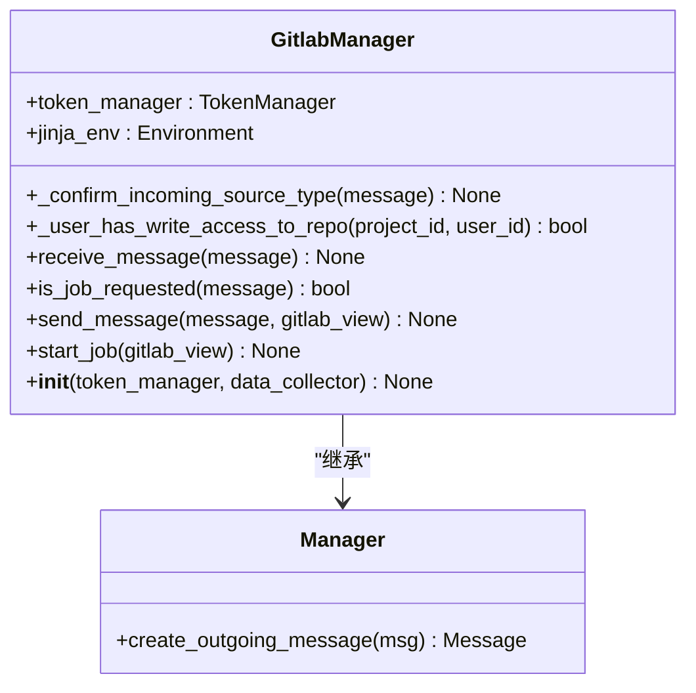
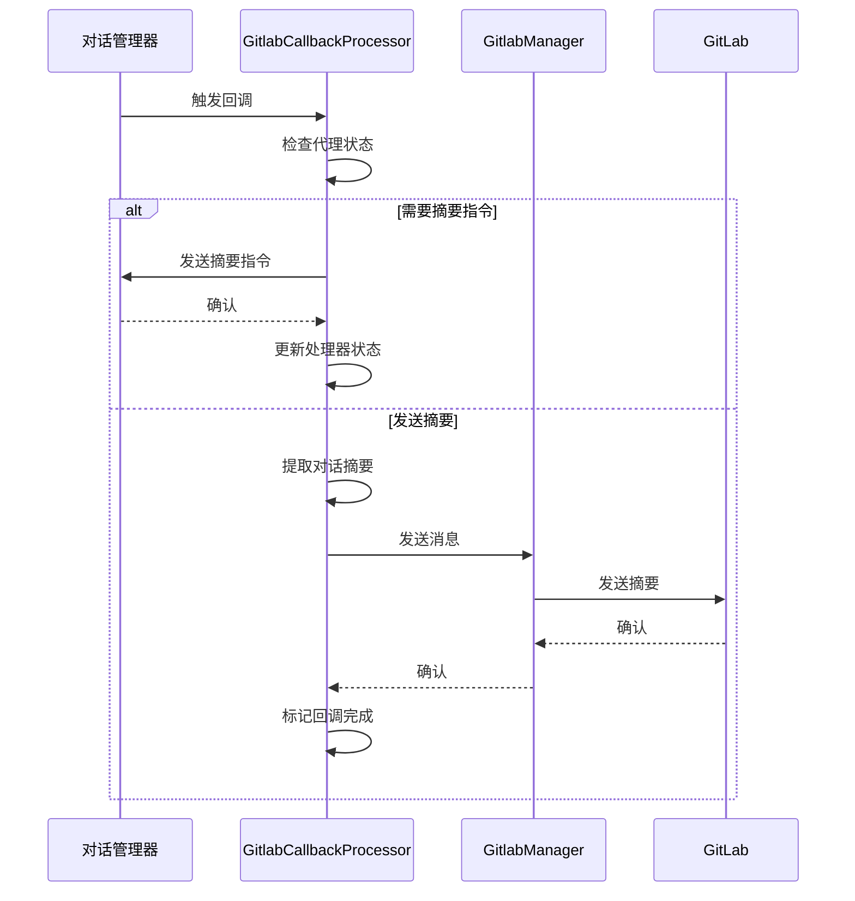
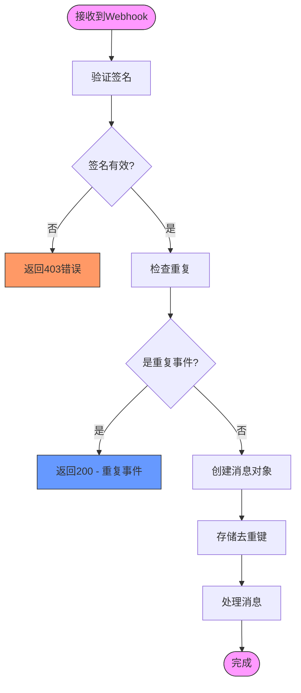
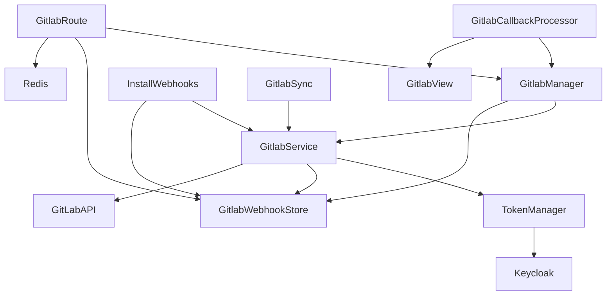

# GitLab集成

<cite>
**本文档引用的文件**
- [gitlab_manager.py](file://enterprise/integrations/gitlab/gitlab_manager.py)
- [gitlab_service.py](file://enterprise/integrations/gitlab/gitlab_service.py)
- [gitlab_service.py](file://openhands/integrations/gitlab/gitlab_service.py)
- [gitlab_callback_processor.py](file://enterprise/server/conversation_callback_processor/gitlab_callback_processor.py)
- [gitlab_view.py](file://enterprise/integrations/gitlab/gitlab_view.py)
- [gitlab_sync.py](file://enterprise/server/auth/gitlab_sync.py)
- [install_gitlab_webhooks.py](file://enterprise/sync/install_gitlab_webhooks.py)
- [gitlab_webhook.py](file://enterprise/storage/gitlab_webhook.py)
- [gitlab_webhook_store.py](file://enterprise/storage/gitlab_webhook_store.py)
- [token_manager.py](file://enterprise/server/auth/token_manager.py)
- [auth.py](file://enterprise/server/routes/auth.py)
- [gitlab.py](file://enterprise/server/routes/integration/gitlab.py)
</cite>

## 目录
1. [简介](#简介)
2. [项目结构](#项目结构)
3. [核心组件](#核心组件)
4. [架构概述](#架构概述)
5. [详细组件分析](#详细组件分析)
6. [依赖分析](#依赖分析)
7. [性能考虑](#性能考虑)
8. [故障排除指南](#故障排除指南)
9. [结论](#结论)

## 简介
本文档详细介绍了OpenHands平台中GitLab集成的实现，涵盖了OAuth认证、令牌管理、Webhook处理和事件回调机制。文档深入分析了gitlab.py中实现的与GitLab API的交互模式，包括项目访问、合并请求创建、代码审查和状态更新。同时，文档解释了gitlab_service.py和gitlab_manager.py中的业务逻辑实现，以及如何处理GitLab特定的工作流如分支保护规则和合并策略。

## 项目结构
GitLab集成相关的代码分布在多个目录中，主要位于enterprise/integrations/gitlab/目录下。该集成包括服务层、管理器、视图、回调处理器和Webhook存储等组件，形成了一个完整的GitLab集成解决方案。

**图源**
- [gitlab_manager.py](file://enterprise/integrations/gitlab/gitlab_manager.py)
- [gitlab_service.py](file://enterprise/integrations/gitlab/gitlab_service.py)
- [gitlab_callback_processor.py](file://enterprise/server/conversation_callback_processor/gitlab_callback_processor.py)
- [gitlab_view.py](file://enterprise/integrations/gitlab/gitlab_view.py)
- [gitlab_webhook_store.py](file://enterprise/storage/gitlab_webhook_store.py)
- [install_gitlab_webhooks.py](file://enterprise/sync/install_gitlab_webhooks.py)
- [gitlab_sync.py](file://enterprise/server/auth/gitlab_sync.py)

**章节源**
- [gitlab_manager.py](file://enterprise/integrations/gitlab/gitlab_manager.py)
- [gitlab_service.py](file://enterprise/integrations/gitlab/gitlab_service.py)
- [gitlab_callback_processor.py](file://enterprise/server/conversation_callback_processor/gitlab_callback_processor.py)
- [gitlab_view.py](file://enterprise/integrations/gitlab/gitlab_view.py)
- [gitlab_webhook_store.py](file://enterprise/storage/gitlab_webhook_store.py)
- [install_gitlab_webhooks.py](file://enterprise/sync/install_gitlab_webhooks.py)
- [gitlab_sync.py](file://enterprise/server/auth/gitlab_sync.py)

## 核心组件
GitLab集成的核心组件包括SaaSGitLabService、GitlabManager、GitlabCallbackProcessor和GitlabWebhookStore。这些组件协同工作，实现了完整的GitLab集成功能，包括认证、令牌管理、Webhook处理和事件回调。

**章节源**
- [gitlab_service.py](file://enterprise/integrations/gitlab/gitlab_service.py)
- [gitlab_manager.py](file://enterprise/integrations/gitlab/gitlab_manager.py)
- [gitlab_callback_processor.py](file://enterprise/server/conversation_callback_processor/gitlab_callback_processor.py)
- [gitlab_webhook_store.py](file://enterprise/storage/gitlab_webhook_store.py)

## 架构概述
GitLab集成的架构基于分层设计，包括服务层、管理层、存储层和路由层。服务层负责与GitLab API的直接交互，管理层处理业务逻辑，存储层管理Webhook配置，路由层处理Webhook事件。

**图源**
- [gitlab.py](file://enterprise/server/routes/integration/gitlab.py)
- [gitlab_manager.py](file://enterprise/integrations/gitlab/gitlab_manager.py)
- [gitlab_service.py](file://enterprise/integrations/gitlab/gitlab_service.py)
- [gitlab_webhook_store.py](file://enterprise/storage/gitlab_webhook_store.py)

## 详细组件分析

### SaaSGitLabService分析
SaaSGitLabService是GitLab集成的核心服务类，负责与GitLab API的所有交互。它继承自GitLabService，并实现了特定于SaaS环境的功能。

**图源**
- [gitlab_service.py](file://enterprise/integrations/gitlab/gitlab_service.py)
- [gitlab_service.py](file://openhands/integrations/gitlab/gitlab_service.py)

**章节源**
- [gitlab_service.py](file://enterprise/integrations/gitlab/gitlab_service.py)

### GitlabManager分析
GitlabManager是GitLab集成的管理层，负责处理GitLab事件的接收和分发。它与SaaSGitLabService和GitlabCallbackProcessor协同工作，实现了完整的事件处理流程。

**图源**
- [gitlab_manager.py](file://enterprise/integrations/gitlab/gitlab_manager.py)

**章节源**
- [gitlab_manager.py](file://enterprise/integrations/gitlab/gitlab_manager.py)

### GitlabCallbackProcessor分析
GitlabCallbackProcessor负责处理对话回调，将对话摘要发送回GitLab。它在对话状态改变时被触发，实现了与GitLab的双向通信。

**图源**
- [gitlab_callback_processor.py](file://enterprise/server/conversation_callback_processor/gitlab_callback_processor.py)

**章节源**
- [gitlab_callback_processor.py](file://enterprise/server/conversation_callback_processor/gitlab_callback_processor.py)

### Webhook处理流程
GitLab Webhook的处理流程包括验证签名、去重检查、消息创建和事件分发。这个流程确保了Webhook事件的可靠处理。

**图源**
- [gitlab.py](file://enterprise/server/routes/integration/gitlab.py)

**章节源**
- [gitlab.py](file://enterprise/server/routes/integration/gitlab.py)

## 依赖分析
GitLab集成依赖于多个内部和外部组件。内部依赖包括TokenManager、Storage组件和ConversationManager，外部依赖包括GitLab API和Redis。

**图源**
- [gitlab_service.py](file://enterprise/integrations/gitlab/gitlab_service.py)
- [gitlab_manager.py](file://enterprise/integrations/gitlab/gitlab_manager.py)
- [gitlab_callback_processor.py](file://enterprise/server/conversation_callback_processor/gitlab_callback_processor.py)
- [gitlab_webhook_store.py](file://enterprise/storage/gitlab_webhook_store.py)
- [install_gitlab_webhooks.py](file://enterprise/sync/install_gitlab_webhooks.py)
- [gitlab_sync.py](file://enterprise/server/auth/gitlab_sync.py)
- [gitlab.py](file://enterprise/server/routes/integration/gitlab.py)

**章节源**
- [gitlab_service.py](file://enterprise/integrations/gitlab/gitlab_service.py)
- [gitlab_manager.py](file://enterprise/integrations/gitlab/gitlab_manager.py)
- [gitlab_callback_processor.py](file://enterprise/server/conversation_callback_processor/gitlab_callback_processor.py)
- [gitlab_webhook_store.py](file://enterprise/storage/gitlab_webhook_store.py)
- [install_gitlab_webhooks.py](file://enterprise/sync/install_gitlab_webhooks.py)
- [gitlab_sync.py](file://enterprise/server/auth/gitlab_sync.py)
- [gitlab.py](file://enterprise/server/routes/integration/gitlab.py)

## 性能考虑
GitLab集成在设计时考虑了多个性能因素，包括异步操作、批量处理和缓存机制。这些设计确保了系统在高负载下的稳定性和响应性。

**章节源**
- [gitlab_service.py](file://enterprise/integrations/gitlab/gitlab_service.py)
- [gitlab_manager.py](file://enterprise/integrations/gitlab/gitlab_manager.py)
- [install_gitlab_webhooks.py](file://enterprise/sync/install_gitlab_webhooks.py)

## 故障排除指南
本节提供GitLab集成常见问题的解决方案。

### 认证失败
当用户无法通过GitLab认证时，检查以下事项：
1. 确认Keycloak配置正确
2. 检查GitLab应用的OAuth设置
3. 验证用户是否已授权应用

### Webhook未触发
当Webhook事件未被正确处理时，检查以下事项：
1. 确认Webhook已正确安装在GitLab项目中
2. 检查Webhook URL是否正确
3. 验证Webhook密钥是否匹配
4. 检查Redis连接是否正常

### 令牌过期
当GitLab令牌过期时，系统会自动尝试刷新。如果刷新失败，用户需要重新登录。

**章节源**
- [token_manager.py](file://enterprise/server/auth/token_manager.py)
- [gitlab_service.py](file://enterprise/integrations/gitlab/gitlab_service.py)
- [gitlab.py](file://enterprise/server/routes/integration/gitlab.py)

## 结论
GitLab集成通过SaaSGitLabService、GitlabManager、GitlabCallbackProcessor等组件的协同工作，实现了完整的GitLab功能集成。系统设计考虑了安全性、可靠性和性能，为用户提供了一个无缝的GitLab集成体验。通过OAuth认证、令牌管理和Webhook处理机制，系统能够安全地与GitLab API交互，并实时响应GitLab事件。