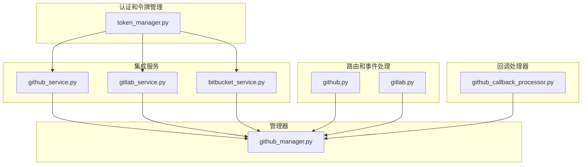
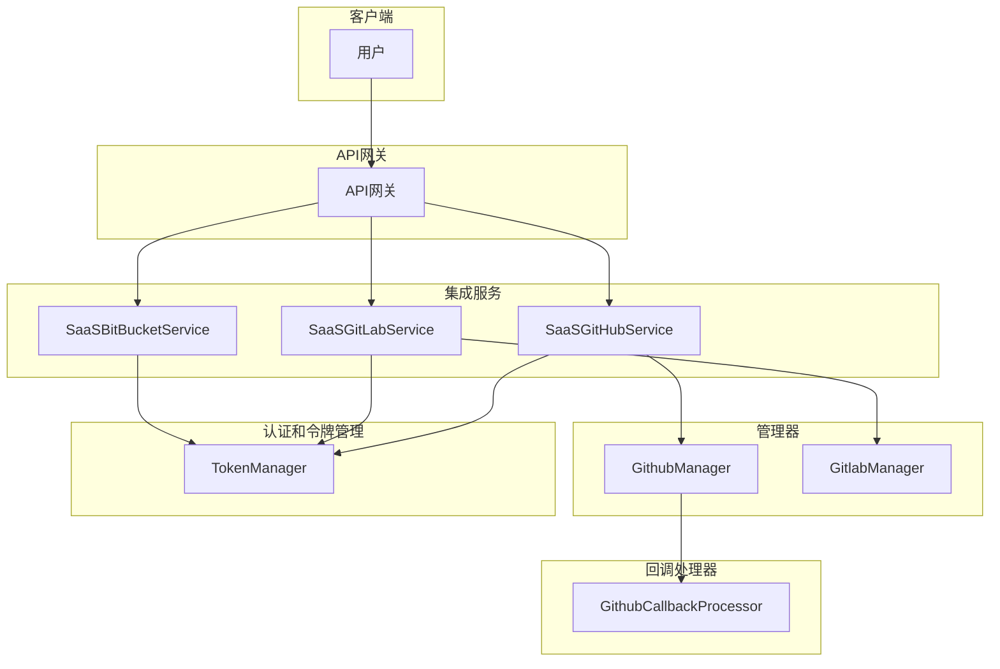
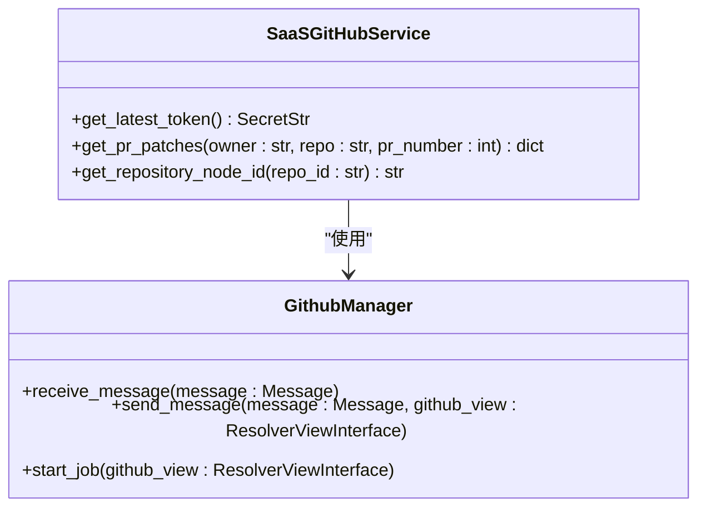
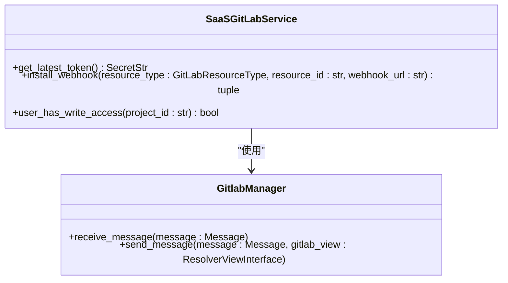
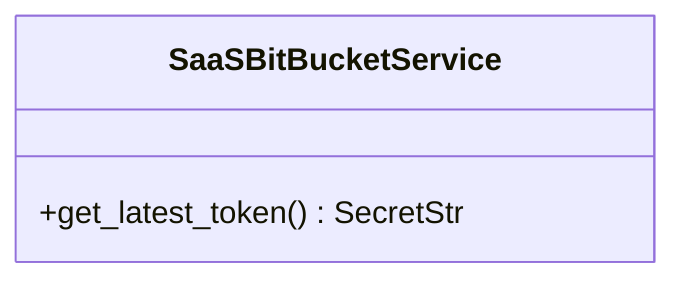
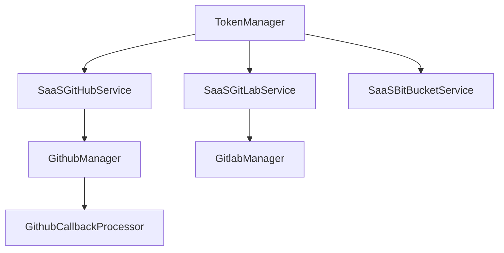

# Git集成

<cite>
**本文档引用的文件**
- [github_service.py](file://enterprise/integrations/github/github_service.py)
- [gitlab_service.py](file://enterprise/integrations/gitlab/gitlab_service.py)
- [bitbucket_service.py](file://enterprise/integrations/bitbucket/bitbucket_service.py)
- [github.py](file://enterprise/server/routes/integration/github.py)
- [gitlab.py](file://enterprise/server/routes/integration/gitlab.py)
- [github_manager.py](file://enterprise/integrations/github/github_manager.py)
- [token_manager.py](file://enterprise/server/auth/token_manager.py)
- [github_callback_processor.py](file://enterprise/server/conversation_callback_processor/github_callback_processor.py)
</cite>

## 目录
1. [简介](#简介)
2. [项目结构](#项目结构)
3. [核心组件](#核心组件)
4. [架构概述](#架构概述)
5. [详细组件分析](#详细组件分析)
6. [依赖分析](#依赖分析)
7. [性能考虑](#性能考虑)
8. [故障排除指南](#故障排除指南)
9. [结论](#结论)

## 简介
本文档详细说明了OpenHands平台与GitHub、GitLab和Bitbucket等Git平台的集成API。文档涵盖了基础Git操作端点、平台特定的集成实现、OAuth认证流程、令牌管理、Webhook处理机制和事件回调系统。此外，还提供了处理合并冲突、分支保护规则和代码审查工作流的指导，以及跨平台集成的统一抽象层设计和特定平台扩展点。

## 项目结构
项目结构清晰地组织了各个集成模块和相关服务。主要的Git集成实现在`enterprise/integrations/`目录下，包括GitHub、GitLab和Bitbucket的具体实现。路由和事件处理在`enterprise/server/routes/integration/`目录中定义，而令牌管理和认证逻辑则位于`enterprise/server/auth/`目录。

**图表来源**
- [github_service.py](file://enterprise/integrations/github/github_service.py)
- [gitlab_service.py](file://enterprise/integrations/gitlab/gitlab_service.py)
- [bitbucket_service.py](file://enterprise/integrations/bitbucket/bitbucket_service.py)
- [github.py](file://enterprise/server/routes/integration/github.py)
- [gitlab.py](file://enterprise/server/routes/integration/gitlab.py)
- [github_manager.py](file://enterprise/integrations/github/github_manager.py)
- [token_manager.py](file://enterprise/server/auth/token_manager.py)
- [github_callback_processor.py](file://enterprise/server/conversation_callback_processor/github_callback_processor.py)

**章节来源**
- [github_service.py](file://enterprise/integrations/github/github_service.py)
- [gitlab_service.py](file://enterprise/integrations/gitlab/gitlab_service.py)
- [bitbucket_service.py](file://enterprise/integrations/bitbucket/bitbucket_service.py)
- [github.py](file://enterprise/server/routes/integration/github.py)
- [gitlab.py](file://enterprise/server/routes/integration/gitlab.py)

## 核心组件
核心组件包括`SaaSGitHubService`、`SaaSGitLabService`和`SaaSBitBucketService`，它们分别处理与GitHub、GitLab和Bitbucket的集成。这些服务通过`TokenManager`获取最新的访问令牌，并提供了一系列方法来处理仓库、分支、提交和拉取请求等操作。

**章节来源**
- [github_service.py](file://enterprise/integrations/github/github_service.py)
- [gitlab_service.py](file://enterprise/integrations/gitlab/gitlab_service.py)
- [bitbucket_service.py](file://enterprise/integrations/bitbucket/bitbucket_service.py)

## 架构概述
系统架构通过统一的抽象层处理不同Git平台的集成，同时提供特定平台的扩展点。`TokenManager`负责管理OAuth令牌，`GithubManager`处理GitHub事件，`GitlabManager`处理GitLab事件。Webhook事件通过`github_events`和`gitlab_events`路由处理，并通过`GithubCallbackProcessor`发送回调。

**图表来源**
- [github_service.py](file://enterprise/integrations/github/github_service.py)
- [gitlab_service.py](file://enterprise/integrations/gitlab/gitlab_service.py)
- [bitbucket_service.py](file://enterprise/integrations/bitbucket/bitbucket_service.py)
- [github_manager.py](file://enterprise/integrations/github/github_manager.py)
- [token_manager.py](file://enterprise/server/auth/token_manager.py)
- [github_callback_processor.py](file://enterprise/server/conversation_callback_processor/github_callback_processor.py)

## 详细组件分析

### GitHub集成分析
`SaaSGitHubService`类通过`get_latest_token`方法获取最新的GitHub访问令牌，并通过`get_pr_patches`方法获取拉取请求的补丁。`GithubManager`类处理GitHub事件，包括验证Webhook签名、处理事件负载和发送消息。

**图表来源**
- [github_service.py](file://enterprise/integrations/github/github_service.py)
- [github_manager.py](file://enterprise/integrations/github/github_manager.py)

### GitLab集成分析
`SaaSGitLabService`类通过`get_latest_token`方法获取最新的GitLab访问令牌，并通过`install_webhook`方法安装Webhook。`GitlabManager`类处理GitLab事件，包括验证Webhook签名、处理事件负载和发送消息。

**图表来源**
- [gitlab_service.py](file://enterprise/integrations/gitlab/gitlab_service.py)
- [gitlab_manager.py](file://enterprise/integrations/gitlab/gitlab_manager.py)

### Bitbucket集成分析
`SaaSBitBucketService`类通过`get_latest_token`方法获取最新的Bitbucket访问令牌。该服务提供了与Bitbucket API交互的基础功能。

**图表来源**
- [bitbucket_service.py](file://enterprise/integrations/bitbucket/bitbucket_service.py)

## 依赖分析
系统依赖于`TokenManager`进行OAuth令牌管理，`GithubManager`和`GitlabManager`处理平台特定的事件，`GithubCallbackProcessor`处理回调。这些组件通过清晰的接口和抽象层进行交互，确保了系统的可扩展性和维护性。

**图表来源**
- [token_manager.py](file://enterprise/server/auth/token_manager.py)
- [github_service.py](file://enterprise/integrations/github/github_service.py)
- [gitlab_service.py](file://enterprise/integrations/gitlab/gitlab_service.py)
- [bitbucket_service.py](file://enterprise/integrations/bitbucket/bitbucket_service.py)
- [github_manager.py](file://enterprise/integrations/github/github_manager.py)
- [gitlab_manager.py](file://enterprise/integrations/gitlab/gitlab_manager.py)
- [github_callback_processor.py](file://enterprise/server/conversation_callback_processor/github_callback_processor.py)

**章节来源**
- [token_manager.py](file://enterprise/server/auth/token_manager.py)
- [github_service.py](file://enterprise/integrations/github/github_service.py)
- [gitlab_service.py](file://enterprise/integrations/gitlab/gitlab_service.py)
- [bitbucket_service.py](file://enterprise/integrations/bitbucket/bitbucket_service.py)
- [github_manager.py](file://enterprise/integrations/github/github_manager.py)
- [gitlab_manager.py](file://enterprise/integrations/gitlab/gitlab_manager.py)
- [github_callback_processor.py](file://enterprise/server/conversation_callback_processor/github_callback_processor.py)

## 性能考虑
系统通过异步处理和缓存机制优化性能。`TokenManager`使用加密存储和刷新机制确保令牌的安全性和有效性。Webhook事件通过Redis进行去重，避免重复处理。此外，系统通过分页和批量处理优化API调用，减少网络延迟。

## 故障排除指南
常见问题包括OAuth令牌过期、Webhook签名验证失败和API调用速率限制。解决方案包括检查令牌有效期、验证Webhook密钥和实现重试机制。日志记录和监控工具可以帮助快速定位和解决问题。

**章节来源**
- [token_manager.py](file://enterprise/server/auth/token_manager.py)
- [github.py](file://enterprise/server/routes/integration/github.py)
- [gitlab.py](file://enterprise/server/routes/integration/gitlab.py)

## 结论
OpenHands平台通过统一的抽象层和特定平台的扩展点，实现了与GitHub、GitLab和Bitbucket的高效集成。系统设计注重安全性、可扩展性和性能，提供了完整的API文档和故障排除指南，确保开发者能够轻松集成和使用。