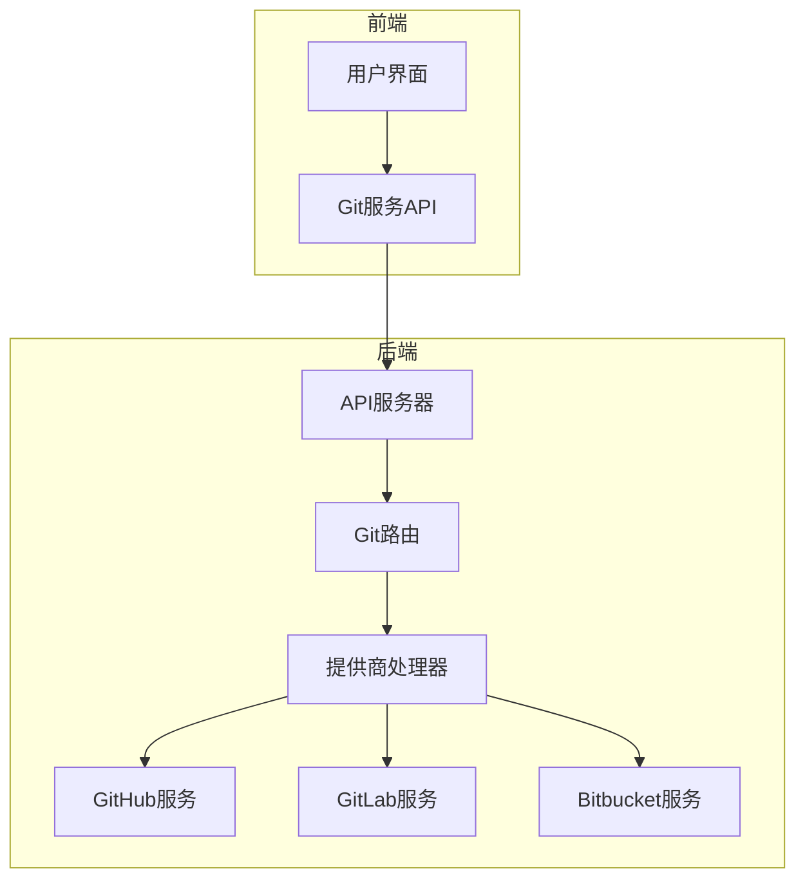
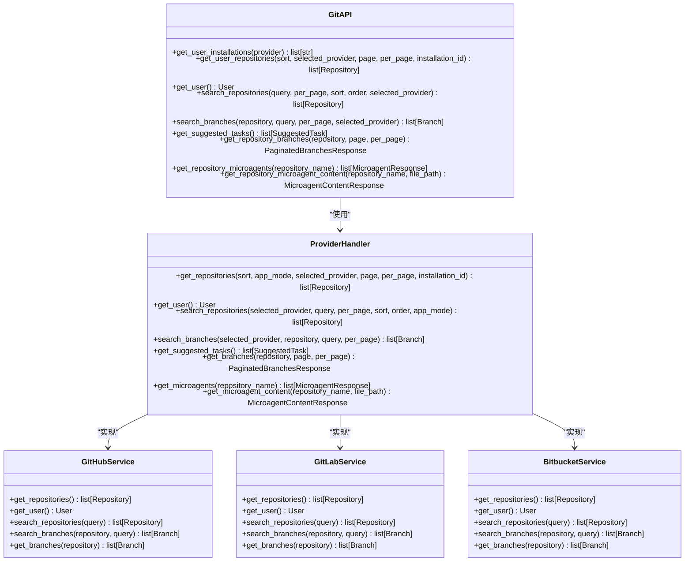
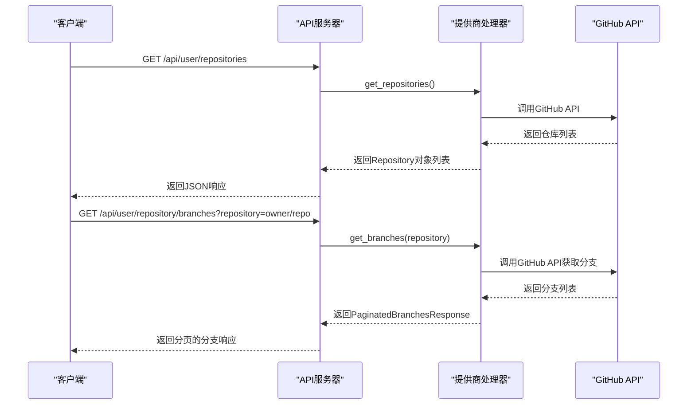
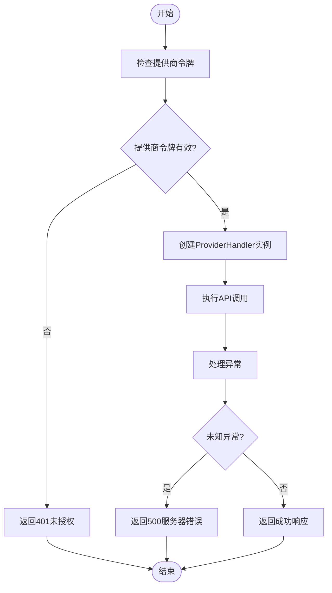
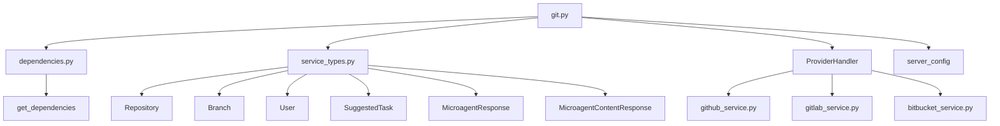
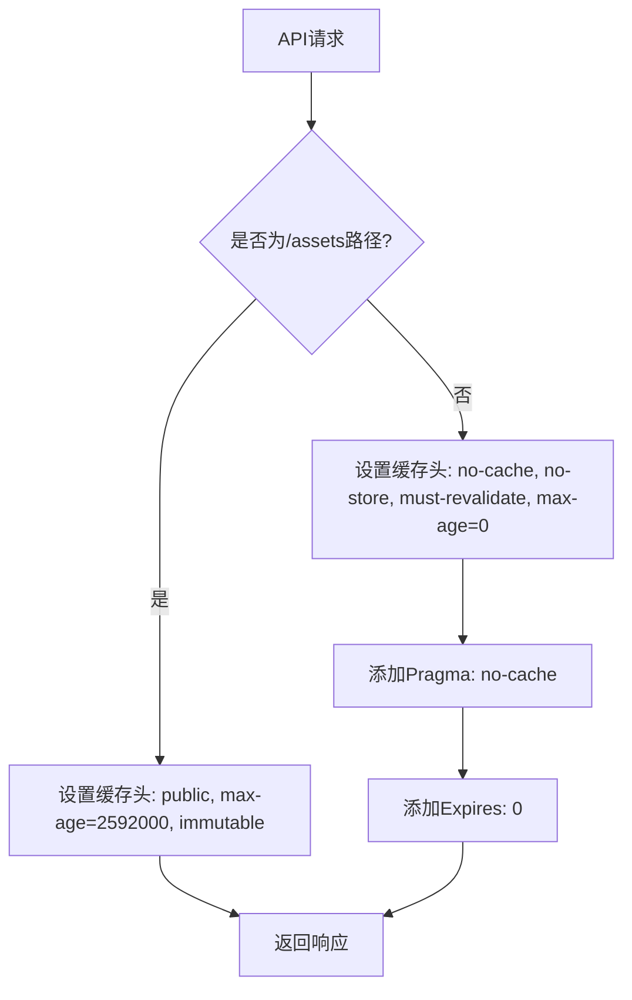
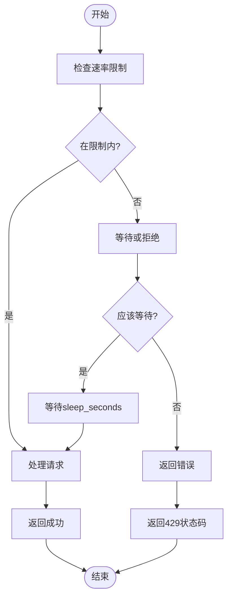
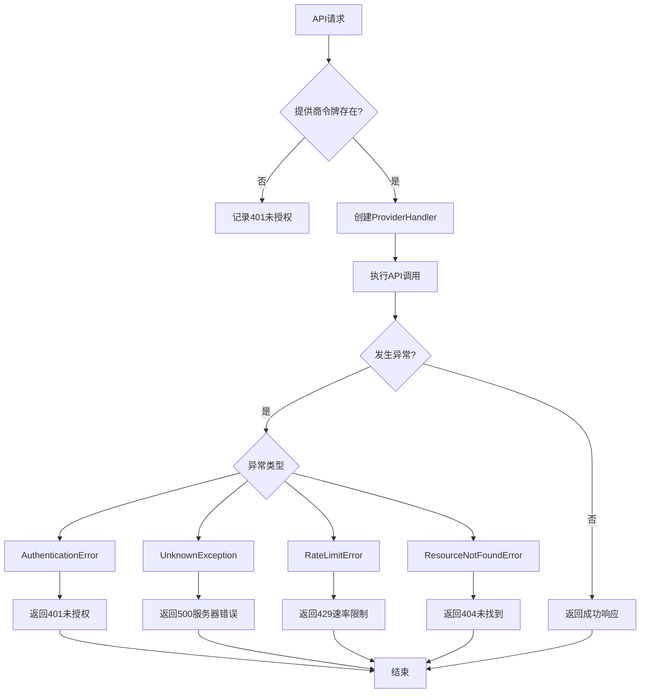

# 核心Git操作

<cite>
**本文档中引用的文件**   
- [git.py](file://openhands/server/routes/git.py)
- [service_types.py](file://openhands/integrations/service_types.py)
- [app.py](file://openhands/server/app.py)
- [v1_router.py](file://openhands/app_server/v1_router.py)
- [http_client.py](file://openhands/integrations/protocols/http_client.py)
- [middleware.py](file://openhands/server/middleware.py)
- [rate_limit.py](file://enterprise/server/rate_limit.py)
</cite>

## 目录
1. [介绍](#介绍)
2. [项目结构](#项目结构)
3. [核心组件](#核心组件)
4. [架构概述](#架构概述)
5. [详细组件分析](#详细组件分析)
6. [依赖分析](#依赖分析)
7. [性能考虑](#性能考虑)
8. [故障排除指南](#故障排除指南)
9. [结论](#结论)

## 介绍
本文档详细说明了OpenHands平台中定义的核心Git操作API。这些API提供了仓库克隆、分支管理、提交、推送、拉取等基础Git操作端点，支持GitHub、GitLab和Bitbucket等多种Git提供商。文档涵盖了RESTful API的HTTP方法、URL模式、请求/响应数据结构和认证机制，并解释了这些基础操作如何被上层平台集成所复用。

## 项目结构
OpenHands平台的Git操作功能主要分布在服务器端的路由和集成模块中。核心Git API端点定义在`openhands/server/routes/git.py`文件中，通过FastAPI框架暴露RESTful接口。这些端点依赖于`ProviderHandler`类来与不同的Git提供商进行交互，并通过统一的数据模型来处理请求和响应。

**Diagram sources**
- [git.py](file://openhands/server/routes/git.py#L35-L421)
- [app.py](file://openhands/server/app.py#L24-L92)

**Section sources**
- [git.py](file://openhands/server/routes/git.py#L1-L421)
- [app.py](file://openhands/server/app.py#L1-L97)

## 核心组件
核心Git操作API由多个端点组成，每个端点处理特定的Git操作。这些端点通过`ProviderHandler`类与不同的Git提供商进行交互，确保了代码的可扩展性和维护性。API设计遵循RESTful原则，使用标准的HTTP方法和状态码。

**Section sources**
- [git.py](file://openhands/server/routes/git.py#L38-L421)
- [service_types.py](file://openhands/integrations/service_types.py#L20-L152)

## 架构概述
核心Git操作API的架构设计旨在提供一个统一的接口来访问不同Git提供商的功能。通过`ProviderHandler`类的抽象，API能够无缝地支持多种Git提供商，同时保持一致的用户体验。

**Diagram sources**
- [git.py](file://openhands/server/routes/git.py#L38-L421)
- [service_types.py](file://openhands/integrations/service_types.py#L198-L200)

## 详细组件分析

### Git API端点分析
核心Git操作API提供了多个端点来处理不同的Git操作需求。这些端点通过统一的认证机制和错误处理策略，确保了API的可靠性和安全性。

#### API端点类图

```mermaid
classDiagram
class Repository {
+id : str
+full_name : str
+git_provider : ProviderType
+is_public : bool
+stargazers_count : int | None
+link_header : str | None
+pushed_at : str | None
+owner_type : OwnerType | None
+main_branch : str | None
}
class Branch {
+name : str
+commit_sha : str
+protected : bool
+last_push_date : str | None
}
class PaginatedBranchesResponse {
+branches : list[Branch]
+has_next_page : bool
+current_page : int
+per_page : int
+total_count : int | None
}
class User {
+id : str
+login : str
+avatar_url : str
+company : str | None
+name : str | None
+email : str | None
}
class SuggestedTask {
+git_provider : ProviderType
+task_type : TaskType
+repo : str
+issue_number : int
+title : str
}
class MicroagentResponse {
+name : str
+path : str
+created_at : str
+git_provider : ProviderType
}
class MicroagentContentResponse {
+content : str
+metadata : dict[str, Any]
}
class ProviderType {
+GITHUB : 'github'
+GITLAB : 'gitlab'
+BITBUCKET : 'bitbucket'
+ENTERPRISE_SSO : 'enterprise_sso'
}
class TaskType {
+MERGE_CONFLICTS : 'MERGE_CONFLICTS'
+FAILING_CHECKS : 'FAILING_CHECKS'
+UNRESOLVED_COMMENTS : 'UNRESOLVED_COMMENTS'
+OPEN_ISSUE : 'OPEN_ISSUE'
+OPEN_PR : 'OPEN_PR'
+CREATE_MICROAGENT : 'CREATE_MICROAGENT'
}
class OwnerType {
+USER : 'user'
+ORGANIZATION : 'organization'
}
```

**Diagram sources**
- [service_types.py](file://openhands/integrations/service_types.py#L116-L152)

#### API调用序列图

**Diagram sources**
- [git.py](file://openhands/server/routes/git.py#L65-L103)
- [service_types.py](file://openhands/integrations/service_types.py#L132-L137)

### 认证机制分析
核心Git操作API使用多种认证机制来确保安全访问。这些机制包括提供商令牌、外部认证令牌和用户ID，为不同场景提供了灵活的认证选项。

#### 认证流程图

**Diagram sources**
- [git.py](file://openhands/server/routes/git.py#L76-L102)
- [http_client.py](file://openhands/integrations/protocols/http_client.py#L77-L99)

**Section sources**
- [git.py](file://openhands/server/routes/git.py#L1-L421)
- [service_types.py](file://openhands/integrations/service_types.py#L163-L172)
- [http_client.py](file://openhands/integrations/protocols/http_client.py#L77-L99)

## 依赖分析
核心Git操作API依赖于多个组件和模块来实现其功能。这些依赖关系确保了API的可扩展性和维护性。

**Diagram sources**
- [git.py](file://openhands/server/routes/git.py#L1-L421)
- [service_types.py](file://openhands/integrations/service_types.py#L1-L200)

**Section sources**
- [git.py](file://openhands/server/routes/git.py#L1-L421)
- [service_types.py](file://openhands/integrations/service_types.py#L1-L200)

## 性能考虑
核心Git操作API在设计时考虑了性能优化，包括缓存控制、速率限制和错误处理。这些措施确保了API在高负载下的稳定性和可靠性。

**Diagram sources**
- [middleware.py](file://openhands/server/middleware.py#L51-L67)

### 速率限制机制

**Diagram sources**
- [middleware.py](file://openhands/server/middleware.py#L70-L106)

**Section sources**
- [middleware.py](file://openhands/server/middleware.py#L51-L111)
- [rate_limit.py](file://enterprise/server/rate_limit.py#L1-L120)

## 故障排除指南
当使用核心Git操作API时，可能会遇到各种错误。以下是一些常见问题及其解决方案。

### 错误处理流程

**Diagram sources**
- [git.py](file://openhands/server/routes/git.py#L93-L97)
- [http_client.py](file://openhands/integrations/protocols/http_client.py#L77-L99)

### 常见错误代码
| 状态码 | 错误类型 | 描述 | 解决方案 |
|--------|---------|------|---------|
| 401 | AuthenticationError | Git提供商令牌缺失或无效 | 检查并提供有效的Git提供商令牌 |
| 404 | ResourceNotFoundError | 请求的资源未找到 | 检查资源路径和权限 |
| 429 | RateLimitError | API速率限制已超出 | 等待一段时间后重试 |
| 500 | UnknownException | 未知服务器错误 | 检查服务器日志并重试 |

**Section sources**
- [git.py](file://openhands/server/routes/git.py#L93-L97)
- [http_client.py](file://openhands/integrations/protocols/http_client.py#L77-L99)
- [service_types.py](file://openhands/integrations/service_types.py#L163-L178)

## 结论
核心Git操作API为OpenHands平台提供了强大而灵活的Git功能集成。通过统一的接口和抽象层，API能够支持多种Git提供商，同时保持一致的用户体验。文档化的RESTful API设计、清晰的认证机制和全面的错误处理策略确保了API的可靠性和易用性。性能优化措施如缓存控制和速率限制进一步增强了API的稳定性和可扩展性。