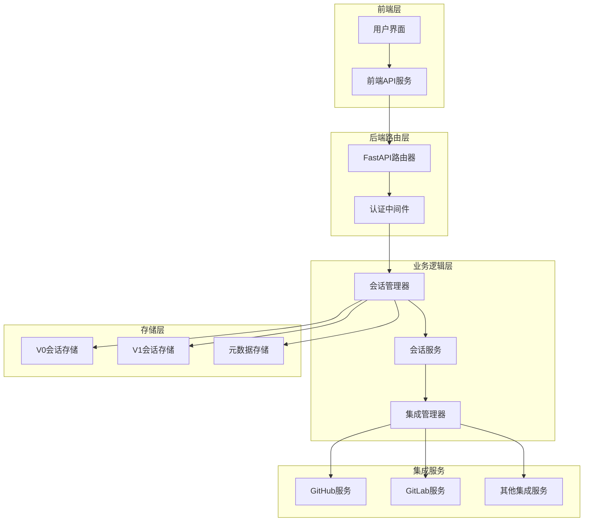
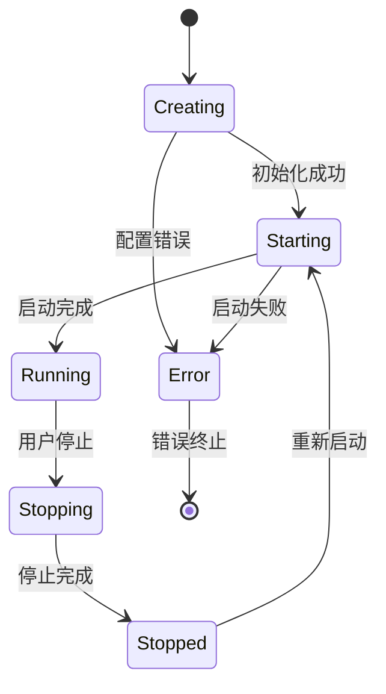
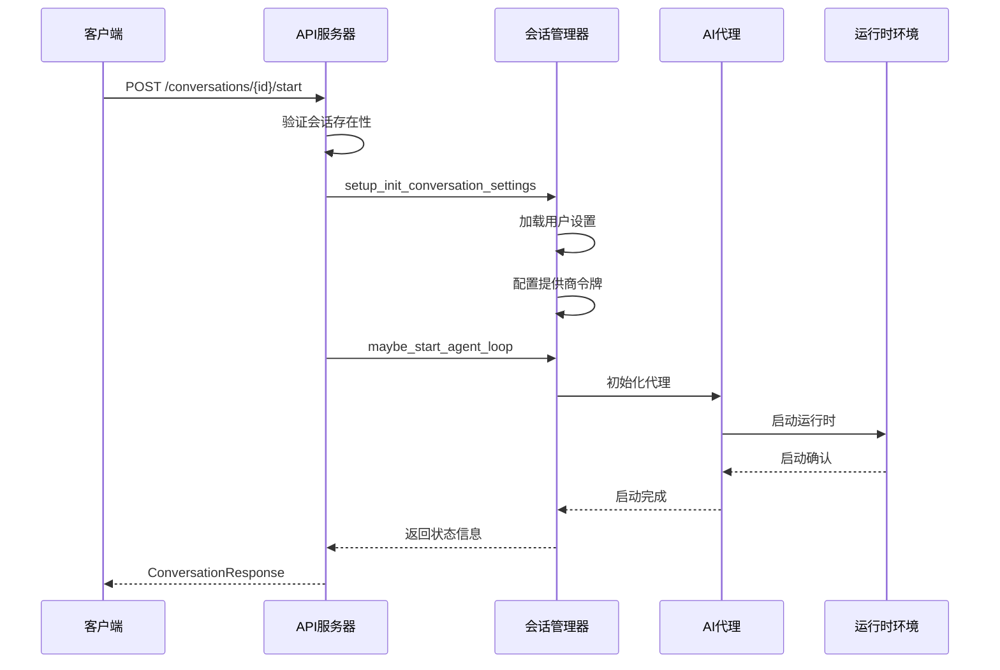
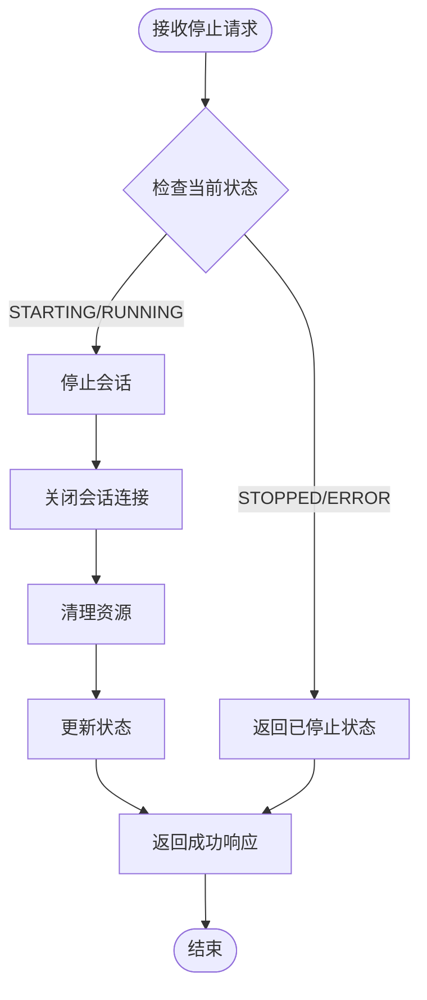
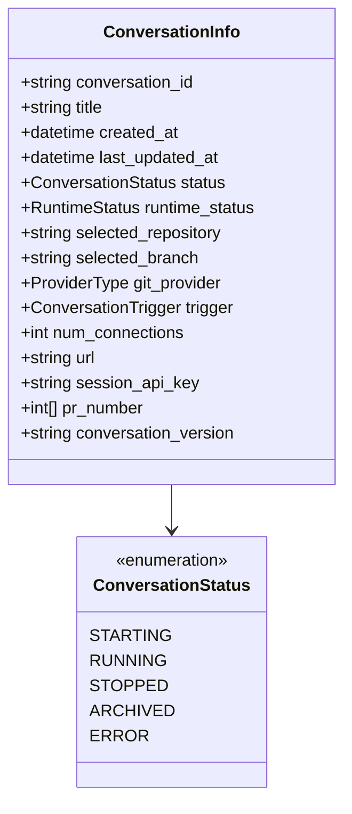
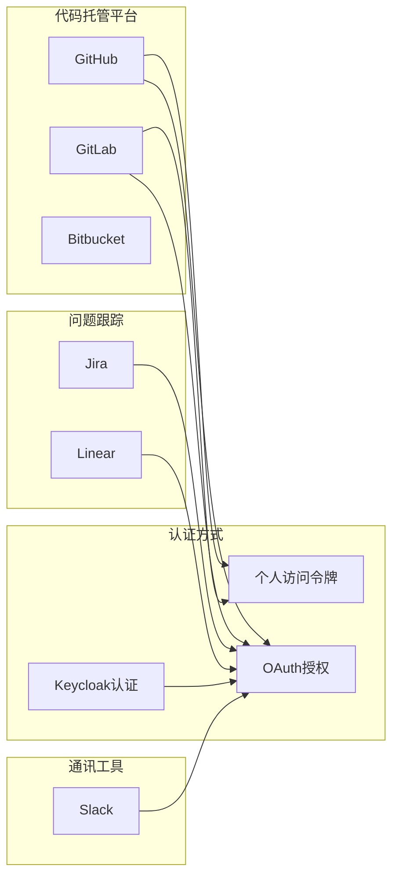
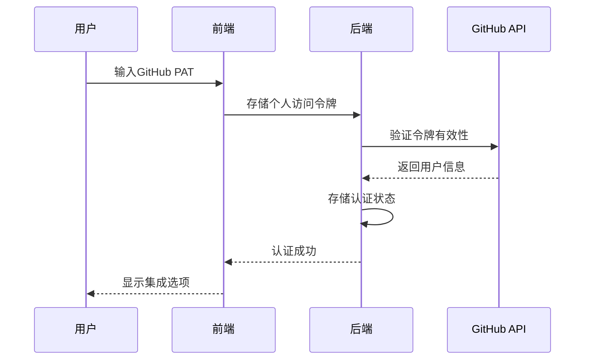
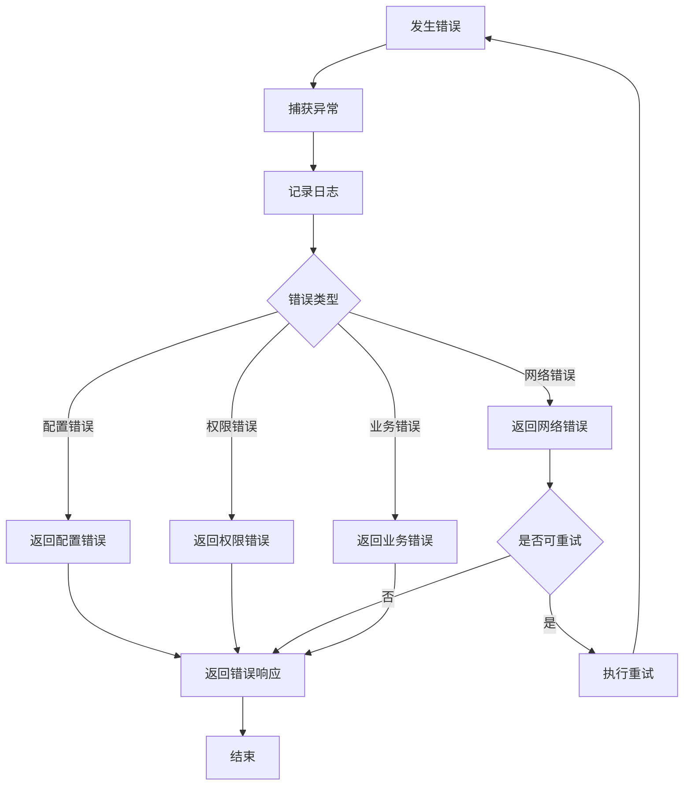

# 会话管理API文档

<cite>
**本文档引用的文件**
- [manage_conversations.py](file://openhands/server/routes/manage_conversations.py)
- [conversation_info.py](file://openhands/server/data_models/conversation_info.py)
- [conversation_status.py](file://openhands/storage/data_models/conversation_status.py)
- [conversation-info-result-set.py](file://openhands/server/data_models/conversation_info_result_set.py)
- [conversation-service.api.ts](file://frontend/src/api/conversation-service/conversation-service.api.ts)
- [v1-conversation-service.api.ts](file://frontend/src/api/conversation-service/v1-conversation-service.api.ts)
- [provider.py](file://openhands/integrations/provider.py)
- [github_service.py](file://openhands/integrations/github/github_service.py)
- [gitlab_service.py](file://openhands/integrations/gitlab/gitlab_service.py)
- [conversation-status.ts](file://frontend/src/types/conversation-status.ts)
</cite>

## 目录
1. [简介](#简介)
2. [项目架构概览](#项目架构概览)
3. [核心端点详解](#核心端点详解)
4. [数据模型与状态](#数据模型与状态)
5. [集成服务与认证](#集成服务与认证)
6. [错误处理机制](#错误处理机制)
7. [实际调用示例](#实际调用示例)
8. [最佳实践指南](#最佳实践指南)

## 简介

OpenHands会话管理系统提供了完整的RESTful API接口，用于创建、管理和控制AI驱动的对话会话。该系统支持两种主要版本的会话：传统V0版本和现代化V1版本，每种版本都有不同的功能特性和技术实现。

### 主要特性

- **多版本兼容**：同时支持V0和V1会话版本
- **多平台集成**：支持GitHub、GitLab等代码托管平台
- **实时通信**：基于WebSocket的实时消息传递
- **状态管理**：完整的会话生命周期状态跟踪
- **权限控制**：细粒度的用户权限验证

## 项目架构概览



**图表来源**
- [manage_conversations.py](file://openhands/server/routes/manage_conversations.py#L98-L102)
- [conversation_service.py](file://openhands/server/services/conversation_service.py#L214-L245)

## 核心端点详解

### 1. 创建新会话 - POST /conversations

#### 功能描述
创建新的AI对话会话，支持多种初始化选项和集成配置。

#### 请求参数

| 参数名 | 类型 | 必需 | 描述 |
|--------|------|------|------|
| repository | string | 否 | 要连接的代码仓库URL |
| git_provider | ProviderType | 否 | Git服务提供商类型 |
| selected_branch | string | 否 | 要使用的分支名称 |
| initial_user_msg | string | 否 | 初始用户消息内容 |
| image_urls | string[] | 否 | 图片文件URL列表 |
| replay_json | string | 否 | 回放事件的JSON字符串 |
| suggested_task | SuggestedTask | 否 | 建议的任务配置 |
| create_microagent | CreateMicroagent | 否 | 微代理创建配置 |
| conversation_instructions | string | 否 | 会话指令说明 |
| mcp_config | MCPConfig | 否 | MCP配置信息 |

#### 响应格式

```typescript
interface ConversationResponse {
  status: string;
  conversation_id: string;
  message?: string;
  conversation_status: ConversationStatus;
}
```

#### 状态转换图



**图表来源**
- [manage_conversations.py](file://openhands/server/routes/manage_conversations.py#L212-L280)

**章节来源**
- [manage_conversations.py](file://openhands/server/routes/manage_conversations.py#L212-L280)

### 2. 获取会话详情 - GET /conversations/{conversation_id}

#### 功能描述
检索指定会话的详细信息，包括状态、配置和连接信息。

#### 路径参数

| 参数名 | 类型 | 必需 | 描述 |
|--------|------|------|------|
| conversation_id | string | 是 | 会话唯一标识符 |

#### 响应格式

```typescript
interface ConversationInfo {
  conversation_id: string;
  title: string;
  last_updated_at: Date;
  status: ConversationStatus;
  runtime_status: RuntimeStatus;
  selected_repository: string;
  selected_branch: string;
  git_provider: ProviderType;
  trigger: ConversationTrigger;
  num_connections: number;
  url: string;
  session_api_key: string;
  created_at: Date;
  pr_number: number[];
  conversation_version: string;
}
```

#### 版本兼容性

系统自动检测并处理不同版本的会话：
- **V1会话**：使用应用级会话服务
- **V0会话**：使用传统元数据存储

**章节来源**
- [manage_conversations.py](file://openhands/server/routes/manage_conversations.py#L433-L466)
- [conversation_info.py](file://openhands/server/data_models/conversation_info.py#L10-L31)

### 3. 启动会话 - POST /conversations/{conversation_id}/start

#### 功能描述
启动指定会话的AI代理循环，开始处理用户交互。

#### 请求参数

| 参数名 | 类型 | 必需 | 描述 |
|--------|------|------|------|
| providers_set | ProvidersSetModel | 否 | 提供商集合配置 |

#### 响应格式

```typescript
interface ProvidersSetModel {
  providers_set?: ProviderType[];
}
```

#### 启动流程



**图表来源**
- [manage_conversations.py](file://openhands/server/routes/manage_conversations.py#L645-L720)

**章节来源**
- [manage_conversations.py](file://openhands/server/routes/manage_conversations.py#L645-L720)

### 4. 停止会话 - POST /conversations/{conversation_id}/stop

#### 功能描述
安全地停止正在运行的会话，清理资源并保存状态。

#### 停止流程



**图表来源**
- [manage_conversations.py](file://openhands/server/routes/manage_conversations.py#L722-L775)

**章节来源**
- [manage_conversations.py](file://openhands/server/routes/manage_conversations.py#L722-L775)

## 数据模型与状态

### 会话状态枚举



**图表来源**
- [conversation_status.py](file://openhands/storage/data_models/conversation_status.py#L13-L24)
- [conversation_info.py](file://openhands/server/data_models/conversation_info.py#L10-L31)

### 状态转换规则

| 当前状态 | 目标操作 | 新状态 | 条件 |
|----------|----------|--------|------|
| STOPPED | start | STARTING | 会话存在且未被删除 |
| STARTING | 启动完成 | RUNNING | 启动成功 |
| RUNNING | 停止 | STOPPED | 用户主动停止 |
| RUNNING | 错误 | ERROR | 运行时异常 |
| ERROR | 重试 | STARTING | 清理错误状态 |
| ARCHIVED | 无法操作 | ARCHIVED | 会话已被归档 |

**章节来源**
- [conversation_status.py](file://openhands/storage/data_models/conversation_status.py#L13-L24)
- [manage_conversations.py](file://openhands/server/routes/manage_conversations.py#L1394-L1417)

## 集成服务与认证

### 支持的集成平台



**图表来源**
- [provider.py](file://openhands/integrations/provider.py#L150-L185)
- [github_service.py](file://openhands/integrations/github/github_service.py#L44-L78)
- [gitlab_service.py](file://openhands/integrations/gitlab/gitlab_service.py#L42-L82)

### 认证流程

#### GitHub集成认证



**图表来源**
- [github_service.py](file://openhands/integrations/github/github_service.py#L44-L78)

#### GitLab集成认证

GitLab支持自定义域名和OAuth认证流程，提供更大的灵活性。

**章节来源**
- [provider.py](file://openhands/integrations/provider.py#L150-L185)
- [github_service.py](file://openhands/integrations/github/github_service.py#L44-L78)
- [gitlab_service.py](file://openhands/integrations/gitlab/gitlab_service.py#L42-L82)

## 错误处理机制

### 常见错误类型

| 错误代码 | 消息ID | 描述 | 解决方案 |
|----------|--------|------|----------|
| 400 | CONFIGURATION$SETTINGS_NOT_FOUND | 设置未找到 | 检查用户设置配置 |
| 400 | ERROR_LLM_AUTHENTICATION | LLM认证失败 | 验证LLM API密钥 |
| 403 | AUTHORIZATION$PERMISSION_DENIED | 权限不足 | 检查用户权限 |
| 404 | CONVERSATION$NOT_FOUND | 会话不存在 | 验证会话ID |
| 500 | CONVERSATION$UPDATE_ERROR | 更新失败 | 检查数据库连接 |

### 错误处理流程



**图表来源**
- [manage_conversations.py](file://openhands/server/routes/manage_conversations.py#L280-L298)

### 会话冲突处理

当多个客户端尝试同时修改同一会话时，系统采用以下策略：

1. **乐观锁**：检查最后修改时间戳
2. **版本控制**：维护会话版本号
3. **合并策略**：智能合并冲突变更
4. **回滚机制**：失败时恢复到稳定状态

**章节来源**
- [manage_conversations.py](file://openhands/server/routes/manage_conversations.py#L280-L298)
- [manage_conversations.py](file://openhands/server/routes/manage_conversations.py#L777-L795)

## 实际调用示例

### 创建新会话示例

```bash
# 基础会话创建
curl -X POST "https://api.openhands.ai/api/conversations" \
  -H "Content-Type: application/json" \
  -H "Authorization: Bearer YOUR_TOKEN" \
  -d '{
    "repository": "https://github.com/example/repo.git",
    "git_provider": "github",
    "selected_branch": "main",
    "initial_user_msg": "请分析这个代码库"
  }'

# 响应示例
{
  "status": "ok",
  "conversation_id": "conv_1234567890abcdef",
  "conversation_status": "STARTING"
}
```

### 启动会话示例

```bash
# 启动会话
curl -X POST "https://api.openhands.ai/api/conversations/conv_1234567890abcdef/start" \
  -H "Content-Type: application/json" \
  -H "Authorization: Bearer YOUR_TOKEN" \
  -d '{
    "providers_set": ["github", "gitlab"]
  }'

# 响应示例
{
  "status": "ok",
  "conversation_id": "conv_1234567890abcdef",
  "conversation_status": "RUNNING"
}
```

### 获取会话详情示例

```bash
# 获取会话信息
curl -X GET "https://api.openhands.ai/api/conversations/conv_1234567890abcdef" \
  -H "Authorization: Bearer YOUR_TOKEN"

# 响应示例
{
  "conversation_id": "conv_1234567890abcdef",
  "title": "代码审查会话",
  "status": "RUNNING",
  "runtime_status": "READY",
  "selected_repository": "https://github.com/example/repo.git",
  "selected_branch": "main",
  "git_provider": "github",
  "created_at": "2024-01-15T10:30:00Z",
  "last_updated_at": "2024-01-15T10:35:00Z",
  "num_connections": 2,
  "pr_number": [123, 124],
  "conversation_version": "V1"
}
```

### 停止会话示例

```bash
# 停止会话
curl -X POST "https://api.openhands.ai/api/conversations/conv_1234567890abcdef/stop" \
  -H "Authorization: Bearer YOUR_TOKEN"

# 响应示例
{
  "status": "ok",
  "conversation_id": "conv_1234567890abcdef",
  "message": "Conversation stopped successfully",
  "conversation_status": "STOPPED"
}
```

### 错误处理示例

```bash
# 会话不存在的情况
curl -X GET "https://api.openhands.ai/api/conversations/nonexistent_id" \
  -H "Authorization: Bearer YOUR_TOKEN"

# 响应示例
{
  "status": "error",
  "message": "Conversation not found",
  "msg_id": "CONVERSATION$NOT_FOUND"
}
```

## 最佳实践指南

### 1. 会话生命周期管理

- **及时清理**：定期清理长时间未使用的会话
- **状态监控**：持续监控会话状态变化
- **资源优化**：合理分配会话资源，避免过度消耗

### 2. 错误恢复策略

```typescript
// 推荐的错误处理模式
async function safeConversationOperation(operation: () => Promise<any>) {
  try {
    return await operation();
  } catch (error) {
    if (error.msg_id === 'CONVERSATION$NOT_FOUND') {
      // 会话不存在，重新创建
      return await createNewConversation();
    } else if (error.msg_id === 'AUTHORIZATION$PERMISSION_DENIED') {
      // 权限不足，刷新认证
      await refreshAuthentication();
      return await operation();
    } else {
      // 其他错误，记录并报告
      logger.error('Conversation operation failed:', error);
      throw error;
    }
  }
}
```

### 3. 性能优化建议

- **批量操作**：对多个会话操作使用批量API
- **缓存策略**：缓存频繁访问的会话信息
- **异步处理**：使用异步API减少阻塞

### 4. 安全考虑

- **令牌管理**：安全存储和传输认证令牌
- **权限验证**：严格验证用户对会话的操作权限
- **审计日志**：记录所有会话相关操作

### 5. 监控和告警

建立完善的监控体系，包括：

- 会话创建成功率
- 平均响应时间
- 错误率统计
- 资源使用情况

通过这些最佳实践，可以确保会话管理系统的稳定性和可靠性，为用户提供优质的AI交互体验。