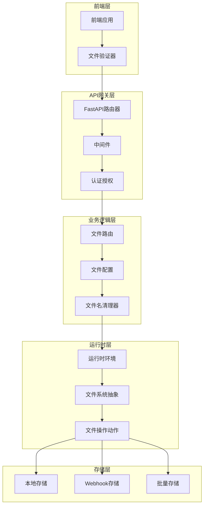
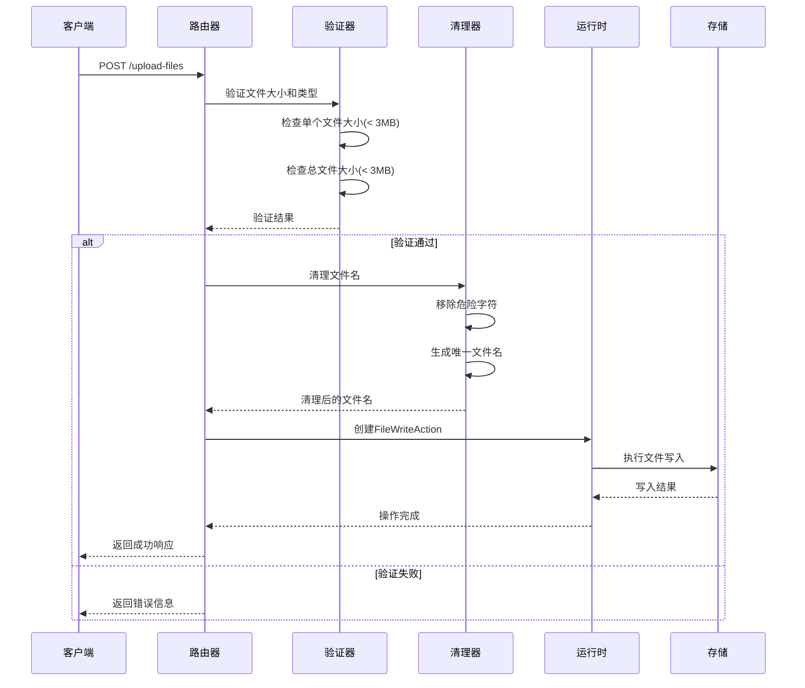
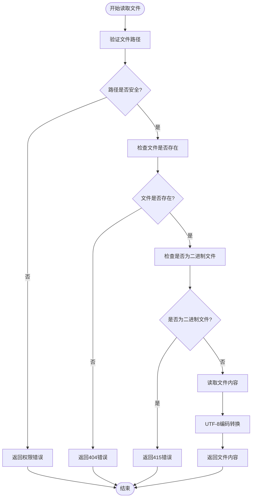
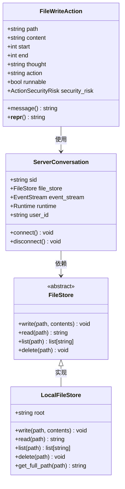
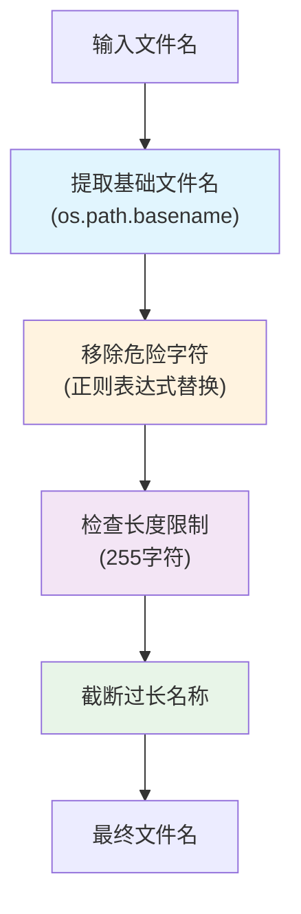
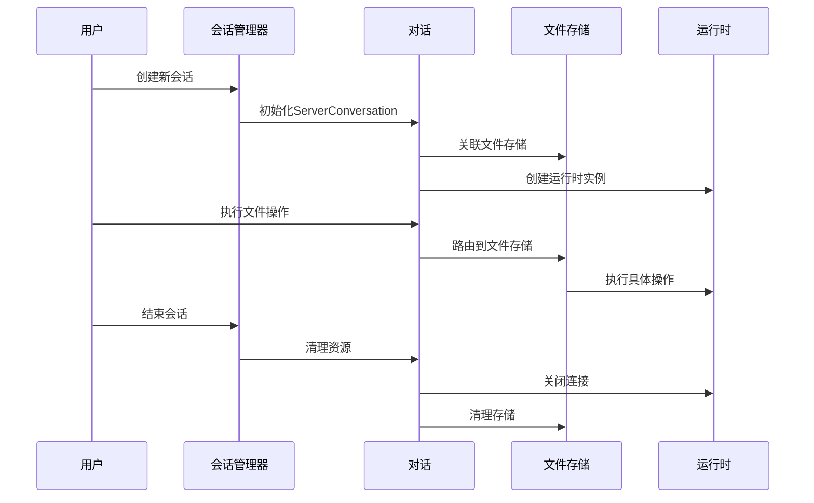
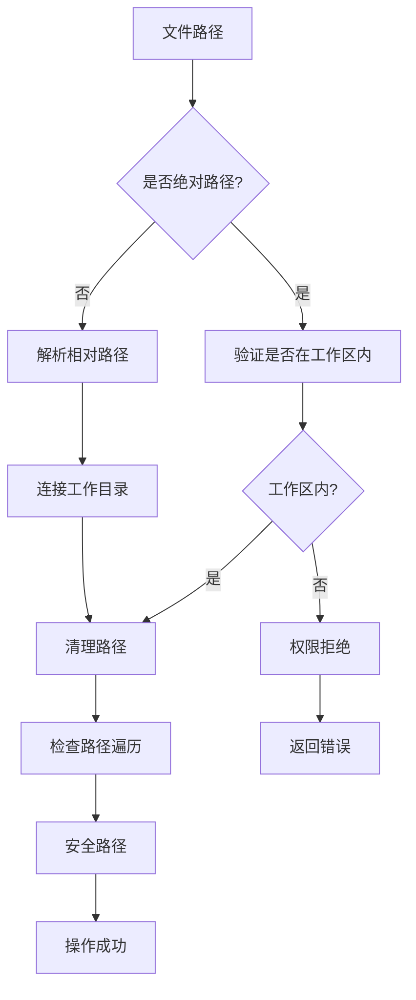
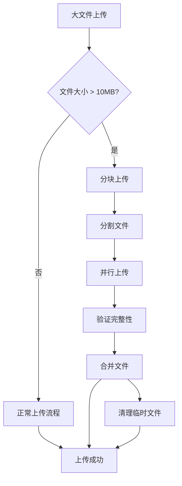
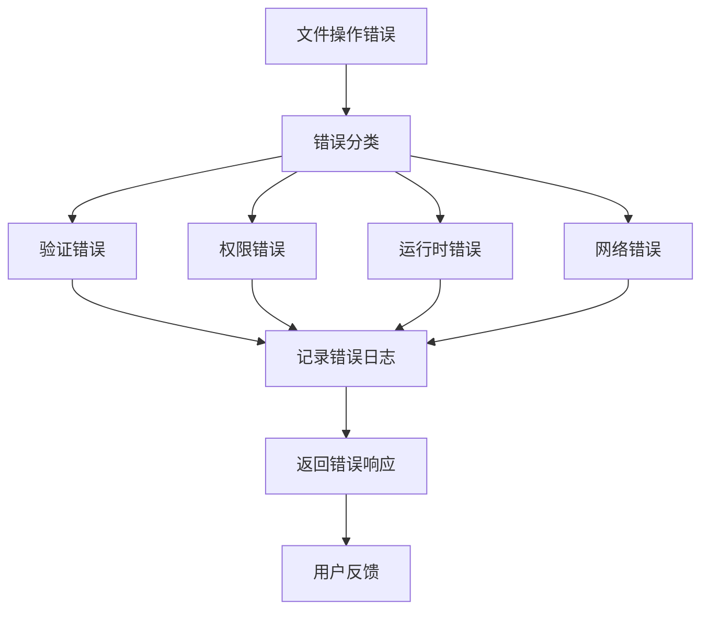

# 文件操作API详细文档

<cite>
**本文档中引用的文件**
- [files.py](file://openhands/server/routes/files.py)
- [files.py](file://openhands/server/files.py)
- [files.py](file://openhands/storage/files.py)
- [local.py](file://openhands/storage/local.py)
- [file_config.py](file://openhands/server/file_config.py)
- [conversation.py](file://openhands/server/session/conversation.py)
- [middleware.py](file://openhands/server/middleware.py)
- [files.py](file://openhands/events/action/files.py)
- [file-validation.ts](file://frontend/src/utils/file-validation.ts)
- [use-v1-upload-files.ts](file://frontend/src/hooks/mutation/use-v1-upload-files.ts)
</cite>

## 目录
1. [简介](#简介)
2. [系统架构概览](#系统架构概览)
3. [核心API端点](#核心api端点)
4. [文件操作详细分析](#文件操作详细分析)
5. [文件配置与安全](#文件配置与安全)
6. [会话生命周期管理](#会话生命周期管理)
7. [运行时环境处理](#运行时环境处理)
8. [最佳实践指南](#最佳实践指南)
9. [故障排除](#故障排除)
10. [总结](#总结)

## 简介

OpenHands文件操作API提供了全面的文件管理功能，支持文件上传、下载、读取和写入操作。该系统采用分层架构设计，包含前端验证、后端路由处理、文件存储抽象和运行时执行等多个层次，确保文件操作的安全性、可靠性和高性能。

## 系统架构概览

文件操作系统的整体架构如下：



**图表来源**
- [files.py](file://openhands/server/routes/files.py#L1-L319)
- [conversation.py](file://openhands/server/session/conversation.py#L1-L67)
- [local.py](file://openhands/storage/local.py#L1-L54)

## 核心API端点

### POST /api/conversations/{conversation_id}/upload-files

文件上传端点，支持多文件同时上传。

#### 功能特性
- 支持多个文件同时上传（multipart/form-data）
- 自动文件名清理和唯一性处理
- 文件大小和类型限制检查
- 错误处理和回退机制

#### 请求参数
| 参数名 | 类型 | 必需 | 描述 |
|--------|------|------|------|
| files | list[UploadFile] | 是 | 要上传的文件列表 |

#### 响应格式
```json
{
  "uploaded_files": ["/workspace/file1.txt", "/workspace/file2.py"],
  "skipped_files": [
    {
      "name": "large_file.exe",
      "reason": "File size exceeds limit"
    }
  ]
}
```

### GET /api/conversations/{conversation_id}/list-files

列出指定路径下的文件列表。

#### 功能特性
- 支持指定目录路径查询
- 自动过滤系统文件和隐藏文件
- 基于.gitignore的智能过滤
- 异步文件系统访问

#### 查询参数
| 参数名 | 类型 | 必需 | 默认值 | 描述 |
|--------|------|------|--------|------|
| path | str | 否 | None | 要列出文件的目录路径 |

### GET /api/conversations/{conversation_id}/select-file

获取指定文件的内容。

#### 功能特性
- 支持文本文件和二进制文件
- 自动检测文件类型
- 错误处理和媒体类型检查
- 内容编码转换

#### 查询参数
| 参数名 | 类型 | 必需 | 描述 |
|--------|------|------|------|
| file | str | 是 | 要读取的文件路径 |

**节来源**
- [files.py](file://openhands/server/routes/files.py#L287-L318)
- [files.py](file://openhands/server/routes/files.py#L43-L110)
- [files.py](file://openhands/server/routes/files.py#L127-L182)

## 文件操作详细分析

### 文件上传流程

文件上传过程包含多个验证和处理步骤：



**图表来源**
- [files.py](file://openhands/server/routes/files.py#L287-L318)
- [file-validation.ts](file://frontend/src/utils/file-validation.ts#L1-L70)

### 文件读取流程

文件读取操作遵循严格的安全检查机制：



**图表来源**
- [files.py](file://openhands/server/routes/files.py#L127-L182)
- [files.py](file://openhands/runtime/utils/files.py#L12-L41)

### 文件写入操作

文件写入操作使用事件驱动架构：



**图表来源**
- [files.py](file://openhands/events/action/files.py#L30-L57)
- [files.py](file://openhands/storage/files.py#L4-L20)
- [local.py](file://openhands/storage/local.py#L8-L54)
- [conversation.py](file://openhands/server/session/conversation.py#L12-L67)

**节来源**
- [files.py](file://openhands/events/action/files.py#L8-L57)
- [files.py](file://openhands/storage/files.py#L1-L20)

## 文件配置与安全

### 文件名清理机制

系统实现了严格的文件名清理机制以防止目录遍历攻击：



**图表来源**
- [file_config.py](file://openhands/server/file_config.py#L18-L29)

### 文件类型和大小限制

系统支持灵活的文件上传配置：

| 配置项 | 默认值 | 描述 |
|--------|--------|------|
| max_file_size_mb | 无限制 | 单个文件最大大小(MB) |
| restrict_file_types | false | 是否限制文件类型 |
| allowed_extensions | .* | 允许的文件扩展名列表 |
| FILES_TO_IGNORE | 多个系统文件夹 | 自动忽略的文件和目录 |

### 权限控制系统

文件操作具有多层次的权限控制：

1. **路径验证**: 确保文件操作仅限于工作区目录
2. **文件名清理**: 防止特殊字符和路径遍历
3. **运行时隔离**: 在沙箱环境中执行文件操作
4. **用户身份验证**: 基于会话的访问控制

**节来源**
- [file_config.py](file://openhands/server/file_config.py#L1-L140)
- [file-validation.ts](file://frontend/src/utils/file-validation.ts#L1-L70)

## 会话生命周期管理

### 会话与文件存储的关联

每个会话都维护独立的文件存储上下文：



**图表来源**
- [conversation.py](file://openhands/server/session/conversation.py#L12-L67)

### 会话状态管理

会话生命周期包含以下关键阶段：

1. **初始化阶段**: 创建文件存储和运行时实例
2. **活跃阶段**: 处理文件操作请求
3. **清理阶段**: 释放资源和清理临时文件

**节来源**
- [conversation.py](file://openhands/server/session/conversation.py#L1-L67)

## 运行时环境处理

### 不同运行时的文件I/O支持

系统支持多种运行时环境，每种都有特定的文件处理能力：

| 运行时类型 | 文件I/O支持 | 特殊功能 | 限制 |
|------------|-------------|----------|------|
| Docker | 完整支持 | 容器内文件系统 | 需要适当挂载 |
| CLI | 基础支持 | 命令行文件操作 | 性能较低 |
| Browser | 受限支持 | 仅浏览器可用文件 | 安全限制 |

### 文件路径处理规则

不同运行时对文件路径有不同的处理方式：



**图表来源**
- [files.py](file://openhands/runtime/utils/files.py#L12-L41)

**节来源**
- [files.py](file://openhands/runtime/utils/files.py#L1-L41)

## 最佳实践指南

### 分块上传策略

对于大文件处理，建议采用分块上传策略：

1. **前端分块**: 将大文件分割成小块
2. **并发上传**: 并行上传多个分块
3. **进度跟踪**: 实时显示上传进度
4. **断点续传**: 支持上传中断后的恢复

### 大文件处理

针对大文件的优化建议：



### 二进制文件支持

系统对二进制文件有专门的处理机制：

1. **自动检测**: 区分文本和二进制文件
2. **编码处理**: 文本文件使用UTF-8编码
3. **Base64编码**: 二进制文件进行Base64编码传输
4. **类型验证**: 前端和后端双重验证

### 性能优化建议

1. **缓存策略**: 对频繁访问的文件建立缓存
2. **压缩传输**: 对大文件启用压缩
3. **异步处理**: 使用异步操作避免阻塞
4. **批量操作**: 合并多个文件操作请求

**节来源**
- [use-v1-upload-files.ts](file://frontend/src/hooks/mutation/use-v1-upload-files.ts#L25-L82)

## 故障排除

### 常见问题及解决方案

| 问题类型 | 症状 | 可能原因 | 解决方案 |
|----------|------|----------|----------|
| 文件上传失败 | 400 Bad Request | 文件大小超限 | 减少文件大小或调整配置 |
| 权限错误 | 403 Forbidden | 路径不在工作区内 | 检查文件路径是否正确 |
| 编码错误 | 文件内容乱码 | 字符编码不匹配 | 确认文件编码格式 |
| 运行时不可用 | 500 Internal Server Error | 运行时未初始化 | 检查会话状态 |

### 错误处理机制

系统实现了完善的错误处理机制：



### 调试和监控

系统提供多种调试和监控手段：

1. **日志记录**: 详细的文件操作日志
2. **性能监控**: 文件操作时间和成功率统计
3. **错误追踪**: 异常堆栈和上下文信息
4. **用户反馈**: 友好的错误消息提示

**节来源**
- [files.py](file://openhands/server/routes/files.py#L150-L182)

## 总结

OpenHands文件操作API提供了一个完整、安全、高效的文件管理系统。通过分层架构设计，系统实现了：

1. **安全性**: 多重验证和权限控制机制
2. **可靠性**: 完善的错误处理和恢复机制
3. **可扩展性**: 抽象化的存储接口支持多种后端
4. **易用性**: 简洁的API设计和丰富的功能特性

该系统特别适用于AI代理和开发环境中的文件操作需求，为用户提供了一个强大而安全的文件管理平台。通过遵循本文档中的最佳实践指南，开发者可以充分利用系统功能，构建高质量的应用程序。