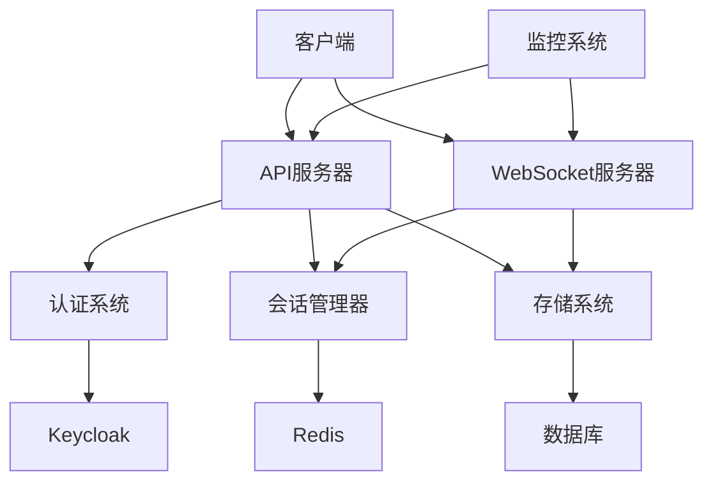
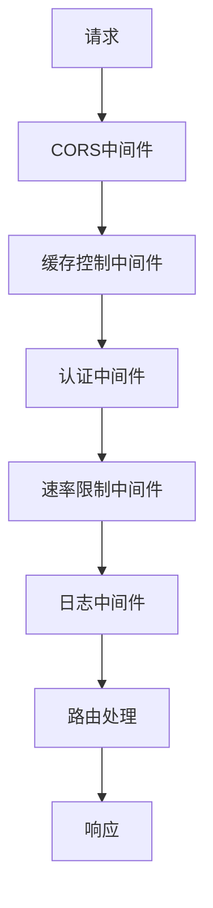
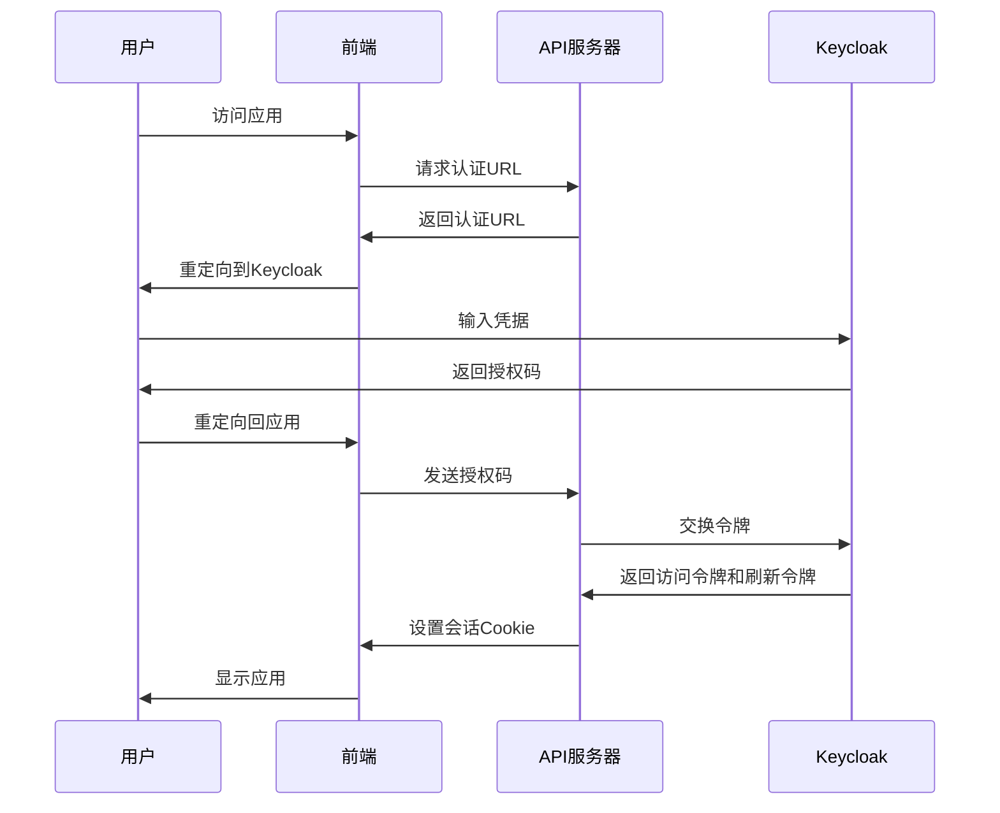
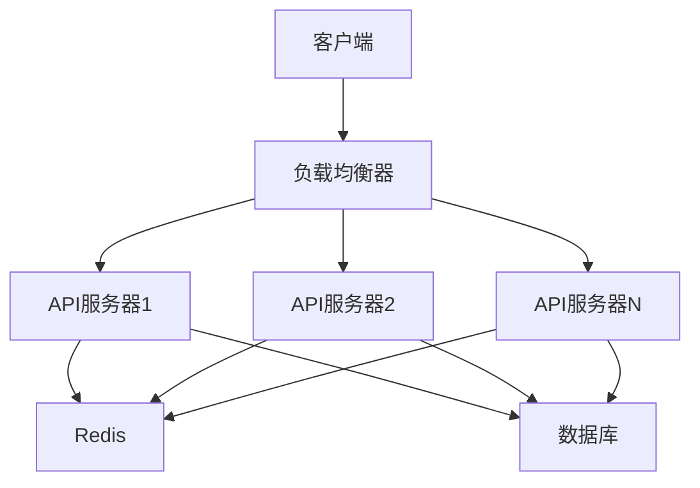
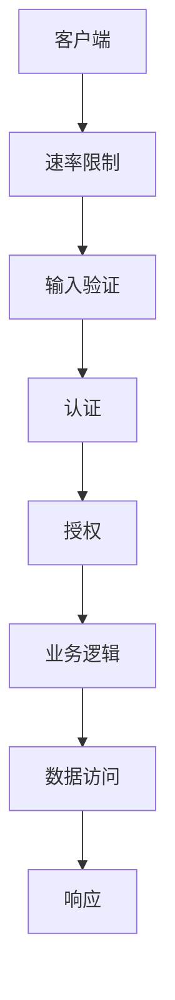
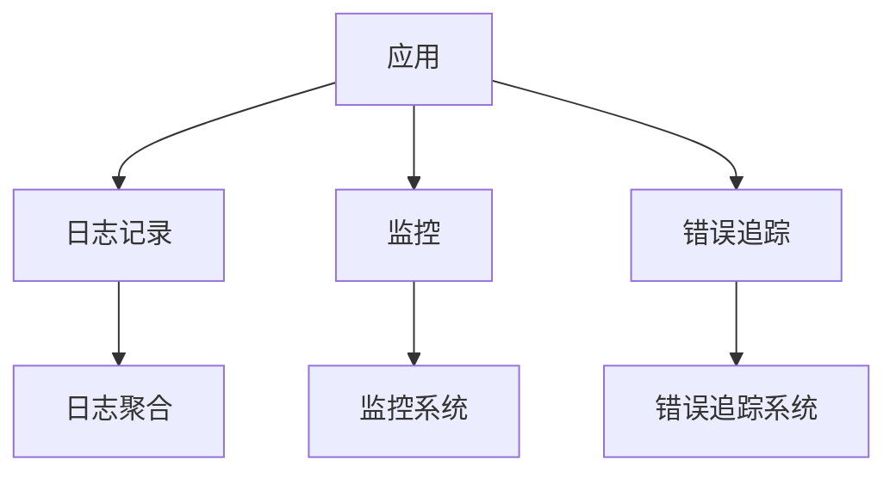
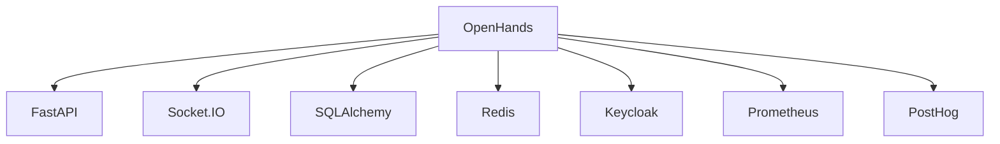

# 后端架构

<cite>
**本文档中引用的文件**   
- [saas_server.py](file://enterprise/saas_server.py)
- [app.py](file://openhands/server/app.py)
- [config.py](file://enterprise/server/config.py)
- [middleware.py](file://enterprise/server/middleware.py)
- [auth.py](file://enterprise/server/routes/auth.py)
- [rate_limit.py](file://enterprise/server/rate_limit.py)
- [logger.py](file://enterprise/server/logger.py)
- [metrics.py](file://enterprise/server/metrics.py)
- [clustered_conversation_manager.py](file://enterprise/server/clustered_conversation_manager.py)
- [dependencies.py](file://openhands/server/dependencies.py)
- [security.py](file://openhands/server/routes/security.py)
- [api_keys.py](file://enterprise/server/routes/api_keys.py)
</cite>

## 目录
1. [简介](#简介)
2. [项目结构](#项目结构)
3. [核心组件](#核心组件)
4. [架构概述](#架构概述)
5. [详细组件分析](#详细组件分析)
6. [依赖分析](#依赖分析)
7. [性能考虑](#性能考虑)
8. [故障排除指南](#故障排除指南)
9. [结论](#结论)

## 简介
OpenHands是一个开源的自动化开发平台，旨在通过AI代理帮助开发者完成编码任务。本后端架构文档详细描述了OpenHands服务器端的设计，包括FastAPI应用结构、路由组织、中间件配置、认证和授权机制、API版本控制策略、服务器性能优化、负载均衡、水平扩展能力、API网关设计、微服务通信模式、安全最佳实践、日志记录、监控和错误追踪系统的集成。

## 项目结构
OpenHands项目采用模块化设计，主要分为以下几个部分：
- `containers/`: 包含Docker容器配置
- `enterprise/`: 企业版相关代码
- `evaluation/`: 评估和基准测试代码
- `frontend/`: 前端代码
- `openhands/`: 核心功能代码
- `openhands-cli/`: CLI工具
- `openhands-ui/`: UI组件库
- `scripts/`: 脚本文件
- `tests/`: 测试代码
- `third_party/`: 第三方依赖

企业版的核心服务器代码位于`enterprise/`目录下，而核心功能代码位于`openhands/`目录下。

## 核心组件
OpenHands后端的核心组件包括FastAPI应用、Socket.IO服务器、认证系统、会话管理器、对话管理器、存储系统和监控系统。这些组件协同工作，提供一个完整的AI代理开发平台。

**Section sources**
- [saas_server.py](file://enterprise/saas_server.py)
- [app.py](file://openhands/server/app.py)

## 架构概述
OpenHands采用微服务架构，主要由以下几个部分组成：
- **API服务器**: 基于FastAPI构建，处理HTTP请求
- **WebSocket服务器**: 基于Socket.IO构建，处理实时通信
- **认证系统**: 基于Keycloak和JWT实现
- **会话管理器**: 管理用户会话和对话
- **存储系统**: 使用数据库和Redis存储数据
- **监控系统**: 使用Prometheus和PostHog进行监控和分析

**Diagram sources **
- [saas_server.py](file://enterprise/saas_server.py)
- [app.py](file://openhands/server/app.py)

## 详细组件分析

### FastAPI应用结构
OpenHands的FastAPI应用结构清晰，主要由以下几个部分组成：
- **主应用**: 在`app.py`中定义，包含基本的路由和中间件
- **企业版应用**: 在`saas_server.py`中定义，扩展了主应用的功能
- **路由**: 分散在不同的模块中，按功能组织
- **中间件**: 处理跨切面关注点，如CORS、缓存控制、认证等

企业版应用通过继承和扩展主应用来添加企业级功能，如计费、集成、监控等。

**Section sources**
- [saas_server.py](file://enterprise/saas_server.py)
- [app.py](file://openhands/server/app.py)

### 路由组织
OpenHands的路由组织遵循RESTful原则，按资源组织。主要路由包括：
- `/api/auth`: 认证相关路由
- `/api/user`: 用户相关路由
- `/api/conversations`: 对话相关路由
- `/api/files`: 文件相关路由
- `/api/settings`: 设置相关路由
- `/api/secrets`: 密钥相关路由
- `/api/billing`: 计费相关路由
- `/api/integration`: 集成相关路由

路由通过模块化的方式组织，每个功能模块有自己的路由文件，然后在主应用中注册。

**Section sources**
- [saas_server.py](file://enterprise/saas_server.py)
- [app.py](file://openhands/server/app.py)

### 中间件配置
OpenHands使用了多种中间件来处理跨切面关注点：
- **CORS中间件**: 处理跨域资源共享
- **缓存控制中间件**: 控制HTTP缓存
- **认证中间件**: 处理用户认证和授权
- **速率限制中间件**: 防止滥用
- **日志中间件**: 记录请求日志

这些中间件按顺序执行，形成一个处理管道，每个请求都会经过这个管道。

**Diagram sources **
- [middleware.py](file://enterprise/server/middleware.py)
- [app.py](file://openhands/server/app.py)

### 认证和授权机制
OpenHands的认证和授权机制基于Keycloak和JWT实现。主要流程如下：
1. 用户通过OAuth2登录
2. Keycloak返回访问令牌和刷新令牌
3. 服务器验证令牌并创建会话
4. 会话信息存储在Redis中
5. 后续请求通过JWT令牌进行认证

授权基于角色和权限，不同的用户角色有不同的访问权限。

**Diagram sources **
- [auth.py](file://enterprise/server/routes/auth.py)
- [middleware.py](file://enterprise/server/middleware.py)

### API版本控制策略
OpenHands采用URL路径版本控制策略，API版本号包含在URL路径中，如`/api/v1/`。这种策略简单明了，易于实现和理解。

向后兼容性通过以下方式保证：
- 不删除已有的API端点
- 不修改已有API端点的请求和响应格式
- 新功能通过新的API端点提供
- 弃用的API端点标记为弃用，并在文档中说明

**Section sources**
- [app.py](file://openhands/server/app.py)
- [saas_server.py](file://enterprise/saas_server.py)

### 服务器性能优化
OpenHands通过多种方式优化服务器性能：
- **异步处理**: 使用async/await进行异步I/O操作
- **连接池**: 使用连接池管理数据库连接
- **缓存**: 使用Redis缓存频繁访问的数据
- **负载均衡**: 支持多实例部署，通过负载均衡器分发请求
- **水平扩展**: 支持水平扩展，通过增加实例数量提高处理能力

**Diagram sources **
- [clustered_conversation_manager.py](file://enterprise/server/clustered_conversation_manager.py)
- [app.py](file://openhands/server/app.py)

### 负载均衡和水平扩展能力
OpenHands支持负载均衡和水平扩展，主要通过以下方式实现：
- **无状态设计**: 服务器实例是无状态的，会话信息存储在Redis中
- **共享存储**: 使用共享的数据库和Redis实例
- **服务发现**: 使用服务发现机制自动注册和发现服务实例
- **健康检查**: 提供健康检查端点，用于负载均衡器的健康检查

这种设计使得OpenHands可以轻松地水平扩展，通过增加服务器实例来提高处理能力。

**Section sources**
- [clustered_conversation_manager.py](file://enterprise/server/clustered_conversation_manager.py)
- [app.py](file://openhands/server/app.py)

### API网关设计
OpenHands的API网关设计简单直接，主要功能包括：
- **路由**: 将请求路由到相应的后端服务
- **认证**: 验证请求的认证信息
- **速率限制**: 实施速率限制策略
- **日志记录**: 记录请求日志
- **监控**: 收集监控数据

API网关作为所有外部请求的入口，提供了统一的接口和安全屏障。

**Section sources**
- [app.py](file://openhands/server/app.py)
- [middleware.py](file://enterprise/server/middleware.py)

### 微服务通信模式
OpenHands采用事件驱动的微服务通信模式，主要通过以下方式实现：
- **事件总线**: 使用Redis作为事件总线，发布和订阅事件
- **消息队列**: 使用消息队列进行异步通信
- **REST API**: 使用REST API进行同步通信
- **gRPC**: 使用gRPC进行高性能通信

这种混合通信模式既保证了灵活性，又保证了性能。

**Section sources**
- [clustered_conversation_manager.py](file://enterprise/server/clustered_conversation_manager.py)
- [app.py](file://openhands/server/app.py)

### 安全最佳实践
OpenHands遵循多种安全最佳实践，包括：
- **输入验证**: 对所有输入进行验证
- **速率限制**: 防止滥用和DDoS攻击
- **认证和授权**: 使用强认证和细粒度授权
- **数据加密**: 对敏感数据进行加密
- **安全头**: 设置安全相关的HTTP头
- **日志记录**: 记录安全相关事件

**Diagram sources **
- [middleware.py](file://enterprise/server/middleware.py)
- [auth.py](file://enterprise/server/routes/auth.py)

### 输入验证
OpenHands使用Pydantic进行输入验证，确保所有输入数据符合预期格式。验证规则定义在数据模型中，自动应用于API请求。

**Section sources**
- [app.py](file://openhands/server/app.py)
- [routes/*.py](file://enterprise/server/routes/)

### 速率限制和DDoS防护
OpenHands使用Redis实现速率限制，防止滥用和DDoS攻击。速率限制策略可配置，支持按IP、用户、API端点等维度进行限制。

**Section sources**
- [rate_limit.py](file://enterprise/server/rate_limit.py)
- [middleware.py](file://enterprise/server/middleware.py)

### 日志记录、监控和错误追踪系统
OpenHands集成了全面的日志记录、监控和错误追踪系统：
- **日志记录**: 使用Python标准日志模块，支持JSON格式输出
- **监控**: 使用Prometheus收集指标，使用PostHog进行用户行为分析
- **错误追踪**: 使用结构化日志记录错误信息，便于排查问题

**Diagram sources **
- [logger.py](file://enterprise/server/logger.py)
- [metrics.py](file://enterprise/server/metrics.py)

## 依赖分析
OpenHands的依赖关系复杂，主要依赖包括：
- **FastAPI**: Web框架
- **Socket.IO**: 实时通信
- **SQLAlchemy**: ORM
- **Redis**: 缓存和消息队列
- **Keycloak**: 认证和授权
- **Prometheus**: 监控
- **PostHog**: 用户行为分析

这些依赖通过pip和Docker进行管理，确保环境的一致性。

**Diagram sources **
- [pyproject.toml](file://pyproject.toml)
- [requirements.txt](file://requirements.txt)

## 性能考虑
OpenHands在设计时充分考虑了性能，主要优化点包括：
- **异步I/O**: 使用async/await进行异步操作
- **连接池**: 使用连接池管理数据库连接
- **缓存**: 使用Redis缓存频繁访问的数据
- **批量处理**: 对数据库操作进行批量处理
- **索引优化**: 对数据库表进行索引优化

这些优化措施确保了系统在高负载下的稳定性和响应速度。

**Section sources**
- [app.py](file://openhands/server/app.py)
- [storage/*.py](file://enterprise/storage/)

## 故障排除指南
当遇到问题时，可以按照以下步骤进行排查：
1. 检查日志文件，查找错误信息
2. 检查监控系统，查看系统指标
3. 检查网络连接，确保服务可达
4. 检查配置文件，确保配置正确
5. 重启服务，尝试恢复

常见问题包括：
- 认证失败：检查Keycloak配置和令牌
- 数据库连接失败：检查数据库配置和连接池
- Redis连接失败：检查Redis配置和网络连接
- 性能问题：检查系统负载和资源使用情况

**Section sources**
- [logger.py](file://enterprise/server/logger.py)
- [app.py](file://openhands/server/app.py)

## 结论
OpenHands后端架构设计合理，功能完整，性能优良。通过模块化设计、微服务架构、异步处理、缓存优化等技术，实现了高可用、高性能、易扩展的AI代理开发平台。未来可以进一步优化，如引入更高级的监控和告警系统，支持更多的集成和插件，提高系统的智能化水平。