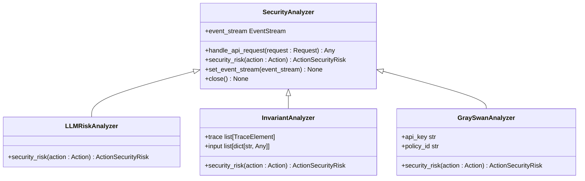
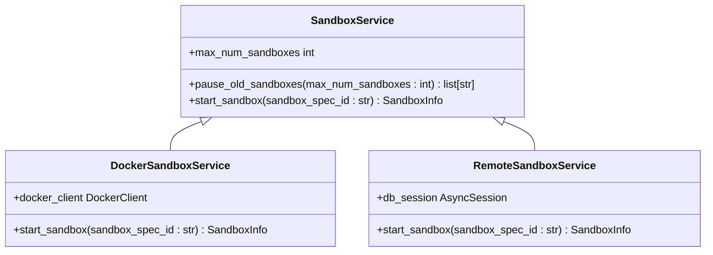
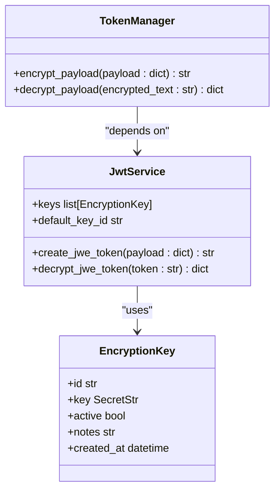

# 安全机制

<cite>
**本文档中引用的文件**   
- [analyzer.py](file://openhands/security/analyzer.py)
- [options.py](file://openhands/security/options.py)
- [README.md](file://openhands/security/README.md)
- [invariant/analyzer.py](file://openhands/security/invariant/analyzer.py)
- [grayswan/analyzer.py](file://openhands/security/grayswan/analyzer.py)
- [llm/analyzer.py](file://openhands/security/llm/analyzer.py)
- [config.py](file://openhands/app_server/config.py)
- [user_auth.py](file://openhands/server/user_auth/user_auth.py)
- [middleware.py](file://enterprise/server/middleware.py)
- [token_manager.py](file://enterprise/server/auth/token_manager.py)
- [encryption_key.py](file://openhands/app_server/utils/encryption_key.py)
- [jwt_service.py](file://openhands/app_server/services/jwt_service.py)
- [remote_sandbox_service.py](file://openhands/app_server/sandbox/remote_sandbox_service.py)
- [docker_sandbox_service.py](file://openhands/app_server/sandbox/docker_sandbox_service.py)
- [sandbox_service.py](file://openhands/app_server/sandbox/sandbox_service.py)
- [auth.py](file://enterprise/server/routes/auth.py)
- [rate_limit.py](file://enterprise/server/rate_limit.py)
- [invariant-service.ts](file://frontend/src/api/invariant-service.ts)
- [secrets-settings.tsx](file://frontend/src/routes/secrets-settings.tsx)
- [secret-list-item.tsx](file://frontend/src/components/features/settings/secrets-settings/secret-list-item.tsx)
</cite>

## 目录
1. [简介](#简介)
2. [安全分析器框架](#安全分析器框架)
3. [输入验证与输出编码](#输入验证与输出编码)
4. [Web攻击防护](#web攻击防护)
5. [运行时沙箱安全隔离](#运行时沙箱安全隔离)
6. [敏感数据加密与密钥管理](#敏感数据加密与密钥管理)
7. [权限最小化与访问控制](#权限最小化与访问控制)
8. [安全审计日志与异常检测](#安全审计日志与异常检测)
9. [安全头设置与CORS策略](#安全头设置与cors策略)
10. [漏洞报告与安全更新](#漏洞报告与安全更新)

## 简介
OpenHands平台通过多层次的安全机制确保系统的安全性，包括安全分析器框架、运行时沙箱隔离、敏感数据加密和访问控制等。系统采用确认模式和安全分析器来防止潜在的安全风险，同时通过JWT认证和加密技术保护用户数据。平台支持多种安全分析器，包括LLM风险分析器、Invariant和Gray Swan，以提供全面的安全监控。此外，系统还实现了速率限制、CORS策略和安全头设置等防护措施，确保Web应用的安全性。

## 安全分析器框架
OpenHands的安全分析器框架是一个抽象基类，设计用于监听事件流并分析操作的安全风险。该框架通过`SecurityAnalyzer`类实现，该类定义了处理API请求、评估安全风险和执行相应操作的方法。系统支持多种安全分析器，包括LLM风险分析器、Invariant和Gray Swan，每种分析器都有其特定的功能和配置。

**图表来源**
- [analyzer.py](file://openhands/security/analyzer.py)
- [llm/analyzer.py](file://openhands/security/llm/analyzer.py)
- [invariant/analyzer.py](file://openhands/security/invariant/analyzer.py)
- [grayswan/analyzer.py](file://openhands/security/grayswan/analyzer.py)

**本节来源**
- [analyzer.py](file://openhands/security/analyzer.py)
- [options.py](file://openhands/security/options.py)
- [README.md](file://openhands/security/README.md)

## 输入验证与输出编码
OpenHands平台通过多种机制确保输入验证和输出编码的安全性。系统在处理用户输入时，会进行严格的验证，防止恶意输入导致的安全问题。对于输出数据，平台采用适当的编码技术，防止跨站脚本（XSS）等攻击。此外，系统还通过安全分析器框架对输入和输出进行实时监控，确保数据的安全性。

**本节来源**
- [middleware.py](file://enterprise/server/middleware.py)
- [user_auth.py](file://openhands/server/user_auth/user_auth.py)

## Web攻击防护
OpenHands平台通过多种措施防护常见的Web攻击，如XSS、CSRF和SQL注入。系统使用安全分析器框架检测潜在的攻击行为，并通过确认模式要求用户确认高风险操作。此外，平台还实现了速率限制和CORS策略，防止恶意请求和跨站请求伪造攻击。

**本节来源**
- [middleware.py](file://enterprise/server/middleware.py)
- [rate_limit.py](file://enterprise/server/rate_limit.py)
- [auth.py](file://enterprise/server/routes/auth.py)

## 运行时沙箱安全隔离
OpenHands平台通过运行时沙箱实现安全隔离，确保代码在受控环境中执行。系统支持多种沙箱后端，包括Docker、远程和本地沙箱，每种后端都有其特定的安全配置。沙箱生命周期管理功能允许创建、启动、停止和销毁沙箱，确保资源的有效利用和安全性。

**图表来源**
- [sandbox_service.py](file://openhands/app_server/sandbox/sandbox_service.py)
- [docker_sandbox_service.py](file://openhands/app_server/sandbox/docker_sandbox_service.py)
- [remote_sandbox_service.py](file://openhands/app_server/sandbox/remote_sandbox_service.py)

**本节来源**
- [sandbox_service.py](file://openhands/app_server/sandbox/sandbox_service.py)
- [docker_sandbox_service.py](file://openhands/app_server/sandbox/docker_sandbox_service.py)
- [remote_sandbox_service.py](file://openhands/app_server/sandbox/remote_sandbox_service.py)

## 敏感数据加密与密钥管理
OpenHands平台通过JWT服务和加密技术保护敏感数据。系统使用JWT进行身份验证和会话管理，确保数据在传输过程中的安全性。此外，平台还实现了密钥管理机制，生成和管理加密密钥，确保数据的静态和传输中加密。

**图表来源**
- [jwt_service.py](file://openhands/app_server/services/jwt_service.py)
- [encryption_key.py](file://openhands/app_server/utils/encryption_key.py)
- [token_manager.py](file://enterprise/server/auth/token_manager.py)

**本节来源**
- [jwt_service.py](file://openhands/app_server/services/jwt_service.py)
- [encryption_key.py](file://openhands/app_server/utils/encryption_key.py)
- [token_manager.py](file://enterprise/server/auth/token_manager.py)

## 权限最小化与访问控制
OpenHands平台通过权限最小化原则和访问控制列表（ACL）实现细粒度的访问控制。系统确保每个用户和组件只能访问其所需的资源，防止权限滥用。访问控制机制与身份验证系统集成，确保只有经过身份验证的用户才能执行特定操作。

**本节来源**
- [user_auth.py](file://openhands/server/user_auth/user_auth.py)
- [auth.py](file://enterprise/server/routes/auth.py)

## 安全审计日志与异常检测
OpenHands平台通过安全审计日志和异常检测系统监控系统的安全状态。系统记录所有安全相关事件，包括用户登录、操作执行和安全分析结果。异常检测系统实时分析日志数据，识别潜在的安全威胁，并触发相应的响应机制。

**本节来源**
- [invariant-service.ts](file://frontend/src/api/invariant-service.ts)
- [invariant/analyzer.py](file://openhands/security/invariant/analyzer.py)

## 安全头设置与CORS策略
OpenHands平台通过安全头设置和CORS策略增强Web应用的安全性。系统配置了适当的安全头，如Content-Security-Policy和X-Content-Type-Options，防止常见的Web攻击。CORS策略确保只有授权的源可以访问API，防止跨站请求伪造攻击。

**本节来源**
- [middleware.py](file://enterprise/server/middleware.py)
- [rate_limit.py](file://enterprise/server/rate_limit.py)

## 漏洞报告与安全更新
OpenHands平台鼓励用户报告安全漏洞，并提供安全更新策略。用户可以通过指定的渠道报告漏洞，平台会及时响应并修复问题。安全更新策略确保系统定期更新，修复已知的安全漏洞，保持系统的安全性。

**本节来源**
- [README.md](file://openhands/security/README.md)
- [security.md](file://microagents/security.md)