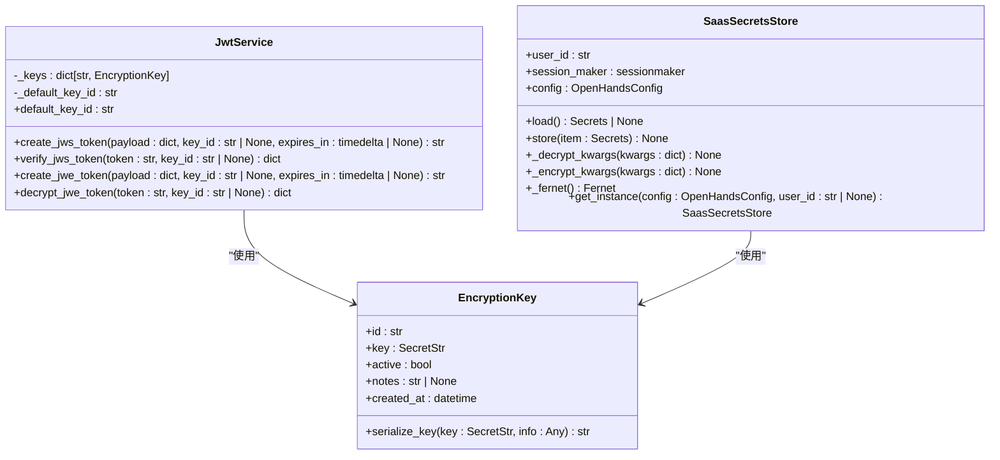
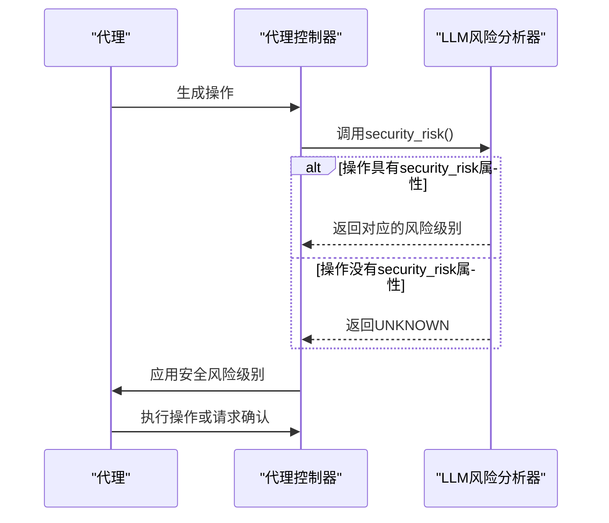

# 数据加密与密钥管理

<cite>
**本文档引用的文件**  
- [encryption_key.py](file://openhands/app_server/utils/encryption_key.py)
- [jwt_service.py](file://openhands/app_server/services/jwt_service.py)
- [token_manager.py](file://enterprise/server/auth/token_manager.py)
- [saas_secrets_store.py](file://enterprise/storage/saas_secrets_store.py)
- [analyzer.py](file://openhands/security/llm/analyzer.py)
- [debugging.py](file://enterprise/server/routes/debugging.py)
- [config.template.toml](file://config.template.toml)
</cite>

## 目录
1. [引言](#引言)
2. [加密算法与实现](#加密算法与实现)
3. [密钥管理策略](#密钥管理策略)
4. [LLM风险分析器](#llm风险分析器)
5. [调试接口安全](#调试接口安全)
6. [密钥轮换与安全管理](#密钥轮换与安全管理)
7. [结论](#结论)

## 引言

OpenHands系统通过多层次的安全机制保护敏感数据，确保在静态存储和传输过程中的数据安全。本系统采用行业标准的加密算法和密钥管理策略，结合LLM风险分析器对安全风险进行评估和验证，确保数据完整性。系统还特别关注调试接口的安全考虑和数据保护措施，提供全面的密钥轮换策略和安全管理最佳实践。

## 加密算法与实现

OpenHands系统采用多种加密算法来保护敏感数据。系统使用Fernet对称加密算法进行数据加密，该算法基于AES-128-CBC模式，并使用HMAC-SHA256进行身份验证。对于需要更高安全性的场景，系统还支持JSON Web Encryption (JWE)标准，使用A256GCM算法进行加密。

在数据传输过程中，系统使用JSON Web Signature (JWS)标准对数据进行签名，确保数据的完整性和真实性。JWS使用HS256算法（HMAC-SHA256）对JWT令牌进行签名，防止数据被篡改。

系统还实现了多层加密机制，对于存储在数据库中的敏感信息，如API令牌和客户端密钥，系统会先进行JSON序列化，然后使用Fernet进行加密，最后将加密结果进行Base64编码存储。这种多层保护机制确保了即使数据库被非法访问，敏感信息也不会被轻易泄露。

**Section sources**
- [token_manager.py](file://enterprise/server/auth/token_manager.py#L47-L87)
- [jwt_service.py](file://openhands/app_server/services/jwt_service.py#L1-L249)

## 密钥管理策略

OpenHands系统采用严格的密钥管理策略，确保加密密钥的安全存储和使用。系统支持多种密钥存储方式，包括环境变量、配置文件和专用密钥文件。密钥的生成和管理遵循安全最佳实践，确保密钥的随机性和强度。

系统使用32字节的密钥作为加密基础，通过SHA256哈希算法将其转换为Fernet密钥格式。密钥的生成使用操作系统的安全随机数生成器（os.urandom），确保密钥的不可预测性。系统还支持密钥轮换机制，允许在不中断服务的情况下更新加密密钥。

密钥的存储采用分层保护机制。主密钥可以通过JWT_SECRET环境变量提供，如果未设置，则系统会自动生成一个密钥并存储在工作区目录下的.key文件中。该文件的访问权限受到严格控制，确保只有授权进程可以读取。

系统还实现了密钥版本控制，每个密钥都有唯一的ID和创建时间戳，支持多密钥共存。这使得系统可以在密钥轮换期间同时支持新旧密钥，确保服务的连续性。

**Diagram sources**
- [encryption_key.py](file://openhands/app_server/utils/encryption_key.py#L1-L58)
- [jwt_service.py](file://openhands/app_server/services/jwt_service.py#L21-L249)
- [saas_secrets_store.py](file://enterprise/storage/saas_secrets_store.py#L1-L130)

**Section sources**
- [encryption_key.py](file://openhands/app_server/utils/encryption_key.py#L1-L58)
- [jwt_service.py](file://openhands/app_server/services/jwt_service.py#L21-L249)

## LLM风险分析器

LLM风险分析器是OpenHands系统的默认安全分析器，它利用LLM提供的安全风险评估来确保数据完整性。该分析器尊重LLM在生成操作时设置的security_risk属性，允许基于上下文和内容进行智能风险评估。

LLM风险分析器的主要功能包括：使用LLM提供的风险评估（低、中、高），自动要求对高风险操作进行确认，尊重确认模式设置以处理中低风险操作，以及与代理的决策过程无缝集成。当操作没有提供风险评估时，分析器会将其默认为未知风险。

系统通过ActionSecurityRisk枚举定义了不同的风险级别，包括LOW、MEDIUM、HIGH和UNKNOWN。LLM风险分析器检查操作是否具有由LLM设置的security_risk属性，并将其映射到相应的ActionSecurityRisk级别。如果未提供风险评估，则返回UNKNOWN。

**Diagram sources**
- [analyzer.py](file://openhands/security/llm/analyzer.py#L1-L42)
- [agent_controller.py](file://openhands/controller/agent_controller.py#L211-L243)

**Section sources**
- [analyzer.py](file://openhands/security/llm/analyzer.py#L1-L42)
- [agent_controller.py](file://openhands/controller/agent_controller.py#L211-L243)

## 调试接口安全

OpenHands系统的调试接口经过精心设计，确保在提供调试功能的同时不牺牲安全性。调试接口的访问受到严格的认证和授权控制，只有经过身份验证的用户才能访问调试功能。

系统在调试接口中实施了多层安全措施。首先，所有调试请求都必须包含有效的认证令牌，该令牌使用JWS进行签名，确保请求的完整性和真实性。其次，调试接口的响应数据经过过滤，不会包含敏感信息，如密钥、令牌或其他认证凭据。

调试日志的记录也遵循安全最佳实践。系统不会在日志中记录敏感信息，而是使用占位符（如'**********'）来代替。同时，调试日志的访问权限受到严格控制，只有授权人员才能查看。

系统还提供了调试模式的配置选项，允许管理员根据需要启用或禁用调试功能。在生产环境中，建议禁用不必要的调试功能，以减少潜在的安全风险。

**Section sources**
- [debugging.py](file://enterprise/server/routes/debugging.py)
- [middleware.py](file://enterprise/server/middleware.py#L99-L134)

## 密钥轮换与安全管理

OpenHands系统提供全面的密钥轮换策略和安全管理最佳实践。密钥轮换是系统安全的重要组成部分，定期更换加密密钥可以降低密钥泄露带来的风险。

系统支持无缝密钥轮换，允许在不中断服务的情况下更新加密密钥。当新密钥被添加到系统中时，它会自动成为默认密钥用于新数据的加密，而旧密钥仍然保留用于解密历史数据。这种机制确保了服务的连续性，同时逐步淘汰旧密钥。

密钥轮换的最佳实践包括：定期评估密钥的有效期，建议每90天轮换一次主密钥；在密钥泄露或怀疑泄露时立即轮换；在系统升级或架构变更时考虑轮换密钥；以及保持详细的密钥使用日志，以便审计和追踪。

安全管理还包括访问控制机制。系统使用基于角色的访问控制（RBAC）来限制对密钥管理功能的访问。只有具有特定权限的管理员才能执行密钥轮换操作。同时，所有密钥管理操作都会被记录在审计日志中，以便后续审查。

系统还建议实施多因素认证（MFA）来保护密钥管理界面，防止未经授权的访问。对于存储在环境变量中的密钥，建议使用专门的密钥管理服务（如Hashicorp Vault或AWS KMS）来提供额外的保护层。

**Section sources**
- [encryption_key.py](file://openhands/app_server/utils/encryption_key.py#L29-L58)
- [jwt_service.py](file://openhands/app_server/services/jwt_service.py#L24-L43)
- [config.template.toml](file://config.template.toml)

## 结论

OpenHands系统通过综合的安全机制确保敏感数据在静态和传输过程中的保护。系统采用行业标准的加密算法，结合严格的密钥管理策略，为数据安全提供了坚实的基础。LLM风险分析器的引入使得系统能够智能地评估和处理安全风险，确保数据完整性。

调试接口的安全设计体现了系统在功能和安全之间的平衡，既提供了必要的调试能力，又不会牺牲安全性。密钥轮换策略和安全管理最佳实践为系统的长期安全运行提供了保障。

通过这些多层次的安全措施，OpenHands系统为用户提供了一个安全可靠的环境，确保敏感数据得到充分保护，同时保持系统的灵活性和可维护性。