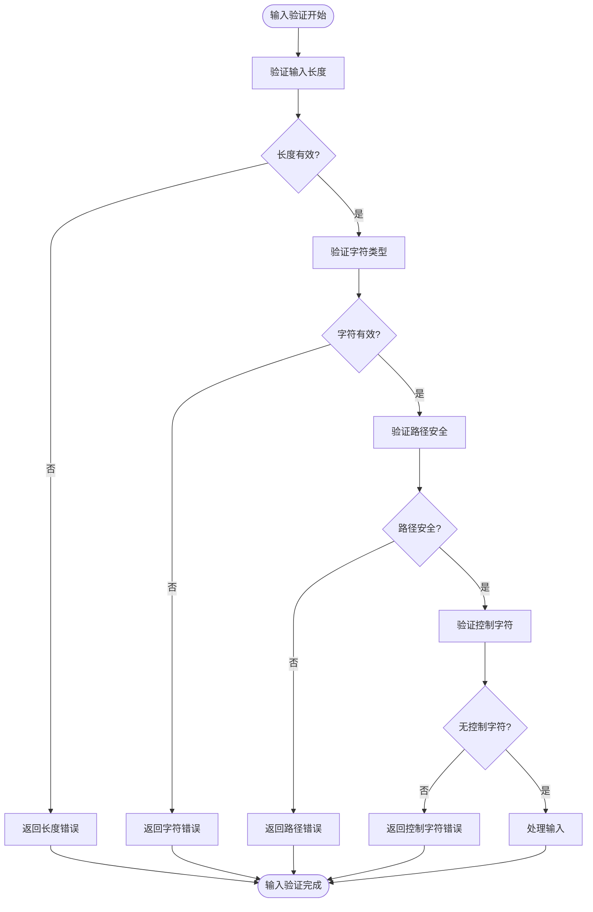
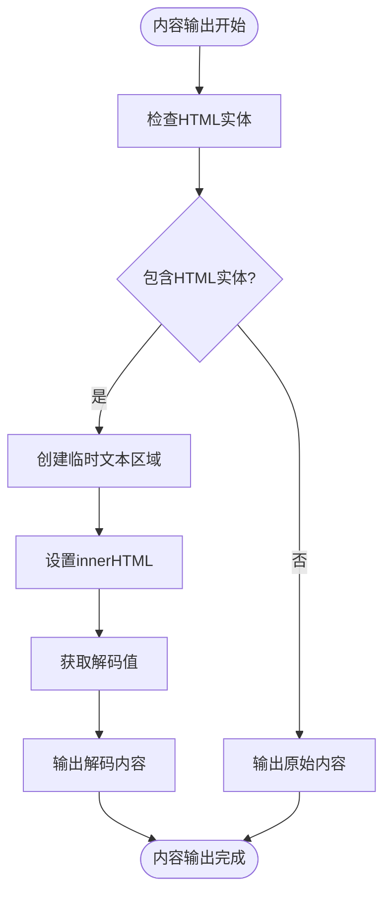
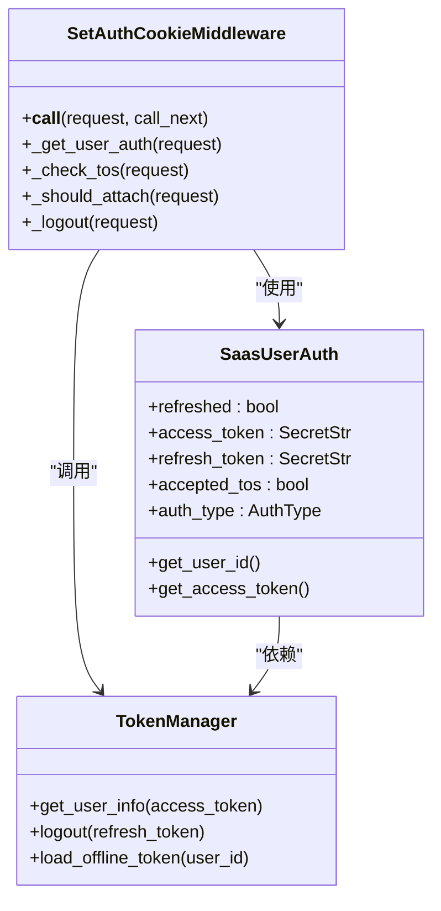
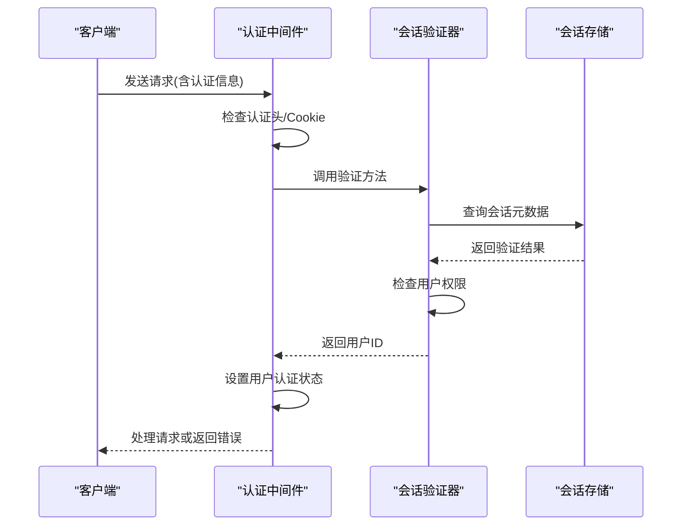
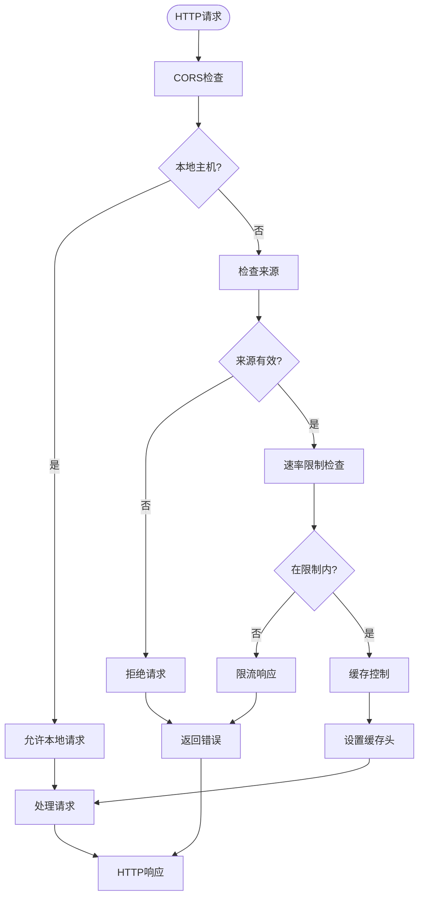
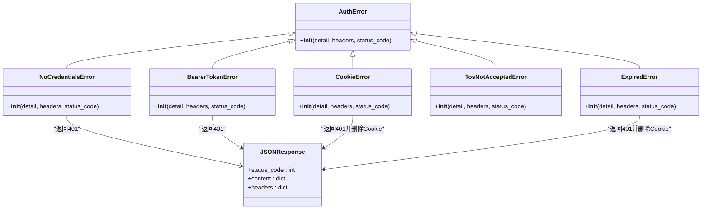
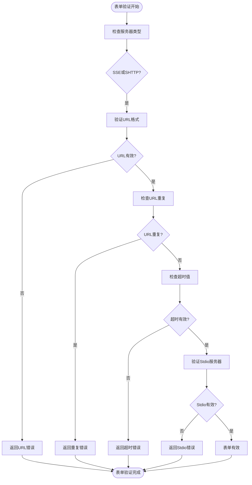

# 输入验证与输出编码

<cite>
**本文档引用的文件**
- [middleware.py](file://openhands/server/middleware.py)
- [utils.py](file://openhands/server/utils.py)
- [saas_conversation_validator.py](file://enterprise/storage/saas_conversation_validator.py)
- [auth_error.py](file://enterprise/server/auth/auth_error.py)
- [conversation.py](file://openhands/server/routes/conversation.py)
- [mcp-server-form.tsx](file://frontend/src/components/features/settings/mcp-settings/mcp-server-form.tsx)
- [mono-component.tsx](file://frontend/src/components/features/chat/mono-component.tsx)
</cite>

## 目录
1. [简介](#简介)
2. [输入验证机制](#输入验证机制)
3. [输出编码与XSS防护](#输出编码与xss防护)
4. [CSRF防护机制](#csrf防护机制)
5. [API端点验证规则](#api端点验证规则)
6. [中间件安全检查](#中间件安全检查)
7. [错误处理策略](#错误处理策略)
8. [自定义验证规则配置](#自定义验证规则配置)

## 简介
OpenHands系统实施了全面的安全机制来防止常见的Web攻击，包括XSS、CSRF和SQL注入。该系统通过多层次的验证和编码策略确保用户输入的安全性，同时保护系统免受恶意攻击。核心安全功能分布在前端和后端组件中，通过严格的输入验证、输出编码和身份验证机制来实现。

**Section sources**
- [middleware.py](file://openhands/server/middleware.py#L1-L132)
- [utils.py](file://openhands/server/utils.py#L1-L116)

## 输入验证机制
OpenHands系统实现了严格的输入验证机制，防止恶意数据进入系统。系统对各种输入参数进行验证，包括会话ID、URL、超时值等。

**Diagram sources**
- [utils.py](file://openhands/server/utils.py#L16-L57)

## 输出编码与XSS防护
系统通过前端和后端的输出编码机制防止XSS攻击。前端组件对HTML实体进行解码，确保安全显示用户内容。

**Diagram sources**
- [mono-component.tsx](file://frontend/src/components/features/chat/mono-component.tsx#L4-L8)

## CSRF防护机制
OpenHands系统通过多种机制防止CSRF攻击，包括认证令牌验证和Cookie安全策略。

**Diagram sources**
- [middleware.py](file://enterprise/server/middleware.py#L26-L175)

## API端点验证规则
系统对API端点实施严格的验证规则，确保只有经过验证的请求才能访问敏感资源。

**Diagram sources**
- [saas_conversation_validator.py](file://enterprise/storage/saas_conversation_validator.py#L13-L153)
- [conversation.py](file://openhands/server/routes/conversation.py#L1-L421)

## 中间件安全检查
系统的中间件层执行全面的安全检查，包括CORS策略、速率限制和缓存控制。

**Diagram sources**
- [middleware.py](file://openhands/server/middleware.py#L16-L132)

## 错误处理策略
系统实施了全面的错误处理策略，确保安全地处理各种认证和验证错误。

**Diagram sources**
- [auth_error.py](file://enterprise/server/auth/auth_error.py#L1-L41)

## 自定义验证规则配置
系统允许通过前端表单配置自定义验证规则，如MCP服务器设置。

**Diagram sources**
- [mcp-server-form.tsx](file://frontend/src/components/features/settings/mcp-settings/mcp-server-form.tsx#L161-L183)