# GraySwan安全分析器

<cite>
**本文档中引用的文件**
- [analyzer.py](file://openhands/security/grayswan/analyzer.py)
- [utils.py](file://openhands/security/grayswan/utils.py)
- [options.py](file://openhands/security/options.py)
- [analyzer.py](file://openhands/security/analyzer.py)
- [README.md](file://openhands/security/README.md)
- [security.py](file://openhands/server/routes/security.py)
- [__init__.py](file://openhands/security/grayswan/__init__.py)
</cite>

## 目录
1. [简介](#简介)
2. [项目结构](#项目结构)
3. [核心组件](#核心组件)
4. [架构概览](#架构概览)
5. [详细组件分析](#详细组件分析)
6. [配置选项](#配置选项)
7. [第三方工具集成](#第三方工具集成)
8. [性能优化](#性能优化)
9. [故障排除指南](#故障排除指南)
10. [结论](#结论)

## 简介

GraySwan安全分析器是OpenHands平台中的一个高级安全监控组件，专门用于检测和评估AI代理在执行操作时可能存在的安全风险。该分析器基于Gray Swan AI的Cygnal API，提供了强大的AI安全监控能力，能够识别潜在的恶意行为、代码注入攻击和不安全的操作模式。

GraySwan分析器的核心优势在于：
- **实时安全监控**：对代理的所有操作进行实时风险评估
- **智能阈值管理**：支持自定义的风险阈值和分类标准
- **上下文感知分析**：利用对话历史提供全面的上下文理解
- **第三方API集成**：无缝集成Gray Swan的先进安全分析能力
- **灵活配置选项**：支持多种配置参数以适应不同安全需求

## 项目结构

GraySwan安全分析器在OpenHands项目中的组织结构如下：

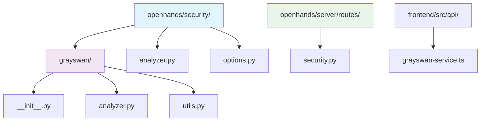

**图表来源**
- [analyzer.py](file://openhands/security/grayswan/analyzer.py#L1-L205)
- [options.py](file://openhands/security/options.py#L1-L11)
- [security.py](file://openhands/server/routes/security.py#L1-L43)

**章节来源**
- [analyzer.py](file://openhands/security/grayswan/analyzer.py#L1-L205)
- [utils.py](file://openhands/security/grayswan/utils.py#L1-L146)
- [options.py](file://openhands/security/options.py#L1-L11)

## 核心组件

GraySwan安全分析器由以下核心组件构成：

### 主要类层次结构

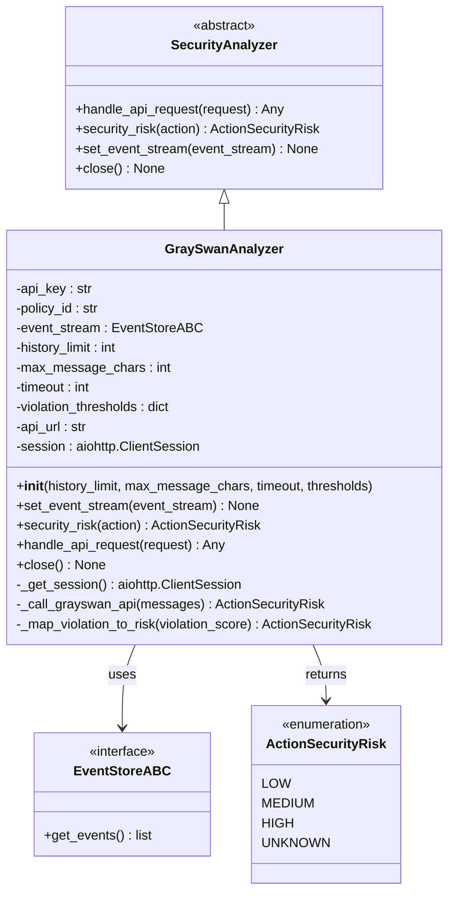

**图表来源**
- [analyzer.py](file://openhands/security/analyzer.py#L8-L38)
- [analyzer.py](file://openhands/security/grayswan/analyzer.py#L18-L205)

### 核心功能模块

GraySwan分析器包含以下关键功能模块：

1. **事件转换模块**：将OpenHands事件转换为OpenAI消息格式
2. **API通信模块**：与Gray Swan Cygnal API进行交互
3. **风险评估模块**：根据API响应映射风险等级
4. **会话管理模块**：处理HTTP会话生命周期
5. **阈值配置模块**：管理风险阈值和分类标准

**章节来源**
- [analyzer.py](file://openhands/security/grayswan/analyzer.py#L18-L205)
- [utils.py](file://openhands/security/grayswan/utils.py#L23-L146)

## 架构概览

GraySwan安全分析器采用分层架构设计，确保了良好的可扩展性和维护性：

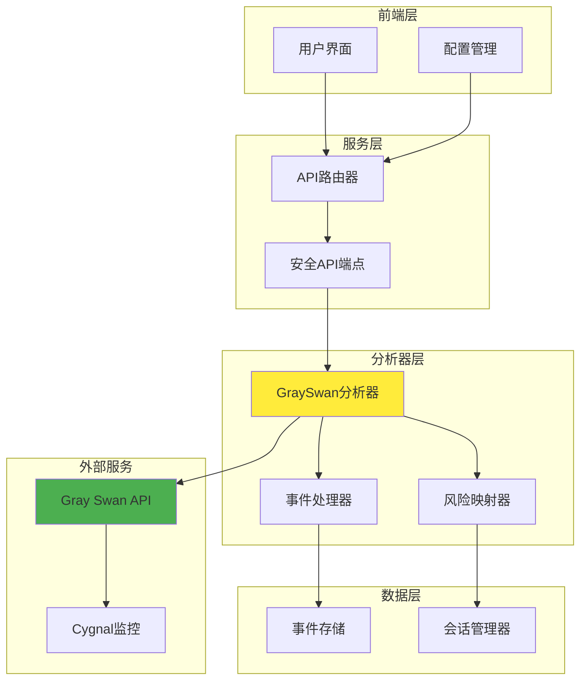

**图表来源**
- [security.py](file://openhands/server/routes/security.py#L19-L43)
- [analyzer.py](file://openhands/security/grayswan/analyzer.py#L18-L205)

## 详细组件分析

### GraySwanAnalyzer主类

GraySwanAnalyzer是整个安全分析系统的核心，继承自SecurityAnalyzer基类，提供了完整的安全监控功能。

#### 初始化过程

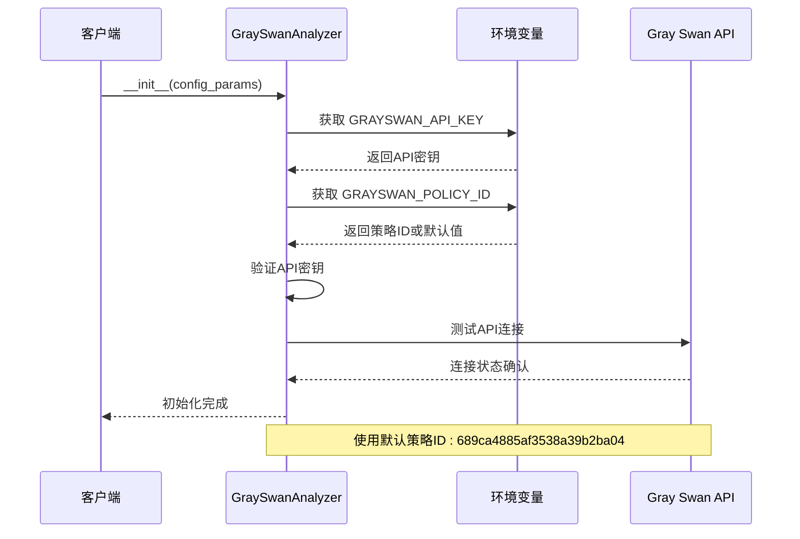

**图表来源**
- [analyzer.py](file://openhands/security/grayswan/analyzer.py#L46-L80)

#### 安全风险评估流程

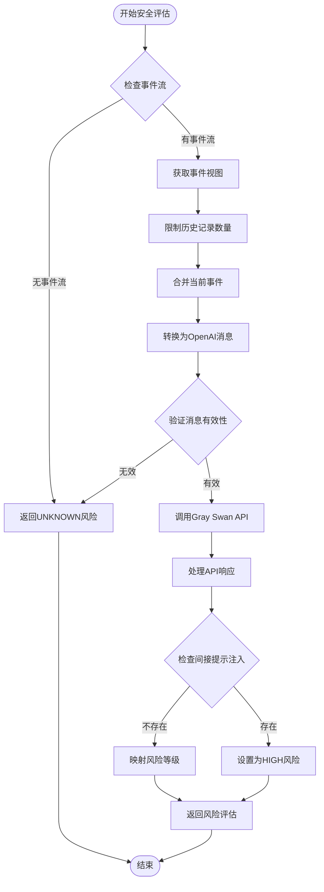

**图表来源**
- [analyzer.py](file://openhands/security/grayswan/analyzer.py#L165-L199)

#### API通信机制

GraySwan分析器通过异步HTTP客户端与Gray Swan API进行通信，支持自动重试和超时处理：

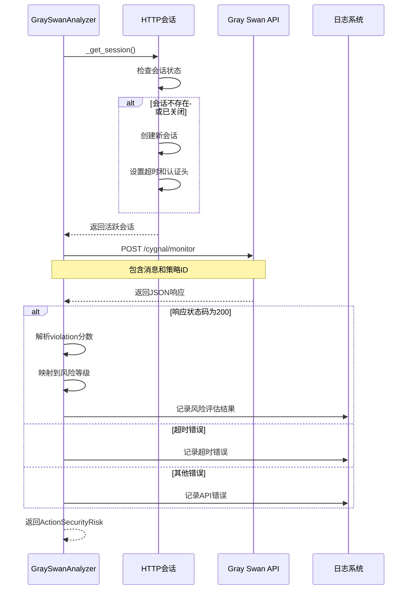

**图表来源**
- [analyzer.py](file://openhands/security/grayswan/analyzer.py#L87-L159)

**章节来源**
- [analyzer.py](file://openhands/security/grayswan/analyzer.py#L18-L205)

### 事件转换工具

事件转换模块负责将OpenHands的各种事件类型转换为Gray Swan API所需的OpenAI消息格式。

#### 支持的事件类型

| 事件类型 | 角色 | 处理方式 | 特殊处理 |
|---------|------|----------|----------|
| SystemMessageAction | system | 直接转换为system角色消息 | 保留原始内容 |
| MessageAction | user/assistant | 根据源确定角色 | 移除security_risk参数 |
| Tool Call | assistant | 提取tool_calls字段 | 序列化函数调用 |
| Tool Response | tool | 添加tool_call_id关联 | 跳过ENVIRONMENT源 |
| AgentStateChangedObservation | 忽略 | 过滤掉 | 不参与分析 |
| ChangeAgentStateAction | 忽略 | 过滤掉 | 不参与分析 |

#### 转换算法

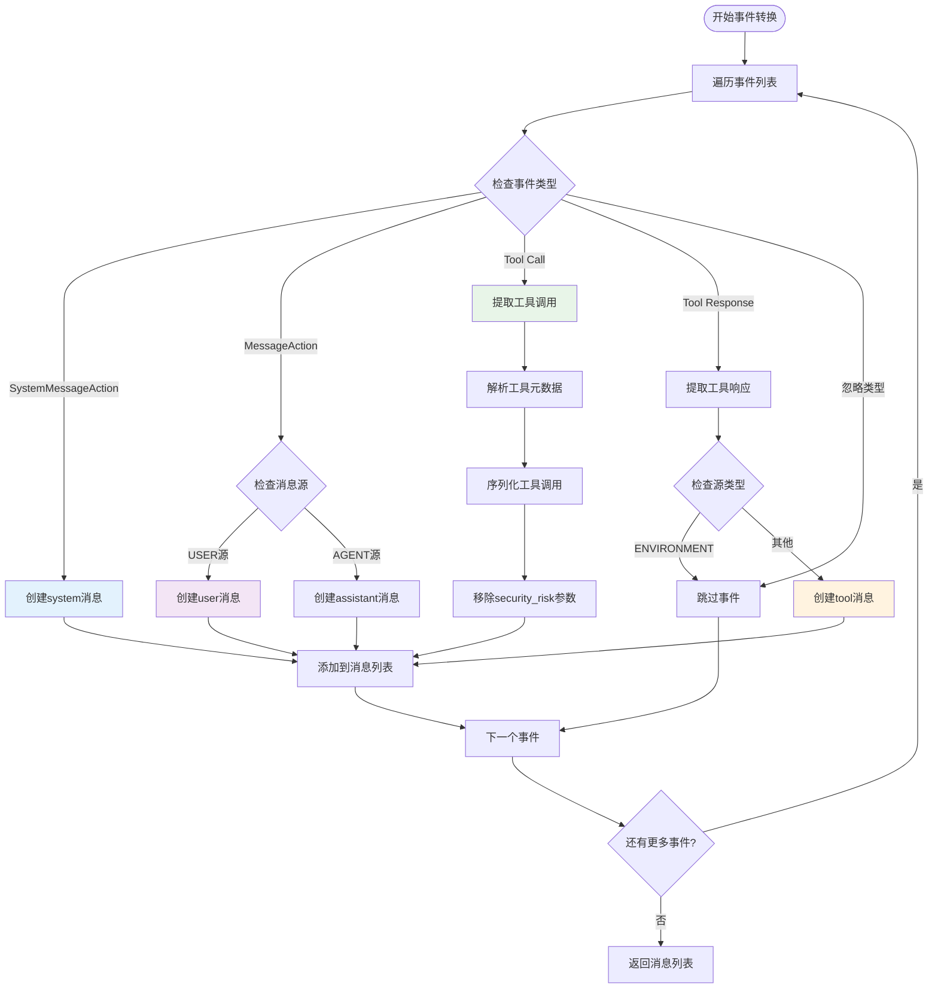

**图表来源**
- [utils.py](file://openhands/security/grayswan/utils.py#L23-L146)

**章节来源**
- [utils.py](file://openhands/security/grayswan/utils.py#L23-L146)

### 风险评估映射

GraySwan分析器使用三层风险评估体系，支持自定义阈值：

#### 风险等级映射表

| 违规分数范围 | 风险等级 | 描述 | 处理建议 |
|-------------|----------|------|----------|
| 0.0 - 0.3 | LOW | 低风险操作 | 自动执行 |
| 0.3 - 0.7 | MEDIUM | 中等风险操作 | 可能需要确认 |
| 0.7 - 1.0 | HIGH | 高风险操作 | 强制确认 |
| > 1.0 | HIGH | 超出范围 | 默认为最高风险 |

#### 特殊情况处理

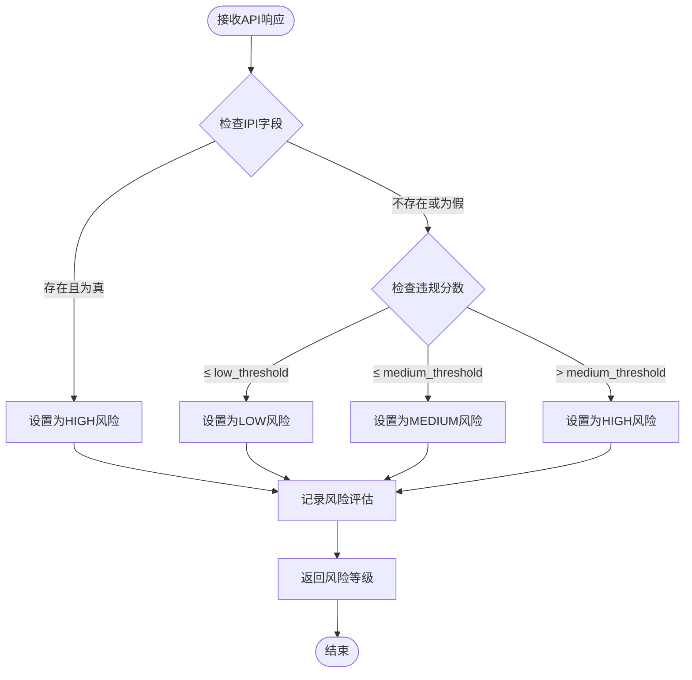

**图表来源**
- [analyzer.py](file://openhands/security/grayswan/analyzer.py#L109-L117)

**章节来源**
- [analyzer.py](file://openhands/security/grayswan/analyzer.py#L109-L117)

## 配置选项

GraySwan安全分析器提供了丰富的配置选项，允许用户根据具体需求进行定制：

### 环境变量配置

| 环境变量 | 必需性 | 默认值 | 描述 |
|---------|--------|--------|------|
| `GRAYSWAN_API_KEY` | 必需 | 无 | Gray Swan API访问密钥 |
| `GRAYSWAN_POLICY_ID` | 可选 | `689ca4885af3538a39b2ba04` | 自定义安全策略ID |

### 初始化参数配置

| 参数名 | 类型 | 默认值 | 描述 | 推荐范围 |
|-------|------|--------|------|----------|
| `history_limit` | int | 20 | 最大历史事件数量 | 10-50 |
| `max_message_chars` | int | 30000 | 最大消息字符数 | 10000-50000 |
| `timeout` | int | 30 | API请求超时时间（秒） | 15-60 |
| `low_threshold` | float | 0.3 | 低风险阈值 | 0.1-0.5 |
| `medium_threshold` | float | 0.7 | 中风险阈值 | 0.5-0.9 |
| `high_threshold` | float | 1.0 | 高风险阈值 | 0.9-1.0 |

### 配置示例

#### 基本配置（推荐）

```toml
[security]
security_analyzer = "grayswan"
confirmation_mode = true
```

#### 高安全配置

```toml
[security]
security_analyzer = "grayswan"
confirmation_mode = true

[grayswan]
history_limit = 30
max_message_chars = 50000
timeout = 45
low_threshold = 0.2
medium_threshold = 0.5
high_threshold = 0.8
```

#### 开发环境配置

```toml
[security]
security_analyzer = "grayswan"
confirmation_mode = false

[grayswan]
history_limit = 10
max_message_chars = 20000
timeout = 20
low_threshold = 0.4
medium_threshold = 0.6
high_threshold = 0.9
```

**章节来源**
- [analyzer.py](file://openhands/security/grayswan/analyzer.py#L21-L80)
- [README.md](file://openhands/security/README.md#L115-L130)

## 第三方工具集成

### Gray Swan Cygnal API集成

GraySwan分析器通过RESTful API与Gray Swan的Cygnal服务进行集成：

#### API端点信息

| 端点 | 方法 | 功能 | 请求格式 | 响应格式 |
|------|------|------|----------|----------|
| `/cygnal/monitor` | POST | 安全监控分析 | `{"messages": [...], "policy_id": "..."}` | `{...}` |
| `/api/security/*` | GET/POST | 配置管理 | 动态路径 | JSON响应 |

#### 认证机制

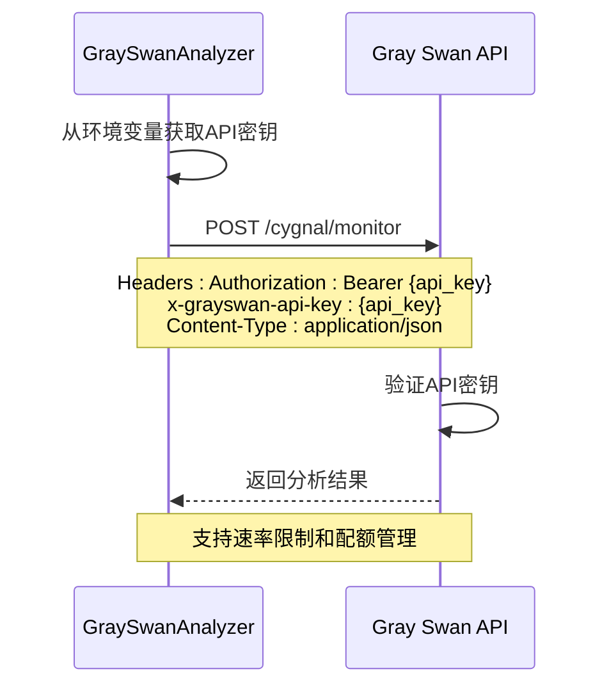

**图表来源**
- [analyzer.py](file://openhands/security/grayswan/analyzer.py#L89-L106)

### 集成最佳实践

#### 错误处理策略

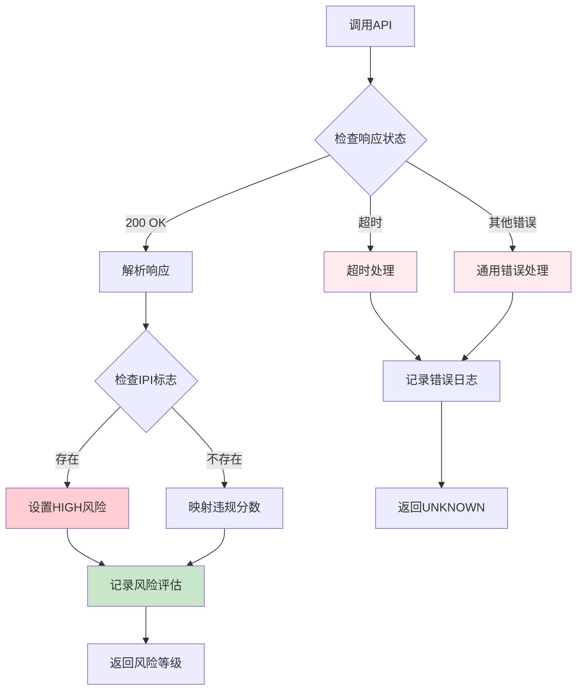

**图表来源**
- [analyzer.py](file://openhands/security/grayswan/analyzer.py#L132-L159)

#### 性能优化措施

1. **连接池管理**：复用HTTP会话减少连接开销
2. **超时控制**：设置合理的请求超时避免阻塞
3. **错误重试**：实现指数退避重试机制
4. **缓存策略**：缓存频繁使用的策略信息

**章节来源**
- [analyzer.py](file://openhands/security/grayswan/analyzer.py#L87-L159)

## 性能优化

### 内存管理优化

GraySwan分析器实现了多项内存优化策略：

#### 事件历史管理

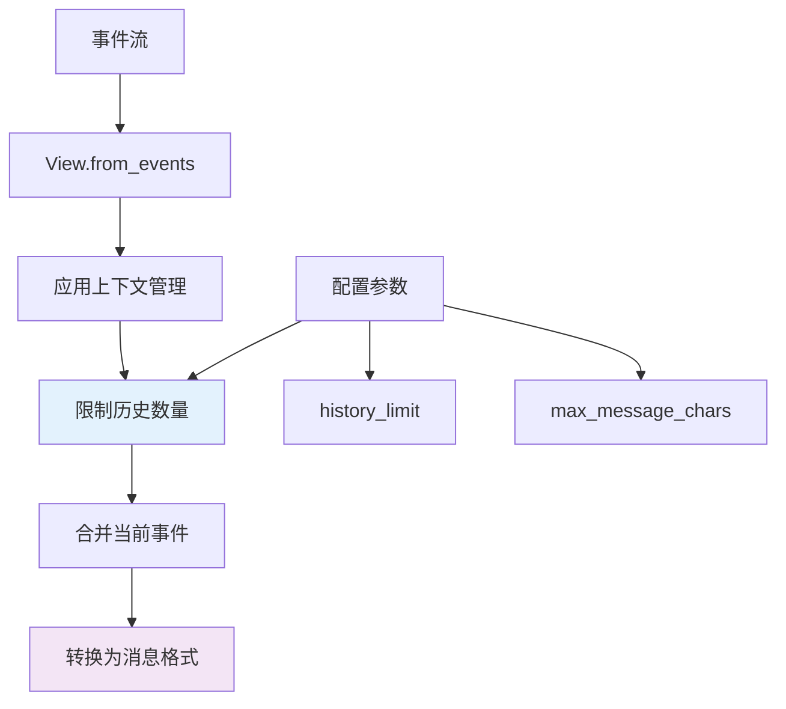

**图表来源**
- [analyzer.py](file://openhands/security/grayswan/analyzer.py#L178-L183)

#### 会话生命周期管理

| 阶段 | 优化策略 | 实现方式 | 性能收益 |
|------|----------|----------|----------|
| 初始化 | 连接池复用 | `aiohttp.ClientSession` | 减少连接建立开销 |
| 请求处理 | 异步非阻塞 | `asyncio` | 提高并发处理能力 |
| 错误恢复 | 自动重试机制 | 指数退避 | 增强系统稳定性 |
| 资源清理 | 及时释放 | `close()`方法 | 避免内存泄漏 |

### 并发处理优化

#### 异步处理架构

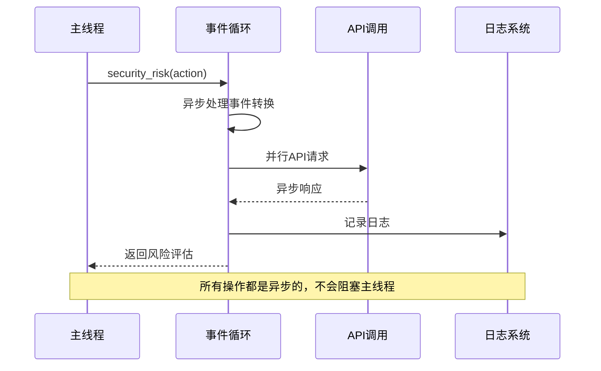

**图表来源**
- [analyzer.py](file://openhands/security/grayswan/analyzer.py#L165-L199)

### 缓存策略

虽然当前实现没有显式的缓存机制，但可以通过以下方式优化：

1. **策略缓存**：缓存常用的策略ID和配置
2. **会话复用**：复用HTTP连接减少握手开销
3. **结果缓存**：对重复的相似请求进行结果缓存

**章节来源**
- [analyzer.py](file://openhands/security/grayswan/analyzer.py#L87-L106)
- [analyzer.py](file://openhands/security/grayswan/analyzer.py#L165-L199)

## 故障排除指南

### 常见问题及解决方案

#### 1. API密钥配置问题

**症状**：初始化时抛出`ValueError: GRAYSWAN_API_KEY environment variable is required`

**解决方案**：
```bash
# 设置环境变量
export GRAYSWAN_API_KEY="your_api_key_here"

# 或者在配置文件中设置
echo 'GRAYSWAN_API_KEY="your_api_key_here"' >> ~/.bashrc
source ~/.bashrc
```

**诊断命令**：
```python
import os
print("API Key exists:", bool(os.getenv('GRAYSWAN_API_KEY')))
```

#### 2. 网络连接问题

**症状**：API请求超时或连接失败

**解决方案**：
```python
# 增加超时时间
analyzer = GraySwanAnalyzer(timeout=60)

# 检查网络连通性
import requests
try:
    response = requests.get('https://api.grayswan.ai', timeout=10)
    print("API endpoint reachable:", response.status_code == 200)
except Exception as e:
    print("Connection error:", e)
```

#### 3. 风险评估异常

**症状**：返回`ActionSecurityRisk.UNKNOWN`

**排查步骤**：
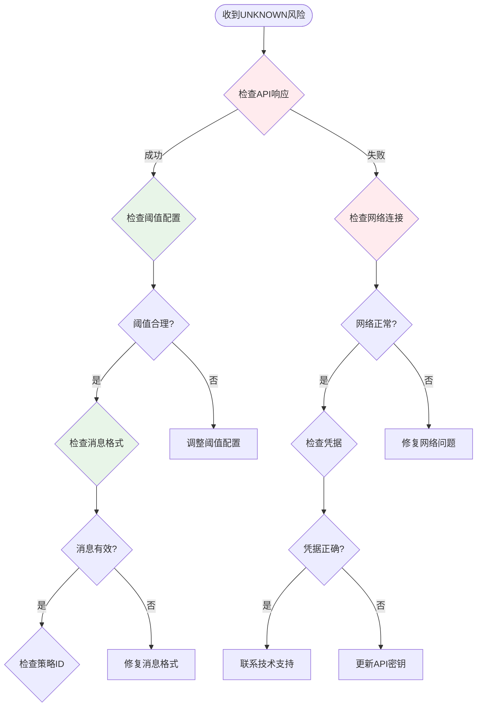

**图表来源**
- [analyzer.py](file://openhands/security/grayswan/analyzer.py#L154-L159)

#### 4. 性能问题诊断

**性能监控指标**：

| 指标 | 正常范围 | 警告阈值 | 优化建议 |
|------|----------|----------|----------|
| API响应时间 | < 5秒 | > 10秒 | 增加超时时间或检查网络 |
| 内存使用量 | < 100MB | > 500MB | 检查事件历史限制 |
| 并发请求数 | < 10 | > 20 | 实现请求队列控制 |
| 错误率 | < 1% | > 5% | 检查配置和网络稳定性 |

#### 5. 日志分析

启用详细日志记录进行问题诊断：

```python
import logging
logging.getLogger('openhands.security.grayswan').setLevel(logging.DEBUG)
```

**常见日志模式**：
- `GraySwanAnalyzer initialized`：初始化成功
- `Sending request to GraySwan API`：API请求发送
- `GraySwan risk assessment`：风险评估结果
- `GraySwan API error`：API错误信息
- `GraySwan API request timed out`：超时错误

### 调试工具

#### 配置验证脚本

```python
def validate_grayswan_config():
    """验证GraySwan分析器配置"""
    import os
    from openhands.security.grayswan.analyzer import GraySwanAnalyzer
    
    # 检查环境变量
    api_key = os.getenv('GRAYSWAN_API_KEY')
    policy_id = os.getenv('GRAYSWAN_POLICY_ID', 'default')
    
    print(f"API Key present: {bool(api_key)}")
    print(f"Policy ID: {policy_id}")
    
    # 尝试初始化
    try:
        analyzer = GraySwanAnalyzer(history_limit=5)
        print("✓ Analyzer initialized successfully")
        return True
    except Exception as e:
        print(f"✗ Initialization failed: {e}")
        return False
```

#### 性能测试脚本

```python
async def test_grayswan_performance():
    """测试GraySwan分析器性能"""
    import time
    from openhands.events.action.message import MessageAction
    
    # 创建测试事件
    test_action = MessageAction(content="Test message")
    
    # 测试多个请求
    analyzer = GraySwanAnalyzer(history_limit=10)
    
    start_time = time.time()
    for i in range(10):
        risk = await analyzer.security_risk(test_action)
        print(f"Request {i+1}: {risk}")
    
    end_time = time.time()
    print(f"Average response time: {(end_time - start_time) / 10:.2f}s")
    
    await analyzer.close()
```

**章节来源**
- [analyzer.py](file://openhands/security/grayswan/analyzer.py#L48-L53)
- [analyzer.py](file://openhands/security/grayswan/analyzer.py#L154-L159)

## 结论

GraySwan安全分析器为OpenHands平台提供了强大而灵活的安全监控能力。通过集成Gray Swan的Cygnal API，该分析器能够：

### 主要优势

1. **先进的AI安全监控**：基于机器学习的威胁检测能力
2. **实时风险评估**：对每个操作进行即时安全分析
3. **可配置的阈值系统**：支持自定义风险分类标准
4. **上下文感知分析**：利用完整对话历史提供准确评估
5. **易于集成**：简洁的API接口和配置选项

### 适用场景

- **开发环境**：代码审查和安全检查
- **生产环境**：实时威胁监控和防护
- **CI/CD管道**：自动化安全验证
- **合规审计**：安全策略执行监控

### 最佳实践建议

1. **合理配置阈值**：根据实际需求调整风险阈值
2. **定期监控性能**：关注API响应时间和错误率
3. **完善日志记录**：启用详细日志便于问题诊断
4. **定期更新策略**：根据新的威胁情报更新安全策略
5. **备份配置**：保存重要的配置参数和策略设置

GraySwan安全分析器代表了现代AI安全监控技术的发展方向，为OpenHands平台的安全运行提供了坚实保障。随着AI技术的不断发展，该分析器也将持续演进，为用户提供更加智能和可靠的安全保护。