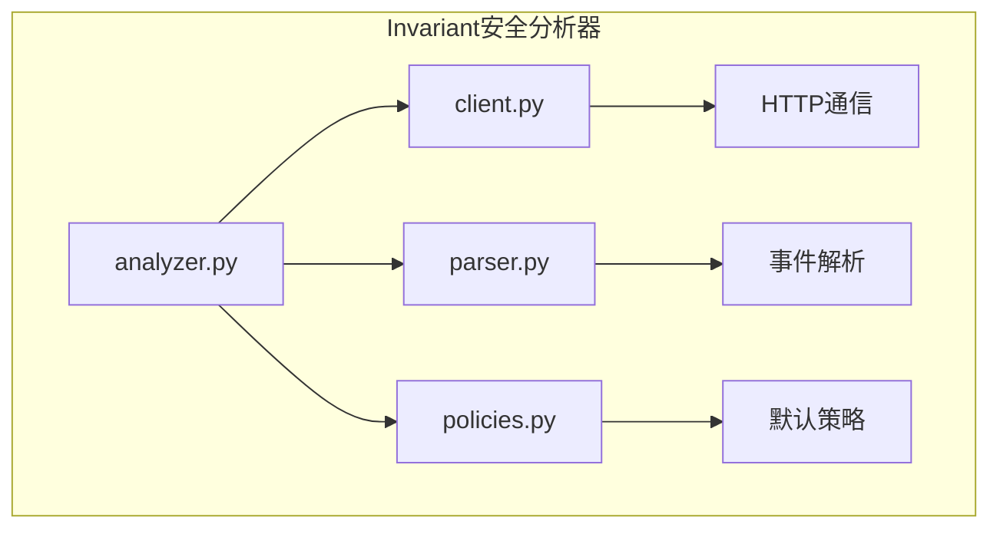
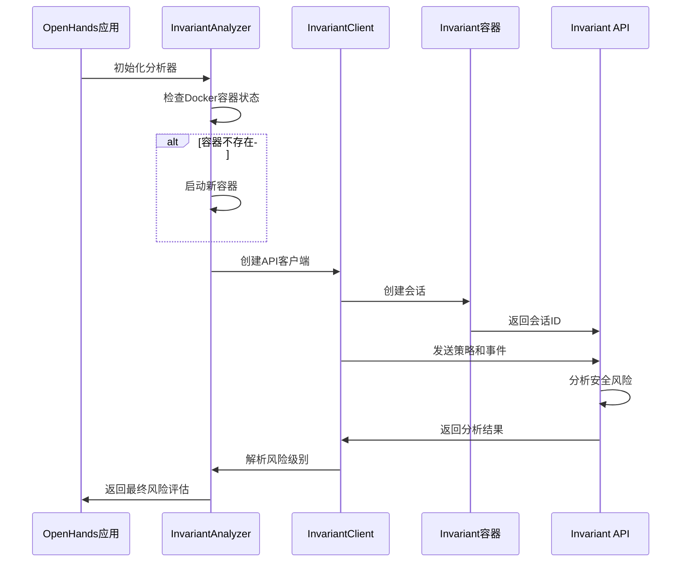
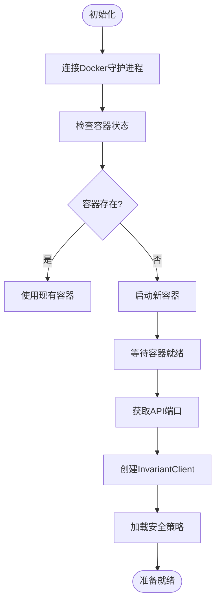
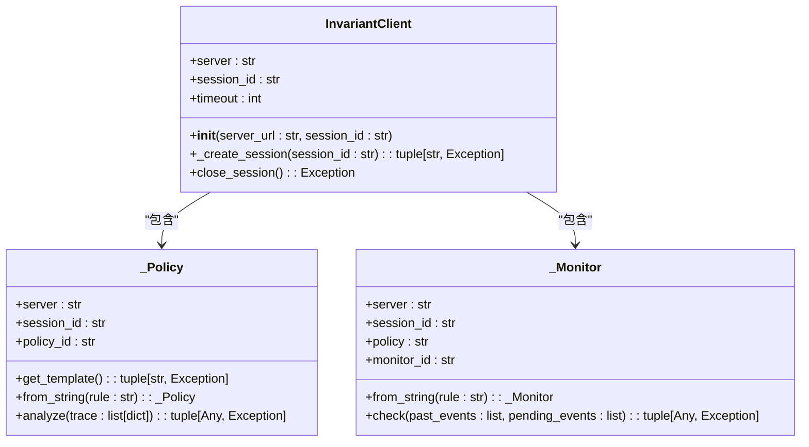
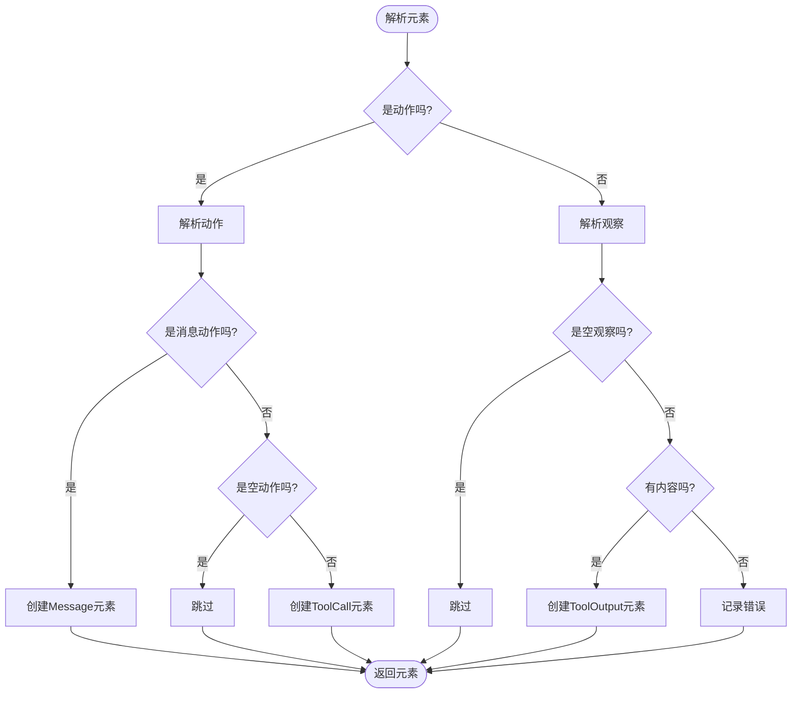
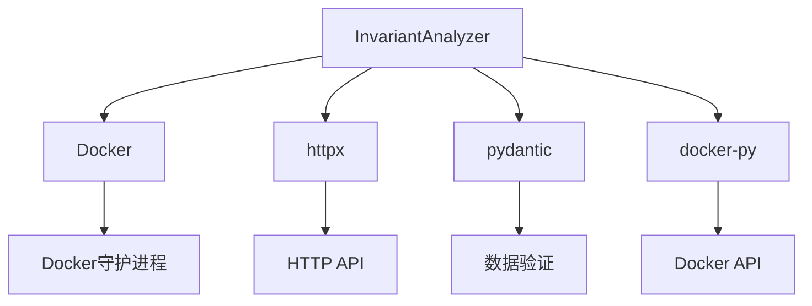

# Invariant安全分析器

<cite>
**本文档引用的文件**
- [analyzer.py](file://openhands/security/invariant/analyzer.py)
- [client.py](file://openhands/security/invariant/client.py)
- [parser.py](file://openhands/security/invariant/parser.py)
- [policies.py](file://openhands/security/invariant/policies.py)
- [invariant-service.ts](file://frontend/src/api/invariant-service.ts)
- [security.py](file://openhands/server/routes/security.py)
- [options.py](file://openhands/security/options.py)
</cite>

## 目录
1. [简介](#简介)
2. [项目结构](#项目结构)
3. [核心组件](#核心组件)
4. [架构概述](#架构概述)
5. [详细组件分析](#详细组件分析)
6. [依赖分析](#依赖分析)
7. [性能考虑](#性能考虑)
8. [故障排除指南](#故障排除指南)
9. [结论](#结论)

## 简介
Invariant安全分析器是OpenHands平台中的一个关键安全组件，它通过Docker容器内的安全分析服务来评估代理操作的安全风险。该分析器使用Invariant平台进行静态分析，能够检测潜在的安全漏洞，如秘密泄露、不安全的bash命令和存在漏洞的Python代码。分析器通过HTTP客户端与安全服务通信，处理动作安全风险评估请求，并根据预定义的安全策略返回风险级别。

## 项目结构
Invariant安全分析器的实现位于`openhands/security/invariant/`目录下，包含多个核心文件：
- `analyzer.py`: 实现`InvariantAnalyzer`类，负责与Docker容器和Invariant API通信
- `client.py`: 提供与Invariant服务器通信的HTTP客户端
- `parser.py`: 将OpenHands事件转换为Invariant可理解的跟踪元素
- `policies.py`: 定义默认的安全策略
- `nodes.py`: 定义用于表示跟踪元素的数据结构

**图表来源**
- [analyzer.py](file://openhands/security/invariant/analyzer.py)
- [client.py](file://openhands/security/invariant/client.py)
- [parser.py](file://openhands/security/invariant/parser.py)
- [policies.py](file://openhands/security/invariant/policies.py)

**章节来源**
- [analyzer.py](file://openhands/security/invariant/analyzer.py)
- [client.py](file://openhands/security/invariant/client.py)

## 核心组件
`InvariantAnalyzer`类是安全分析的核心，它继承自`SecurityAnalyzer`基类并实现了安全风险评估功能。分析器在初始化时会检查是否存在运行中的Docker容器，如果没有则会启动一个新的容器。它使用`InvariantClient`与Invariant服务器通信，并通过`parse_element`函数将OpenHands事件转换为Invariant可理解的格式。

**章节来源**
- [analyzer.py](file://openhands/security/invariant/analyzer.py)
- [parser.py](file://openhands/security/invariant/parser.py)

## 架构概述
Invariant安全分析器采用客户端-服务器架构，其中分析器作为客户端运行在OpenHands应用中，而安全分析服务运行在独立的Docker容器中。这种架构实现了关注点分离，使得安全分析可以独立于主应用进行扩展和更新。

**图表来源**
- [analyzer.py](file://openhands/security/invariant/analyzer.py)
- [client.py](file://openhands/security/invariant/client.py)

## 详细组件分析

### InvariantAnalyzer分析
`InvariantAnalyzer`类负责协调整个安全分析过程。它在初始化时会：
1. 连接到Docker守护进程
2. 检查是否存在名为`openhands-invariant-server`的容器
3. 如果不存在，则从`ghcr.io/invariantlabs-ai/server:openhands`镜像启动新容器
4. 等待容器启动并获取API端口
5. 创建`InvariantClient`实例用于后续通信

**图表来源**
- [analyzer.py](file://openhands/security/invariant/analyzer.py)

**章节来源**
- [analyzer.py](file://openhands/security/invariant/analyzer.py)

### HTTP通信机制
`InvariantClient`类封装了与Invariant服务器的所有HTTP通信。它提供了创建会话、管理策略和执行安全检查的接口。客户端使用`httpx`库进行异步HTTP请求，并实现了重试机制以处理网络问题。

**图表来源**
- [client.py](file://openhands/security/invariant/client.py)

**章节来源**
- [client.py](file://openhands/security/invariant/client.py)

### 事件解析机制
`parser.py`文件中的`parse_element`函数负责将OpenHands事件转换为Invariant可理解的跟踪元素。它根据事件类型（动作或观察）创建相应的消息、工具调用或工具输出。

**图表来源**
- [parser.py](file://openhands/security/invariant/parser.py)

**章节来源**
- [parser.py](file://openhands/security/invariant/parser.py)

## 依赖分析
Invariant安全分析器依赖于多个外部组件和库：
- Docker: 用于运行安全分析服务容器
- httpx: 用于异步HTTP通信
- pydantic: 用于数据验证和模型定义
- docker-py: 用于与Docker守护进程交互

**图表来源**
- [analyzer.py](file://openhands/security/invariant/analyzer.py)
- [client.py](file://openhands/security/invariant/client.py)

**章节来源**
- [analyzer.py](file://openhands/security/invariant/analyzer.py)
- [client.py](file://openhands/security/invariant/client.py)

## 性能考虑
为了优化性能，Invariant安全分析器实现了以下机制：
1. 容器重用：分析器会检查是否存在运行中的容器，如果存在则重用，避免重复启动开销
2. 会话管理：使用会话ID保持与服务器的持久连接
3. 异步通信：使用异步HTTP客户端提高响应速度
4. 缓存策略：默认策略在首次加载后会被缓存

在高并发场景下，建议：
- 预先启动分析器容器
- 使用连接池管理HTTP客户端
- 监控Docker资源使用情况
- 设置合理的超时值

## 故障排除指南
### 常见问题及解决方案
**问题1: Docker容器启动失败**
- **症状**: 日志中出现"Error creating Invariant Security Analyzer container"
- **原因**: Docker服务未运行或资源不足
- **解决方案**: 
  1. 确保Docker服务正在运行
  2. 检查系统资源是否充足
  3. 在设置中禁用安全分析器作为临时解决方案

**问题2: API通信超时**
- **症状**: 分析请求长时间无响应
- **原因**: 网络问题或服务器过载
- **解决方案**:
  1. 检查网络连接
  2. 增加超时设置
  3. 重启Invariant容器

**问题3: 安全策略不生效**
- **症状**: 预期的安全检查未触发
- **原因**: 策略语法错误或未正确加载
- **解决方案**:
  1. 验证策略语法
  2. 检查策略是否已正确更新
  3. 重启分析器以重新加载策略

**章节来源**
- [analyzer.py](file://openhands/security/invariant/analyzer.py)
- [client.py](file://openhands/security/invariant/client.py)

## 结论
Invariant安全分析器通过将安全分析功能封装在独立的Docker容器中，实现了安全功能与主应用的解耦。它利用Invariant平台的强大分析能力，能够有效检测各种安全风险。通过HTTP客户端与安全服务通信，分析器能够灵活地处理各种动作安全风险评估请求。安全策略的定义和管理通过API进行，使得策略更新变得简单高效。分析结果的解析和反馈机制确保了风险评估的准确性和及时性。通过合理的配置和性能优化，Invariant安全分析器可以为OpenHands平台提供可靠的安全保障。