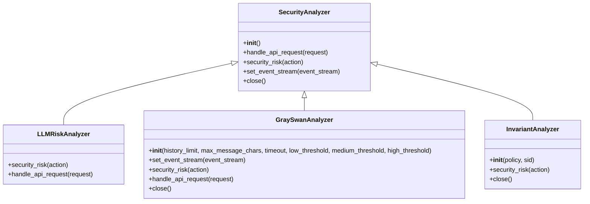
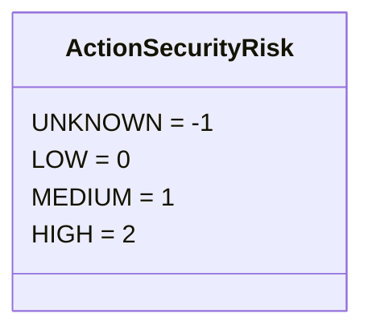
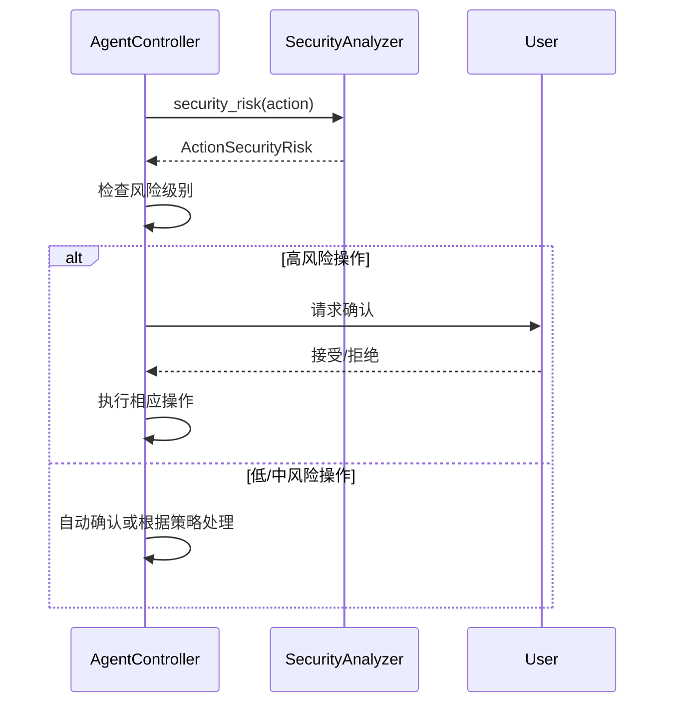

# LLM安全分析器

<cite>
**本文档引用的文件**
- [analyzer.py](file://openhands/security/analyzer.py)
- [options.py](file://openhands/security/options.py)
- [llm/analyzer.py](file://openhands/security/llm/analyzer.py)
- [grayswan/analyzer.py](file://openhands/security/grayswan/analyzer.py)
- [invariant/analyzer.py](file://openhands/security/invariant/analyzer.py)
- [agent_controller.py](file://openhands/controller/agent_controller.py)
- [action.py](file://openhands/events/action/action.py)
- [security.py](file://openhands/server/routes/security.py)
- [llm-settings.tsx](file://frontend/src/routes/llm-settings.tsx)
</cite>

## 目录
1. [简介](#简介)
2. [核心组件](#核心组件)
3. [实现机制](#实现机制)
4. [风险分类模型](#风险分类模型)
5. [响应处理机制](#响应处理机制)
6. [配置选项](#配置选项)
7. [性能优化建议](#性能优化建议)
8. [常见问题解决方案](#常见问题解决方案)

## 简介
LLM安全分析器是OpenHands框架中的关键安全组件，负责对用户输入和AI生成内容进行安全检测，防止恶意指令注入和不当内容生成。该系统通过多种安全分析器实现多层次的安全防护，包括基于LLM的风险评估、外部安全服务集成和本地策略执行。

## 核心组件

LLM安全分析器系统由多个核心组件构成，包括基础安全分析器类、多种具体实现的安全分析器以及相关的配置和路由组件。这些组件协同工作，确保系统在处理用户请求和AI生成内容时能够有效识别和防范潜在的安全风险。

**本文档引用的文件**
- [analyzer.py](file://openhands/security/analyzer.py#L1-L38)
- [options.py](file://openhands/security/options.py#L1-L11)
- [llm/analyzer.py](file://openhands/security/llm/analyzer.py#L1-L43)

## 实现机制

LLM安全分析器的实现基于一个灵活的插件架构，通过继承基础`SecurityAnalyzer`类来创建不同的安全分析器。系统支持多种安全分析器，包括LLM风险分析器、GraySwan分析器和Invariant分析器，每种分析器都有其特定的安全检测机制。

**图表来源**
- [analyzer.py](file://openhands/security/analyzer.py#L8-L38)
- [llm/analyzer.py](file://openhands/security/llm/analyzer.py#L12-L43)
- [grayswan/analyzer.py](file://openhands/security/grayswan/analyzer.py#L18-L205)
- [invariant/analyzer.py](file://openhands/security/invariant/analyzer.py#L15-L126)

## 风险分类模型

LLM安全分析器使用标准化的风险分类模型来评估各种操作的安全性。风险级别分为四个等级：未知(UNKNOWN)、低(LOW)、中(MEDIUM)和高(HIGH)。这种分类模型为系统提供了统一的风险评估标准，使得不同安全分析器的评估结果可以相互比较和整合。

**图表来源**
- [action.py](file://openhands/events/action/action.py#L14-L18)

## 响应处理机制

安全分析器的响应处理机制通过与代理控制器的紧密集成来实现。当检测到潜在风险时，系统会根据风险级别采取相应的措施，包括要求用户确认、自动拒绝或记录日志。这种机制确保了在发现潜在安全问题时能够及时采取适当的响应措施。

**图表来源**
- [agent_controller.py](file://openhands/controller/agent_controller.py#L214-L243)
- [agent_controller.py](file://openhands/controller/agent_controller.py#L972-L991)

## 配置选项

LLM安全分析器提供了丰富的配置选项，允许用户根据具体需求调整安全策略。主要配置选项包括：

| 配置项 | 描述 | 默认值 |
|-------|------|-------|
| security_analyzer | 安全分析器类型 | llm |
| CONFIRMATION_MODE | 确认模式开关 | false |
| GRAYSWAN_API_KEY | GraySwan API密钥 | 无 |
| GRAYSWAN_POLICY_ID | GraySwan策略ID | 689ca4885af3538a39b2ba04 |

此外，系统还支持通过环境变量和配置文件进行配置，提供了灵活的部署选项。

**本文档引用的文件**
- [options.py](file://openhands/security/options.py#L6-L10)
- [grayswan/analyzer.py](file://openhands/security/grayswan/analyzer.py#L48-L63)
- [llm-settings.tsx](file://frontend/src/routes/llm-settings.tsx#L380-L671)

## 性能优化建议

为了确保LLM安全分析器在高负载环境下的性能表现，建议采取以下优化措施：

1. **缓存机制**：对于频繁执行的低风险操作，可以考虑实现结果缓存，避免重复的安全分析。
2. **异步处理**：将安全分析过程异步化，避免阻塞主执行流程。
3. **批量处理**：对于连续的低风险操作，可以考虑批量处理，减少分析开销。
4. **资源限制**：合理设置分析器的资源使用上限，防止资源耗尽。

这些优化措施可以在不影响安全性的前提下，显著提升系统的整体性能。

## 常见问题解决方案

在使用LLM安全分析器时，可能会遇到一些常见问题。以下是这些问题的解决方案：

1. **安全分析器未初始化**：确保在启动时正确配置了安全分析器，并检查相关依赖是否正常。
2. **API请求超时**：调整超时设置，或检查网络连接是否稳定。
3. **Docker容器启动失败**：确保Docker服务正在运行，并检查容器镜像是否可用。
4. **环境变量缺失**：检查必要的环境变量是否已正确设置，特别是API密钥等敏感信息。

通过遵循这些解决方案，可以有效解决使用过程中遇到的大部分问题。

**本文档引用的文件**
- [invariant/analyzer.py](file://openhands/security/invariant/analyzer.py#L37-L44)
- [grayswan/analyzer.py](file://openhands/security/grayswan/analyzer.py#L48-L53)
- [security.py](file://openhands/server/routes/security.py#L36-L40)