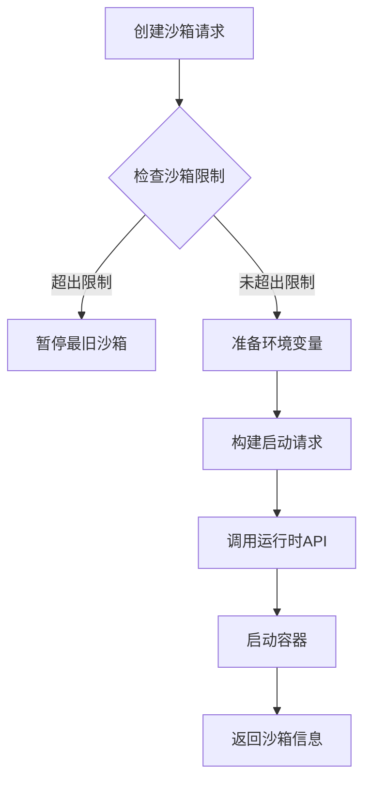
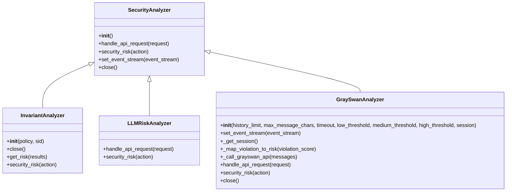
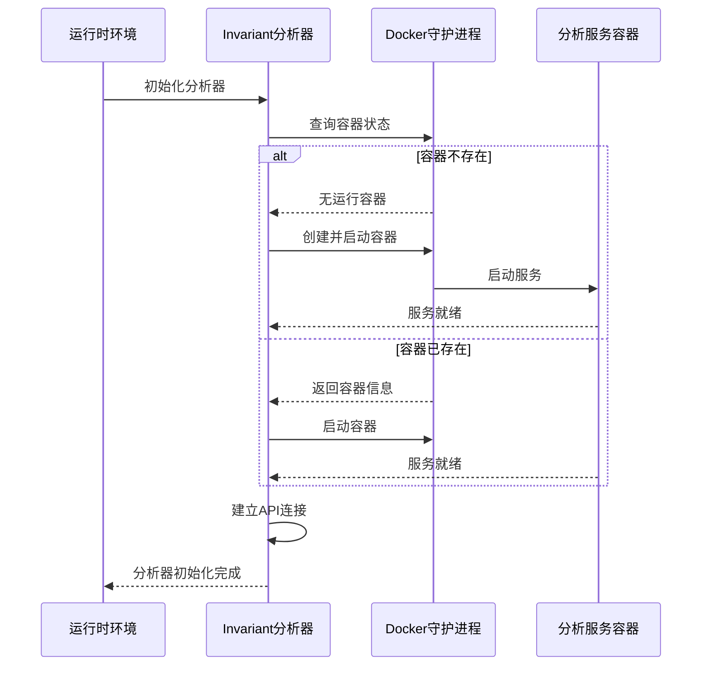
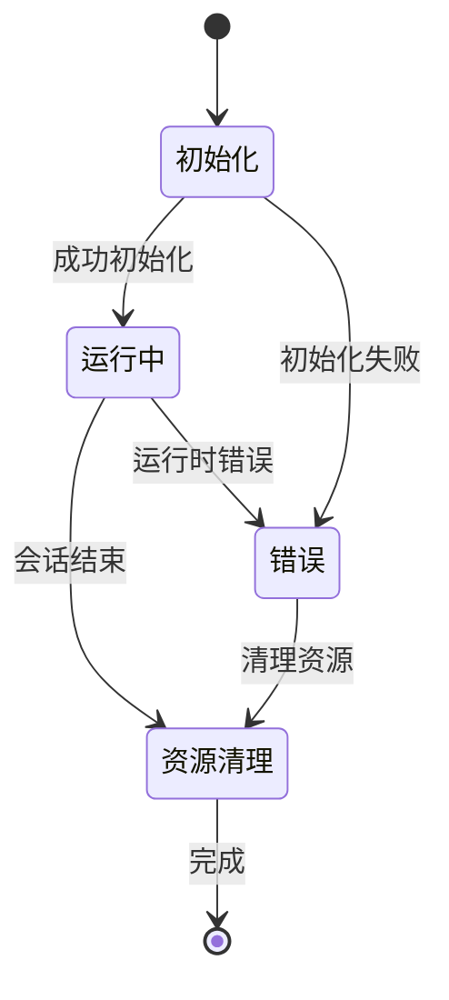
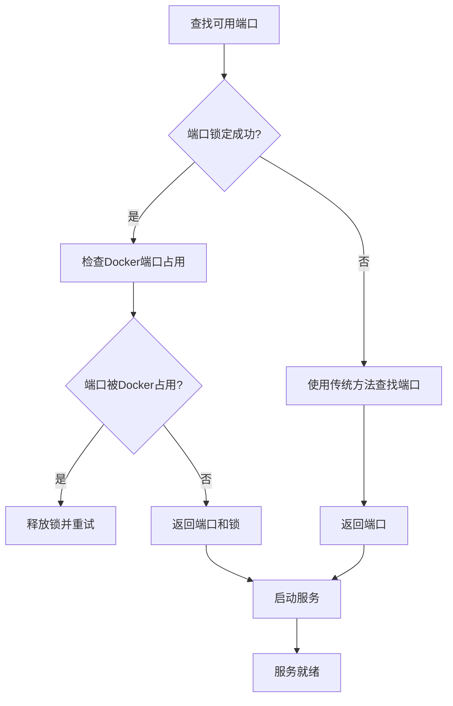

# 运行时安全与沙箱隔离

<cite>
**本文档引用的文件**   
- [analyzer.py](file://openhands/security/analyzer.py)
- [options.py](file://openhands/security/options.py)
- [invariant/analyzer.py](file://openhands/security/invariant/analyzer.py)
- [invariant/client.py](file://openhands/security/invariant/client.py)
- [invariant/parser.py](file://openhands/security/invariant/parser.py)
- [invariant/nodes.py](file://openhands/security/invariant/nodes.py)
- [invariant/policies.py](file://openhands/security/invariant/policies.py)
- [base.py](file://openhands/runtime/base.py)
- [action_execution_server.py](file://openhands/runtime/action_execution_server.py)
- [docker_sandbox_service.py](file://openhands/app_server/sandbox/docker_sandbox_service.py)
- [remote_sandbox_service.py](file://openhands/app_server/sandbox/remote_sandbox_service.py)
</cite>

## 目录
1. [引言](#引言)
2. [沙箱隔离机制](#沙箱隔离机制)
3. [安全分析器设计](#安全分析器设计)
4. [InvariantAnalyzer实现](#invariantanalyzer实现)
5. [安全分析器生命周期管理](#安全分析器生命周期管理)
6. [端口分配与API通信](#端口分配与api通信)
7. [性能优化建议](#性能优化建议)
8. [故障排除指南](#故障排除指南)
9. [结论](#结论)

## 引言

OpenHands平台通过沙箱隔离机制和代码执行限制策略确保运行时环境的安全性。该系统采用容器化技术隔离代码执行环境，防止恶意代码对主机系统造成损害。安全分析器框架作为核心安全组件，能够实时监控和分析代理操作，评估潜在安全风险。本文档详细阐述了SecurityAnalyzer抽象基类的设计与实现，以及InvariantAnalyzer如何通过Docker容器运行安全分析服务。同时，文档涵盖了安全分析器的生命周期管理、端口分配和API通信机制，为开发者提供全面的运行时安全指导。

## 沙箱隔离机制

OpenHands平台采用多层沙箱隔离机制来保护运行时环境。系统通过容器化技术创建隔离的执行环境，每个沙箱实例都运行在独立的容器中，与主机系统和其他沙箱实例完全隔离。这种设计确保了即使在执行潜在危险代码时，也不会影响主机系统的稳定性和安全性。

沙箱服务通过`RemoteSandboxService`和`DockerSandboxService`等组件管理沙箱生命周期。当需要创建新的沙箱时，系统会执行以下步骤：首先检查现有沙箱数量，如果超过最大限制，则暂停最旧的沙箱；然后准备环境变量和启动请求；最后通过API调用启动远程运行时。启动请求包含容器镜像、命令、工作目录、环境变量等关键参数，并设置运行用户和组为10001以增强安全性。

**Diagram sources**
- [remote_sandbox_service.py](file://openhands/app_server/sandbox/remote_sandbox_service.py#L288-L359)
- [docker_sandbox_service.py](file://openhands/app_server/sandbox/docker_sandbox_service.py#L305-L322)

**Section sources**
- [remote_sandbox_service.py](file://openhands/app_server/sandbox/remote_sandbox_service.py#L288-L359)
- [docker_sandbox_service.py](file://openhands/app_server/sandbox/docker_sandbox_service.py#L305-L344)

## 安全分析器设计

SecurityAnalyzer抽象基类是OpenHands安全框架的核心组件，为各种安全分析器提供了统一的接口和基础功能。该基类定义了安全分析器必须实现的关键方法，包括API请求处理、安全风险评估、事件流设置和资源清理等。

**Diagram sources**
- [analyzer.py](file://openhands/security/analyzer.py#L8-L38)
- [invariant/analyzer.py](file://openhands/security/invariant/analyzer.py#L15-L126)
- [llm/analyzer.py](file://openhands/security/llm/analyzer.py#L12-L43)
- [grayswan/analyzer.py](file://openhands/security/grayswan/analyzer.py#L18-L205)

**Section sources**
- [analyzer.py](file://openhands/security/analyzer.py#L8-L38)
- [options.py](file://openhands/security/options.py#L6-L10)

## InvariantAnalyzer实现

InvariantAnalyzer是基于Invariant安全分析服务的具体实现，通过Docker容器运行安全分析服务。该分析器在初始化时会检查是否存在已运行的分析服务容器，如果没有则创建并启动新的容器实例。容器使用预定义的镜像`ghcr.io/invariantlabs-ai/server:openhands`，并在本地随机端口上暴露服务。

**Diagram sources**
- [invariant/analyzer.py](file://openhands/security/invariant/analyzer.py#L25-L87)
- [invariant/client.py](file://openhands/security/invariant/client.py#L10-L39)

**Section sources**
- [invariant/analyzer.py](file://openhands/security/invariant/analyzer.py#L25-L87)
- [invariant/client.py](file://openhands/security/invariant/client.py#L10-L39)

## 安全分析器生命周期管理

安全分析器的生命周期管理包括初始化、运行时监控和资源清理三个阶段。在初始化阶段，系统根据配置选择相应的安全分析器类型，并创建其实例。对于InvariantAnalyzer，这包括检查和启动Docker容器，建立与分析服务的连接，以及加载安全策略。

运行时监控阶段，安全分析器通过事件流接收代理操作，并实时评估其安全风险。每个操作都会被解析为特定的跟踪元素，然后提交给分析服务进行风险评估。分析结果会映射到标准的风险级别（低、中、高），供系统决策使用。

资源清理阶段在会话结束时执行，确保所有分配的资源都被正确释放。对于InvariantAnalyzer，这包括停止Docker容器；对于GraySwanAnalyzer，则包括关闭HTTP会话。这种严格的生命周期管理确保了系统资源的有效利用和安全性。

**Diagram sources**
- [invariant/analyzer.py](file://openhands/security/invariant/analyzer.py#L89-L91)
- [grayswan/analyzer.py](file://openhands/security/grayswan/analyzer.py#L201-L205)
- [base.py](file://openhands/runtime/base.py#L197-L207)

**Section sources**
- [invariant/analyzer.py](file://openhands/security/invariant/analyzer.py#L89-L91)
- [grayswan/analyzer.py](file://openhands/security/grayswan/analyzer.py#L201-L205)

## 端口分配与API通信

OpenHands平台采用智能端口分配机制来管理服务端口，防止端口冲突。系统使用`find_available_tcp_port`函数查找可用端口，并通过文件锁机制防止多个进程同时分配相同端口。这种双重保护机制确保了即使在高并发环境下也能安全地分配端口。

API通信机制基于HTTP/HTTPS协议，使用JSON格式进行数据交换。安全分析服务通过RESTful API提供各种功能，包括会话管理、策略加载和风险评估。客户端通过预定义的端点与服务通信，所有请求都包含会话标识符以确保请求的正确路由。

**Diagram sources**
- [action_execution_server.py](file://openhands/runtime/action_execution_server.py#L69-L75)
- [docker_sandbox_service.py](file://openhands/app_server/sandbox/docker_sandbox_service.py#L664-L689)
- [test_port_locking_fix.py](file://tests/runtime/test_port_locking_fix.py#L59-L82)

**Section sources**
- [action_execution_server.py](file://openhands/runtime/action_execution_server.py#L69-L75)
- [docker_sandbox_service.py](file://openhands/app_server/sandbox/docker_sandbox_service.py#L664-L689)

## 性能优化建议

为了优化运行时安全系统的性能，建议采取以下措施：首先，合理配置沙箱数量限制，避免创建过多沙箱实例导致资源耗尽；其次，优化安全策略，减少不必要的分析规则以降低处理延迟；最后，定期清理旧的沙箱实例，释放系统资源。

对于InvariantAnalyzer，可以考虑复用分析服务容器而不是为每个会话创建新容器。这可以显著减少容器启动时间，提高系统响应速度。同时，建议监控Docker守护进程的性能，确保其能够快速响应容器管理请求。

在高并发场景下，应重点关注端口分配机制的性能。虽然文件锁机制有效防止了端口冲突，但在极端情况下可能成为性能瓶颈。可以通过扩大端口范围或优化锁机制来进一步提升性能。

## 故障排除指南

当遇到安全分析器相关问题时，可以按照以下步骤进行排查：首先检查Docker服务是否正常运行，因为InvariantAnalyzer依赖Docker容器；其次验证网络连接，确保能够访问外部安全服务如GraySwan；最后检查配置文件，确认安全分析器设置正确。

常见问题包括：Docker容器启动失败，通常由于Docker服务未运行或资源不足；API连接超时，可能是网络问题或服务端故障；端口冲突，表明端口分配机制出现问题。对于这些问题，应查看相关日志文件获取详细错误信息，并根据具体情况进行处理。

## 结论

OpenHands平台通过完善的沙箱隔离机制和多层次的安全分析框架，为代码执行提供了强大的安全保障。SecurityAnalyzer抽象基类的设计使得系统能够灵活集成各种安全分析服务，而InvariantAnalyzer的具体实现展示了如何通过容器化技术运行外部安全服务。系统的生命周期管理和端口分配机制确保了资源的有效利用和稳定性。通过遵循本文档的建议，开发者可以更好地理解和使用OpenHands的安全特性，构建更加安全可靠的自动化系统。