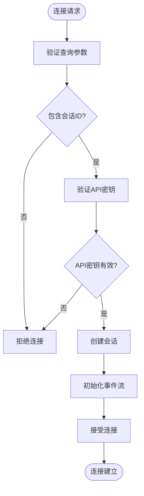

# 异步处理

<cite>
**本文档引用的文件**
- [app.py](file://openhands/server/app.py)
- [listen.py](file://openhands/server/listen.py)
- [listen_socket.py](file://openhands/server/listen_socket.py)
- [session.py](file://openhands/server/session/session.py)
- [async_event_store_wrapper.py](file://openhands/events/async_event_store_wrapper.py)
- [async_llm.py](file://openhands/llm/async_llm.py)
- [streaming_llm.py](file://openhands/llm/streaming_llm.py)
- [async_utils.py](file://openhands/utils/async_utils.py)
- [middleware.py](file://openhands/server/middleware.py)
- [conversation_manager.py](file://openhands/server/conversation_manager/standalone_conversation_manager.py)
- [db_session_injector.py](file://openhands/app_server/services/db_session_injector.py)
- [use-websocket.ts](file://frontend/src/hooks/use-websocket.ts)
- [conversation-websocket-handler.test.tsx](file://frontend/__tests__/conversation-websocket-handler.test.tsx)
</cite>

## 目录
1. [引言](#引言)
2. [项目结构](#项目结构)
3. [核心组件](#核心组件)
4. [架构概述](#架构概述)
5. [详细组件分析](#详细组件分析)
6. [依赖分析](#依赖分析)
7. [性能考虑](#性能考虑)
8. [故障排除指南](#故障排除指南)
9. [结论](#结论)

## 引言
本文档深入分析OpenHands后端的异步I/O架构，重点关注FastAPI事件循环集成、WebSocket连接管理机制、异步请求处理管道等核心组件。文档详细说明了异步数据库操作、文件I/O处理、任务调度模式和并发控制策略，并解释了异步上下文中的异常处理特殊考虑。

## 项目结构
OpenHands后端采用模块化设计，主要包含服务器、事件处理、LLM集成、运行时环境等核心模块。异步处理架构主要集中在服务器模块中，通过FastAPI和Socket.IO实现WebSocket通信，结合异步数据库操作和LLM调用，构建了高效的异步I/O处理管道。

**图示来源**
- [app.py](file://openhands/server/app.py)
- [listen.py](file://openhands/server/listen.py)
- [listen_socket.py](file://openhands/server/listen_socket.py)

**本节来源**
- [app.py](file://openhands/server/app.py)
- [listen.py](file://openhands/server/listen.py)

## 核心组件
OpenHands的异步处理架构由多个核心组件构成，包括FastAPI应用、Socket.IO服务器、事件存储、异步LLM服务和会话管理器。这些组件协同工作，实现了高效的异步I/O处理。

**本节来源**
- [app.py](file://openhands/server/app.py)
- [listen.py](file://openhands/server/listen.py)
- [session.py](file://openhands/server/session/session.py)

## 架构概述
OpenHands的异步架构基于FastAPI和Socket.IO构建，采用事件驱动的设计模式。当客户端建立WebSocket连接时，服务器创建会话并监听事件流。所有I/O操作，包括数据库访问、LLM调用和文件操作，都以异步方式执行，确保高并发性能。

**图示来源**
- [listen_socket.py](file://openhands/server/listen_socket.py)
- [session.py](file://openhands/server/session/session.py)
- [async_llm.py](file://openhands/llm/async_llm.py)

## 详细组件分析

### FastAPI与Socket.IO集成
OpenHands使用FastAPI作为Web框架，并通过Socket.IO实现WebSocket通信。服务器应用在启动时创建FastAPI实例，并将其与Socket.IO服务器集成，形成统一的ASGI应用。

**图示来源**
- [app.py](file://openhands/server/app.py)
- [listen.py](file://openhands/server/listen.py)

**本节来源**
- [app.py](file://openhands/server/app.py)
- [listen.py](file://openhands/server/listen.py)

### WebSocket连接管理
WebSocket连接管理是异步处理的核心。服务器通过`connect`事件处理程序验证会话，并建立事件流。每个连接都有唯一的会话ID，用于关联客户端和服务器端的会话状态。

**图示来源**
- [listen_socket.py](file://openhands/server/listen_socket.py)
- [session.py](file://openhands/server/session/session.py)

**本节来源**
- [listen_socket.py](file://openhands/server/listen_socket.py)
- [session.py](file://openhands/server/session/session.py)

### 异步请求处理管道
异步请求处理管道负责处理从客户端接收的事件，并将其分发到相应的处理程序。管道采用发布-订阅模式，确保事件能够高效地传递到所有订阅者。

**图示来源**
- [session.py](file://openhands/server/session/session.py)
- [async_event_store_wrapper.py](file://openhands/events/async_event_store_wrapper.py)

**本节来源**
- [session.py](file://openhands/server/session/session.py)
- [async_event_store_wrapper.py](file://openhands/events/async_event_store_wrapper.py)

### 异步数据库操作
异步数据库操作通过`db_session_injector.py`中的`get_async_db_engine`方法实现。该方法根据配置创建异步数据库引擎，支持PostgreSQL和SQLite。

**图示来源**
- [db_session_injector.py](file://openhands/app_server/services/db_session_injector.py)

**本节来源**
- [db_session_injector.py](file://openhands/app_server/services/db_session_injector.py)

### 异步LLM服务
异步LLM服务通过`AsyncLLM`类实现，该类封装了对LLM的异步调用。服务支持重试机制和取消请求功能，确保在高负载下仍能稳定运行。

**图示来源**
- [async_llm.py](file://openhands/llm/async_llm.py)
- [streaming_llm.py](file://openhands/llm/streaming_llm.py)

**本节来源**
- [async_llm.py](file://openhands/llm/async_llm.py)
- [streaming_llm.py](file://openhands/llm/streaming_llm.py)

## 依赖分析
OpenHands的异步处理架构依赖于多个关键组件，包括FastAPI、Socket.IO、Litellm、SQLAlchemy等。这些组件通过清晰的接口进行交互，确保系统的可维护性和可扩展性。

**图示来源**
- [app.py](file://openhands/server/app.py)
- [db_session_injector.py](file://openhands/app_server/services/db_session_injector.py)
- [async_llm.py](file://openhands/llm/async_llm.py)

**本节来源**
- [app.py](file://openhands/server/app.py)
- [db_session_injector.py](file://openhands/app_server/services/db_session_injector.py)
- [async_llm.py](file://openhands/llm/async_llm.py)

## 性能考虑
异步处理架构显著提升了系统的吞吐量和响应时间。通过异步I/O操作，系统能够同时处理大量并发连接，而不会阻塞事件循环。此外，连接池和缓存机制进一步优化了数据库访问性能。

**本节来源**
- [middleware.py](file://openhands/server/middleware.py)
- [async_utils.py](file://openhands/utils/async_utils.py)

## 故障排除指南
在异步上下文中处理异常需要特殊考虑。OpenHands通过多种机制确保异常不会导致系统崩溃，包括重试机制、超时控制和优雅的错误处理。

**本节来源**
- [async_llm.py](file://openhands/llm/async_llm.py)
- [async_utils.py](file://openhands/utils/async_utils.py)

## 结论
OpenHands的异步处理架构通过精心设计的组件和清晰的接口，实现了高效的异步I/O处理。该架构不仅提升了系统的性能和可扩展性，还确保了在高并发场景下的稳定性和可靠性。