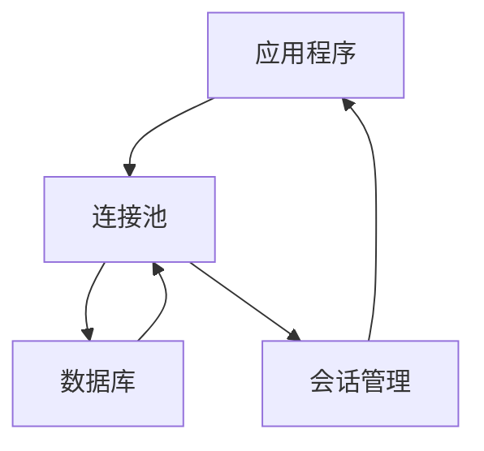
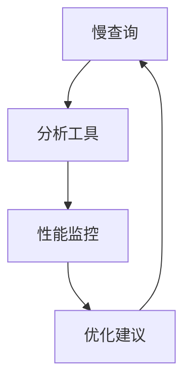

# 数据库优化

<cite>
**本文档引用的文件**   
- [database.py](file://enterprise/storage/database.py)
- [debugging.py](file://enterprise/server/routes/debugging.py)
- [user_settings.py](file://enterprise/storage/user_settings.py)
- [conversation_callback.py](file://enterprise/storage/conversation_callback.py)
- [saas_conversation_store.py](file://enterprise/storage/saas_conversation_store.py)
- [env.py](file://enterprise/migrations/env.py)
- [077_drop_settings_table.py](file://enterprise/migrations/versions/077_drop_settings_table.py)
- [openhands-enterprise-telemetry-design.md](file://enterprise/doc/design-doc/openhands-enterprise-telemetry-design.md)
</cite>

## 目录
1. [引言](#引言)
2. [数据库连接池配置与连接复用机制](#数据库连接池配置与连接复用机制)
3. [SQL查询优化策略与索引设计原则](#sql查询优化策略与索引设计原则)
4. [批量操作与事务管理最佳实践](#批量操作与事务管理最佳实践)
5. [读写分离架构与查询缓存应用](#读写分离架构与查询缓存应用)
6. [慢查询分析工具与性能监控指标](#慢查询分析工具与性能监控指标)
7. [数据库schema设计对性能的影响分析与优化建议](#数据库schema设计对性能的影响分析与优化建议)
8. [结论](#结论)

## 引言
OpenHands是一个开源的自动化开发平台，其企业版在数据库访问优化方面采用了多种技术来确保系统的高性能和可扩展性。本文档旨在全面阐述OpenHands的数据访问优化技术，包括SQL查询优化策略、索引设计原则、数据库连接池配置、连接复用机制、批量操作和事务管理的最佳实践、读写分离架构以及查询缓存的应用。此外，文档还将提供慢查询分析工具和性能监控指标，并详细分析数据库schema设计对性能的影响，提出相应的优化建议。

**Section sources**
- [database.py](file://enterprise/storage/database.py#L1-L115)

## 数据库连接池配置与连接复用机制
OpenHands通过配置数据库连接池来优化数据库访问性能。连接池的大小和溢出连接数可以通过环境变量进行配置，这允许根据实际负载动态调整连接池的大小。具体来说，`POOL_SIZE`环境变量定义了连接池的初始大小，而`MAX_OVERFLOW`则定义了当所有连接都在使用时可以创建的额外连接数。这种配置有助于避免在高并发场景下出现连接耗尽的问题。

此外，OpenHands还实现了连接复用机制，通过使用SQLAlchemy的session maker来管理数据库会话。每个会话都从连接池中获取一个连接，并在会话结束时自动返回到池中，从而减少了频繁建立和关闭数据库连接的开销。这种方式不仅提高了性能，还降低了数据库服务器的负载。

**Diagram sources**
- [database.py](file://enterprise/storage/database.py#L20-L22)
- [database.py](file://enterprise/storage/database.py#L103-L114)

**Section sources**
- [database.py](file://enterprise/storage/database.py#L1-L115)

## SQL查询优化策略与索引设计原则
为了提高查询效率，OpenHands采用了多种SQL查询优化策略。首先，通过分析慢查询日志，识别出执行时间较长的查询语句，并对其进行优化。例如，对于经常使用的查询，可以通过添加适当的索引来加速数据检索。其次，利用数据库的查询计划功能，检查查询的执行路径，确保查询能够有效地利用索引。

在索引设计方面，OpenHands遵循以下原则：为经常用于WHERE子句中的列创建索引；为JOIN操作中涉及的列创建索引；避免在低选择性的列上创建索引，因为这可能会导致索引的维护成本高于其带来的性能提升。此外，定期审查和优化现有索引，以适应数据分布的变化。

**Section sources**
- [openhands-enterprise-telemetry-design.md](file://enterprise/doc/design-doc/openhands-enterprise-telemetry-design.md#L148-L162)

## 批量操作与事务管理最佳实践
在处理大量数据时，OpenHands推荐使用批量操作来减少网络往返次数，从而提高整体性能。例如，在插入或更新多条记录时，应尽可能地将这些操作合并成一个批量操作，而不是逐条执行。这样不仅可以减少与数据库的交互次数，还可以降低事务的开销。

关于事务管理，OpenHands强调了短事务的重要性。长时间运行的事务会占用数据库资源，影响其他操作的性能。因此，建议将大事务分解为多个小事务，每个事务只包含必要的操作。同时，合理设置事务的隔离级别，以平衡数据一致性和并发性能。

**Section sources**
- [saas_conversation_store.py](file://enterprise/storage/saas_conversation_store.py#L80-L84)
- [saas_conversation_store.py](file://enterprise/storage/saas_conversation_store.py#L124-L131)

## 读写分离架构与查询缓存应用
OpenHands支持读写分离架构，通过将读操作和写操作分配到不同的数据库实例上来提高系统的可扩展性和性能。通常，写操作会被定向到主数据库，而读操作则被分发到一个或多个只读副本。这种架构可以显著减轻主数据库的负载，特别是在读密集型的应用场景中。

为了进一步提升性能，OpenHands还利用了查询缓存技术。对于那些不经常变化但频繁访问的数据，可以将其结果集缓存起来，当再次收到相同的查询请求时，直接从缓存中返回结果，而无需再次访问数据库。这种方法特别适用于配置信息、元数据等静态内容的查询。

**Section sources**
- [database.py](file://enterprise/storage/database.py#L70-L100)
- [debugging.py](file://enterprise/server/routes/debugging.py#L40-L54)

## 慢查询分析工具与性能监控指标
OpenHands提供了专门的工具来帮助开发者分析慢查询。通过`/pool-stats`端点，可以实时获取数据库连接池的状态，包括已检入、已检出和溢出的连接数。这些信息有助于诊断连接池是否达到极限，进而采取相应的措施。

此外，`/test-db`和`/a-test-db`端点可用于压力测试数据库连接池，模拟多线程或多协程环境下的数据库访问情况。通过这些测试，可以评估系统在高并发条件下的表现，并发现潜在的性能瓶颈。

性能监控方面，OpenHands记录了关键的性能指标，如查询响应时间、事务处理速度等。这些指标可以通过监控系统进行收集和分析，帮助运维团队及时发现并解决性能问题。

**Diagram sources**
- [debugging.py](file://enterprise/server/routes/debugging.py#L40-L54)
- [debugging.py](file://enterprise/server/routes/debugging.py#L56-L76)

**Section sources**
- [debugging.py](file://enterprise/server/routes/debugging.py#L40-L124)

## 数据库schema设计对性能的影响分析与优化建议
数据库schema的设计对性能有着直接的影响。在OpenHands中，通过合理的schema设计，可以有效提高数据访问效率。例如，`telemetry_metrics`表的设计考虑到了数据的查询模式，通过为`collected_at`和`uploaded_at`字段创建索引，加快了基于时间范围的查询速度。

另外，`telemetry_identity`表通过限制表中只能有一行数据，确保了身份信息的唯一性，同时也简化了对该表的访问逻辑。这种设计减少了不必要的数据冗余，提高了数据的一致性和完整性。

针对数据库schema设计，提出以下几点优化建议：
- 选择合适的数据类型，避免使用过大的数据类型，以减少存储空间和提高I/O效率。
- 合理规划表结构，避免过度规范化或反规范化，找到性能和数据一致性的最佳平衡点。
- 定期审查和优化schema，根据实际使用情况调整表结构和索引。

**Section sources**
- [openhands-enterprise-telemetry-design.md](file://enterprise/doc/design-doc/openhands-enterprise-telemetry-design.md#L148-L175)
- [user_settings.py](file://enterprise/storage/user_settings.py#L6-L41)

## 结论
综上所述，OpenHands通过一系列精心设计的技术手段实现了高效的数据库访问优化。从连接池配置到SQL查询优化，再到批量操作和事务管理，每一项技术都在不同程度上提升了系统的性能和稳定性。未来，随着业务的发展和技术的进步，持续优化数据库访问策略将是保持系统竞争力的关键。