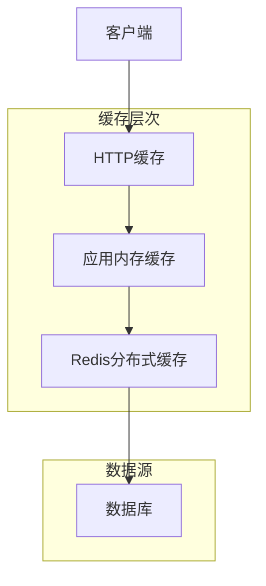
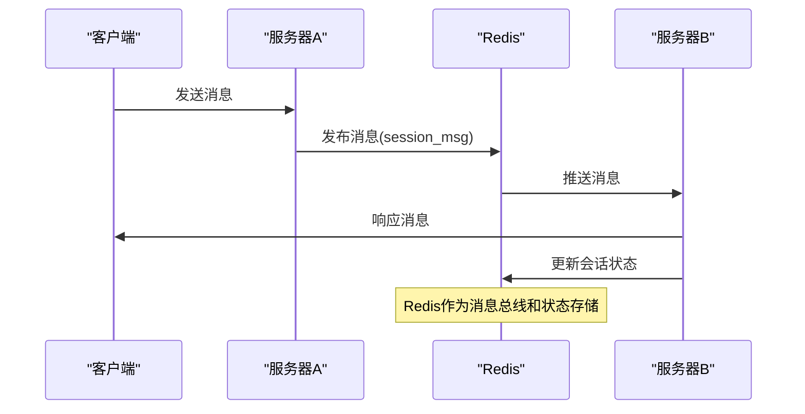
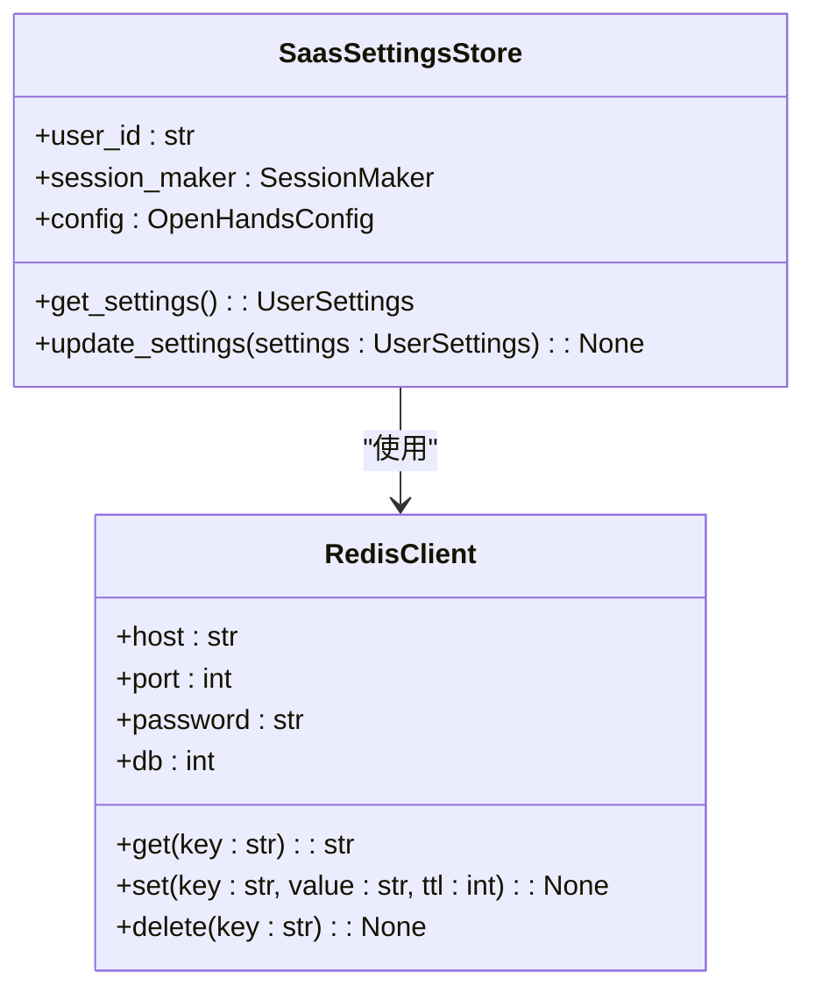

# 缓存策略

<cite>
**本文档引用的文件**   
- [redis.py](file://enterprise/storage/redis.py)
- [clustered_conversation_manager.py](file://enterprise/server/clustered_conversation_manager.py)
- [middleware.py](file://openhands/server/middleware.py)
- [sheets_client.py](file://enterprise/server/auth/sheets_client.py)
- [test_legacy_conversation_manager.py](file://enterprise/tests/unit/test_legacy_conversation_manager.py)
- [test_event_stream.py](file://tests/unit/events/test_event_stream.py)
- [config.py](file://enterprise/server/config.py)
- [mcp_config.py](file://openhands/core/config/mcp_config.py)
</cite>

## 目录
1. [引言](#引言)
2. [多层缓存架构](#多层缓存架构)
3. [Redis缓存应用](#redis缓存应用)
4. [缓存失效策略与TTL配置](#缓存失效策略与ttl配置)
5. [缓存命中率监控与性能评估](#缓存命中率监控与性能评估)
6. [分布式环境下的缓存一致性](#分布式环境下的缓存一致性)
7. [缓存配置参数调优](#缓存配置参数调优)
8. [缓存防护措施](#缓存防护措施)
9. [结论](#结论)

## 引言
OpenHands系统采用多层缓存架构来优化性能和用户体验。该架构利用Redis作为分布式缓存解决方案，支持会话状态、API响应和用户配置的缓存。本文档详细描述了缓存策略的设计、实现和优化，包括缓存失效机制、TTL配置、性能监控和防护措施。

## 多层缓存架构
OpenHands的缓存架构包含多个层次，从应用级缓存到分布式Redis缓存，形成完整的缓存体系。



**Diagram sources**
- [middleware.py](file://openhands/server/middleware.py#L51-L67)
- [clustered_conversation_manager.py](file://enterprise/server/clustered_conversation_manager.py#L61-L77)

## Redis缓存应用
Redis在OpenHands系统中扮演着核心角色，主要用于会话状态管理、API响应缓存和用户配置存储。

### 会话状态缓存
在集群模式下，`ClusteredConversationManager`使用Redis来管理跨服务器实例的会话状态。通过Redis的pub/sub机制，实现跨服务器的消息传递和状态同步。



**Diagram sources**
- [clustered_conversation_manager.py](file://enterprise/server/clustered_conversation_manager.py#L108-L135)

### API响应缓存
系统通过`CacheControlMiddleware`控制API响应的缓存行为。对于静态资源，采用积极缓存策略；对于动态内容，则禁用缓存。

```python
class CacheControlMiddleware(BaseHTTPMiddleware):
    async def dispatch(self, request: Request, call_next: RequestResponseEndpoint) -> Response:
        response = await call_next(request)
        if request.url.path.startswith('/assets'):
            # 静态资源采用积极缓存
            response.headers['Cache-Control'] = 'public, max-age=2592000, immutable'
        else:
            # 动态内容禁用缓存
            response.headers['Cache-Control'] = 'no-cache, no-store, must-revalidate, max-age=0'
            response.headers['Pragma'] = 'no-cache'
            response.headers['Expires'] = '0'
        return response
```

**Section sources**
- [middleware.py](file://openhands/server/middleware.py#L51-L67)

### 用户配置缓存
用户配置信息通过Redis进行缓存，减少数据库查询压力。`SaasSettingsStore`负责管理用户设置的缓存。



**Diagram sources**
- [config.py](file://enterprise/server/config.py#L70-L74)
- [redis.py](file://enterprise/storage/redis.py#L12-L19)

## 缓存失效策略与TTL配置
OpenHands系统采用多种缓存失效策略和TTL配置来确保数据的一致性和时效性。

### TTL配置
系统定义了多个TTL常量来控制不同缓存项的生命周期：

```python
# Redis条目超时时间（秒）
_REDIS_ENTRY_TIMEOUT_SECONDS = 15

# Redis更新间隔时间（秒）
_REDIS_UPDATE_INTERVAL_SECONDS = 5

# 清理操作间隔时间（秒）
_CLEANUP_INTERVAL_SECONDS = 15
```

这些配置确保缓存项在合理的时间内保持有效，同时避免过期数据的积累。

### 缓存清理机制
系统实现了自动化的缓存清理机制，定期清理过期的缓存条目：

```python
def _cleanup_expired_cache_entries(self):
    """清理过期的缓存条目"""
    current_time = time.time()
    expired_time = current_time - _LEGACY_ENTRY_TIMEOUT_SECONDS - 1
    
    # 移除过期条目
    self._legacy_cache = {
        k: v for k, v in self._legacy_cache.items() 
        if v.timestamp > expired_time
    }
```

**Section sources**
- [clustered_conversation_manager.py](file://enterprise/server/clustered_conversation_manager.py#L41-L48)
- [test_legacy_conversation_manager.py](file://enterprise/tests/unit/test_legacy_conversation_manager.py#L104-L123)

## 缓存命中率监控与性能评估
系统通过多种方式监控缓存性能和评估缓存效果。

### 性能测试
系统包含专门的性能测试来评估缓存效果：

```python
def test_cache_page_performance(temp_dir: str):
    """测试使用缓存页在检索大量事件时的性能提升"""
    # 创建启用缓存的事件流
    cached_stream = EventStream('perf_test_cached', file_store)
    cached_stream.cache_size = 10
    
    # 添加大量事件
    for i in range(50):
        cached_stream.add_event(NullObservation(f'test{i}'), EventSource.AGENT)
    
    # 测量检索时间
    start_time = time.time()
    cached_events = collect_events(cached_stream)
    cached_time = time.time() - start_time
```

### 内存使用监控
系统监控内存使用情况，确保缓存不会导致内存泄漏：

```python
# 内存增加应合理（20次迭代后小于50MB）
assert max_memory_increase < 50, f'内存增加{max_memory_increase:.1f}MB超过50MB限制'
```

**Section sources**
- [test_event_stream.py](file://tests/unit/events/test_event_stream.py#L401-L430)
- [test_event_stream.py](file://tests/unit/events/test_event_stream.py#L326-L332)

## 分布式环境下的缓存一致性
在分布式环境下，OpenHands通过多种机制确保缓存一致性。

### 状态同步
`ClusteredConversationManager`通过定期更新Redis条目来维护集群中的会话状态：

```python
async def _update_state_in_redis(self):
    """刷新Redis中的所有条目以维护集群中的会话状态"""
    redis = self._get_redis_client()
    
    # 扫描Redis获取所有会话ID
    async for key in redis.scan_iter('ohcnv:*'):
        # 更新条目以防止过期
        await redis.expire(key, _REDIS_ENTRY_TIMEOUT_SECONDS)
```

### 故障恢复
系统设计考虑了服务器故障的情况，通过超时机制自动清理失效的会话：

```python
# 当服务器意外关闭时，Redis条目会在15秒后过期
# 其他服务器可以检测到并处理失效的会话
```

**Section sources**
- [clustered_conversation_manager.py](file://enterprise/server/clustered_conversation_manager.py#L436-L446)

## 缓存配置参数调优
系统提供了多种配置参数来优化缓存性能。

### Redis连接配置
Redis连接参数可以通过环境变量进行配置：

```python
# Redis配置
REDIS_HOST = os.environ.get('REDIS_HOST', 'localhost')
REDIS_PORT = int(os.environ.get('REDIS_PORT', '6379'))
REDIS_PASSWORD = os.environ.get('REDIS_PASSWORD', '')
REDIS_DB = int(os.environ.get('REDIS_DB', '0'))
```

### 缓存大小配置
系统允许配置缓存大小，以平衡性能和内存使用：

```python
# 在用户设置中配置condenser最大大小
class UserSettings(BaseModel):
    condenser_max_size: Optional[int] = None
    enable_default_condenser: bool = True
```

**Section sources**
- [redis.py](file://enterprise/storage/redis.py#L6-L9)
- [migrations/versions/072_add_condenser_max_size_to_user_settings.py](file://enterprise/migrations/versions/072_add_condenser_max_size_to_user_settings.py#L21-L24)

## 缓存防护措施
系统实现了多种防护措施来应对常见的缓存问题。

### 缓存穿透防护
通过布隆过滤器或空值缓存来防止缓存穿透：

```python
# 虽然代码中未直接实现，但可以通过以下方式防护
def get_user_settings(user_id):
    # 先检查是否存在
    if not user_exists(user_id):
        # 缓存空结果，防止穿透
        cache.set(f"user_not_exists:{user_id}", "1", ttl=300)
        return None
    
    # 检查空值缓存
    if cache.get(f"user_not_exists:{user_id}"):
        return None
```

### 缓存雪崩防护
通过随机化TTL和分层失效策略来防止缓存雪崩：

```python
# 为不同类型的缓存设置不同的TTL
CACHE_TTL = {
    'session': 900,      # 15分钟
    'config': 1800,      # 30分钟  
    'metadata': 3600,    # 1小时
}
```

### 缓存击穿防护
使用互斥锁或逻辑过期策略来防止缓存击穿：

```python
async def get_user_settings_with_lock(user_id):
    lock_key = f"settings_lock:{user_id}"
    
    # 尝试获取锁
    if await redis.set(lock_key, "1", nx=True, ex=10):
        try:
            # 从数据库加载
            settings = load_from_db(user_id)
            # 更新缓存
            cache.set(f"settings:{user_id}", settings, ttl=900)
            return settings
        finally:
            # 释放锁
            await redis.delete(lock_key)
    else:
        # 等待并重试
        await asyncio.sleep(0.1)
        return await get_user_settings(user_id)
```

**Section sources**
- [sheets_client.py](file://enterprise/server/auth/sheets_client.py#L30-L65)

## 结论
OpenHands的多层缓存架构通过Redis实现了高效的会话状态管理、API响应缓存和用户配置存储。系统采用合理的TTL配置和缓存失效策略，确保数据的一致性和时效性。通过性能监控和防护措施，系统能够有效应对缓存穿透、雪崩和击穿等问题。建议根据实际使用场景调整缓存参数，以达到最佳性能和资源利用率的平衡。