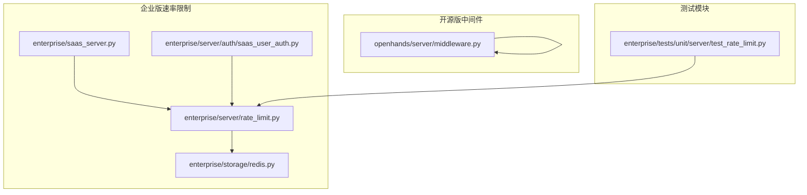
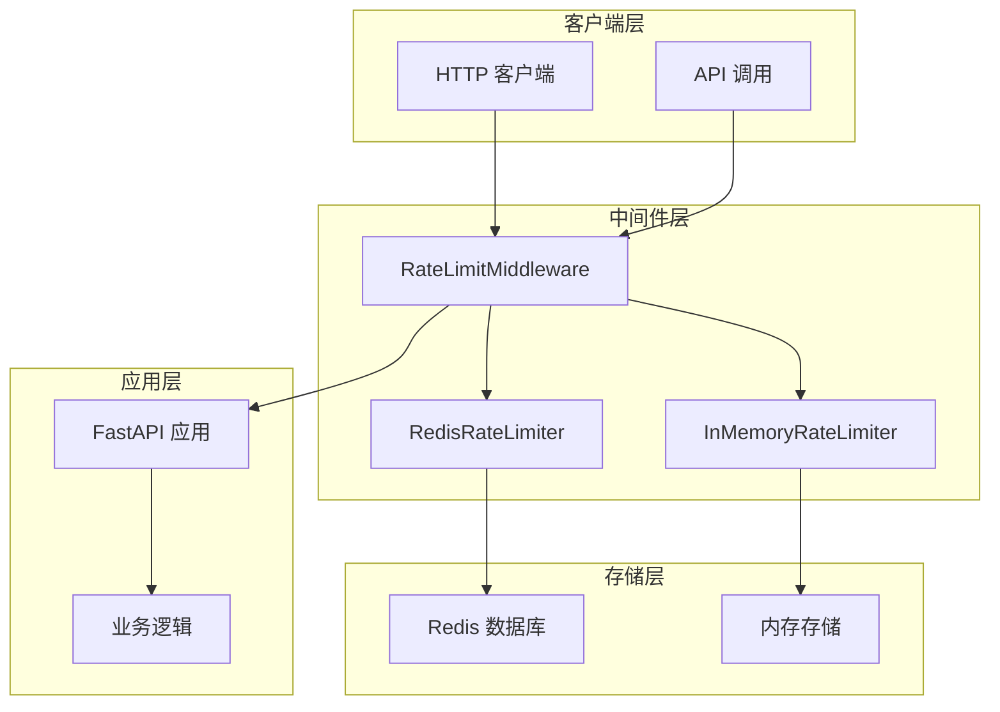
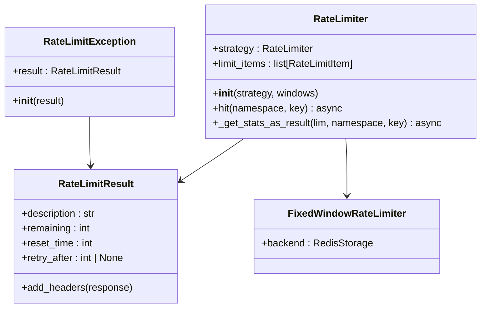
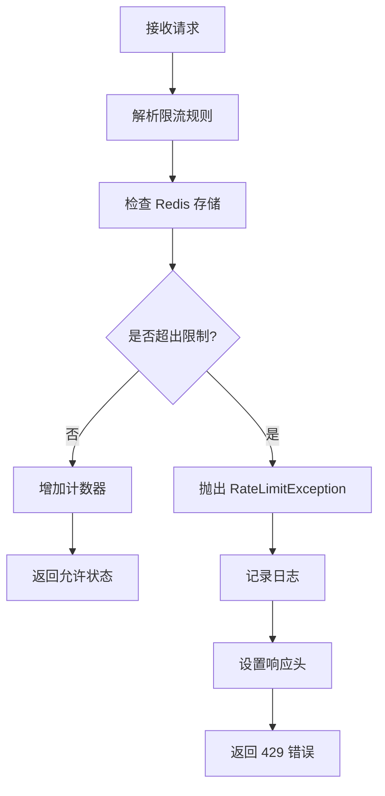
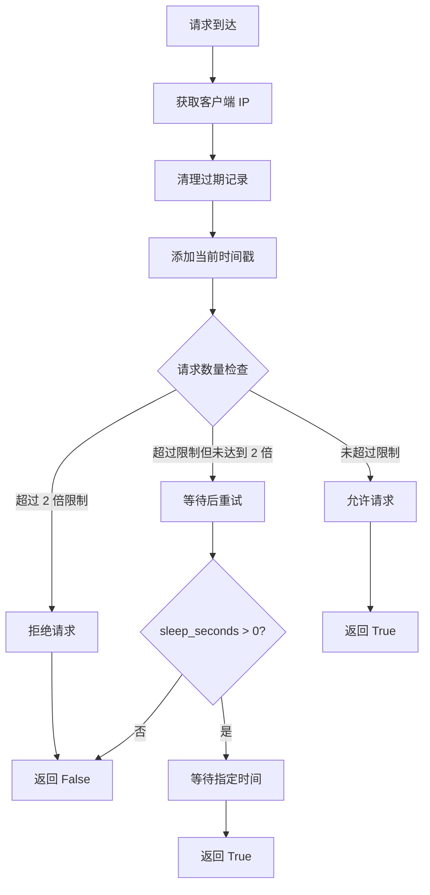
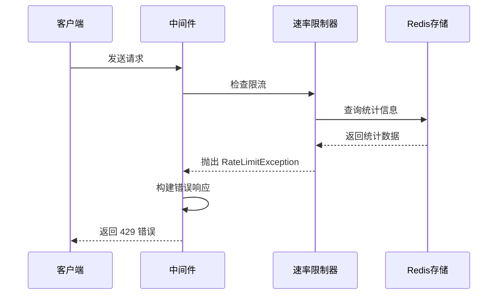
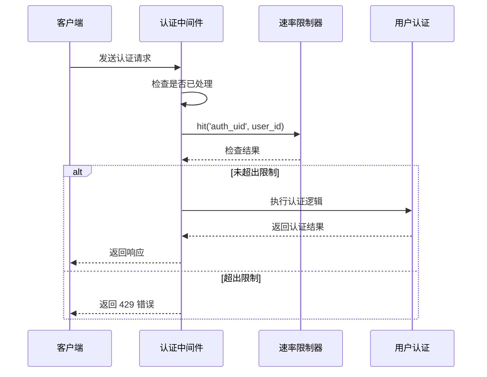
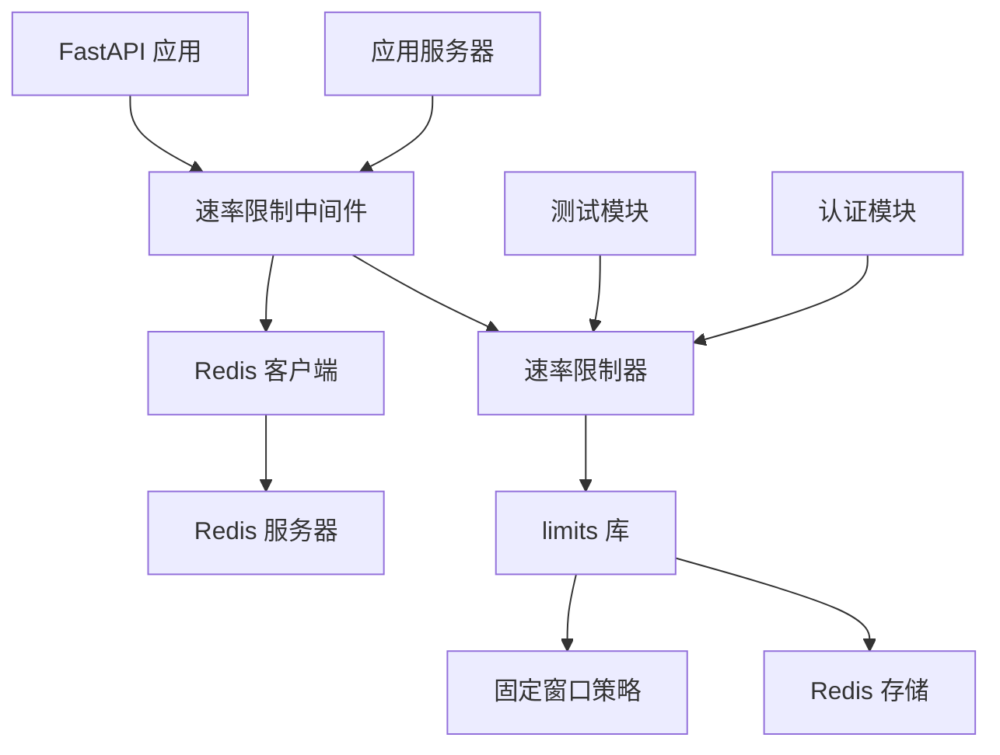

# 速率限制

<cite>
**本文档中引用的文件**
- [enterprise/server/rate_limit.py](file://enterprise/server/rate_limit.py)
- [openhands/server/middleware.py](file://openhands/server/middleware.py)
- [enterprise/storage/redis.py](file://enterprise/storage/redis.py)
- [enterprise/saas_server.py](file://enterprise/saas_server.py)
- [enterprise/server/auth/saas_user_auth.py](file://enterprise/server/auth/saas_user_auth.py)
- [enterprise/tests/unit/server/test_rate_limit.py](file://enterprise/tests/unit/server/test_rate_limit.py)
</cite>

## 目录
1. [简介](#简介)
2. [项目结构](#项目结构)
3. [核心组件](#核心组件)
4. [架构概览](#架构概览)
5. [详细组件分析](#详细组件分析)
6. [依赖关系分析](#依赖关系分析)
7. [性能考虑](#性能考虑)
8. [故障排除指南](#故障排除指南)
9. [结论](#结论)

## 简介

OpenHands 实现了一套完整的分布式速率限制系统，用于保护 API 服务免受滥用和过载。该系统采用基于 Redis 的分布式存储，支持多种限流算法，并提供了灵活的配置选项和异常处理机制。

速率限制系统主要解决以下问题：
- 防止 API 滥用和恶意攻击
- 保护系统资源不被过度消耗
- 提供公平的资源访问控制
- 支持不同级别的用户权限管理
- 提供详细的监控和调试信息

## 项目结构

OpenHands 的速率限制功能分布在多个模块中，主要包括：



**图表来源**
- [enterprise/server/rate_limit.py](file://enterprise/server/rate_limit.py#L1-L138)
- [openhands/server/middleware.py](file://openhands/server/middleware.py#L1-L132)

**章节来源**
- [enterprise/server/rate_limit.py](file://enterprise/server/rate_limit.py#L1-L138)
- [openhands/server/middleware.py](file://openhands/server/middleware.py#L1-L132)

## 核心组件

OpenHands 的速率限制系统包含以下核心组件：

### 分布式速率限制器（Enterprise）
- 基于 Redis 的分布式存储
- 支持固定窗口算法
- 提供详细的速率限制统计信息
- 异常处理和日志记录

### 内存速率限制器（OpenSource）
- 基于内存的历史记录
- 简化的滑动窗口逻辑
- 本地单机限流

### 中间件层
- FastAPI 中间件集成
- 请求拦截和处理
- 错误响应生成

**章节来源**
- [enterprise/server/rate_limit.py](file://enterprise/server/rate_limit.py#L50-L120)
- [openhands/server/middleware.py](file://openhands/server/middleware.py#L70-L131)

## 架构概览

OpenHands 的速率限制架构采用分层设计，支持不同的部署模式：



**图表来源**
- [openhands/server/middleware.py](file://openhands/server/middleware.py#L108-L131)
- [enterprise/server/rate_limit.py](file://enterprise/server/rate_limit.py#L99-L107)

## 详细组件分析

### 分布式速率限制器（Redis 实现）

#### 核心类结构



**图表来源**
- [enterprise/server/rate_limit.py](file://enterprise/server/rate_limit.py#L50-L120)

#### 限流策略配置

系统支持多种限流策略配置：

| 策略类型 | 描述 | 示例配置 | 适用场景 |
|---------|------|----------|----------|
| 固定窗口 | 在固定时间窗口内限制请求数量 | `"10/second; 100/minute"` | 简单的速率控制 |
| 滑动窗口 | 更精确的时间窗口控制 | 需要更精细的控制 | 高精度限流需求 |
| 令牌桶 | 允许突发流量但总体控制 | 动态配置 | 流量波动较大的场景 |

#### 窗口算法实现

系统采用固定窗口算法，通过 `limits` 库实现：



**图表来源**
- [enterprise/server/rate_limit.py](file://enterprise/server/rate_limit.py#L58-L80)

**章节来源**
- [enterprise/server/rate_limit.py](file://enterprise/server/rate_limit.py#L50-L120)

### 内存速率限制器（本地实现）

#### 简化算法设计



**图表来源**
- [openhands/server/middleware.py](file://openhands/server/middleware.py#L88-L105)

#### 配置参数说明

| 参数 | 默认值 | 描述 | 影响 |
|------|--------|------|------|
| requests | 2 | 允许的最大请求数 | 直接影响限流阈值 |
| seconds | 1 | 时间窗口长度（秒） | 控制统计周期 |
| sleep_seconds | 1 | 超出限制时的等待时间 | 影响用户体验 |

**章节来源**
- [openhands/server/middleware.py](file://openhands/server/middleware.py#L70-L106)

### 异常处理机制

#### 错误响应格式

系统提供标准化的错误响应格式：



**图表来源**
- [enterprise/server/rate_limit.py](file://enterprise/server/rate_limit.py#L123-L137)

#### 响应头信息

系统在每个响应中包含详细的速率限制信息：

| 响应头 | 描述 | 示例值 |
|--------|------|--------|
| X-RateLimit-Limit | 当前限制描述 | "10 per 1 second" |
| X-RateLimit-Remaining | 剩余可用次数 | "5" |
| X-RateLimit-Reset | 限制重置时间戳 | "1640995200" |
| Retry-After | 推荐重试间隔（秒） | "10" |

**章节来源**
- [enterprise/server/rate_limit.py](file://enterprise/server/rate_limit.py#L41-L48)

### 用户认证与速率限制集成

#### 认证流程中的限流



**图表来源**
- [enterprise/server/auth/saas_user_auth.py](file://enterprise/server/auth/saas_user_auth.py#L217-L224)

**章节来源**
- [enterprise/server/auth/saas_user_auth.py](file://enterprise/server/auth/saas_user_auth.py#L217-L224)

## 依赖关系分析

### 核心依赖关系



**图表来源**
- [enterprise/server/rate_limit.py](file://enterprise/server/rate_limit.py#L16-L21)
- [enterprise/saas_server.py](file://enterprise/saas_server.py#L22-L23)

### 外部依赖

系统依赖以下外部组件：

| 组件 | 版本要求 | 用途 | 可选性 |
|------|----------|------|--------|
| limits | 最新版本 | 速率限制算法实现 | 必需 |
| redis | 3.0+ | 分布式存储 | 必需 |
| fastapi | 0.68+ | Web 框架 | 必需 |
| python | 3.8+ | 运行环境 | 必需 |

**章节来源**
- [enterprise/storage/redis.py](file://enterprise/storage/redis.py#L1-L24)

## 性能考虑

### Redis 性能优化

1. **连接池管理**：使用异步 Redis 客户端减少连接开销
2. **键空间设计**：合理设计 Redis 键名避免热键问题
3. **过期策略**：自动清理过期的速率限制数据
4. **网络优化**：使用本地 Redis 实例减少网络延迟

### 内存使用优化

1. **历史记录清理**：定期清理过期的请求记录
2. **数据结构选择**：使用高效的数据结构存储历史记录
3. **批量操作**：支持批量处理多个限流规则

### 并发处理

1. **异步操作**：所有 Redis 操作都是异步的
2. **无锁设计**：使用 Redis 的原子操作保证一致性
3. **错误恢复**：网络异常时的优雅降级

## 故障排除指南

### 常见问题及解决方案

#### Redis 连接问题

**症状**：速率限制检查失败，日志显示连接错误
**原因**：Redis 服务器不可达或认证失败
**解决方案**：
1. 检查 Redis 服务状态
2. 验证连接凭据配置
3. 检查网络连通性

#### 限流阈值过高

**症状**：系统负载过高但未触发限流
**原因**：限流阈值设置不合理
**解决方案**：
1. 调整限流规则配置
2. 监控系统资源使用情况
3. 根据实际负载调整参数

#### 性能问题

**症状**：API 响应时间变长
**原因**：Redis 性能瓶颈或网络延迟
**解决方案**：
1. 优化 Redis 配置
2. 使用本地 Redis 实例
3. 增加 Redis 连接池大小

**章节来源**
- [enterprise/server/rate_limit.py](file://enterprise/server/rate_limit.py#L67-L76)

### 监控和调试

#### 日志配置

系统提供详细的日志记录：

```python
# 启用速率限制相关日志
logger.info(f'Rate limit hit for {namespace}:{key}')
logger.exception('Rate limit check could not complete, redis issue?')
```

#### 监控指标

建议监控以下关键指标：
- 请求成功率
- 限流触发频率
- Redis 响应时间
- 内存使用情况
- 错误率统计

**章节来源**
- [enterprise/server/rate_limit.py](file://enterprise/server/rate_limit.py#L70-L76)

## 结论

OpenHands 的速率限制系统提供了完整而灵活的解决方案，支持从简单的本地限流到复杂的分布式限流场景。系统的主要优势包括：

1. **灵活性**：支持多种限流算法和配置选项
2. **可扩展性**：基于 Redis 的分布式架构支持水平扩展
3. **易用性**：简洁的 API 设计和完善的错误处理
4. **可观测性**：详细的日志记录和监控信息
5. **可靠性**：优雅的错误处理和降级机制

该系统为 OpenHands 提供了强大的 API 保护能力，确保服务的稳定性和资源的有效利用。通过合理的配置和监控，可以满足不同规模和需求的应用场景。