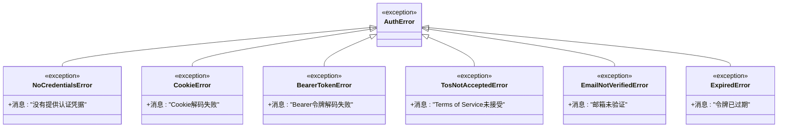

# JWT认证

<cite>
**本文档引用的文件**
- [token_manager.py](file://enterprise/server/auth/token_manager.py)
- [jwt_service.py](file://openhands/app_server/services/jwt_service.py)
- [middleware.py](file://enterprise/server/middleware.py)
- [auth.py](file://enterprise/server/routes/auth.py)
- [auth_error.py](file://enterprise/server/auth/auth_error.py)
- [auth_token_store.py](file://enterprise/storage/auth_token_store.py)
- [encryption_key.py](file://openhands/app_server/utils/encryption_key.py)
- [config.py](file://enterprise/server/config.py)
- [test_jwt_service.py](file://tests/unit/app_server/test_jwt_service.py)
- [test_auth_middleware.py](file://tests/unit/app_server/test_auth_middleware.py)
</cite>

## 目录
1. [简介](#简介)
2. [系统架构概览](#系统架构概览)
3. [核心组件分析](#核心组件分析)
4. [JWT令牌生成与验证](#jwt令牌生成与验证)
5. [令牌管理策略](#令牌管理策略)
6. [认证流程](#认证流程)
7. [安全特性](#安全特性)
8. [错误处理](#错误处理)
9. [最佳实践](#最佳实践)
10. [故障排除指南](#故障排除指南)

## 简介

OpenHands采用基于JWT（JSON Web Token）的现代认证机制，为用户提供安全可靠的会话管理。该系统支持多种身份提供商（IDP），包括GitHub、GitLab、Bitbucket等，并提供了完整的令牌生命周期管理功能。

### 主要特性

- **多层加密保护**：使用JWS和JWE双重加密机制
- **自动令牌刷新**：智能检测并刷新过期令牌
- **多身份提供商支持**：统一的认证接口
- **安全的Cookie存储**：HTTPS-only的认证Cookie
- **灵活的权限控制**：基于JWT声明的细粒度访问控制

## 系统架构概览


**图表来源**
- [middleware.py](file://enterprise/server/middleware.py#L26-L175)
- [token_manager.py](file://enterprise/server/auth/token_manager.py#L78-L672)
- [auth.py](file://enterprise/server/routes/auth.py#L37-L435)

## 核心组件分析

### TokenManager类

TokenManager是JWT认证系统的核心组件，负责管理所有与令牌相关的操作。


**图表来源**
- [token_manager.py](file://enterprise/server/auth/token_manager.py#L78-L672)
- [jwt_service.py](file://openhands/app_server/services/jwt_service.py#L21-L249)
- [auth_token_store.py](file://enterprise/storage/auth_token_store.py#L184-L208)

**章节来源**
- [token_manager.py](file://enterprise/server/auth/token_manager.py#L78-L672)
- [jwt_service.py](file://openhands/app_server/services/jwt_service.py#L21-L249)

### JWT服务组件

JwtService提供了JWT令牌的创建、验证、加密和解密功能。

#### 主要方法

| 方法名 | 功能描述 | 参数 |
|--------|----------|------|
| `create_jws_token` | 创建JWS签名令牌 | payload, key_id, expires_in |
| `verify_jws_token` | 验证JWS签名令牌 | token, key_id |
| `create_jwe_token` | 创建JWE加密令牌 | payload, key_id, expires_in |
| `decrypt_jwe_token` | 解密JWE令牌 | token, key_id |

**章节来源**
- [jwt_service.py](file://openhands/app_server/services/jwt_service.py#L49-L232)

## JWT令牌生成与验证

### JWS令牌创建流程


**图表来源**
- [jwt_service.py](file://openhands/app_server/services/jwt_service.py#L49-L90)

### JWE令牌加密流程


**图表来源**
- [jwt_service.py](file://openhands/app_server/services/jwt_service.py#L129-L185)

### 令牌验证机制

系统实现了多层次的令牌验证机制：

1. **签名验证**：使用HS256算法验证令牌签名
2. **过期时间检查**：验证令牌是否在有效期内
3. **密钥ID验证**：确保使用正确的密钥进行验证
4. **负载内容验证**：检查令牌载荷的完整性

**章节来源**
- [jwt_service.py](file://openhands/app_server/services/jwt_service.py#L92-L128)

## 令牌管理策略

### 令牌生命周期管理


**图表来源**
- [token_manager.py](file://enterprise/server/auth/token_manager.py#L289-L442)

### 令牌刷新策略

系统实现了智能的令牌刷新机制：

#### 访问令牌刷新条件
- 访问令牌将在到期前4小时自动刷新
- 如果访问令牌已过期但刷新令牌有效，则自动刷新
- 如果两个令牌都过期，则抛出异常

#### 刷新令牌处理
- 支持GitHub、GitLab、Bitbucket三种IDP的令牌刷新
- 使用各自的OAuth2.0刷新机制
- 自动更新数据库中的令牌信息

**章节来源**
- [token_manager.py](file://enterprise/server/auth/token_manager.py#L289-L442)

### 加密工具链

系统使用Fernet对称加密算法保护敏感令牌数据：


**图表来源**
- [token_manager.py](file://enterprise/server/auth/token_manager.py#L47-L87)

**章节来源**
- [token_manager.py](file://enterprise/server/auth/token_manager.py#L47-L87)

## 认证流程

### OAuth2.0授权码流程


**图表来源**
- [auth.py](file://enterprise/server/routes/auth.py#L99-L248)

### 中间件认证流程


**图表来源**
- [middleware.py](file://enterprise/server/middleware.py#L32-L175)

**章节来源**
- [middleware.py](file://enterprise/server/middleware.py#L32-L175)
- [auth.py](file://enterprise/server/routes/auth.py#L99-L248)

## 安全特性

### 多层安全防护

#### 1. 传输安全
- **HTTPS强制**：所有认证通信必须使用HTTPS
- **Secure标志**：认证Cookie设置Secure标志
- **HttpOnly保护**：防止客户端脚本访问Cookie

#### 2. 存储安全
- **加密存储**：敏感令牌使用Fernet加密
- **密钥轮换**：支持多密钥管理和密钥轮换
- **访问控制**：严格的数据库访问权限控制

#### 3. 验证安全
- **多重验证**：签名验证 + 过期时间验证 + 内容验证
- **防重放攻击**：使用时间戳和随机数防止重放
- **令牌绑定**：将令牌与特定用户或设备绑定

### Cookie安全配置

| 安全属性 | 配置值 | 说明 |
|----------|--------|------|
| HttpOnly | true | 防止XSS攻击 |
| Secure | true/false | HTTPS环境启用 |
| SameSite | strict/lax | 防止CSRF攻击 |
| Domain | 动态计算 | 根据环境配置 |

**章节来源**
- [auth.py](file://enterprise/server/routes/auth.py#L43-L86)
- [middleware.py](file://enterprise/server/middleware.py#L115-L125)

### 防护措施

#### 防止令牌泄露
1. **最小权限原则**：只授予必要的API访问权限
2. **定期轮换**：自动刷新短期令牌
3. **监控异常**：检测异常登录行为
4. **撤销机制**：支持即时令牌撤销

#### 防止重放攻击
1. **时间戳验证**：检查令牌的时间有效性
2. **随机数使用**：在令牌中包含随机数
3. **一次性使用**：某些场景下限制令牌的一次性使用

## 错误处理

### 异常类型层次结构



**图表来源**
- [auth_error.py](file://enterprise/server/auth/auth_error.py#L1-L41)

### 错误处理策略

#### 1. 认证失败处理
- **Cookie无效**：删除无效Cookie并返回401
- **令牌过期**：尝试自动刷新令牌
- **网络错误**：重试机制 + 降级处理

#### 2. 权限不足处理
- **TOS未接受**：重定向到TOS页面
- **邮箱未验证**：提示用户验证邮箱
- **权限不足**：返回403禁止访问

#### 3. 系统错误处理
- **Keycloak连接失败**：记录日志并返回友好错误
- **数据库访问失败**：快速失败并通知管理员
- **密钥管理错误**：使用备用密钥或降级处理

**章节来源**
- [auth_error.py](file://enterprise/server/auth/auth_error.py#L1-L41)
- [middleware.py](file://enterprise/server/middleware.py#L70-L97)

## 最佳实践

### 密钥管理

#### 密钥生成
```python
# 推荐的密钥生成方式
master_key = os.getenv('JWT_SECRET')
if master_key:
    encryption_keys = [EncryptionKey(key=SecretStr(master_key), active=True)]
else:
    # 自动生成强密钥
    encryption_keys = [EncryptionKey(key=SecretStr(base62.encodebytes(os.urandom(32))), active=True)]
```

#### 密钥轮换
1. **定期轮换**：建议每90天轮换一次主密钥
2. **渐进式部署**：新密钥激活后逐步迁移
3. **回滚准备**：保留最近的几个密钥用于回滚

### 性能优化

#### 缓存策略
- **令牌缓存**：缓存有效的用户令牌
- **元数据缓存**：缓存用户信息和权限
- **密钥缓存**：缓存解密密钥

#### 并发处理
- **异步操作**：使用异步模式处理令牌操作
- **连接池**：复用数据库和HTTP连接
- **批量操作**：合并多个令牌操作

### 监控和日志

#### 关键指标
- **认证成功率**：跟踪认证请求的成功率
- **令牌刷新频率**：监控令牌刷新的频率
- **错误分布**：分析不同类型错误的发生原因

#### 日志记录
- **安全事件**：记录所有认证相关事件
- **性能指标**：记录响应时间和吞吐量
- **异常追踪**：详细记录异常堆栈信息

## 故障排除指南

### 常见问题诊断

#### 1. 认证失败问题

**症状**：用户无法登录，返回401错误
**可能原因**：
- JWT密钥不匹配
- Cookie被浏览器阻止
- 时间同步问题

**解决方案**：
```bash
# 检查JWT密钥配置
echo $JWT_SECRET

# 验证Cookie设置
curl -I https://your-domain.com/api/authenticate \
     -H "Cookie: keycloak_auth=your-token"

# 检查系统时间同步
ntpdate -q pool.ntp.org
```

#### 2. 令牌刷新失败

**症状**：访问令牌过期但刷新失败
**可能原因**：
- 刷新令牌已失效
- 第三方IDP服务不可用
- 网络连接问题

**解决方案**：
```python
# 检查刷新令牌状态
await token_manager.validate_offline_token(user_id)
await token_manager.check_offline_token_is_active(user_id)

# 手动重新获取令牌
access_token, refresh_token = await token_manager.get_keycloak_tokens(code, redirect_uri)
```

#### 3. 密钥解密失败

**症状**：令牌存储读取失败
**可能原因**：
- 密钥配置错误
- 数据损坏
- 权限问题

**解决方案**：
```python
# 检查密钥文件权限
ls -la .keys

# 验证密钥格式
cat .keys | jq .

# 重新生成密钥文件
python -c "
import os
from openhands.app_server.utils.encryption_key import get_default_encryption_keys
keys = get_default_encryption_keys(Path('.'))
print('密钥生成成功')
"
```

### 调试工具

#### 1. 令牌验证工具
```python
# 验证JWT令牌
import jwt
from datetime import datetime

def validate_jwt_token(token, secret):
    try:
        payload = jwt.decode(token, secret, algorithms=['HS256'])
        print(f"令牌有效，过期时间: {datetime.fromtimestamp(payload['exp'])}")
        return True
    except jwt.ExpiredSignatureError:
        print("令牌已过期")
        return False
    except jwt.InvalidTokenError as e:
        print(f"令牌无效: {e}")
        return False
```

#### 2. 日志分析工具
```bash
# 分析认证错误日志
grep "auth_error\|Invalid JWT" /var/log/app.log | tail -100

# 统计认证成功率
awk '/authenticate/ {count++} /success/ {success++} END {printf "成功率: %.2f%%\n", success/count*100}' auth.log
```

#### 3. 性能监控工具
```python
# 监控认证延迟
import time
import logging

def monitor_auth_performance(func):
    def wrapper(*args, **kwargs):
        start_time = time.time()
        try:
            result = func(*args, **kwargs)
            duration = time.time() - start_time
            logging.info(f"认证操作耗时: {duration:.2f}s")
            return result
        except Exception as e:
            duration = time.time() - start_time
            logging.error(f"认证失败，耗时: {duration:.2f}s, 错误: {e}")
            raise
    return wrapper
```

**章节来源**
- [test_jwt_service.py](file://tests/unit/app_server/test_jwt_service.py#L23-L372)
- [test_auth_middleware.py](file://tests/unit/app_server/test_auth_middleware.py#L49-L236)

## 结论

OpenHands的JWT认证系统提供了完整、安全、高性能的用户认证解决方案。通过多层次的安全防护、智能的令牌管理和完善的错误处理机制，确保了系统的可靠性和用户体验。

### 关键优势
- **安全性**：多重加密和验证机制
- **可靠性**：自动刷新和故障恢复
- **可扩展性**：支持多种身份提供商
- **易维护性**：清晰的架构和完善的监控

### 发展方向
- **零信任架构**：进一步强化身份验证
- **生物识别集成**：支持指纹和面部识别
- **AI驱动安全**：智能检测异常行为
- **跨平台支持**：移动端和桌面端统一认证

通过持续的优化和改进，OpenHands的JWT认证系统将继续为用户提供更加安全、便捷的认证体验。