# 企业级单点登录系统文档

<cite>
**本文档中引用的文件**
- [keycloak_manager.py](file://enterprise/server/auth/keycloak_manager.py)
- [sheets_client.py](file://enterprise/server/auth/sheets_client.py)
- [saas_user_auth.py](file://enterprise/server/auth/saas_user_auth.py)
- [token_manager.py](file://enterprise/server/auth/token_manager.py)
- [constants.py](file://enterprise/server/auth/constants.py)
- [auth.py](file://enterprise/server/routes/auth.py)
- [auth_error.py](file://enterprise/server/auth/auth_error.py)
- [auth_utils.py](file://enterprise/server/auth/auth_utils.py)
- [config.py](file://enterprise/server/config.py)
- [middleware.py](file://enterprise/server/middleware.py)
</cite>

## 目录
1. [简介](#简介)
2. [系统架构概览](#系统架构概览)
3. [Keycloak集成核心组件](#keycloak集成核心组件)
4. [企业用户认证流程](#企业用户认证流程)
5. [Google Sheets用户同步机制](#google-sheets用户同步机制)
6. [令牌管理和会话控制](#令牌管理和会话控制)
7. [部署和配置指南](#部署和配置指南)
8. [安全考虑](#安全考虑)
9. [错误处理策略](#错误处理策略)
10. [故障排除指南](#故障排除指南)

## 简介

OpenHands企业级单点登录（SSO）系统是一个高度集成的身份验证解决方案，专门设计用于企业环境中的统一身份管理。该系统通过与Keycloak身份提供者（IdP）的深度集成，为企业用户提供安全、可扩展的单点登录体验，同时支持多种身份提供者和用户同步机制。

### 核心特性

- **多身份提供者支持**：支持GitHub、GitLab、Bitbucket和企业Keycloak实例
- **企业用户同步**：通过Google Sheets实现企业用户列表的实时同步
- **安全令牌管理**：完整的OAuth 2.0和OpenID Connect流程支持
- **会话生命周期管理**：智能的令牌刷新和过期处理机制
- **细粒度权限控制**：基于用户组和角色的访问控制

## 系统架构概览

OpenHands SSO系统采用分层架构设计，确保了高可用性、可扩展性和安全性。

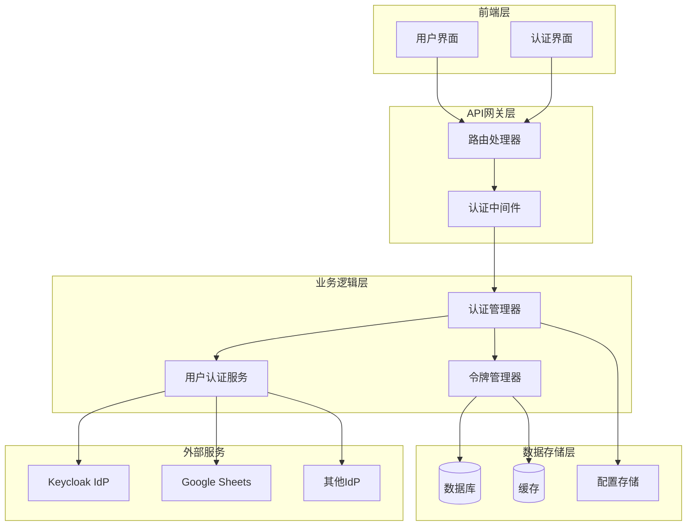

**图表来源**
- [auth.py](file://enterprise/server/routes/auth.py#L1-L200)
- [middleware.py](file://enterprise/server/middleware.py#L69-L100)

## Keycloak集成核心组件

### Keycloak管理器（KeycloakManager）

Keycloak管理器是系统的核心组件，负责与Keycloak身份提供者的交互。它提供了两个主要的客户端实例：KeycloakOpenID用于用户认证，KeycloakAdmin用于管理员操作。

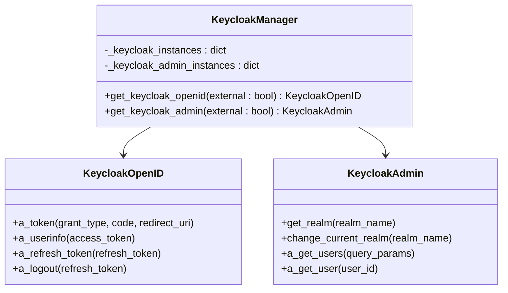

**图表来源**
- [keycloak_manager.py](file://enterprise/server/auth/keycloak_manager.py#L21-L50)

#### 关键功能特性

1. **单例模式实现**：通过内部字典缓存Keycloak实例，避免重复连接
2. **外部和内部实例分离**：支持不同网络环境下的Keycloak连接
3. **自动重连机制**：在网络异常时自动重新建立连接
4. **Realm管理**：动态切换和管理不同的Keycloak领域

**章节来源**
- [keycloak_manager.py](file://enterprise/server/auth/keycloak_manager.py#L1-L51)

### 令牌管理器（TokenManager）

令牌管理器负责整个系统的令牌生命周期管理，包括获取、验证、刷新和撤销令牌。

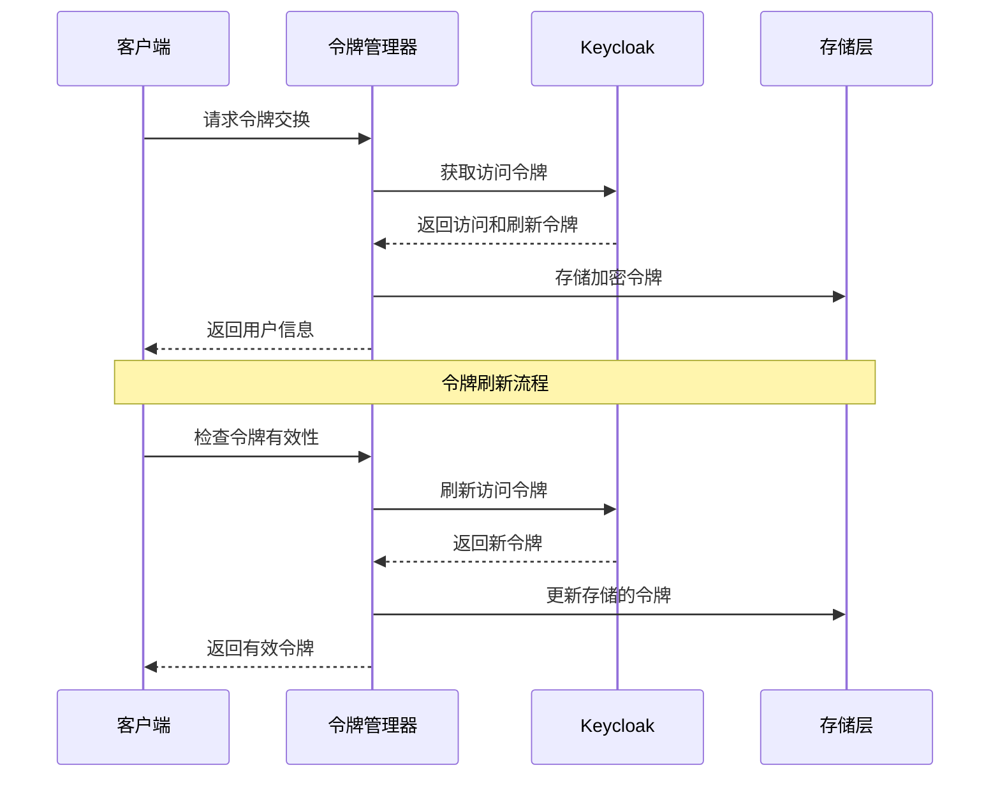

**图表来源**
- [token_manager.py](file://enterprise/server/auth/token_manager.py#L89-L112)
- [token_manager.py](file://enterprise/server/auth/token_manager.py#L596-L601)

**章节来源**
- [token_manager.py](file://enterprise/server/auth/token_manager.py#L1-L672)

## 企业用户认证流程

### OAuth 2.0授权码流程

OpenHands实现了完整的OAuth 2.0授权码流程，支持PKCE扩展以提高安全性。

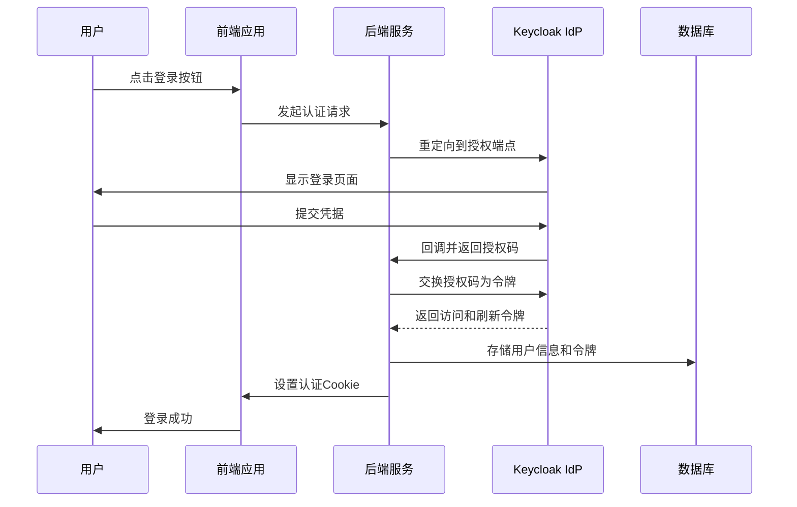

**图表来源**
- [auth.py](file://enterprise/server/routes/auth.py#L99-L200)

### 用户属性映射

系统从Keycloak获取的用户信息包含丰富的属性，这些属性被映射到OpenHands的用户模型中。

| Keycloak属性 | OpenHands字段 | 描述 |
|-------------|---------------|------|
| `sub` | `user_id` | 唯一用户标识符 |
| `preferred_username` | `username` | 用户显示名称 |
| `email` | `email` | 用户邮箱地址 |
| `email_verified` | `email_verified` | 邮箱验证状态 |
| `identity_provider` | `idp` | 身份提供者类型 |
| `given_name` | `first_name` | 名字 |
| `family_name` | `last_name` | 姓氏 |

**章节来源**
- [auth.py](file://enterprise/server/routes/auth.py#L133-L140)
- [saas_user_auth.py](file://enterprise/server/auth/saas_user_auth.py#L296-L301)

### 会话管理

系统实现了多层次的会话管理机制，确保用户会话的安全性和持久性。

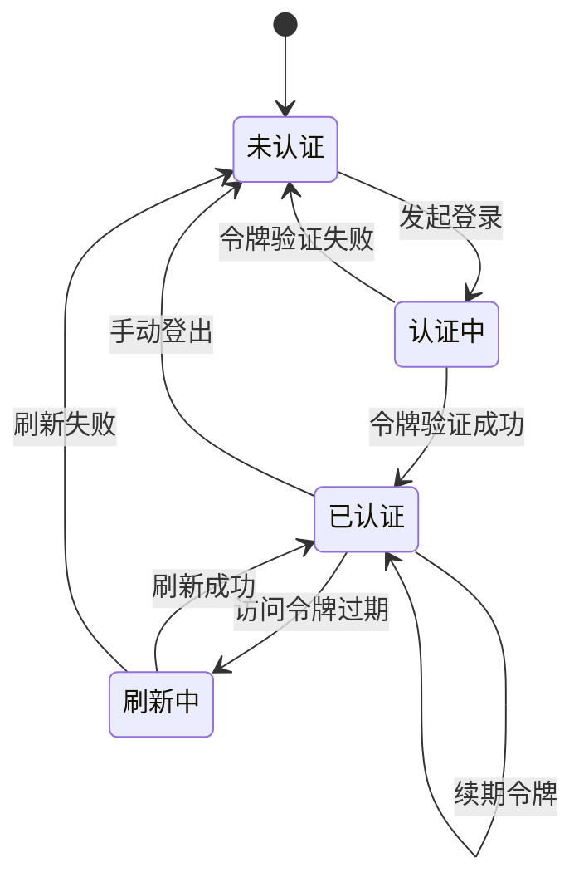

**图表来源**
- [saas_user_auth.py](file://enterprise/server/auth/saas_user_auth.py#L65-L80)

**章节来源**
- [saas_user_auth.py](file://enterprise/server/auth/saas_user_auth.py#L43-L324)

## Google Sheets用户同步机制

### Google Sheets客户端

Google Sheets客户端提供了企业用户列表的实时同步功能，支持从Google Sheets读取用户白名单。

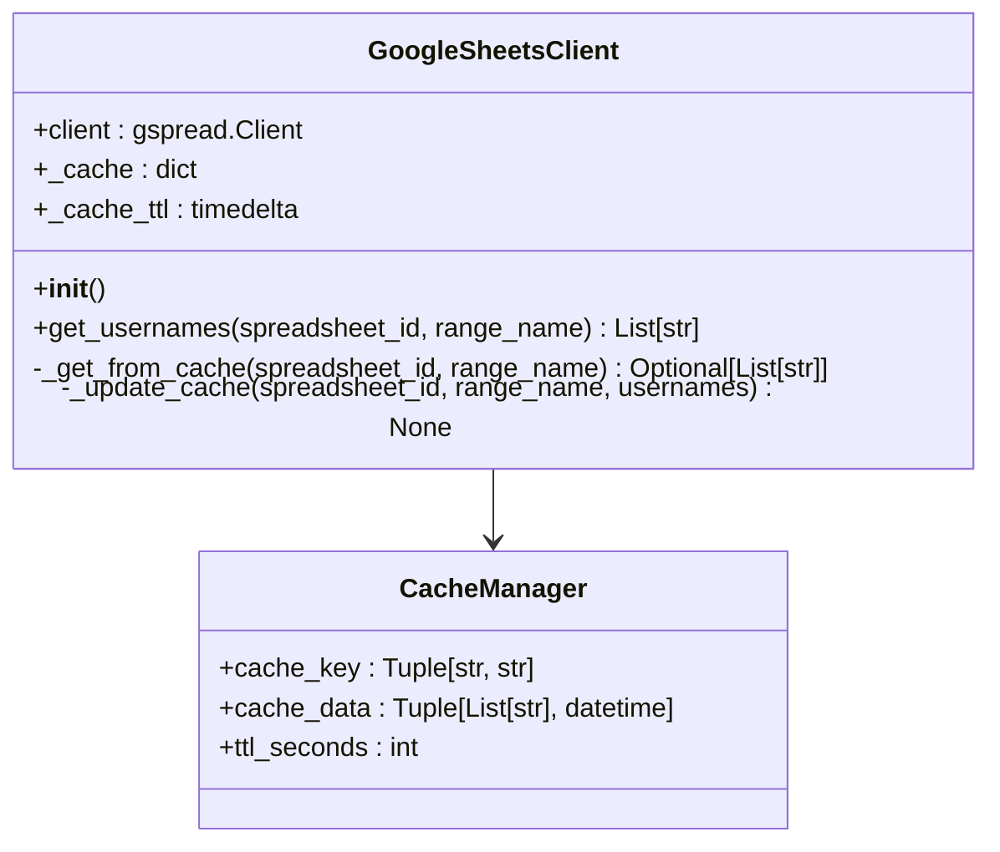

**图表来源**
- [sheets_client.py](file://enterprise/server/auth/sheets_client.py#L10-L112)

### 缓存机制

系统实现了智能缓存机制来优化Google Sheets API的使用频率。

| 缓存特性 | 默认值 | 描述 |
|---------|--------|------|
| TTL | 15秒 | 缓存生存时间 |
| 缓存键 | `(spreadsheet_id, range_name)` | 唯一标识缓存项 |
| 清理策略 | 自动过期 | 超时后自动清理 |
| 错误处理 | 降级到空列表 | API失败时的安全降级 |

**章节来源**
- [sheets_client.py](file://enterprise/server/auth/sheets_client.py#L1-L112)

## 令牌管理和会话控制

### 多层令牌验证

系统实现了多层令牌验证机制，确保令牌的安全性和有效性。

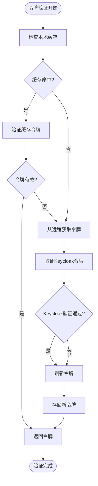

**图表来源**
- [token_manager.py](file://enterprise/server/auth/token_manager.py#L264-L288)

### 离线令牌管理

离线令牌（Offline Token）允许系统在用户不活跃时保持会话状态。

| 功能 | 实现方式 | 安全特性 |
|------|----------|----------|
| 令牌存储 | AES加密存储 | 敏感数据加密 |
| 自动刷新 | 智能检测过期 | 预防性刷新 |
| 过期监控 | 定期验证活动状态 | 及时失效 |
| 安全删除 | 完整清理机制 | 防止残留数据 |

**章节来源**
- [token_manager.py](file://enterprise/server/auth/token_manager.py#L585-L672)

## 部署和配置指南

### 环境变量配置

以下是Keycloak SSO集成所需的关键环境变量：

| 变量名 | 必需 | 描述 | 示例值 |
|--------|------|------|--------|
| `KEYCLOAK_SERVER_URL` | 是 | Keycloak服务器URL | `https://keycloak.example.com` |
| `KEYCLOAK_REALM_NAME` | 是 | Keycloak领域名称 | `openhands` |
| `KEYCLOAK_CLIENT_ID` | 是 | 客户端ID | `openhands-client` |
| `KEYCLOAK_CLIENT_SECRET` | 是 | 客户端密钥 | `your-secret-key` |
| `KEYCLOAK_SERVER_URL_EXT` | 否 | 外部访问URL | `https://auth.example.com` |
| `ENABLE_ENTERPRISE_SSO` | 否 | 启用企业SSO | `true` |
| `AUTH_WEB_HOST` | 否 | 认证主机名 | `auth.example.com` |

### Keycloak服务器集成

#### 1. Keycloak Realm配置

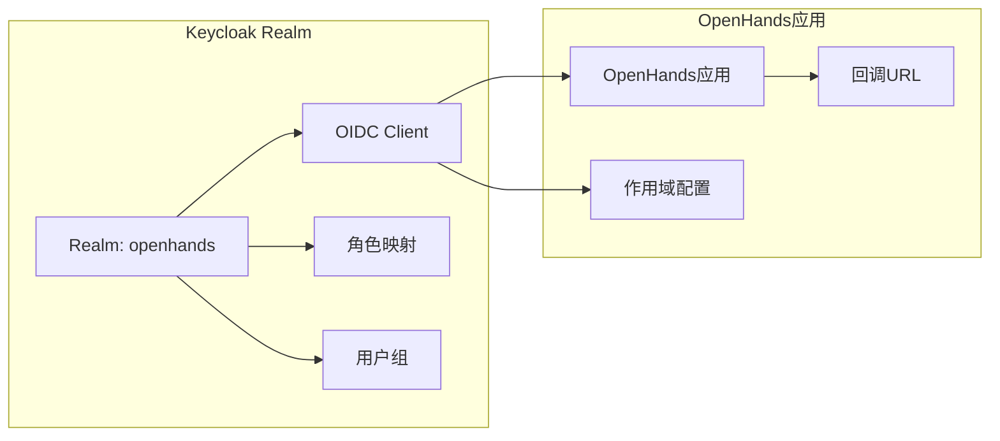

#### 2. 客户端配置要求

- **协议**：OpenID Connect
- **认证流程**：Authorization Code Flow with PKCE
- **作用域**：openid, email, profile, offline_access
- **回调URL**：`https://your-domain.com/oauth/keycloak/callback`
- **刷新令牌有效期**：根据业务需求配置

### Google Sheets集成配置

#### 1. 服务账户设置

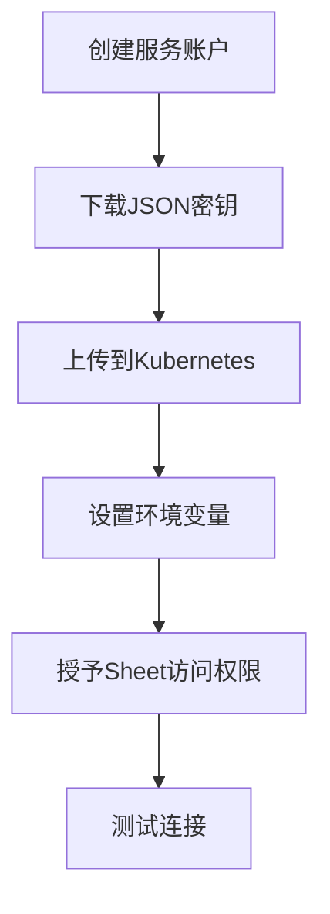

#### 2. 权限配置

- **Google Cloud项目**：启用Google Sheets API
- **服务账户权限**：`spreadsheets.readonly`
- **Google Sheets权限**：共享给服务账户邮箱

**章节来源**
- [constants.py](file://enterprise/server/auth/constants.py#L1-L33)
- [config.py](file://enterprise/server/config.py#L157-L190)

## 安全考虑

### 令牌安全

#### 1. 传输安全

- **HTTPS强制**：所有通信必须使用HTTPS
- **HSTS配置**：启用HTTP严格传输安全
- **证书验证**：严格验证SSL证书

#### 2. 存储安全

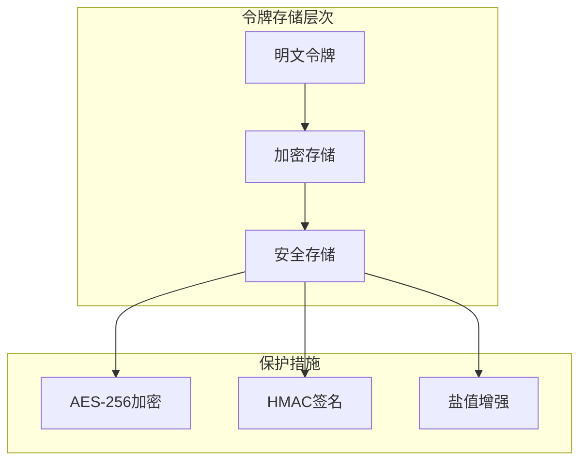

#### 3. 会话安全

| 安全特性 | 实现方式 | 配置参数 |
|---------|----------|----------|
| Cookie安全标志 | `httponly`, `secure`, `samesite` | 生产环境启用 |
| CSRF保护 | 验证码机制 | 自动生成 |
| 会话固定防护 | 重新生成会话ID | 登录时执行 |
| 最大会话期限 | 配置超时时间 | 可配置 |

### 身份提供者配置

#### 1. 多IdP支持

系统支持多种身份提供者，每种都有特定的安全配置：

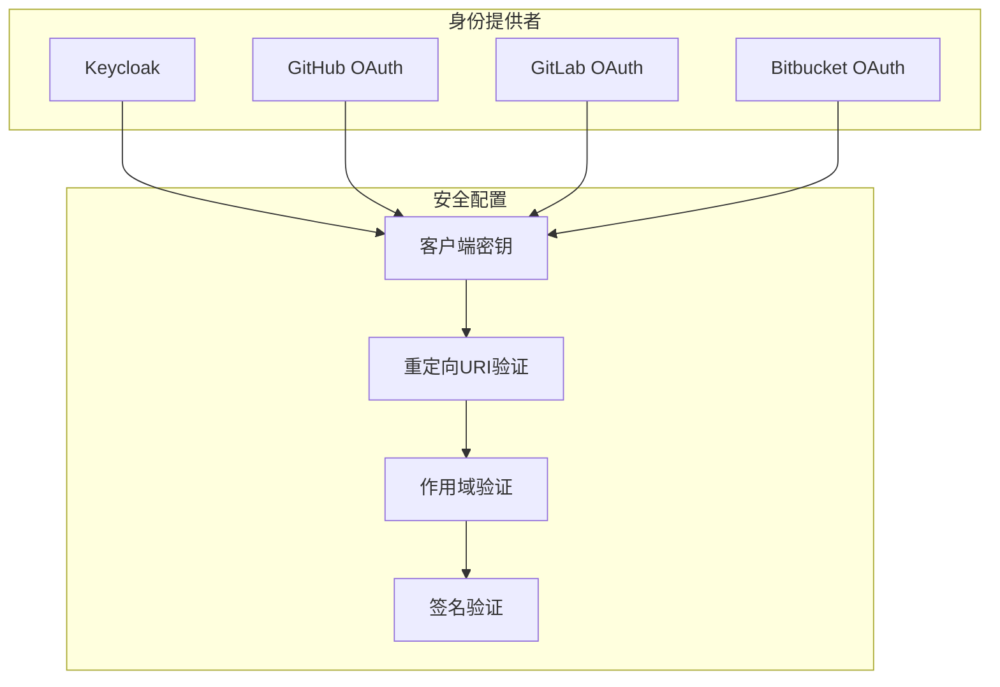

#### 2. 用户生命周期管理

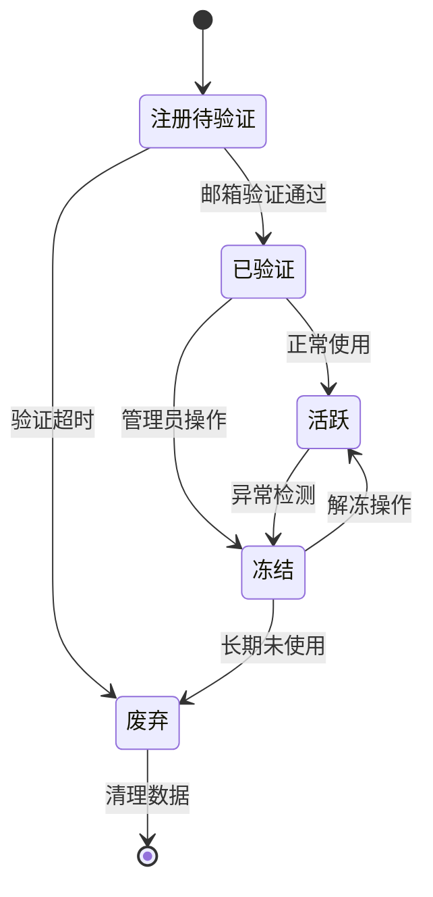

**章节来源**
- [middleware.py](file://enterprise/server/middleware.py#L69-L100)
- [auth_utils.py](file://enterprise/server/auth/auth_utils.py#L8-L80)

## 错误处理策略

### 分层错误处理

系统实现了分层的错误处理机制，确保各种异常情况都能得到妥善处理。

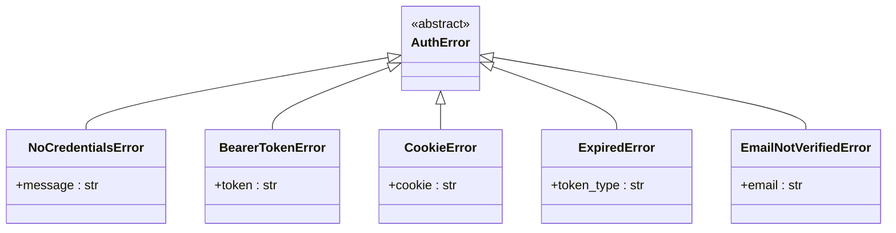

**图表来源**
- [auth_error.py](file://enterprise/server/auth/auth_error.py#L1-L41)

### 错误恢复机制

#### 1. 自动重试策略

| 错误类型 | 重试次数 | 退避策略 | 超时时间 |
|---------|----------|----------|----------|
| 网络连接错误 | 3次 | 指数退避 | 30秒 |
| Keycloak认证错误 | 2次 | 固定间隔 | 10秒 |
| API限制错误 | 5次 | 线性退避 | 60秒 |
| 缓存失效 | 1次 | 立即重试 | 5秒 |

#### 2. 优雅降级

当某些功能不可用时，系统会自动降级到备用方案：

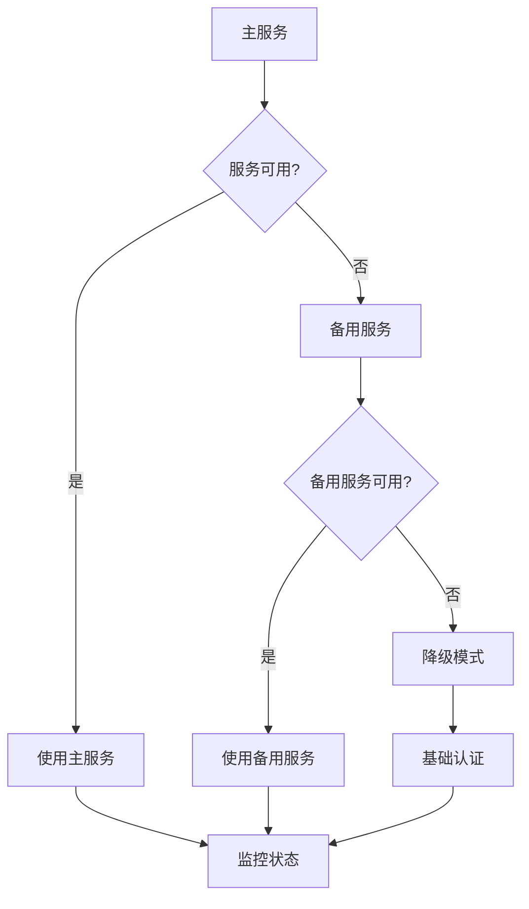

**章节来源**
- [auth_error.py](file://enterprise/server/auth/auth_error.py#L1-L41)
- [token_manager.py](file://enterprise/server/auth/token_manager.py#L43-L46)

## 故障排除指南

### 常见问题诊断

#### 1. Keycloak连接问题

**症状**：无法连接到Keycloak服务器
**诊断步骤**：
1. 检查网络连通性
2. 验证URL格式正确性
3. 确认SSL证书有效性
4. 检查防火墙规则

**解决方案**：
```bash
# 测试Keycloak连接
curl -k https://keycloak.example.com/realms/openhands/.well-known/openid-configuration

# 检查DNS解析
nslookup keycloak.example.com

# 验证SSL证书
openssl s_client -connect keycloak.example.com:443 -servername keycloak.example.com
```

#### 2. 令牌验证失败

**症状**：用户登录后立即被注销
**诊断流程**：

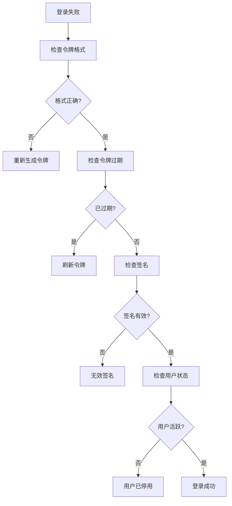

#### 3. Google Sheets同步问题

**症状**：企业用户无法通过Google Sheets验证
**排查步骤**：
1. 验证服务账户权限
2. 检查Google Sheets访问权限
3. 确认API配额使用情况
4. 检查网络代理设置

**调试命令**：
```python
# 测试Google Sheets连接
from enterprise.server.auth.sheets_client import GoogleSheetsClient
client = GoogleSheetsClient()
usernames = client.get_usernames("spreadsheet_id", "A:A")
print(f"成功获取 {len(usernames)} 个用户名")
```

### 监控和日志

#### 1. 关键指标监控

| 指标类别 | 监控项目 | 告警阈值 |
|---------|----------|----------|
| 认证成功率 | 登录失败率 | >5% |
| 响应时间 | API响应延迟 | >2秒 |
| 错误率 | 4xx/5xx错误率 | >10% |
| 用户活跃度 | 日活用户数 | 异常下降 |

#### 2. 日志分析

系统记录详细的审计日志，包括：

- **认证事件**：登录、登出、令牌刷新
- **错误事件**：认证失败、令牌过期、网络错误
- **安全事件**：可疑登录、权限变更
- **性能事件**：响应时间、吞吐量

**章节来源**
- [auth_utils.py](file://enterprise/server/auth/auth_utils.py#L8-L80)
- [token_manager.py](file://enterprise/server/auth/token_manager.py#L43-L46)

## 总结

OpenHands企业级单点登录系统提供了一个完整、安全、可扩展的身份验证解决方案。通过与Keycloak的深度集成，结合Google Sheets的企业用户同步机制，系统能够满足现代企业对身份管理的各种需求。

### 主要优势

1. **安全性**：多层安全防护，包括令牌加密、会话管理和错误处理
2. **可扩展性**：支持多种身份提供者和灵活的配置选项
3. **可靠性**：完善的错误恢复机制和监控体系
4. **易用性**：简洁的API接口和详细的文档

### 最佳实践建议

1. **定期更新密钥**：定期轮换客户端密钥和JWT签名密钥
2. **监控告警**：建立完善的监控和告警机制
3. **备份策略**：定期备份用户数据和配置信息
4. **安全审计**：定期进行安全审计和漏洞扫描

通过遵循本文档的指导原则和最佳实践，企业可以构建一个稳定、安全、高效的企业级单点登录系统。