# 权限控制

<cite>
**本文档中引用的文件**
- [saas_user_auth.py](file://enterprise/server/auth/saas_user_auth.py)
- [default_user_auth.py](file://openhands/server/user_auth/default_user_auth.py)
- [auth_utils.py](file://enterprise/server/auth/auth_utils.py)
- [middleware.py](file://enterprise/server/middleware.py)
- [token_manager.py](file://enterprise/server/auth/token_manager.py)
- [auth.py](file://enterprise/server/routes/auth.py)
- [user_auth.py](file://openhands/server/user_auth/user_auth.py)
- [saas_settings_store.py](file://enterprise/storage/saas_settings_store.py)
- [saas_secrets_store.py](file://enterprise/storage/saas_secrets_store.py)
- [api_keys.py](file://enterprise/server/routes/api_keys.py)
- [saas_conversation_validator.py](file://enterprise/storage/saas_conversation_validator.py)
</cite>

## 目录
1. [简介](#简介)
2. [系统架构概览](#系统架构概览)
3. [基于角色的访问控制（RBAC）模型](#基于角色的访问控制rbac模型)
4. [核心认证组件](#核心认证组件)
5. [多租户数据隔离策略](#多租户数据隔离策略)
6. [API端点权限验证机制](#api端点权限验证机制)
7. [令牌管理系统](#令牌管理系统)
8. [用户权限存储与管理](#用户权限存储与管理)
9. [安全中间件与拦截器](#安全中间件与拦截器)
10. [扩展性设计与自定义权限](#扩展性设计与自定义权限)
11. [故障排除指南](#故障排除指南)
12. [总结](#总结)

## 简介

OpenHands采用企业级权限控制系统，基于Keycloak身份提供商实现单点登录（SSO）和多租户访问控制。该系统支持多种认证方式，包括Cookie认证、Bearer Token认证和API密钥认证，为不同类型的用户和集成场景提供灵活的访问控制机制。

权限控制系统的核心特性包括：
- 基于JWT的无状态认证
- 多租户数据隔离
- 细粒度权限控制
- 自动令牌刷新机制
- 完整的审计日志记录
- 可扩展的权限模型

## 系统架构概览

OpenHands的权限控制系统采用分层架构设计，确保安全性和可扩展性：

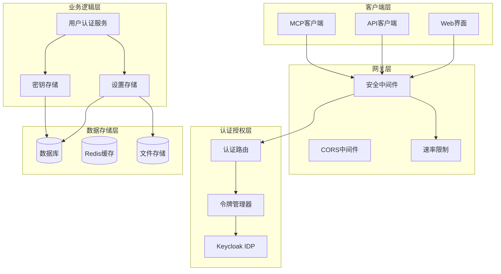

**图表来源**
- [middleware.py](file://enterprise/server/middleware.py#L1-L175)
- [auth.py](file://enterprise/server/routes/auth.py#L1-L435)
- [token_manager.py](file://enterprise/server/auth/token_manager.py#L1-L672)

## 基于角色的访问控制（RBAC）模型

OpenHands实现了企业级的RBAC模型，通过多层次的权限控制确保数据安全和功能访问的正确性。

### 用户认证类型

系统支持三种主要的认证方式：

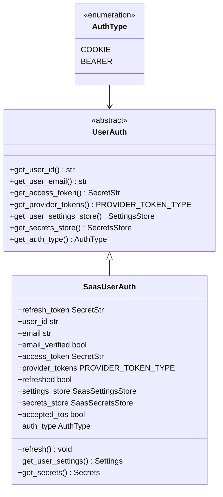

**图表来源**
- [user_auth.py](file://openhands/server/user_auth/user_auth.py#L18-L107)
- [saas_user_auth.py](file://enterprise/server/auth/saas_user_auth.py#L43-L57)

### 权限验证流程

权限验证遵循严格的流程控制：

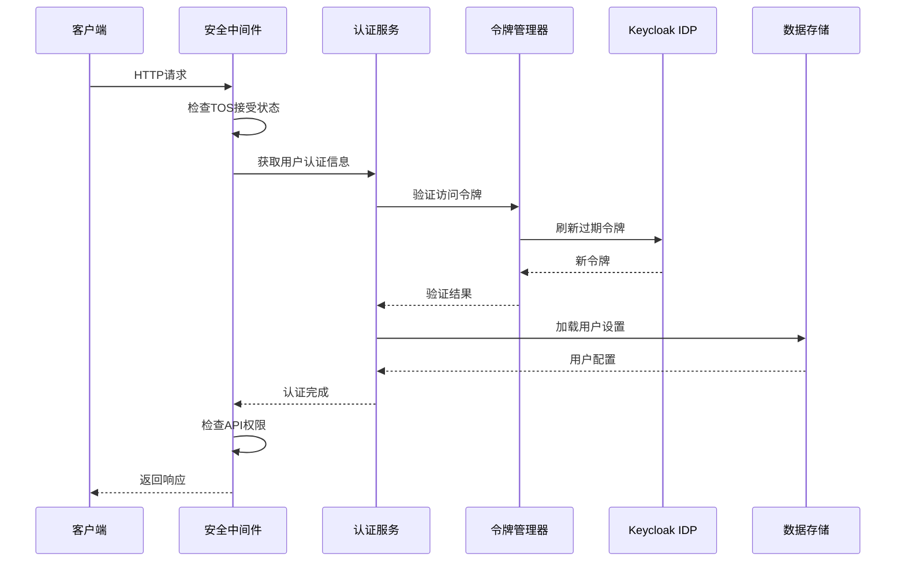

**图表来源**
- [middleware.py](file://enterprise/server/middleware.py#L32-L98)
- [saas_user_auth.py](file://enterprise/server/auth/saas_user_auth.py#L207-L225)

**章节来源**
- [user_auth.py](file://openhands/server/user_auth/user_auth.py#L1-L107)
- [saas_user_auth.py](file://enterprise/server/auth/saas_user_auth.py#L43-L324)

## 核心认证组件

### SaasUserAuth类设计

SaasUserAuth是企业版权限控制的核心类，继承自抽象基类UserAuth，提供了完整的认证和授权功能：

#### 主要属性和方法

| 属性名 | 类型 | 描述 | 默认值 |
|--------|------|------|--------|
| `refresh_token` | `SecretStr` | Keycloak刷新令牌 | 必需 |
| `user_id` | `str` | 用户唯一标识符 | 必需 |
| `email` | `str \| None` | 用户邮箱地址 | 可选 |
| `email_verified` | `bool \| None` | 邮箱验证状态 | 可选 |
| `access_token` | `SecretStr \| None` | Keycloak访问令牌 | 可选 |
| `provider_tokens` | `PROVIDER_TOKEN_TYPE \| None` | 第三方提供商令牌 | 可选 |
| `refreshed` | `bool` | 是否已刷新令牌 | `False` |
| `accepted_tos` | `bool \| None` | Terms of Service接受状态 | 可选 |

#### 令牌刷新机制

系统实现了智能的令牌刷新机制，确保用户会话的连续性：

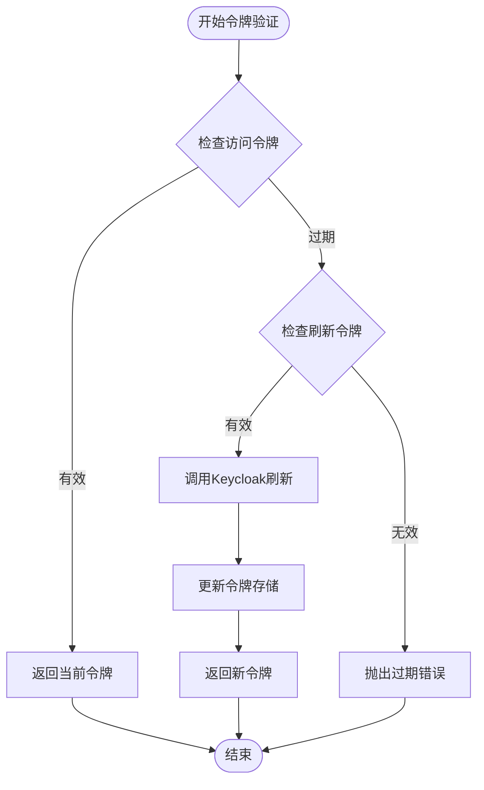

**图表来源**
- [saas_user_auth.py](file://enterprise/server/auth/saas_user_auth.py#L70-L89)

### 认证实例获取流程

系统支持多种认证方式的优先级处理：

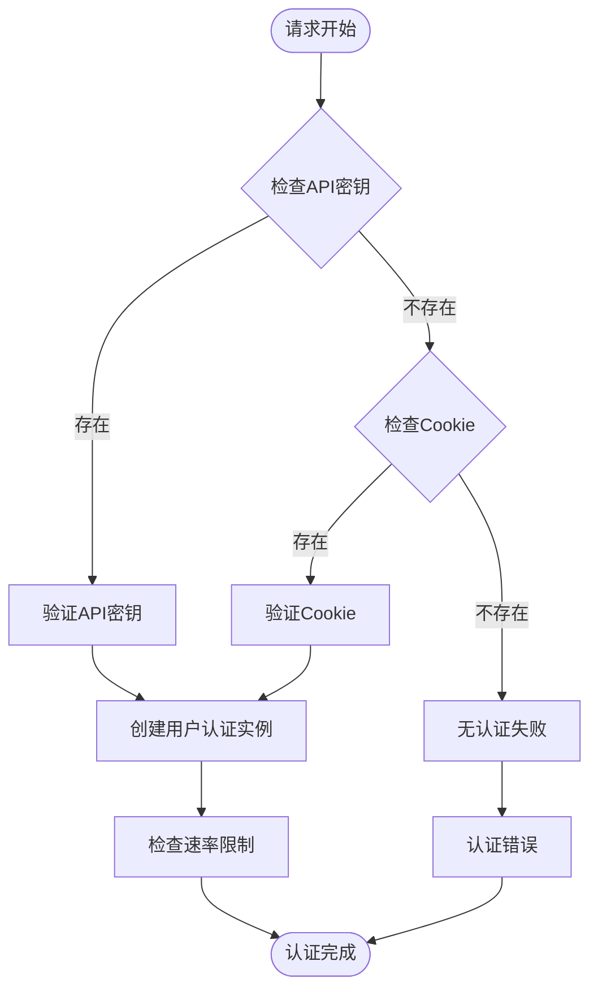

**图表来源**
- [saas_user_auth.py](file://enterprise/server/auth/saas_user_auth.py#L207-L225)

**章节来源**
- [saas_user_auth.py](file://enterprise/server/auth/saas_user_auth.py#L43-L324)

## 多租户数据隔离策略

OpenHands采用严格的数据隔离策略，确保不同租户之间的数据完全独立。

### 租户标识机制

每个用户操作都绑定到特定的租户上下文：

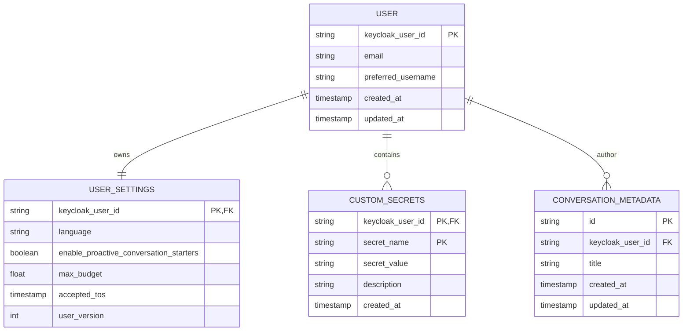

**图表来源**
- [saas_settings_store.py](file://enterprise/storage/saas_settings_store.py#L43-L76)
- [saas_secrets_store.py](file://enterprise/storage/saas_secrets_store.py#L24-L48)

### 数据访问边界控制

系统在所有数据访问层面实施租户隔离：

| 存储类型 | 隔离机制 | 实现方式 | 性能影响 |
|----------|----------|----------|----------|
| 关系数据库 | 用户ID过滤 | 查询时添加WHERE条件 | 最小 |
| 文件存储 | 路径前缀 | 用户专用目录结构 | 极小 |
| 缓存系统 | 键命名空间 | 用户ID作为键前缀 | 很小 |
| 第三方服务 | 访问令牌 | 用户专属令牌 | 中等 |

### 会话数据隔离

每个用户的会话数据都严格隔离：

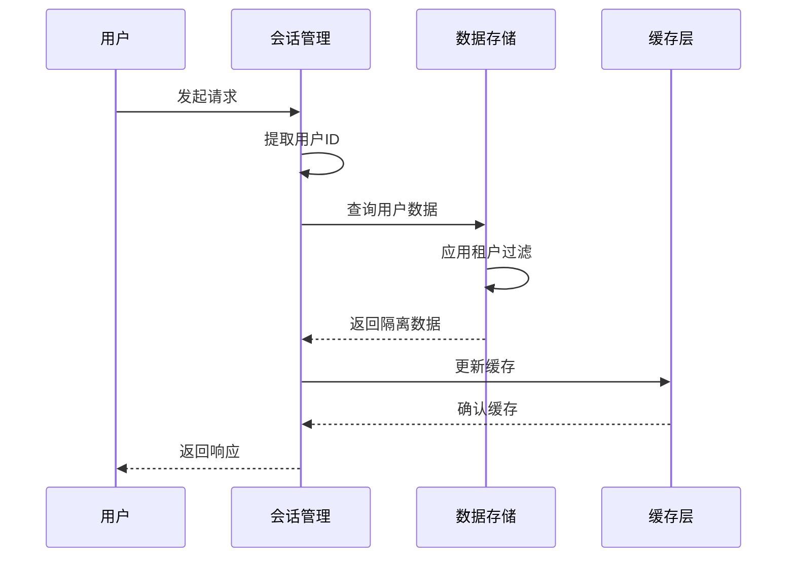

**图表来源**
- [saas_settings_store.py](file://enterprise/storage/saas_settings_store.py#L60-L76)
- [saas_secrets_store.py](file://enterprise/storage/saas_secrets_store.py#L28-L48)

**章节来源**
- [saas_settings_store.py](file://enterprise/storage/saas_settings_store.py#L1-L393)
- [saas_secrets_store.py](file://enterprise/storage/saas_secrets_store.py#L1-L130)

## API端点权限验证机制

### 中间件权限检查

安全中间件负责所有传入请求的权限验证：

#### TOS（Terms of Service）验证

系统强制要求用户接受服务条款：

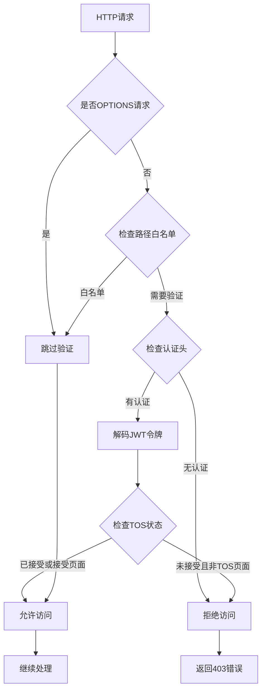

**图表来源**
- [middleware.py](file://enterprise/server/middleware.py#L102-L148)

#### API密钥验证

系统支持多种API密钥验证方式：

| 验证方式 | 使用场景 | 安全级别 | 性能开销 |
|----------|----------|----------|----------|
| Authorization头 | 标准REST API | 高 | 低 |
| X-Session-API-Key头 | 流式代理场景 | 中 | 低 |
| Cookie认证 | Web界面访问 | 高 | 中等 |

### 速率限制机制

系统实施细粒度的速率限制以防止滥用：

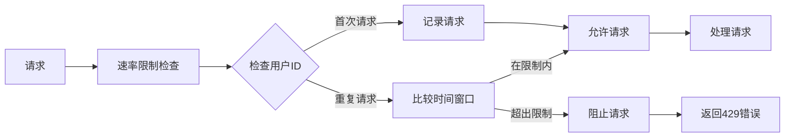

**图表来源**
- [saas_user_auth.py](file://enterprise/server/auth/saas_user_auth.py#L218-L224)

**章节来源**
- [middleware.py](file://enterprise/server/middleware.py#L1-L175)
- [auth.py](file://enterprise/server/routes/auth.py#L1-L435)

## 令牌管理系统

### TokenManager核心功能

TokenManager是整个令牌系统的核心组件，负责与Keycloak身份提供商的所有交互：

#### 令牌生命周期管理

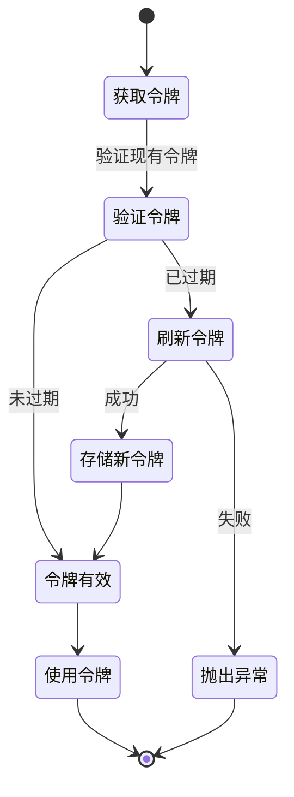

#### 支持的第三方提供商

系统支持多个第三方身份提供商：

| 提供商 | 类型 | 令牌刷新 | 用户映射 |
|--------|------|----------|----------|
| GitHub | OAuth2 | 自动 | 用户ID映射 |
| GitLab | OAuth2 | 自动 | 用户ID映射 |
| Bitbucket | OAuth2 | 自动 | 用户ID映射 |
| Keycloak | OIDC | 内置 | 属性映射 |

### 令牌加密与安全

系统采用多层加密保护敏感令牌：

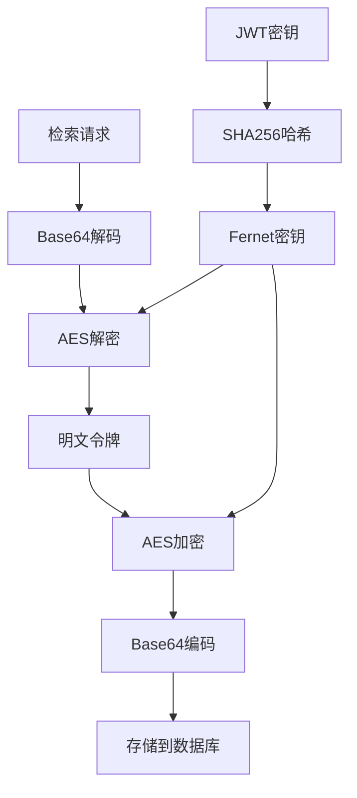

**图表来源**
- [token_manager.py](file://enterprise/server/auth/token_manager.py#L47-L75)
- [saas_secrets_store.py](file://enterprise/storage/saas_secrets_store.py#L113-L118)

**章节来源**
- [token_manager.py](file://enterprise/server/auth/token_manager.py#L1-L672)

## 用户权限存储与管理

### 设置存储系统

SaasSettingsStore管理用户的个性化配置：

#### 配置层次结构

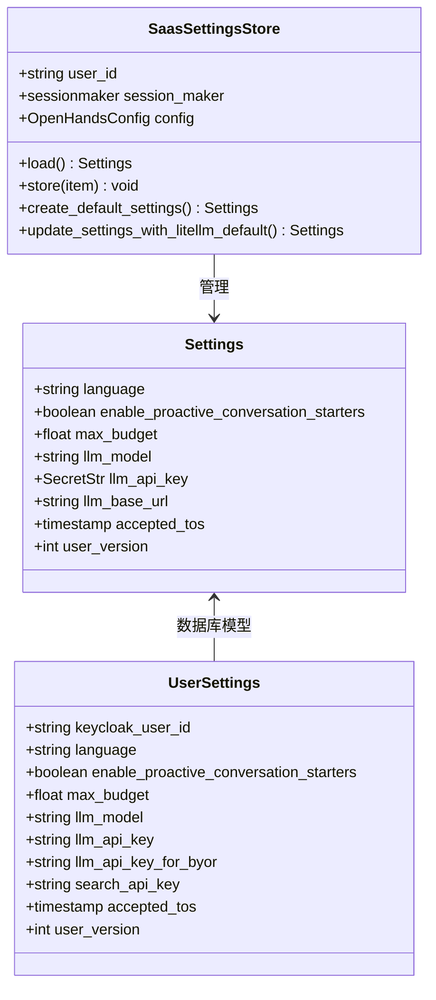

**图表来源**
- [saas_settings_store.py](file://enterprise/storage/saas_settings_store.py#L37-L393)

### 密钥安全管理

SaasSecretsStore专门管理用户的敏感凭据：

#### 加密存储机制

| 敏感数据类型 | 加密算法 | 存储格式 | 访问控制 |
|-------------|----------|----------|----------|
| LLM API密钥 | AES-256 | Base64编码 | 用户隔离 |
| 搜索API密钥 | AES-256 | Base64编码 | 用户隔离 |
| 第三方令牌 | AES-256 | Base64编码 | 用户隔离 |

### 用户验证系统

Enterprise版本包含用户验证功能，支持白名单和Google Sheets集成：

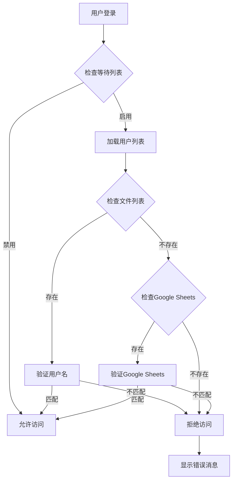

**图表来源**
- [auth_utils.py](file://enterprise/server/auth/auth_utils.py#L57-L76)

**章节来源**
- [saas_settings_store.py](file://enterprise/storage/saas_settings_store.py#L1-L393)
- [saas_secrets_store.py](file://enterprise/storage/saas_secrets_store.py#L1-L130)
- [auth_utils.py](file://enterprise/server/auth/auth_utils.py#L1-L80)

## 安全中间件与拦截器

### SetAuthCookieMiddleware

这是权限控制系统的核心中间件，负责处理认证Cookie和权限验证：

#### 中间件执行流程

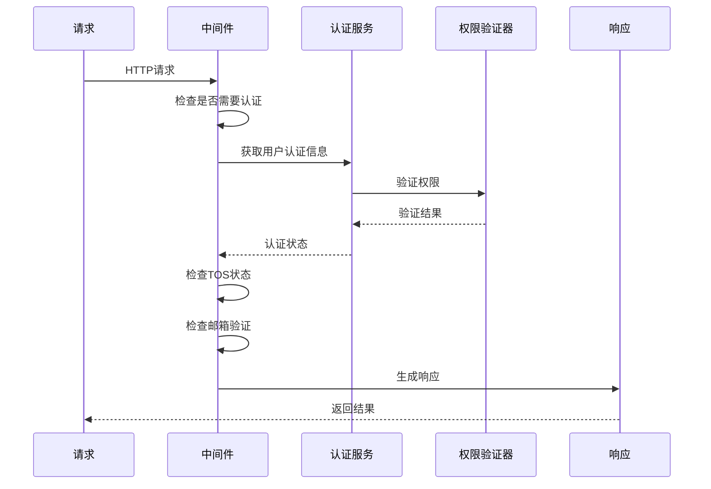

**图表来源**
- [middleware.py](file://enterprise/server/middleware.py#L32-L98)

#### 异常处理机制

中间件实现了完善的异常处理：

| 异常类型 | 处理方式 | 响应状态码 | 清理操作 |
|----------|----------|------------|----------|
| `NoCredentialsError` | 删除认证Cookie | 401 | 清除会话 |
| `ExpiredError` | 删除认证Cookie | 401 | 清除会话 |
| `AuthError` | 删除认证Cookie | 401 | 清除会话 |
| `EmailNotVerifiedError` | 返回403错误 | 403 | 保持会话 |
| `TosNotAcceptedError` | 返回403错误 | 403 | 保持会话 |

### Cookie安全配置

系统实施严格的Cookie安全策略：

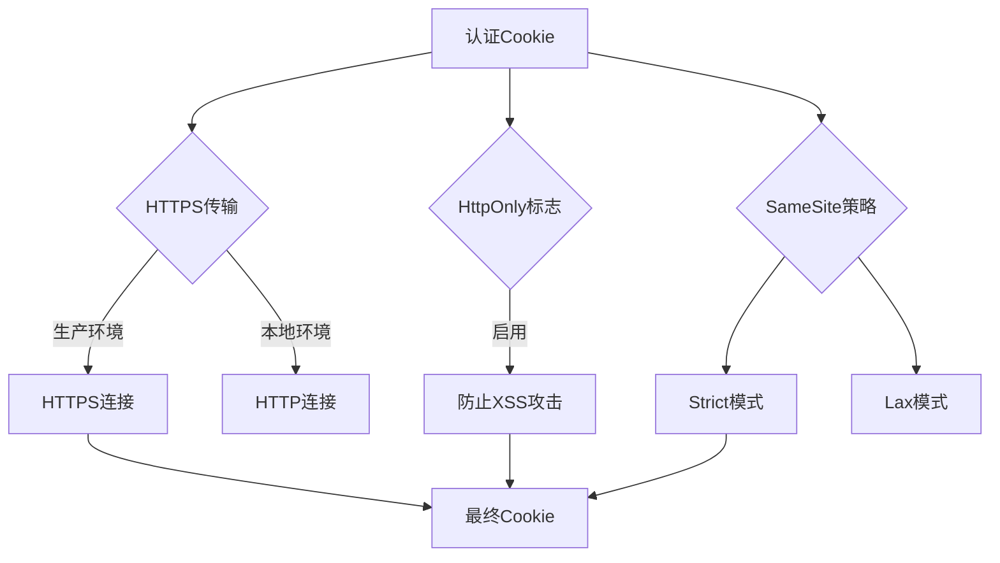

**图表来源**
- [middleware.py](file://enterprise/server/middleware.py#L46-L53)
- [auth.py](file://enterprise/server/routes/auth.py#L43-L78)

**章节来源**
- [middleware.py](file://enterprise/server/middleware.py#L1-L175)

## 扩展性设计与自定义权限

### 插件化认证架构

OpenHands采用插件化的认证架构，支持自定义认证实现：

#### 认证接口设计

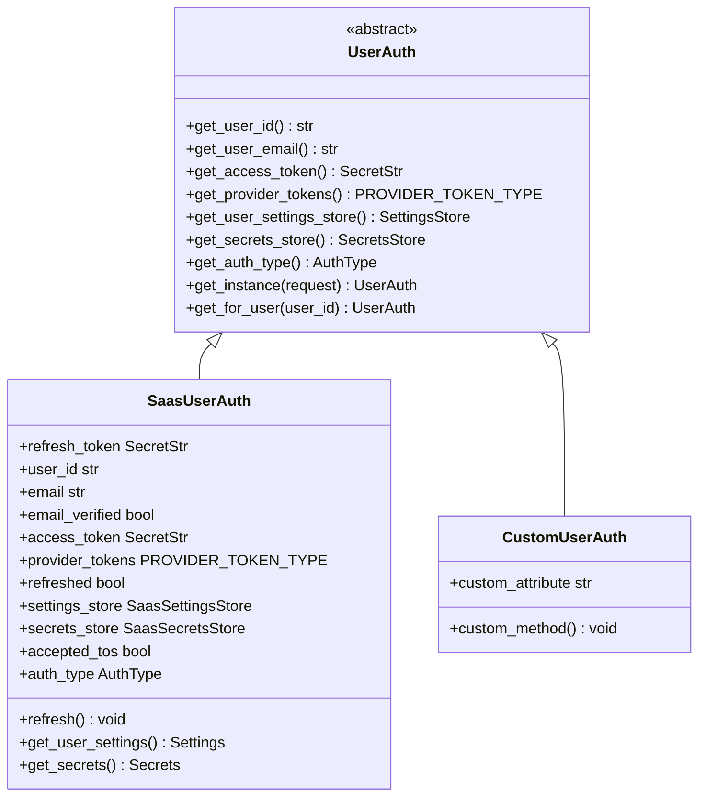

**图表来源**
- [user_auth.py](file://openhands/server/user_auth/user_auth.py#L23-L107)

### 自定义权限扩展

开发者可以通过以下方式扩展权限系统：

#### 1. 自定义认证类

```python
# 示例：自定义LDAP认证类
class LdapUserAuth(UserAuth):
    def __init__(self, ldap_user_id: str):
        self.user_id = ldap_user_id
        self.auth_type = AuthType.CUSTOM
    
    async def get_user_id(self) -> str:
        return self.user_id
    
    async def get_user_email(self) -> str:
        # LDAP查询用户邮箱
        return await self._ldap_lookup_email(self.user_id)
```

#### 2. 权限策略引擎

系统支持基于规则的权限策略：

| 策略类型 | 实现方式 | 应用场景 | 性能 |
|----------|----------|----------|------|
| 角色基础 | 数据库查询 | 传统RBAC | 中等 |
| 属性基础 | 条件判断 | 动态权限 | 高 |
| 策略基础 | 规则引擎 | 复杂业务逻辑 | 中等 |

### API密钥管理

系统提供了完整的API密钥管理功能：

#### API密钥特性

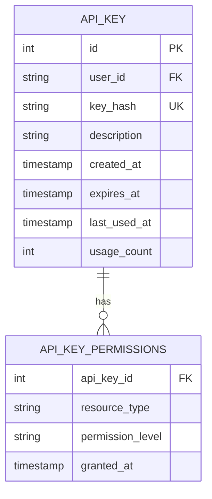

**图表来源**
- [api_keys.py](file://enterprise/server/routes/api_keys.py#L213-L252)

**章节来源**
- [user_auth.py](file://openhands/server/user_auth/user_auth.py#L1-L107)
- [api_keys.py](file://enterprise/server/routes/api_keys.py#L1-L435)

## 故障排除指南

### 常见认证问题

#### 1. 令牌过期问题

**症状**: 用户收到401未授权错误
**原因**: 访问令牌已过期
**解决方案**: 
- 检查令牌刷新机制是否正常工作
- 验证Keycloak连接状态
- 查看服务器日志中的令牌刷新尝试

#### 2. Cookie认证失败

**症状**: Web界面无法正常登录
**原因**: Cookie配置或浏览器设置问题
**解决方案**:
- 检查Cookie安全标志设置
- 验证SameSite策略配置
- 确认浏览器Cookie设置

#### 3. API密钥验证失败

**症状**: API调用返回401错误
**原因**: API密钥无效或已过期
**解决方案**:
- 验证API密钥格式
- 检查密钥有效期
- 确认密钥权限范围

### 性能监控指标

#### 关键性能指标

| 指标名称 | 正常范围 | 警告阈值 | 监控方法 |
|----------|----------|----------|----------|
| 认证响应时间 | < 200ms | > 500ms | 应用日志 |
| 令牌刷新成功率 | > 99% | < 95% | 监控系统 |
| 并发认证请求数 | < 1000 | > 5000 | 负载监控 |
| 数据库查询延迟 | < 50ms | > 200ms | 数据库监控 |

#### 日志分析要点

系统记录详细的认证日志，用于问题诊断：

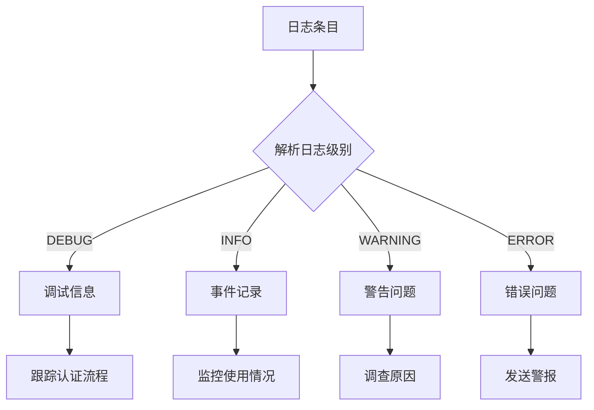

**章节来源**
- [middleware.py](file://enterprise/server/middleware.py#L1-L175)
- [saas_user_auth.py](file://enterprise/server/auth/saas_user_auth.py#L1-L324)

## 总结

OpenHands的企业级权限控制系统是一个完整、安全、可扩展的解决方案，具有以下核心优势：

### 安全特性
- 基于JWT的无状态认证
- 多层加密保护敏感数据
- 严格的多租户隔离
- 完善的审计和监控

### 功能特性
- 支持多种认证方式
- 智能令牌刷新机制
- 细粒度权限控制
- 可扩展的插件架构

### 运维特性
- 完整的错误处理和恢复机制
- 实时性能监控
- 详细的日志记录
- 灵活的配置管理

该权限控制系统为企业级应用提供了坚实的安全基础，同时保持了良好的开发体验和运维便利性。通过模块化设计和清晰的接口定义，系统具备了应对未来需求变化的能力，能够支持更复杂的权限管理场景。