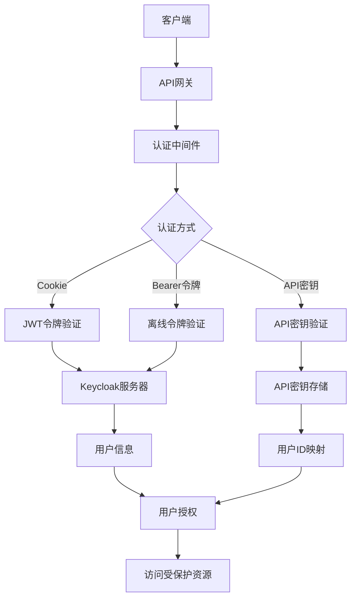
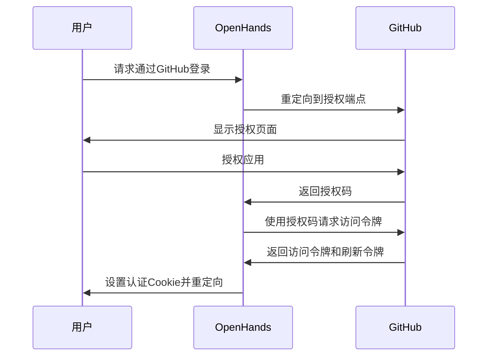
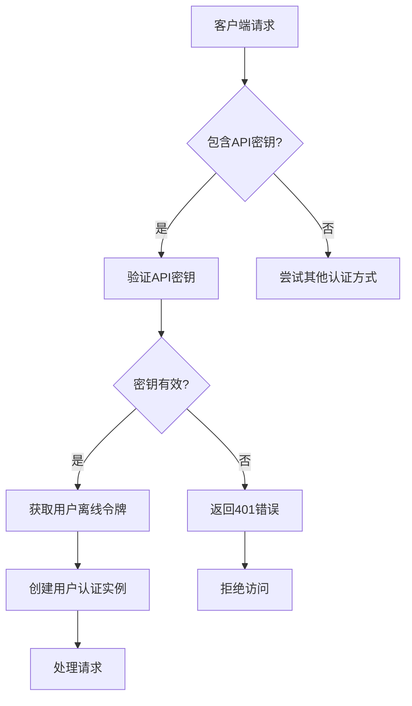
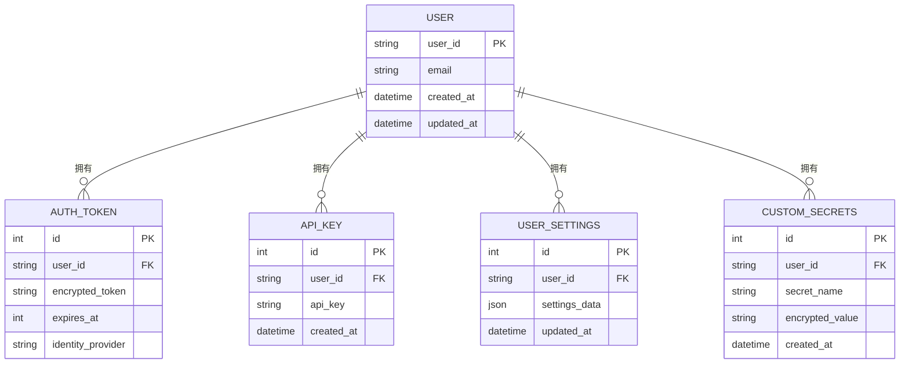

# 认证系统

<cite>
**本文档引用的文件**   
- [auth.py](file://enterprise/server/routes/auth.py)
- [token_manager.py](file://enterprise/server/auth/token_manager.py)
- [saas_user_auth.py](file://enterprise/server/auth/saas_user_auth.py)
- [keycloak_manager.py](file://enterprise/server/auth/keycloak_manager.py)
- [auth_utils.py](file://enterprise/server/auth/auth_utils.py)
- [github_utils.py](file://enterprise/server/auth/github_utils.py)
- [constants.py](file://enterprise/server/auth/constants.py)
- [middleware.py](file://enterprise/server/middleware.py)
- [auth_error.py](file://enterprise/server/auth/auth_error.py)
</cite>

## 目录
1. [简介](#简介)
2. [认证架构概述](#认证架构概述)
3. [基于JWT的认证流程](#基于jwt的认证流程)
4. [OAuth2集成实现](#oauth2集成实现)
5. [企业级单点登录（Keycloak）](#企业级单点登录keycloak)
6. [用户会话管理](#用户会话管理)
7. [API密钥认证](#api密钥认证)
8. [权限控制模型](#权限控制模型)
9. [安全最佳实践](#安全最佳实践)
10. [多租户环境下的用户隔离](#多租户环境下的用户隔离)

## 简介
OpenHands的认证系统是一个综合性的安全框架，旨在为用户提供安全、灵活的访问控制机制。该系统基于JWT（JSON Web Token）技术，结合Keycloak身份认证服务器，实现了现代化的认证和授权流程。系统支持多种认证方式，包括基于Cookie的会话认证、API密钥认证以及企业级单点登录（SSO）。通过OAuth2协议，系统与GitHub、GitLab等第三方服务集成，实现了无缝的身份验证和令牌管理。本文档将全面解析OpenHands的认证系统，涵盖其架构设计、核心组件、安全机制和最佳实践。

## 认证架构概述
OpenHands的认证系统采用分层架构设计，核心组件包括Keycloak身份认证服务器、JWT令牌管理器、用户认证服务和权限控制模块。系统通过Keycloak处理用户身份验证，生成JWT令牌，并在后续请求中验证这些令牌的有效性。TokenManager类负责令牌的创建、刷新和验证，确保令牌的安全性和时效性。用户认证流程通过SaasUserAuth类实现，该类封装了用户身份验证的逻辑，支持多种认证方式。系统还集成了中间件，用于在请求处理过程中自动验证用户身份和权限。

**图源**
- [auth.py](file://enterprise/server/routes/auth.py#L37-L435)
- [middleware.py](file://enterprise/server/middleware.py#L26-L175)
- [saas_user_auth.py](file://enterprise/server/auth/saas_user_auth.py#L43-L324)

## 基于JWT的认证流程
OpenHands的认证流程基于JWT标准实现，确保了认证信息的安全传输和验证。当用户通过身份验证后，系统会生成一个包含用户信息的JWT令牌，并将其作为响应的一部分发送给客户端。客户端在后续请求中需要在Authorization头中包含此令牌。服务器端的认证中间件会拦截每个请求，提取并验证JWT令牌的有效性。验证过程包括检查令牌的签名、过期时间以及包含的用户信息。

认证流程的关键步骤包括：
1. 用户通过登录界面提交认证凭据
2. 系统验证凭据并生成JWT访问令牌和刷新令牌
3. 令牌通过加密的Cookie或响应体返回给客户端
4. 客户端在后续请求中携带访问令牌
5. 服务器验证令牌并授予相应的访问权限

当访问令牌即将过期时，系统会自动使用刷新令牌获取新的访问令牌，确保用户体验的连续性。

**节源**
- [auth.py](file://enterprise/server/routes/auth.py#L99-L287)
- [token_manager.py](file://enterprise/server/auth/token_manager.py#L78-L672)
- [saas_user_auth.py](file://enterprise/server/auth/saas_user_auth.py#L59-L79)

## OAuth2集成实现
OpenHands系统通过OAuth2协议与GitHub、GitLab等第三方服务集成，实现了安全的第三方身份验证。系统配置了相应的客户端ID和密钥，用于与第三方OAuth2提供者通信。当用户选择通过第三方服务登录时，系统会重定向到第三方的授权端点，用户授权后，第三方服务会返回一个授权码。系统使用此授权码向第三方服务的令牌端点请求访问令牌。

对于GitHub集成，系统使用`GITHUB_APP_CLIENT_ID`和`GITHUB_APP_CLIENT_SECRET`环境变量配置的凭据。GitLab集成类似，使用`GITLAB_APP_CLIENT_ID`和`GITLAB_APP_CLIENT_SECRET`。系统还实现了令牌刷新机制，当访问令牌过期时，可以使用刷新令牌获取新的访问令牌，而无需用户重新登录。

**图源**
- [token_manager.py](file://enterprise/server/auth/token_manager.py#L344-L415)
- [constants.py](file://enterprise/server/auth/constants.py#L3-L19)
- [github_utils.py](file://enterprise/server/auth/github_utils.py#L85-L109)

## 企业级单点登录（Keycloak）
OpenHands系统集成了Keycloak作为企业级身份认证和单点登录（SSO）解决方案。Keycloak提供了强大的身份管理功能，包括用户管理、身份验证、授权和单点登录。系统通过KeycloakOpenID客户端与Keycloak服务器通信，处理用户的登录、注销和令牌验证。

KeycloakManager类负责管理Keycloak客户端的实例，提供单例模式的访问接口。系统支持内部和外部Keycloak服务器配置，通过`KEYCLOAK_SERVER_URL`和`KEYCLOAK_SERVER_URL_EXT`环境变量进行区分。用户登录后，系统会从Keycloak获取用户的访问令牌和刷新令牌，并将其存储在加密的Cookie中。

Keycloak还支持多种身份提供者（Identity Provider），包括GitHub、GitLab和Bitbucket。系统可以配置为允许用户通过这些第三方服务进行身份验证，实现统一的身份管理。

**节源**
- [keycloak_manager.py](file://enterprise/server/auth/keycloak_manager.py#L1-L51)
- [token_manager.py](file://enterprise/server/auth/token_manager.py#L89-L128)
- [constants.py](file://enterprise/server/auth/constants.py#L7-L15)

## 用户会话管理
OpenHands系统通过JWT令牌和加密Cookie实现用户会话管理。当用户成功认证后，系统会生成一个包含用户信息的JWT令牌，并将其存储在名为`keycloak_auth`的加密Cookie中。该Cookie配置为HttpOnly和Secure，防止跨站脚本攻击（XSS）和中间人攻击。

会话管理的关键特性包括：
- **令牌刷新**：系统定期检查访问令牌的有效期，当令牌即将过期时，自动使用刷新令牌获取新的访问令牌
- **会话过期**：访问令牌设置较短的有效期（通常为1小时），刷新令牌设置较长的有效期（通常为30天）
- **安全存储**：所有敏感信息（如令牌）都经过加密存储，防止信息泄露
- **会话终止**：用户注销时，系统会清除Cookie并调用Keycloak的注销端点，确保会话完全终止

SetAuthCookieMiddleware中间件负责在响应中设置和更新认证Cookie，确保用户的会话状态始终保持最新。

**节源**
- [auth.py](file://enterprise/server/routes/auth.py#L43-L78)
- [middleware.py](file://enterprise/server/middleware.py#L26-L97)
- [saas_user_auth.py](file://enterprise/server/auth/saas_user_auth.py#L131-L137)

## API密钥认证
OpenHands系统支持API密钥认证，为自动化脚本和第三方应用提供安全的访问方式。API密钥通过`X-Session-API-Key`或`Authorization: Bearer`头传递。系统使用ApiKeyStore类管理API密钥的存储和验证。

API密钥认证流程如下：
1. 客户端在请求头中包含API密钥
2. 系统从ApiKeyStore中验证密钥的有效性
3. 如果密钥有效，系统通过用户的离线令牌获取最新的认证信息
4. 系统创建SaasUserAuth实例，代表经过认证的用户

API密钥与用户的Keycloak用户ID关联，确保每个API密钥都有明确的归属。系统还实现了速率限制，防止API密钥被滥用。

**图源**
- [saas_user_auth.py](file://enterprise/server/auth/saas_user_auth.py#L249-L267)
- [auth.py](file://enterprise/server/routes/auth.py#L295-L319)
- [middleware.py](file://enterprise/server/middleware.py#L32-L97)

## 权限控制模型
OpenHands系统实现了基于角色的访问控制（RBAC）模型，结合用户属性和环境条件进行细粒度的权限管理。系统通过UserAuth接口定义统一的认证和授权接口，不同的认证方式（如Cookie认证、API密钥认证）实现该接口。

权限控制的关键组件包括：
- **用户角色**：系统定义了不同的用户角色，如普通用户、管理员等，每个角色具有不同的权限
- **资源访问**：系统根据用户角色和属性决定对特定资源的访问权限
- **操作授权**：系统在执行敏感操作前验证用户是否有相应的权限
- **条件访问**：系统可以基于时间、IP地址等条件实施访问控制

SaasUserAuth类提供了`get_user_settings`和`get_secrets`方法，用于获取用户的设置和密钥，这些信息可以用于实现更复杂的权限逻辑。

**节源**
- [saas_user_auth.py](file://enterprise/server/auth/saas_user_auth.py#L99-L129)
- [auth_error.py](file://enterprise/server/auth/auth_error.py#L9-L15)
- [middleware.py](file://enterprise/server/middleware.py#L60-L67)

## 安全最佳实践
OpenHands系统遵循多项安全最佳实践，确保用户数据和系统资源的安全：
- **HTTPS强制**：所有认证相关的通信都通过HTTPS进行，防止中间人攻击
- **令牌加密**：JWT令牌和敏感信息都经过加密存储，防止信息泄露
- **速率限制**：系统实现了基于Redis的速率限制，防止暴力破解和滥用
- **输入验证**：所有用户输入都经过严格的验证和清理，防止注入攻击
- **安全头**：响应中包含安全相关的HTTP头，如Content-Security-Policy、X-Content-Type-Options等
- **日志记录**：关键操作（如登录、注销）都有详细的日志记录，便于审计和监控

系统还实现了多层错误处理，确保在认证失败时不会泄露敏感信息。例如，认证失败时返回通用的错误消息，而不是具体的失败原因。

**节源**
- [middleware.py](file://enterprise/server/middleware.py#L70-L97)
- [token_manager.py](file://enterprise/server/auth/token_manager.py#L47-L75)
- [auth.py](file://enterprise/server/routes/auth.py#L302-L318)

## 多租户环境下的用户隔离
OpenHands系统设计支持多租户环境，确保不同用户之间的数据隔离和安全。系统通过以下机制实现用户隔离：
- **用户ID隔离**：每个用户都有唯一的Keycloak用户ID，所有数据操作都基于此ID进行
- **数据分区**：用户数据在存储时通过用户ID进行分区，确保数据的物理隔离
- **访问控制**：系统在访问任何资源前都会验证当前用户是否有权访问该资源
- **密钥管理**：用户的API密钥和令牌都与用户ID关联，防止跨用户访问

TokenManager类提供了`get_idp_token_from_idp_user_id`方法，可以根据第三方服务的用户ID获取相应的访问令牌，同时确保用户隔离。系统还实现了`UserVerifier`类，用于验证用户是否在允许的列表中，进一步增强了安全性。

**图源**
- [token_manager.py](file://enterprise/server/auth/token_manager.py#L449-L489)
- [auth_utils.py](file://enterprise/server/auth/auth_utils.py#L8-L76)
- [storage.py](file://enterprise/storage/database.py#L1-L50)