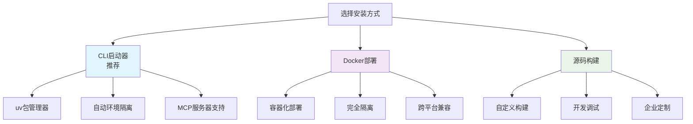
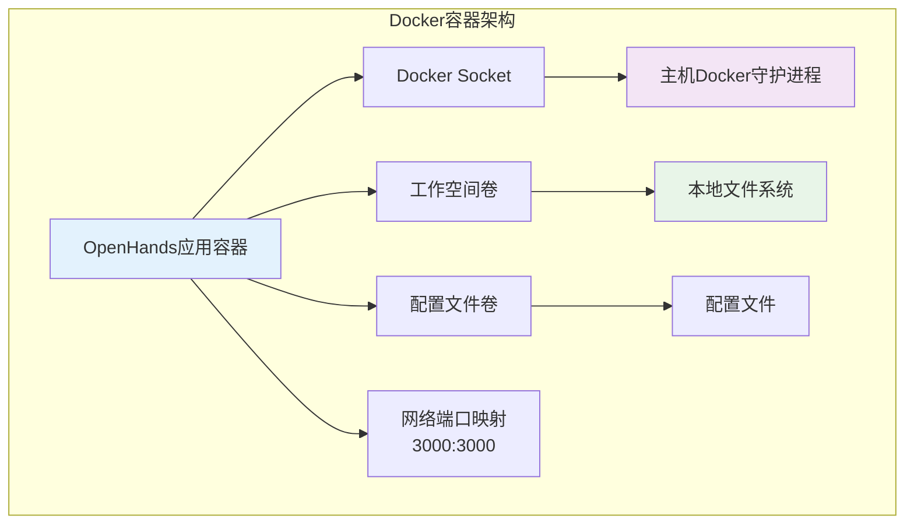
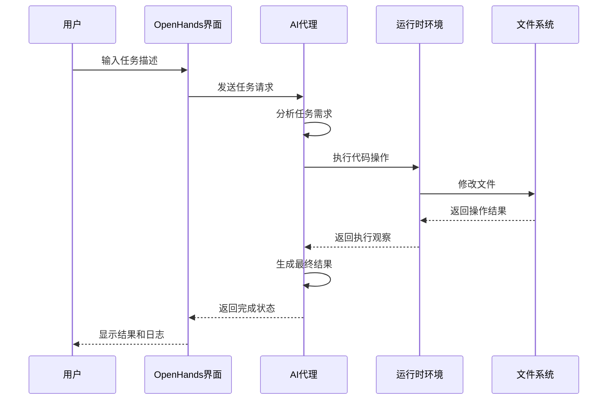

# 快速开始

<cite>
**本文档中引用的文件**
- [README.md](file://README.md)
- [pyproject.toml](file://pyproject.toml)
- [docker-compose.yml](file://docker-compose.yml)
- [config.template.toml](file://config.template.toml)
- [containers/app/Dockerfile](file://containers/app/Dockerfile)
- [containers/app/entrypoint.sh](file://containers/app/entrypoint.sh)
- [containers/dev/compose.yml](file://containers/dev/compose.yml)
- [openhands-cli/pyproject.toml](file://openhands-cli/pyproject.toml)
- [Development.md](file://Development.md)
- [Makefile](file://Makefile)
- [microagents/README.md](file://microagents/README.md)
- [openhands/runtime/README.md](file://openhands/runtime/README.md)
</cite>

## 目录
1. [简介](#简介)
2. [系统要求](#系统要求)
3. [安装方式概览](#安装方式概览)
4. [方法一：CLI启动器（推荐）](#方法一cli启动器推荐)
5. [方法二：Docker部署](#方法二docker部署)
6. [方法三：源码构建](#方法三源码构建)
7. [配置设置](#配置设置)
8. [基本使用示例](#基本使用示例)
9. [关键配置选项](#关键配置选项)
10. [常见问题排查](#常见问题排查)
11. [验证安装检查清单](#验证安装检查清单)
12. [操作系统特定指导](#操作系统特定指导)
13. [高级配置](#高级配置)
14. [故障排除指南](#故障排除指南)

## 简介

OpenHands是一个由人工智能驱动的软件开发平台，能够执行人类开发者能做的任何事情：修改代码、运行命令、浏览网页、调用API等。本指南将帮助您在本地环境中快速部署和运行OpenHands。

### 核心特性
- **多语言支持**：支持多种编程语言和框架
- **智能代理**：具备自主学习和解决问题的能力
- **安全隔离**：通过沙箱环境确保系统安全
- **灵活部署**：支持多种部署方式

## 系统要求

### 基础要求
- **操作系统**：Linux、macOS 或 Windows Subsystem for Linux (WSL) 2.0+
- **内存**：至少 8GB RAM（推荐 16GB+）
- **存储空间**：至少 20GB 可用磁盘空间
- **网络**：稳定的互联网连接

### 软件依赖

#### 方法一：CLI启动器
- **uv**：Python包管理工具（版本 ≥ 0.1.0）

#### 方法二：Docker部署
- **Docker**：版本 ≥ 20.10
- **Docker Compose**：版本 ≥ 2.0

#### 方法三：源码构建
- **Python**：版本 3.12
- **Node.js**：版本 ≥ 22.x
- **Poetry**：版本 ≥ 1.8
- **npm**：版本 ≥ 9.0

### 硬件建议
- **CPU**：4核心或更多
- **GPU**（可选）：用于加速机器学习推理
- **SSD**：提高文件操作性能

## 安装方式概览

OpenHands提供三种主要的安装和运行方式：



**图表来源**
- [README.md](file://README.md#L58-L115)
- [Development.md](file://Development.md#L11-L22)

## 方法一：CLI启动器（推荐）

### 步骤1：安装uv包管理器

#### macOS/Linux
```bash
curl -Ls "https://github.com/astral-sh/uv/releases/latest/download/uv-installer.sh" | sh
```

#### Windows (WSL)
```bash
curl -Ls "https://github.com/astral-sh/uv/releases/latest/download/uv-installer.ps1" | powershell
```

### 步骤2：启动OpenHands服务

```bash
# 启动GUI服务器
uvx --python 3.12 openhands serve

# 或启动CLI界面
uvx --python 3.12 openhands
```

### 功能特点
- **自动环境隔离**：使用uv创建独立的Python环境
- **MCP服务器支持**：内置模型上下文协议服务器
- **快速启动**：无需复杂的依赖管理
- **跨平台**：支持所有主流操作系统

**章节来源**
- [README.md](file://README.md#L58-L76)

## 方法二：Docker部署

### 预先准备

#### 检查Docker状态
```bash
# 检查Docker是否已安装
docker --version

# 检查Docker服务是否运行
docker ps
```

#### 创建工作目录
```bash
# 创建项目目录
mkdir ~/openhands-project
cd ~/openhands-project
```

### 使用Docker Compose

#### 方式一：标准部署
```bash
# 克隆配置文件
wget https://raw.githubusercontent.com/OpenHands/OpenHands/main/docker-compose.yml

# 启动服务
docker compose up -d
```

#### 方式二：自定义配置
```bash
# 设置环境变量
export WORKSPACE_BASE="$PWD/workspace"
export SANDBOX_RUNTIME_CONTAINER_IMAGE=docker.openhands.dev/openhands/runtime:0.61-nikolaik

# 启动服务
docker compose up -d
```

### 手动Docker命令

```bash
docker pull docker.openhands.dev/openhands/runtime:0.61-nikolaik

docker run -it --rm --pull=always \
    -e SANDBOX_RUNTIME_CONTAINER_IMAGE=docker.openhands.dev/openhands/runtime:0.61-nikolaik \
    -e LOG_ALL_EVENTS=true \
    -v /var/run/docker.sock:/var/run/docker.sock \
    -v ~/.openhands:/.openhands \
    -p 3000:3000 \
    --add-host host.docker.internal:host-gateway \
    --name openhands-app \
    docker.openhands.dev/openhands/openhands:0.61
```

### Docker配置详解



**图表来源**
- [docker-compose.yml](file://docker-compose.yml#L1-L24)
- [containers/app/Dockerfile](file://containers/app/Dockerfile#L1-L96)

**章节来源**
- [README.md](file://README.md#L77-L104)
- [docker-compose.yml](file://docker-compose.yml#L1-L24)

## 方法三：源码构建

### 开发环境设置

#### 1. 克隆仓库
```bash
git clone https://github.com/OpenHands/OpenHands.git
cd OpenHands
```

#### 2. 检查系统要求
```bash
# 检查Python版本
python3.12 --version

# 检查Node.js版本
node --version

# 检查Docker（可选）
docker --version
```

#### 3. 构建项目
```bash
# 完整构建（推荐）
make build

# 或单独构建后端
make install-python-dependencies

# 或单独构建前端
make install-frontend-dependencies
```

### 开发模式运行

#### 启动后端服务
```bash
make start-backend
```

#### 启动前端服务
```bash
make start-frontend
```

#### 完整启动
```bash
make run
```

### 开发容器（可选）

```bash
# 使用开发容器
make docker-dev
```

**章节来源**
- [Development.md](file://Development.md#L51-L140)
- [Makefile](file://Makefile#L25-L32)

## 配置设置

### 自动配置向导

```bash
# 运行配置设置
make setup-config
```

配置向导会引导您完成以下设置：
- 工作空间目录路径
- LLM提供商和API密钥
- 模型名称和参数
- 环境变量设置

### 手动配置

#### 创建配置文件
```bash
# 复制模板配置
cp config.template.toml config.toml

# 编辑配置文件
nano config.toml
```

#### 基本配置示例
```toml
[core]
workspace_base = "./workspace"
debug = false
disable_color = false

[llm]
model = "gpt-4o"
api_key = "your-api-key-here"
base_url = ""

[agent]
enable_browsing = true
enable_editor = true
enable_jupyter = true
enable_cmd = true
```

### 环境变量配置

```bash
# 设置工作空间
export WORKSPACE_BASE="$HOME/openhands-workspace"

# 设置LLM配置
export OPENHANDS_LLM_API_KEY="your-api-key"
export OPENHANDS_LLM_MODEL="gpt-4o"

# 设置运行时
export RUNTIME="docker"
export SANDBOX_USER_ID="$(id -u)"
```

**章节来源**
- [config.template.toml](file://config.template.toml#L1-L543)
- [Makefile](file://Makefile#L300-L333)

## 基本使用示例

### 启动会话

#### Web界面访问
1. 打开浏览器访问：http://localhost:3000
2. 首次启动会提示配置LLM
3. 选择合适的模型和API密钥

#### CLI界面使用
```bash
# 启动CLI
uvx --python 3.12 openhands

# 或使用本地安装
openhands
```

### 创建第一个任务

#### 示例1：简单代码修改
```
请在项目中添加一个新的函数，实现斐波那契数列计算。
```

#### 示例2：网站功能扩展
```
我在网站上添加了一个新的联系表单，请确保它能正确发送邮件通知。
```

#### 示例3：数据分析脚本
```
请分析提供的数据集，生成销售趋势报告，并可视化结果。
```

### 查看结果



**图表来源**
- [README.md](file://README.md#L106-L115)

## 关键配置选项

### 核心配置

| 配置项 | 默认值 | 描述 | 推荐设置 |
|--------|--------|------|----------|
| `workspace_base` | `./workspace` | 工作空间根目录 | `~/openhands-workspace` |
| `debug` | `false` | 启用调试模式 | 生产环境设为`false` |
| `max_iterations` | `500` | 最大迭代次数 | 根据复杂度调整 |
| `max_budget_per_task` | `0.0` | 单任务最大预算 | 设置合理的限制 |

### LLM配置

| 配置项 | 默认值 | 描述 | 推荐设置 |
|--------|--------|------|----------|
| `model` | `"gpt-4o"` | 使用的LLM模型 | `gpt-4o` 或 `claude-3-5-sonnet` |
| `api_key` | `""` | LLM API密钥 | 必填 |
| `max_input_tokens` | `0` | 最大输入token数 | 根据模型调整 |
| `temperature` | `0.0` | 生成温度 | `0.1`-`0.3`用于精确任务 |

### 运行时配置

| 配置项 | 默认值 | 描述 | 推荐设置 |
|--------|--------|------|----------|
| `runtime` | `"docker"` | 运行时类型 | `docker` 或 `local` |
| `timeout` | `120` | 超时时间（秒） | `300`-`600` |
| `base_container_image` | `"nikolaik/python-nodejs:python3.12-nodejs22"` | 基础镜像 | 使用官方镜像 |
| `user_id` | `1000` | 用户ID | 使用当前用户ID |

### 安全配置

| 配置项 | 默认值 | 描述 | 推荐设置 |
|--------|--------|------|----------|
| `confirmation_mode` | `false` | 确认模式 | 生产环境启用 |
| `security_analyzer` | `"llm"` | 安全分析器 | `"llm"` 或 `"invariant"` |
| `enable_security_analyzer` | `true` | 启用安全分析 | 始终启用 |

**章节来源**
- [config.template.toml](file://config.template.toml#L9-L543)

## 常见问题排查

### 端口冲突问题

#### 问题症状
```
Error: Port 3000 is already in use
```

#### 解决方案
```bash
# 检查占用端口的进程
lsof -i :3000

# 终止占用进程
kill -9 <PID>

# 或使用其他端口
export BACKEND_PORT=3001
make run
```

### 依赖缺失问题

#### Python依赖问题
```bash
# 清理并重新安装
poetry cache clear --all pypi
poetry install --with dev,test,runtime

# 或使用pip直接安装
pip install -r requirements.txt
```

#### Node.js依赖问题
```bash
# 清理node_modules
rm -rf frontend/node_modules
cd frontend && npm install

# 或强制重新安装
npm install --force
```

### 权限问题

#### Docker权限
```bash
# 添加用户到docker组
sudo usermod -aG docker $USER

# 重新登录或执行
newgrp docker

# 测试Docker权限
docker run hello-world
```

#### 文件权限
```bash
# 设置正确的文件权限
chmod -R 755 ~/.openhands
chmod -R 755 ./workspace

# 设置正确的所有者
sudo chown -R $USER:$USER ~/.openhands
sudo chown -R $USER:$USER ./workspace
```

### 内存不足问题

#### 系统资源监控
```bash
# 检查可用内存
free -h

# 检查磁盘空间
df -h

# 检查进程内存使用
ps aux | sort -nk +4 | tail
```

#### 性能优化
```bash
# 限制并发任务数
export MAX_CONCURRENT_TASKS=2

# 减少缓存大小
export CACHE_SIZE_LIMIT=100MB
```

**章节来源**
- [Makefile](file://Makefile#L47-L137)

## 验证安装检查清单

### 基础验证

- [ ] **系统要求满足**
  - [ ] Python 3.12 已安装
  - [ ] Node.js 22.x 已安装
  - [ ] Docker 已安装（可选）
  - [ ] 至少 8GB 内存可用

- [ ] **依赖安装成功**
  - [ ] Poetry 安装完成
  - [ ] 前端依赖安装完成
  - [ ] 后端依赖安装完成

- [ ] **配置文件设置**
  - [ ] `config.toml` 文件存在
  - [ ] LLM API密钥已配置
  - [ ] 工作空间路径正确

- [ ] **服务启动**
  - [ ] 后端服务正常启动
  - [ ] 前端服务正常启动
  - [ ] Web界面可访问

### 功能验证

- [ ] **基本交互测试**
  - [ ] 能够创建新会话
  - [ ] 能够发送简单指令
  - [ ] 能够查看执行结果

- [ ] **文件操作测试**
  - [ ] 能够读取现有文件
  - [ ] 能够创建新文件
  - [ ] 能够修改文件内容

- [ ] **LLM集成测试**
  - [ ] API密钥验证成功
  - [ ] 模型响应正常
  - [ ] 错误处理机制正常

### 性能验证

- [ ] **响应时间测试**
  - [ ] 首次响应时间 < 30秒
  - [ ] 文件操作响应时间 < 5秒
  - [ ] 复杂任务响应时间 < 2分钟

- [ ] **稳定性测试**
  - [ ] 连续运行24小时无异常
  - [ ] 多次重启服务正常
  - [ ] 配置重载功能正常

## 操作系统特定指导

### Linux（Ubuntu/Debian）

#### 系统更新
```bash
sudo apt update && sudo apt upgrade -y
sudo apt install build-essential python3.12 python3.12-dev
```

#### Docker安装
```bash
# 安装Docker
curl -fsSL https://get.docker.com -o get-docker.sh
sudo sh get-docker.sh

# 安装Docker Compose
sudo curl -L "https://github.com/docker/compose/releases/download/v2.20.2/docker-compose-$(uname -s)-$(uname -m)" -o /usr/local/bin/docker-compose
sudo chmod +x /usr/local/bin/docker-compose
```

### macOS

#### Homebrew安装
```bash
# 安装Homebrew
/bin/bash -c "$(curl -fsSL https://raw.githubusercontent.com/Homebrew/install/HEAD/install.sh)"

# 安装必要工具
brew install python@3.12 node@22 docker
```

#### Docker Desktop
1. 下载并安装Docker Desktop
2. 在偏好设置中启用Docker Socket
3. 允许Docker访问必要的文件夹

### Windows (WSL 2)

#### WSL安装
```powershell
# 启用WSL
wsl --install

# 更新到WSL 2
wsl --set-default-version 2

# 安装Ubuntu发行版
wsl --install Ubuntu
```

#### 环境配置
```bash
# 在WSL中安装Python
sudo apt update
sudo apt install python3.12 python3.12-venv

# 配置X11转发（用于图形界面）
export DISPLAY=$(cat /etc/resolv.conf | grep nameserver | awk '{print $2}'):0
export LIBGL_ALWAYS_INDIRECT=1
```

### 特殊情况处理

#### 防火墙配置
```bash
# 允许Docker通信
sudo ufw allow 2375/tcp
sudo ufw allow 2376/tcp

# 允许Web服务
sudo ufw allow 3000/tcp
```

#### 网络代理设置
```bash
# 配置Docker代理
sudo mkdir -p /etc/systemd/system/docker.service.d
echo "[Service]
Environment=\"HTTP_PROXY=http://proxy.company.com:8080\"
Environment=\"HTTPS_PROXY=http://proxy.company.com:8080\"" | sudo tee /etc/systemd/system/docker.service.d/http-proxy.conf

sudo systemctl daemon-reload
sudo systemctl restart docker
```

## 高级配置

### 多模型配置

```toml
# 主模型配置
[llm.primary]
model = "gpt-4o"
api_key = "primary-key"
max_input_tokens = 128000

# 辅助模型配置
[llm.secondary]
model = "claude-3-5-sonnet"
api_key = "secondary-key"
max_input_tokens = 200000

[model_routing]
router_name = "multimodal_router"
```

### 自定义运行时

```toml
# 自定义Docker运行时
[sandbox]
runtime_container_image = "custom-runtime:latest"
base_container_image = "custom-base:latest"
timeout = 600
user_id = 1000

# GPU支持
[sandbox]
enable_gpu = true
cuda_visible_devices = "0,1"
```

### 微代理配置

```toml
# 启用微代理
[agent]
disabled_microagents = []

# 自定义微代理路径
[microagents]
custom_agents_dir = "/path/to/custom-agents"
```

### 安全加固

```toml
# 启用确认模式
[security]
confirmation_mode = true
security_analyzer = "invariant"
enable_security_analyzer = true

# 网络安全
[sandbox]
use_host_network = false
runtime_extra_build_args = ["--network=bridge"]
```

**章节来源**
- [config.template.toml](file://config.template.toml#L534-L543)
- [openhands/runtime/README.md](file://openhands/runtime/README.md#L44-L60)

## 故障排除指南

### 日志分析

#### 后端日志
```bash
# 查看后端服务日志
tail -f logs/backend.log

# 查看特定日期的日志
find logs -name "*.log" -mtime -1

# 分析错误模式
grep -i error logs/backend.log | tail -20
```

#### 前端日志
```bash
# 浏览器开发者工具
# F12 → Console → Network → Application

# 前端日志文件
ls -la frontend/logs/
```

#### Docker日志
```bash
# 查看容器日志
docker logs openhands-app

# 实时跟踪日志
docker logs -f openhands-app

# 查看容器事件
docker events --filter "container=openhands-app"
```

### 性能诊断

#### 资源使用监控
```bash
# 系统资源使用
htop
iotop
nvidia-smi  # 如果有GPU

# 容器资源使用
docker stats openhands-app

# 磁盘使用情况
du -sh workspace/
```

#### 网络诊断
```bash
# 检查网络连接
curl -I http://localhost:3000

# 检查端口监听
netstat -tlnp | grep :3000

# 检查DNS解析
nslookup localhost
```

### 数据恢复

#### 配置恢复
```bash
# 备份当前配置
cp config.toml config.toml.backup

# 恢复默认配置
cp config.template.toml config.toml

# 重新配置
make setup-config
```

#### 工作空间恢复
```bash
# 备份工作空间
tar -czf workspace.backup.tar.gz workspace/

# 恢复工作空间
rm -rf workspace/
tar -xzf workspace.backup.tar.gz

# 清理损坏的文件
find workspace/ -name "*.lock" -delete
```

### 升级指南

#### 小版本升级
```bash
# 拉取最新代码
git pull origin main

# 更新依赖
make install-python-dependencies
make install-frontend-dependencies

# 重启服务
make run
```

#### 大版本升级
```bash
# 备份重要数据
cp -r ~/.openhands ~/.openhands.backup
cp config.toml config.toml.backup

# 清理旧环境
make clean

# 重新构建
make build

# 恢复配置
cp config.toml.backup config.toml
```

### 社区支持

#### 获取帮助
- **GitHub Issues**：报告bug和功能请求
- **Slack社区**：实时讨论和技术支持
- **文档站点**：详细的技术文档

#### 贡献指南
- **代码贡献**：遵循项目的编码规范
- **文档改进**：帮助完善使用文档
- **测试反馈**：提供使用场景和改进建议

**章节来源**
- [Development.md](file://Development.md#L130-L140)

## 结论

通过本指南，您应该能够成功在本地环境中部署和运行OpenHands。根据您的具体需求和环境，可以选择最适合的安装方式：

- **快速体验**：使用CLI启动器（推荐）
- **生产部署**：使用Docker容器
- **开发调试**：使用源码构建

记住定期更新配置和监控系统性能，以获得最佳的使用体验。如果遇到任何问题，可以参考故障排除部分或寻求社区支持。

祝您在OpenHands平台上取得丰硕的开发成果！