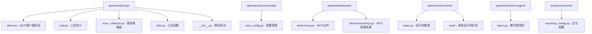
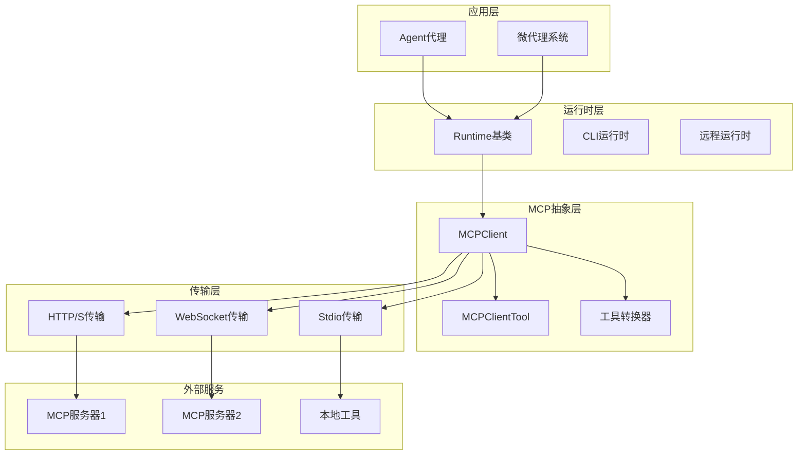
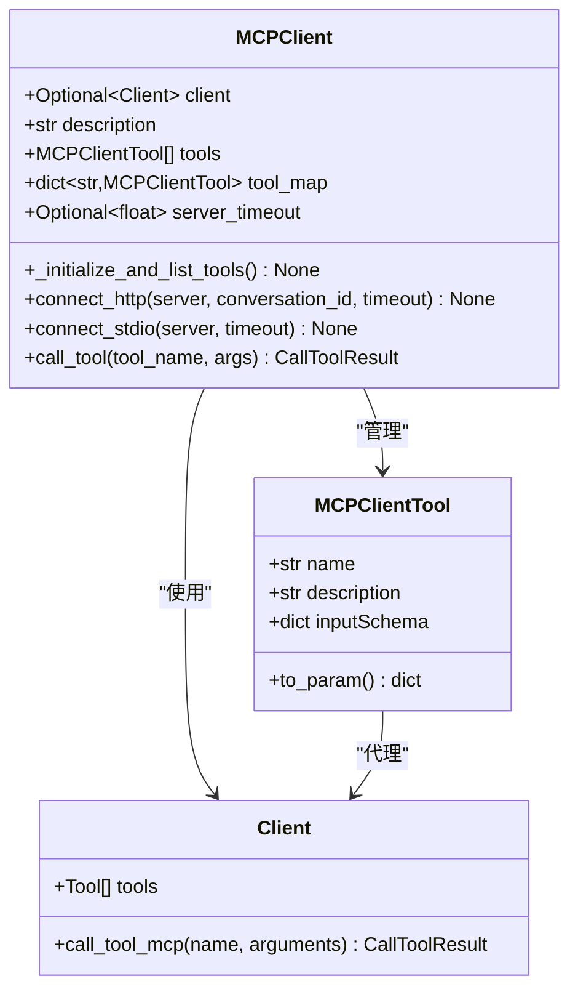
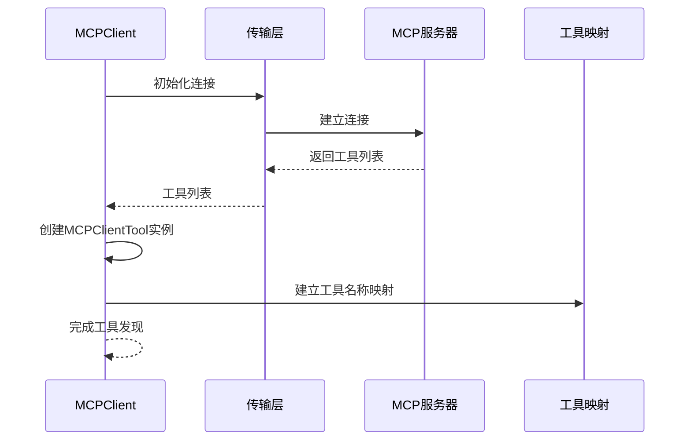
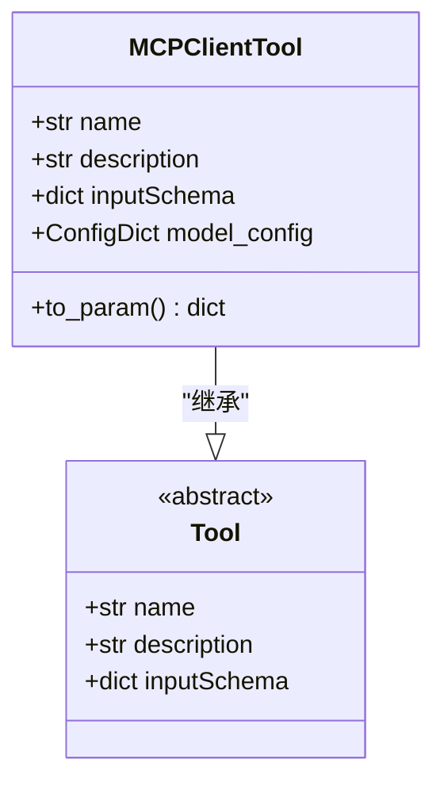
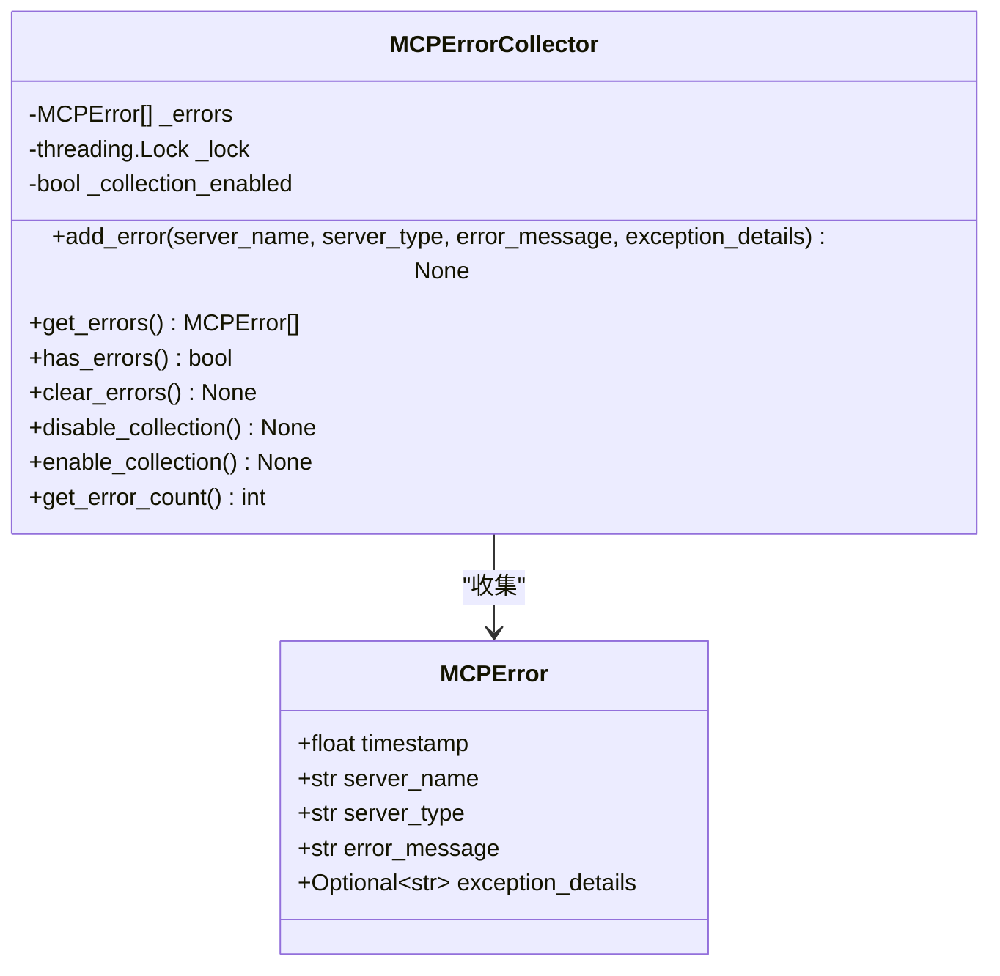
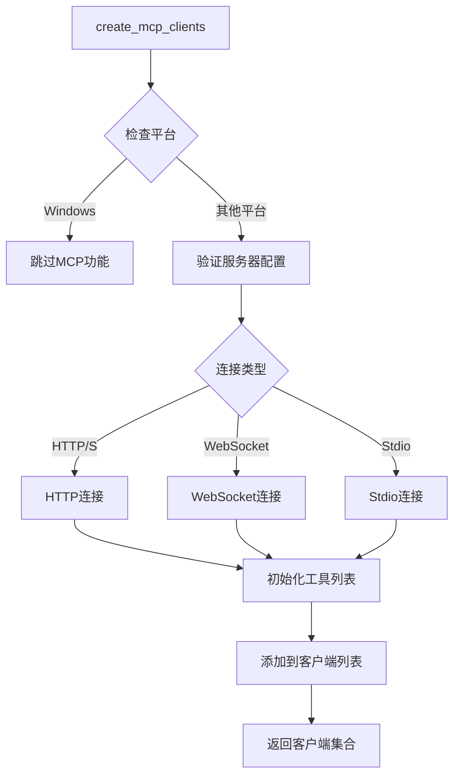
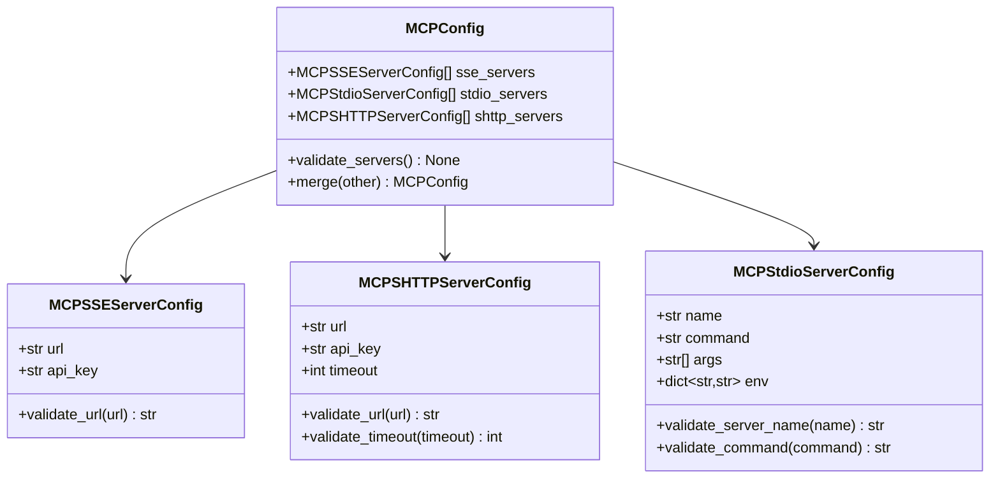
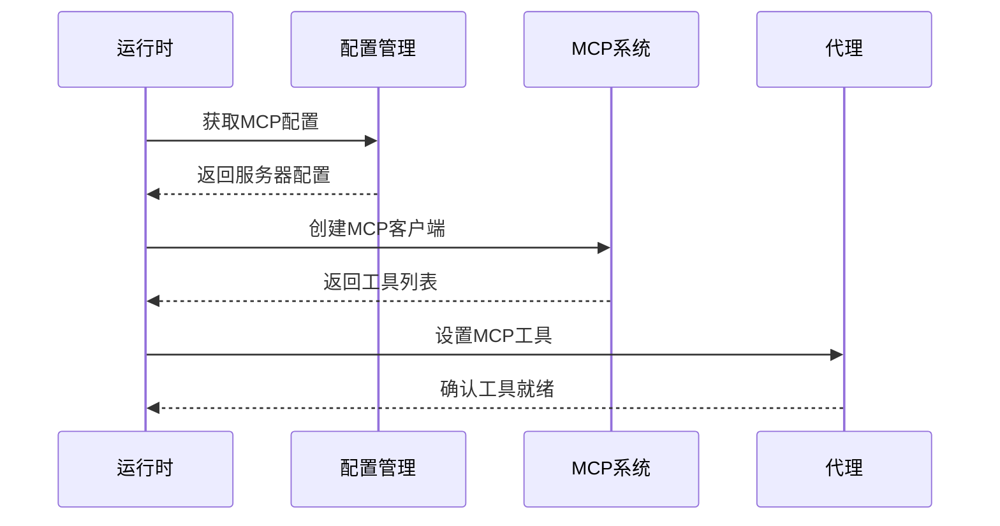
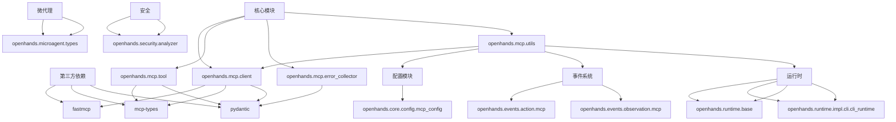

# MCP插件系统

<cite>
**本文档引用的文件**
- [openhands/mcp/client.py](file://openhands/mcp/client.py)
- [openhands/mcp/tool.py](file://openhands/mcp/tool.py)
- [openhands/mcp/error_collector.py](file://openhands/mcp/error_collector.py)
- [openhands/mcp/utils.py](file://openhands/mcp/utils.py)
- [openhands/core/config/mcp_config.py](file://openhands/core/config/mcp_config.py)
- [enterprise/server/mcp/mcp_config.py](file://enterprise/server/mcp/mcp_config.py)
- [openhands/events/action/mcp.py](file://openhands/events/action/mcp.py)
- [openhands/events/observation/mcp.py](file://openhands/events/observation/mcp.py)
- [openhands/runtime/base.py](file://openhands/runtime/base.py)
- [openhands/microagent/types.py](file://openhands/microagent/types.py)
- [openhands/security/analyzer.py](file://openhands/security/analyzer.py)
</cite>

## 目录
1. [简介](#简介)
2. [项目结构](#项目结构)
3. [核心组件](#核心组件)
4. [架构概览](#架构概览)
5. [详细组件分析](#详细组件分析)
6. [依赖关系分析](#依赖关系分析)
7. [性能考虑](#性能考虑)
8. [故障排除指南](#故障排除指南)
9. [结论](#结论)

## 简介

MCP（Model Context Protocol）插件系统是OpenHands平台的核心扩展机制，为AI代理提供了与外部服务和工具进行交互的能力。该系统采用标准化的协议设计，支持多种传输方式，包括HTTP(S)、WebSocket和标准输入输出流，确保了高度的灵活性和可扩展性。

MCP系统的主要目标是：
- 提供统一的工具访问接口
- 支持异步操作和超时处理
- 实现安全的权限控制
- 提供完整的错误收集和监控机制
- 支持动态工具发现和加载

## 项目结构

MCP插件系统在OpenHands项目中的组织结构如下：

**图表来源**
- [openhands/mcp/client.py](file://openhands/mcp/client.py#L1-L179)
- [openhands/mcp/tool.py](file://openhands/mcp/tool.py#L1-L24)
- [openhands/mcp/error_collector.py](file://openhands/mcp/error_collector.py#L1-L79)
- [openhands/mcp/utils.py](file://openhands/mcp/utils.py#L1-L340)

**章节来源**
- [openhands/mcp/client.py](file://openhands/mcp/client.py#L1-L179)
- [openhands/mcp/tool.py](file://openhands/mcp/tool.py#L1-L24)
- [openhands/mcp/error_collector.py](file://openhands/mcp/error_collector.py#L1-L79)
- [openhands/mcp/utils.py](file://openhands/mcp/utils.py#L1-L340)

## 核心组件

MCP插件系统由以下核心组件构成：

### MCPClient - 客户端连接管理器
负责建立和维护与MCP服务器的连接，支持多种传输协议。

### MCPClientTool - 工具代理
表示可以在MCP服务器上调用的工具代理，提供元数据和参数转换功能。

### MCPErrorCollector - 错误收集器
提供线程安全的错误收集机制，用于记录和跟踪MCP操作中的异常情况。

### 工具函数模块 - utils.py
包含创建客户端、转换工具格式、调用工具等核心功能函数。

**章节来源**
- [openhands/mcp/client.py](file://openhands/mcp/client.py#L24-L179)
- [openhands/mcp/tool.py](file://openhands/mcp/tool.py#L5-L24)
- [openhands/mcp/error_collector.py](file://openhands/mcp/error_collector.py#L19-L79)
- [openhands/mcp/utils.py](file://openhands/mcp/utils.py#L29-L340)

## 架构概览

MCP插件系统采用分层架构设计，确保了良好的分离关注点和可扩展性：

**图表来源**
- [openhands/mcp/client.py](file://openhands/mcp/client.py#L24-L179)
- [openhands/runtime/base.py](file://openhands/runtime/base.py#L91-L800)
- [openhands/mcp/utils.py](file://openhands/mcp/utils.py#L64-L154)

## 详细组件分析

### MCPClient - 客户端连接管理

MCPClient是MCP系统的核心组件，负责管理与MCP服务器的连接和工具调用：

**图表来源**
- [openhands/mcp/client.py](file://openhands/mcp/client.py#L24-L179)
- [openhands/mcp/tool.py](file://openhands/mcp/tool.py#L5-L24)

#### 连接类型支持

MCPClient支持三种主要的连接类型：

1. **HTTP(S)连接**：使用StreamableHttpTransport，适用于现代Web服务
2. **WebSocket连接**：使用SSETransport，支持实时双向通信
3. **标准输入输出连接**：使用StdioTransport，适用于本地命令行工具

#### 工具发现和管理

客户端通过初始化过程自动发现可用工具，并维护工具映射表以便快速查找：

**图表来源**
- [openhands/mcp/client.py](file://openhands/mcp/client.py#L35-L58)

**章节来源**
- [openhands/mcp/client.py](file://openhands/mcp/client.py#L24-L179)

### MCPClientTool - 工具代理

MCPClientTool是工具的轻量级代理，主要用于元数据存储和参数转换：

**图表来源**
- [openhands/mcp/tool.py](file://openhands/mcp/tool.py#L5-L24)

#### 参数转换机制

工具代理提供`to_param()`方法，将MCP工具转换为ChatCompletionToolParam格式，以便与AI代理兼容：

**章节来源**
- [openhands/mcp/tool.py](file://openhands/mcp/tool.py#L5-L24)

### 错误收集和监控

MCPErrorCollector提供了完整的错误收集和监控机制：

**图表来源**
- [openhands/mcp/error_collector.py](file://openhands/mcp/error_collector.py#L19-L79)

#### 错误分类和处理

系统支持多种类型的错误收集：

- **连接错误**：服务器不可达或认证失败
- **工具调用错误**：工具执行超时或返回错误
- **转换错误**：工具格式转换失败
- **配置错误**：无效的服务器配置

**章节来源**
- [openhands/mcp/error_collector.py](file://openhands/mcp/error_collector.py#L19-L79)

### 工具函数和实用程序

utils.py模块提供了MCP系统的核心功能函数：

**图表来源**
- [openhands/mcp/utils.py](file://openhands/mcp/utils.py#L64-L154)

#### 工具转换和集成

系统提供了多种工具转换功能：

1. **MCP客户端到工具转换**：将MCP客户端转换为代理可用的工具格式
2. **配置解析**：从配置文件解析MCP服务器设置
3. **运行时集成**：将MCP工具集成到代理运行时环境中

**章节来源**
- [openhands/mcp/utils.py](file://openhands/mcp/utils.py#L29-L340)

### 配置管理系统

MCP配置系统提供了灵活的服务器配置管理：

**图表来源**
- [openhands/core/config/mcp_config.py](file://openhands/core/config/mcp_config.py#L222-L384)

#### 配置验证和合并

系统提供了完整的配置验证机制：

- **URL格式验证**：确保服务器地址格式正确
- **超时限制**：防止过长的等待时间
- **唯一性检查**：避免重复的服务器配置
- **配置合并**：支持多个配置源的合并

**章节来源**
- [openhands/core/config/mcp_config.py](file://openhands/core/config/mcp_config.py#L222-L384)

### 运行时集成

MCP系统与运行时环境深度集成，提供上下文管理和工具发现：

**图表来源**
- [openhands/runtime/base.py](file://openhands/runtime/base.py#L370-L410)
- [openhands/mcp/utils.py](file://openhands/mcp/utils.py#L289-L339)

**章节来源**
- [openhands/runtime/base.py](file://openhands/runtime/base.py#L91-L800)
- [openhands/mcp/utils.py](file://openhands/mcp/utils.py#L289-L339)

## 依赖关系分析

MCP插件系统的依赖关系展现了清晰的分层架构：

**图表来源**
- [openhands/mcp/client.py](file://openhands/mcp/client.py#L1-L12)
- [openhands/mcp/utils.py](file://openhands/mcp/utils.py#L1-L27)
- [openhands/core/config/mcp_config.py](file://openhands/core/config/mcp_config.py#L1-L17)

### 关键依赖说明

1. **fastmcp**：提供MCP协议的基础实现
2. **mcp-types**：定义MCP协议的数据类型
3. **pydantic**：用于配置验证和数据模型
4. **asyncio**：支持异步操作和超时处理

**章节来源**
- [openhands/mcp/client.py](file://openhands/mcp/client.py#L1-L12)
- [openhands/mcp/utils.py](file://openhands/mcp/utils.py#L1-L27)

## 性能考虑

MCP系统在设计时充分考虑了性能优化：

### 超时处理机制

系统实现了多层次的超时控制：

1. **连接超时**：建立连接的最大等待时间
2. **工具调用超时**：单个工具执行的最大时间
3. **全局操作超时**：整个MCP操作的总时间限制

### 并发处理

- 使用asyncio实现非阻塞操作
- 支持并发工具调用
- 实现连接池管理

### 内存管理

- 及时清理断开的连接
- 限制错误日志大小
- 优化工具映射表结构

### 缓存策略

- 工具元数据缓存
- 连接状态缓存
- 配置信息缓存

## 故障排除指南

### 常见问题和解决方案

#### 连接失败

**症状**：无法连接到MCP服务器
**原因**：
- 网络连接问题
- 服务器地址错误
- 认证凭据无效

**解决方案**：
1. 检查网络连接
2. 验证服务器URL格式
3. 确认API密钥有效性

#### 工具调用超时

**症状**：工具执行时间过长
**原因**：
- 服务器响应慢
- 网络延迟高
- 工具本身复杂度高

**解决方案**：
1. 调整超时设置
2. 优化工具实现
3. 使用更高效的服务器

#### 配置错误

**症状**：MCP配置不生效
**原因**：
- 配置文件格式错误
- 服务器配置冲突
- 权限不足

**解决方案**：
1. 验证配置文件语法
2. 检查配置项完整性
3. 确认文件权限设置

**章节来源**
- [openhands/mcp/error_collector.py](file://openhands/mcp/error_collector.py#L27-L79)
- [openhands/mcp/utils.py](file://openhands/mcp/utils.py#L257-L286)

### 监控和调试

系统提供了完整的监控和调试功能：

1. **错误收集**：自动记录所有MCP相关错误
2. **日志记录**：详细的调试信息
3. **状态查询**：实时查看连接状态
4. **性能指标**：工具调用时间和成功率统计

## 结论

MCP插件系统为OpenHands平台提供了强大而灵活的扩展能力。通过标准化的协议设计、完善的错误处理机制和高性能的实现，该系统成功地将外部工具和服务无缝集成到AI代理的工作流程中。

### 主要优势

1. **协议标准化**：采用MCP协议确保互操作性
2. **多传输支持**：支持HTTP、WebSocket和Stdio等多种连接方式
3. **异步处理**：充分利用asyncio实现高性能并发
4. **安全可靠**：完善的错误处理和超时机制
5. **易于扩展**：模块化设计便于添加新功能

### 发展方向

1. **性能优化**：进一步提升并发处理能力和响应速度
2. **功能增强**：支持更多的传输协议和认证方式
3. **监控完善**：增加更详细的性能监控和诊断功能
4. **生态建设**：构建更丰富的MCP工具生态系统

MCP插件系统作为OpenHands平台的重要组成部分，为AI代理提供了无限的扩展可能性，是实现智能自动化工作流的关键基础设施。